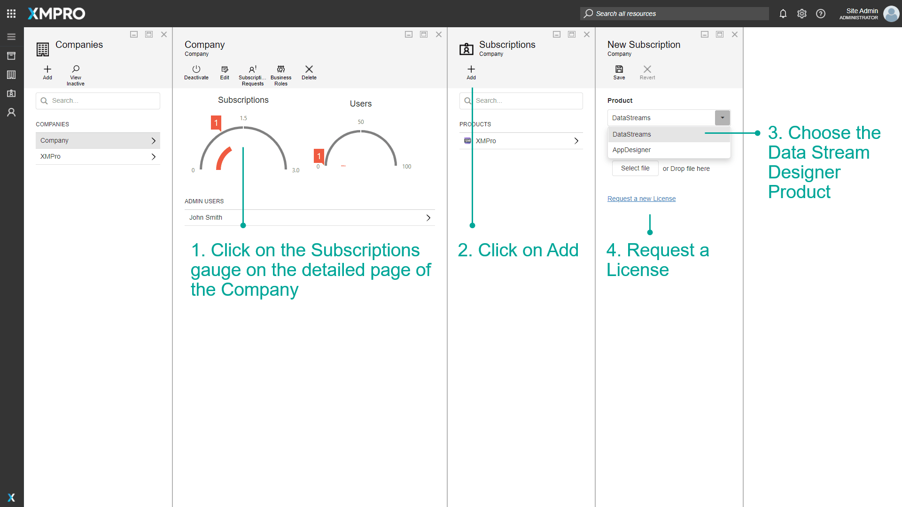
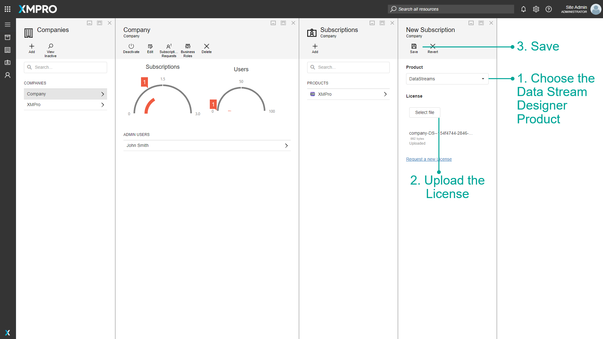
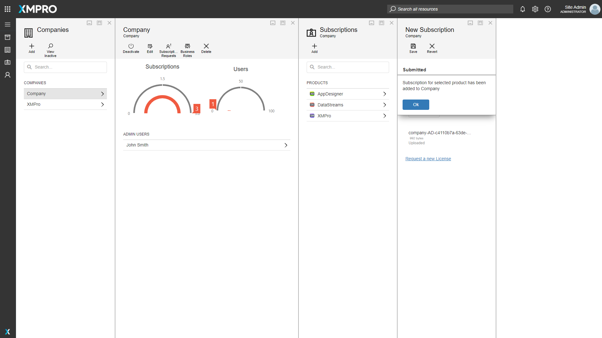
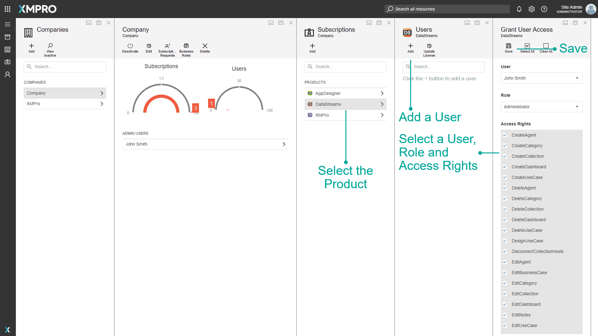

# Manage Company Subscriptions

> [!WARNING]
> Please note that this section is intended for Global Administrative users. No other type of user is allowed to manage data about companies and their Subscriptions.

## Adding a Subscription for the new Company

After the Company is successfully created, you will have to add a Subscription to XMPro Tools for it. To add a Subscription, please follow the steps below.

1. Click on the _Subscriptions_ gauge on the detailed page of the Company.
2. Click on _Add_.
3. Choose the Data Stream Designer Product. The exact name will depend on your installation, in this example, it is "DataStreams".
4. Request a License.

Clicking _Request a new License_ will send a request to the [XMPro support team](http://xmpro.com/support/) for a license for Data Stream Designer for this Company.

> [!WARNING]
> Clicking _Request a new license_ will only send a license request to XMPro if you have enabled email notifications at the time of installing Subscription Manager

> [!NOTE]
> The steps above need to be completed for both the Data Stream Designer and App Designer Products.

Change the Product to App Designer and request another license. Licenses are given on an individual basis by the [XMPro support team](http://xmpro.com/support/).

When you have received a license for each product, return to this page. Select the Data Stream Designer product and upload its corresponding license and press Save.

Then click Add on the Subscriptions page and repeat the steps above for the App Designer product.

Now we will add the user to each subscription. Click on the Data Stream Designer product and click the Add button. Select the user and role as well as the permissions the user should have in the product, and click Save.

Follow the above steps for the App Designer.
