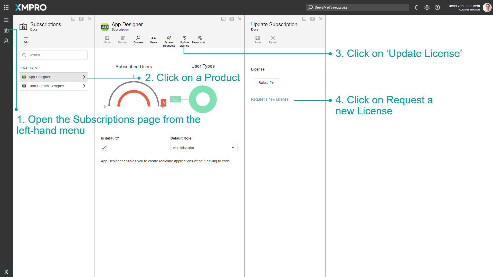
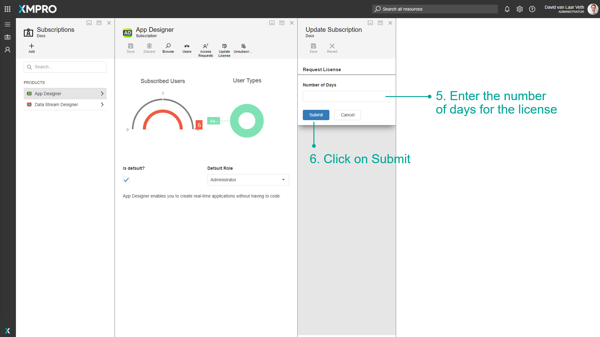
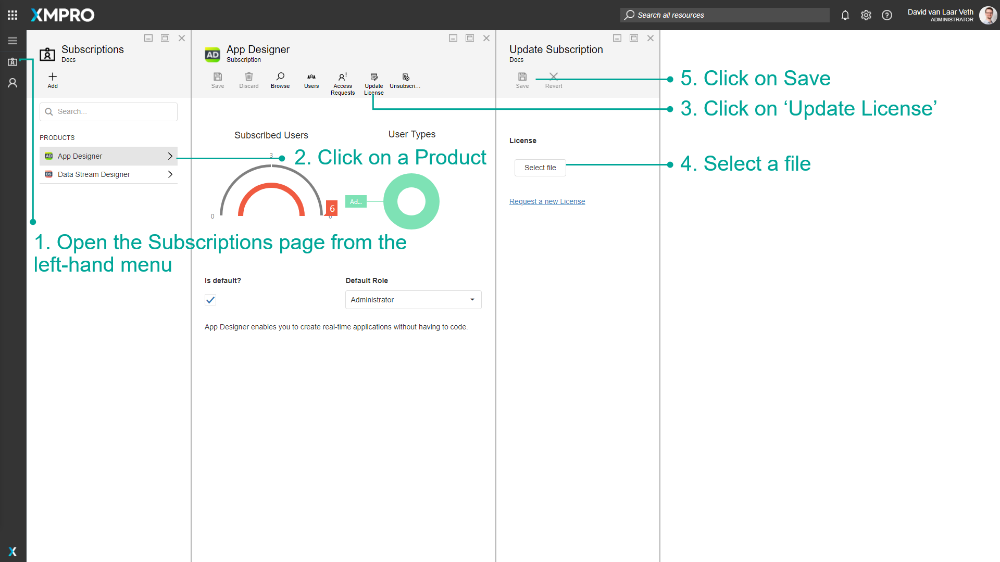

# Request and Apply a License

> [!WARNING]
> Please note that this section is intended for Administrative users. No other type of user is allowed to manage a Company's Subscriptions.

## Request a License

Company Administrators can request a License when updating a Subscription for a Company. To request a new License, follow the steps below:

1. Open the Subscriptions page from the left-hand menu.
2. Click on a Product.
3. Click on 'Update License'.
4. Click on Request a new License.
5. Enter the number of days for the License.
6. Click on Submit.

Your License request will be sent to [XMPro Support](https://xmpro.na1.teamsupport.com/dashboard). An XMPro team member will get back to you shortly via email to progress the request further.

## Apply a License

If a Company Administrator already has a License, they can apply it to the Product. To apply a License, follow the steps below:

1. Open the Subscriptions page from the left-hand menu.
2. Click on a Product.
3. Click on 'Update License'.
4. Select the License file.
5. Click on Save.

