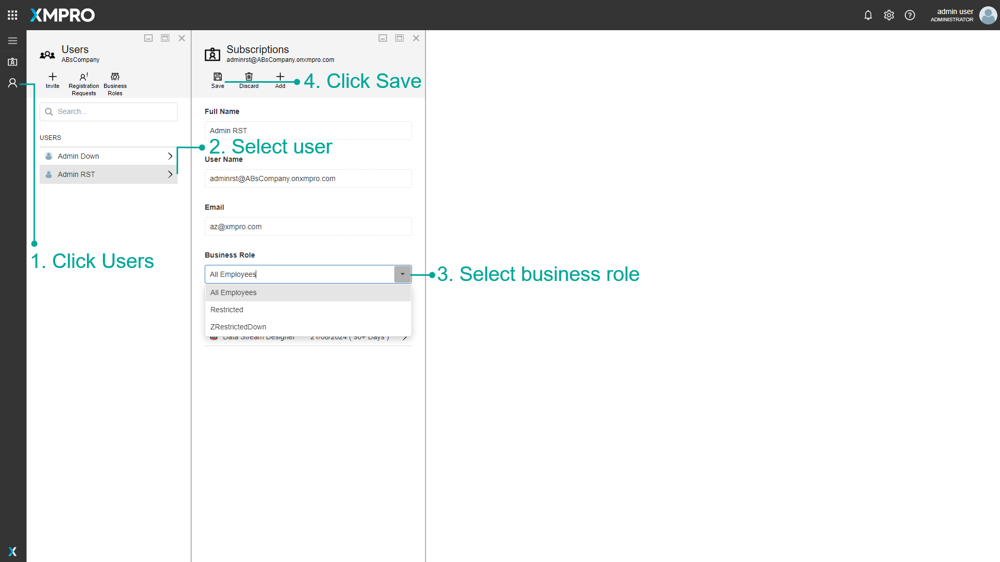

# Change Business Role

> [!WARNING]
> Please note that this section is intended for Administrative users. No other type of user is allowed to manage a Company's Subscriptions.

To change a user's business role in XMPro, first log in to XMPro as your company administrator.

1. Click on the Users page in the left menu.
2. Select the user whose business role you wish to change, to open the Subscriptions blade.
3. Choose a new business role.
4. Click the Save button.

