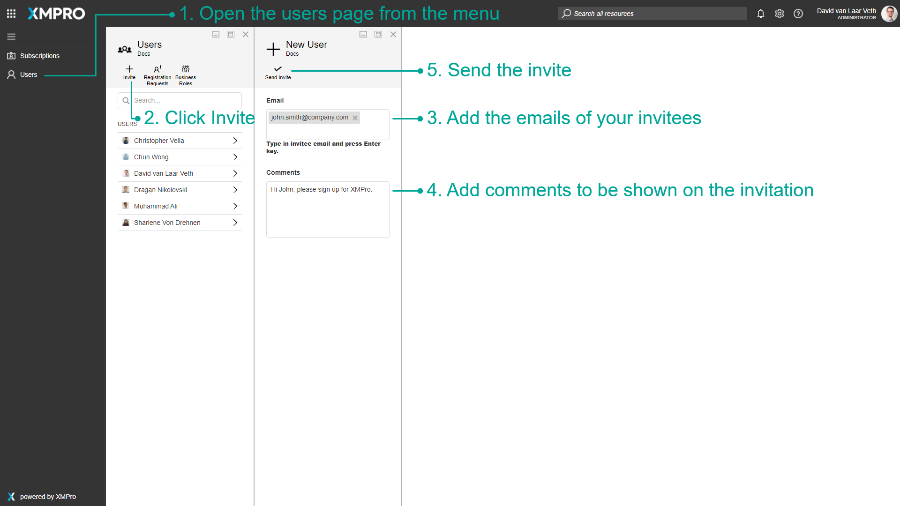
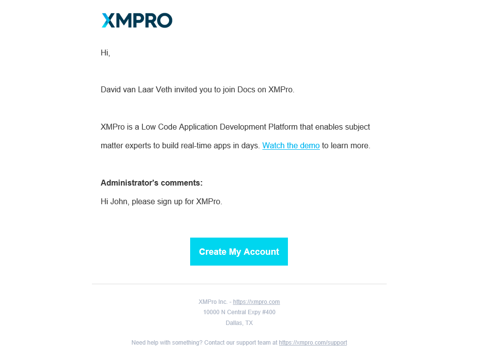

# Invite a User

> [!WARNING]
> Please note that this section is intended for Administrative users. No other type of user is allowed to manage a Company's Subscriptions.

To invite users to your company on XMPro, first log in to XMPro as your company administrator.

1. Click on the Users page in the left menu.
2. Click on the Invite button in the command bar.
3. Add the emails of your invitees in the Email field. Press enter after each email.
4. Add comments to be shown on the invitation.
5. Click the Send Invite button.

The email will have a link to the registration page to sign up for your company in XMPro.

