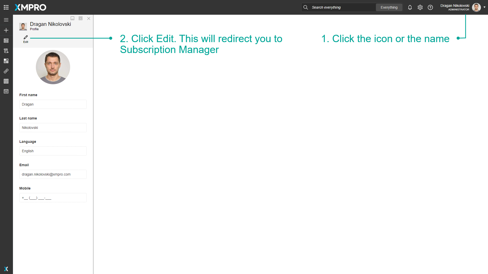
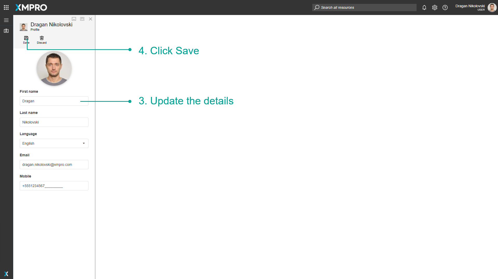

# Profile

Any user is able to update their settings using the Subscription Manager. This includes updating your first name, last name, language, email address, or phone number. This is useful if your personal or contact details have changed and you would like to update them on XMPro.

### How to Edit a Profile

1. Click the icon or the name.
2. Click Edit. This will redirect you to Subscription Manager.

1. Update the details.
2. Click Save.

> [!NOTE]
> If the language selected is English, the Date and Time format for XMPro Products will be determined by the web browser's locale. For example, American English vs Australian English.

> [!NOTE]
> The email and mobile number may take up to an hour to propagate to all XMPro Products.
