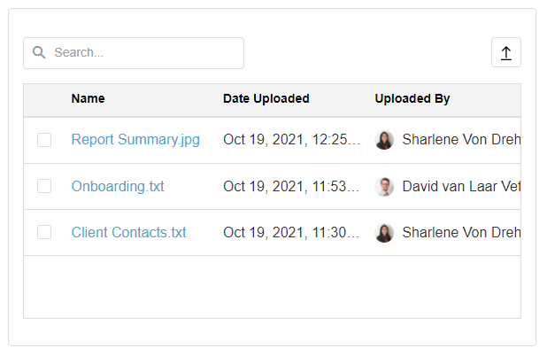
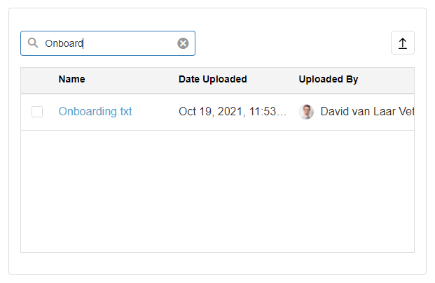
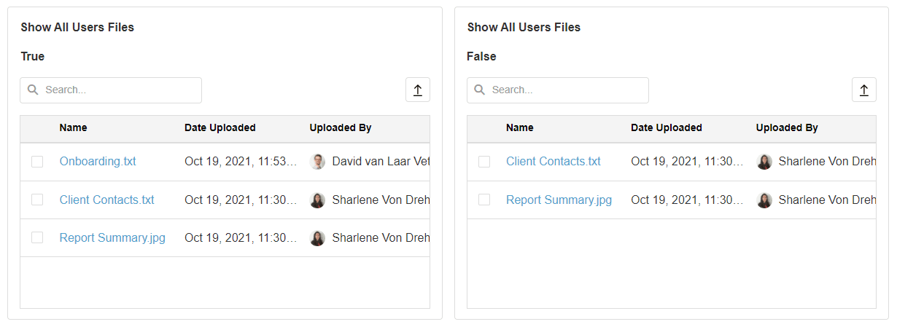
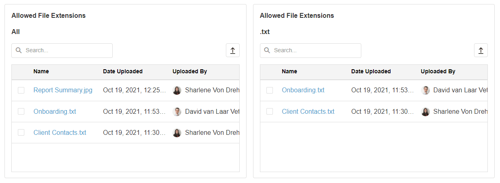
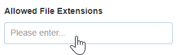
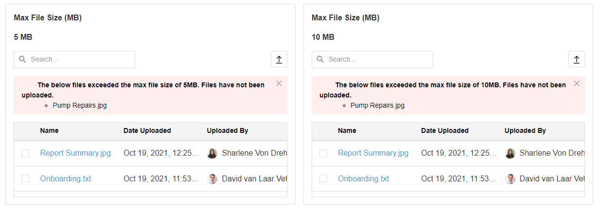
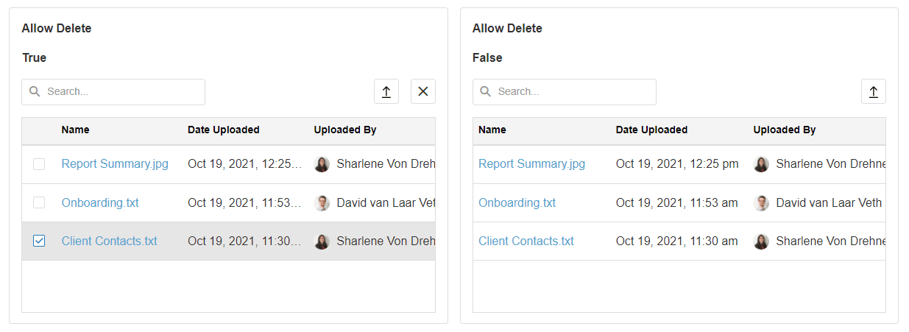
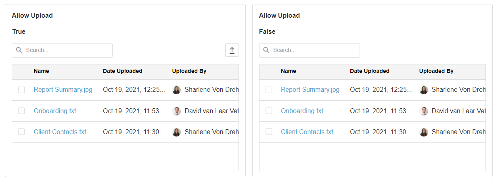

# File Library

The File Library Block allows you to upload and store multiple files in your App. Files can be uploaded, downloaded, or deleted. This can be useful if you want to share certain files with users who have access to your App.

## Searching for files in the File Library

To search for files in the File Library Block, enter the file name of the file you would like to search for. The File Library Block will automatically filter the files and show you the search results.

## File Library Properties

### Appearance

#### Common Properties

You can change the _visibility_ of the File Library, which is common to most blocks;

[See the Common Properties article for more details on common appearance properties.](../common-properties.md#appearance)

### Behavior

#### Show All Users Files

This allows you to toggle between seeing only the files that you have uploaded, or the files that other users that have access to the App have uploaded.

#### Allowed File Extensions

This allows you to specify the types of files that are allowed to be uploaded. If left blank, any file type can be uploaded. If a file extension is listed, (for example, a .png file), the File Library Block will not allow you to upload any other file except those with a .png extension.

You can add file library extensions in the following way:

#### Max File Size (MB)

This determines the maximum file size that can be uploaded. If you attempt to upload a file that exceeds the max size, it will not be uploaded.

#### Allow Delete

This specifies if each file can be deleted or not. Each file has a checkbox next to it that allows you to delete the file. When Allow Delete is set to false, the checkboxes next to the files are no longer visible, so files cannot be selected and deleted.

#### Allow Upload

This specifies if the upload icon in the top-right of the File Library block is visible or not. If visible, the user can click on the icon to upload files. If not visible, they will be unable to upload files.

