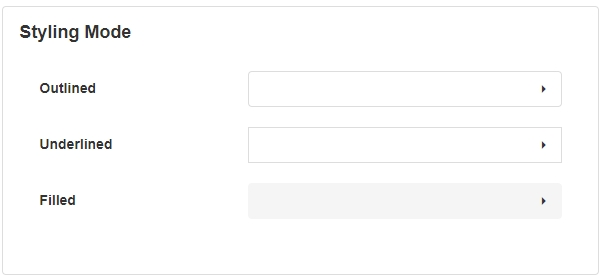
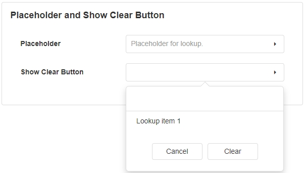
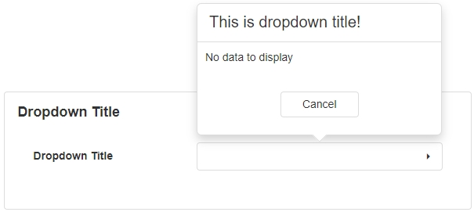
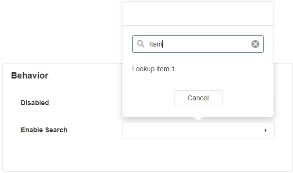
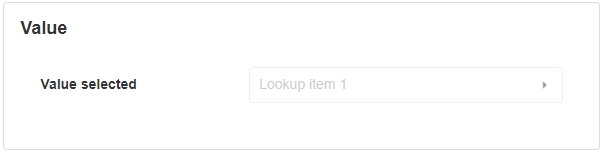

# Lookup

The Lookup is a UI component that allows a user to search for an item in a collection shown in a drop-down menu. This is useful when there are many options or items to select from and it may be hard for the user to find one particular item. This UI control allows the user to navigate to the item faster.

## Lookup Properties

### Appearance

#### Common Properties

Properties that are common to most Blocks include _visible, styling mode, placeholder, tooltip_ and _show clear button;_

[See the Common Properties article for more details on common appearance properties.](../common-properties.md#appearance)

#### Styling Mode

#### Placeholder and Show Clear Button

Placeholder is the text that will be displayed before a value is selected.\
Show Clear Button will add a button to clear the selected item.

#### Dropdown Title

Title of the Lookup when it's open for selection.

### Behavior

#### Common Properties

The _disabled_ property is common to most Blocks;

[See the Common Properties article for more details on common behavior properties.](../common-properties.md#behavior)

#### Enable Search

It will add a search bar where the user can search the items in the Lookup.

### Value

#### Common Properties

This option is used to select the default value and must match a value from the Data Source.

[See the Common Properties article for more details on common value properties.](../common-properties.md#value)

### Data Source

‌Data sources can be Static or Dynamic. Static values have to be entered manually while Dynamic will get the value from the provided Data Source.

The Data Source property is required for the Lookup Block.

#### Static Items

If a dynamic data source is not used, you can enter key dates to display manually under the Data section.

#### Dynamic Data Source

This option allows you to connect the control to a specific data source such as a database to pull data dynamically. This will give you additional options to sort, filter, show, or skip certain records.

[See the Common Properties article for more details on common data source properties.](../common-properties.md#data-source)

## Data

This is only available if the Data Source is Dynamic. Here we have the option to set the values of the buttons as well as what text will be displayed. ‌

[See the Common Properties article for more details on common data properties.](../common-properties.md)

#### Display Expression

The expression is a user-friendly name for what the user can see. For example, the text that is displayed to the user.

The Display Expression property is required for the Lookup Block.

#### Value Expression

This is the actual value stored in the background of the application in the code. For example, instead of true or false, it would be 0 or 1.

The Value Expression property is required for the Lookup Block.

### Grouping

This is only available if the Data Source is Dynamic. Here we have the option to set how the items in the Lookup will be grouped.

If grouping is enabled, the Group By Expression property is required for the Lookup Block.

### Action

#### Common Properties

Properties that are common to most Blocks include: _Navigate To and Show Confirmation Dialog;_

[See the Common Properties article for more details on common action properties.](../common-properties.md#action)
