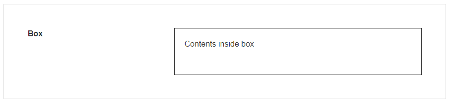
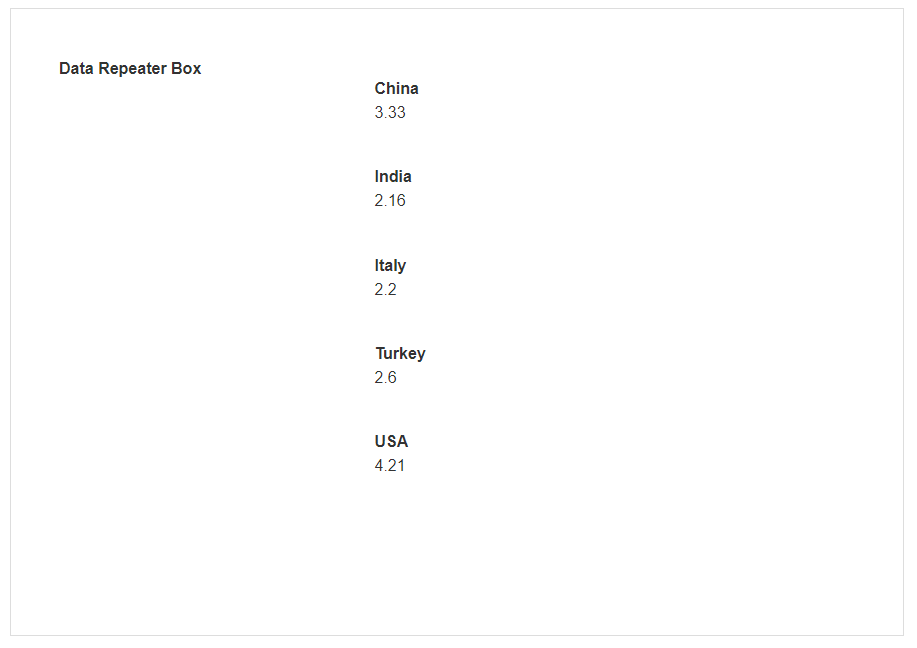

# Box & Data Repeater Box

A Box is a simple Block that allows you to add data or other elements inside it. This can be used as a container to store a group of other Blocks.

A Data Repeater Box is a Box that allows you to repeat data multiple times, including data that is coming from a Data Source. If a text field is added to the Data Repeater Box, that text Block can be bound to a field coming from the Data Source. The Data Repeater Box will then repeat the data for that field for each record.

> [!WARNING]
> Take care with repeated elements that also have a Data Source, such as a [Lookup](../basic/lookup.md), as their Data Source is fetched for every record returned by the Data Repeater's Data Source. A large result set may result in a timeout.
>
> You can use the **Show # of Results** under the [**Data Source**](#data-source-1) property to limit the repetition of the blocks.

## Box Properties

### Appearance

#### Common Properties

The _visibility_ property is common to most Blocks;

[See the Common Properties article for more details on common appearance properties.](../common-properties.md#appearance)

### Data Source

#### Common Properties

The Box has properties that are common to most Blocks: _filter, sort, show # of results_, and _skip # of results;_

[See the Common Properties article for more details on common data source properties.](../common-properties.md#data-source)

## Data Repeater Box Properties

### Appearance

#### Common Properties

The _visibility_ property is common to most Blocks;

[See the Common Properties article for more details on common appearance properties.](../common-properties.md#appearance)

### Data Source

#### Common Properties

The data repeater box has properties that are common to most Blocks: _filter, sort, show # of results_, _skip # of results,_ and _show default row;_

[See the Common Properties article for more details on common Data Source properties.](../common-properties.md#data-source)
