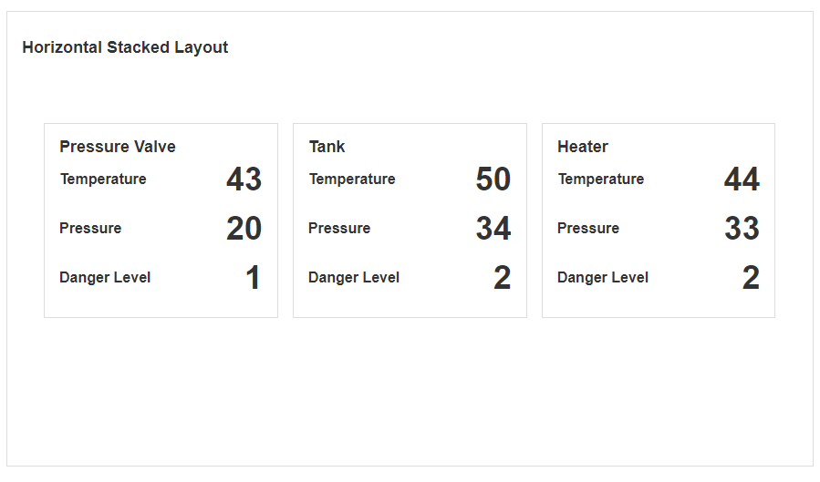
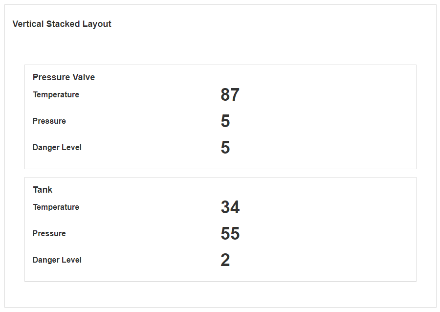
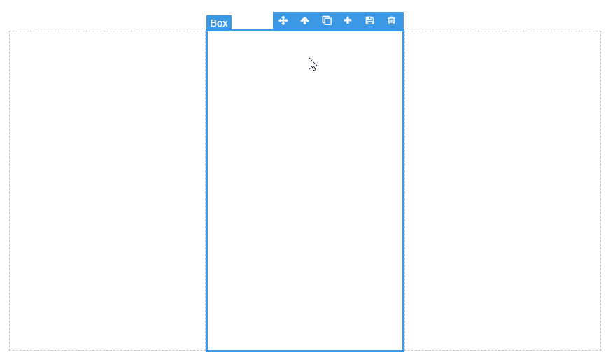
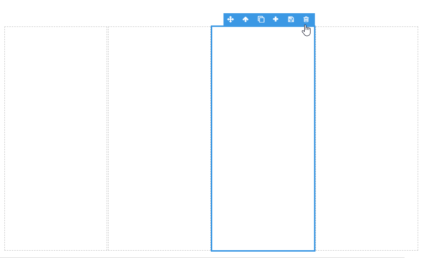
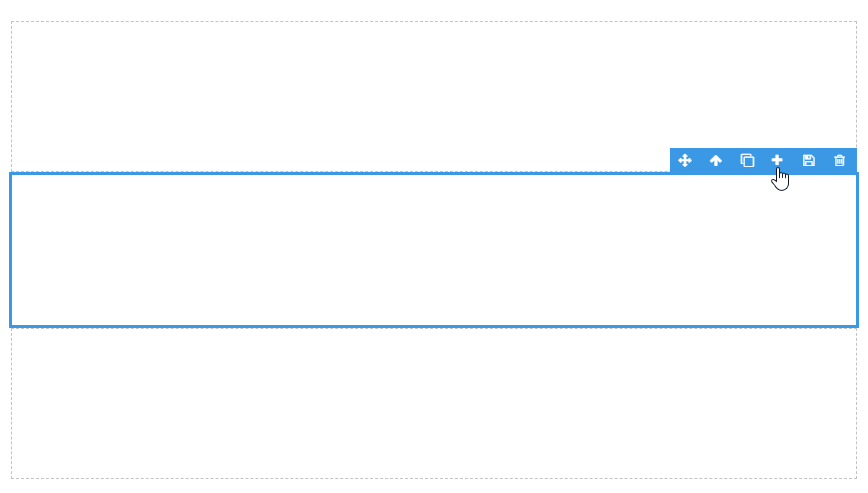
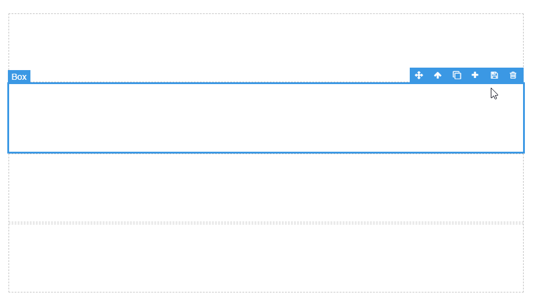

# Stacked Layout Horizontal & Vertical

Horizontal Stacked Layouts separate a given area into columns. Vertical Stacked Layouts separate a given layout into rows. Columns or rows can be added or reduced to change the layout. This Block can be useful if the position of the page contents needs to be displayed right-to-left or top-to-bottom.

## Add a Box to the Horizontal Layout

To add a horizontal pane, select a pane and click on the plus symbol in the top-right Block toolbar.

> [!NOTE]
> [See the Canvas article for more details on these controls.](../../concepts/application/canvas.md#block-toolbar)

## Delete a Box in the Horizontal Layout

To delete a horizontal pane, select a pane and click on the delete 'bin' symbol in the top-right block toolbar.

> [!NOTE]
> [See the Canvas article for more details on these controls.](../../concepts/application/canvas.md#block-toolbar)

## Add a Box to the Vertical Layout

To add a Box to a Vertical Layout, select a pane and click on the plus symbol in the top-right block toolbar.

> [!NOTE]
> [See the Canvas article for more details on these controls.](../../concepts/application/canvas.md#block-toolbar)

## Delete a Box in the Vertical Layout

To delete a vertical pane, select a pane and click on the delete 'bin' symbol in the top-right block toolbar.

> [!NOTE]
> [See the Canvas article for more details on these controls.](../../concepts/application/canvas.md#block-toolbar)

## Horizontal and Vertical Layout Properties

### Appearance

#### Common Properties

The _visibility_ property is common to most Blocks;

[See the Common Properties article for more details on common appearance properties.](../common-properties.md#appearance)

### Data Source

#### Common Properties

The Vertical and Horizontal Layouts have properties that are common to most Blocks: _filter, sort, show # of results, skip # of results,_ and _show default row_;

[See the Common Properties article for more details on common Data Source properties.](../common-properties.md#data-source)
