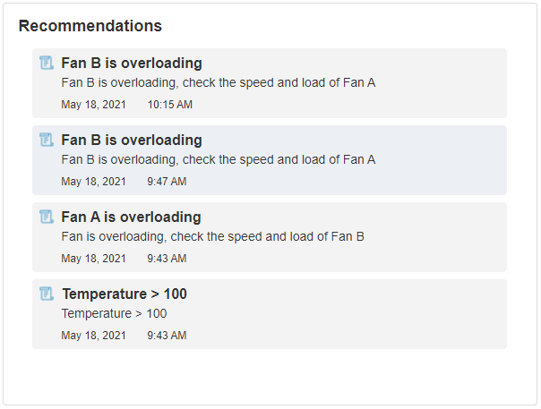
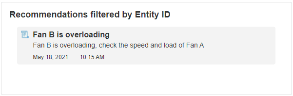

# Alert List

The Alert List will show a list of all the Alerts for the selected Recommendations.

## Alert List Properties

### Behavior

#### Recommendations

This will display a list of Alerts for Recommendations. Before launching the App, you can select which Recommendations to show the Alerts for.

_Fig 1: Alert List Recommendations_

#### Type

The identifier filter options are Asset, Process, KPI, and Entity.

#### ID

The Identifier used to filter the Recommendation Alerts.

_Fig 2: Alert List ID_
