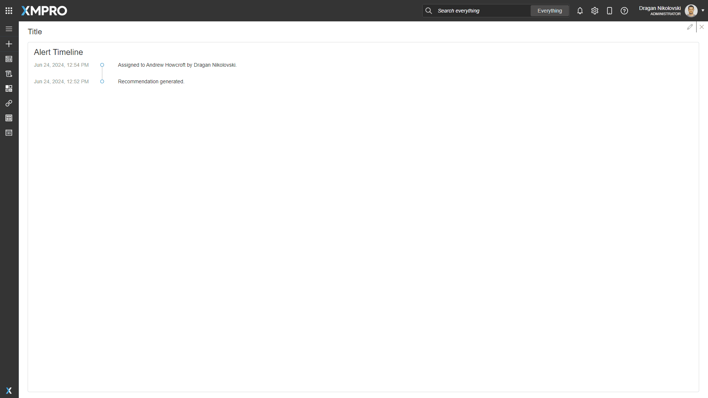
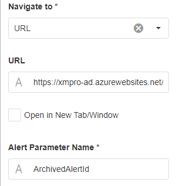
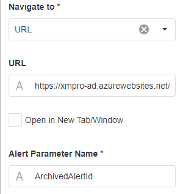

# Alert Timeline

A list of the activities that have occurred on an Alert.

If this list includes a hyperlink for an escalated alert, configuration properties allow the designer to determine the behavior of that hyperlink. Perhaps the design is for all alerts to be shown using the same Page, or use a formula to show archived alerts on a different Page in the same or a different App (use the URL option to accomplish this).

_Fig 1: Alert Timeline_

## Alert Timeline Properties

### Appearance

#### Common Properties

The _visibility_ property is common to most Blocks;

[See the Common Properties article for more details on common appearance properties.](../common-properties.md#appearance)

#### Title

Optional text that shows at the top of the block and defaults to "Alert Timeline".

### Behavior

#### Alert ID

Supply an Alert Identifier and its timeline is displayed when the Page is opened.

#### Navigate To

This configures the page or website that the webpage will navigate to when the user clicks on a linked alert's hyperlink:

* Page takes you to the specified page of the current App, optionally in a new tab/window
* URL takes you to the specified URL (any website), optionally in a new tab/window

**Page**

The page to which the user is redirected, which is applicable when [Navigate To](../../blocks-toolbox/common-properties.md#navigate-to) is set to 'Page'.

_Fig 2: Navigate To and Page properties_

See the [Navigate Between Pages article](../../how-tos/apps/navigate-between-pages.md) for more information about navigating between pages.

**URL**

The URL to which the user is redirected, which is applicable when [Navigate To](../../blocks-toolbox/common-properties.md#navigate-to) is set to 'URL'.

_Fig 3: Navigate To, URL, Open in New Tab/Window, and Alert Paramater Name properties_

#### Open in New Tab/Window

Tick to open in a new tab/window, instead of redirecting the current tab.

#### Alert Parameter Name

Supply the parameter name of the Page/URL that will be used to navigate to the escalated alert. It is used to append the escalated Alert Identifier.
