# Circular Gauge

This Block allows you to display data in the format of a Circular Gauge. The Circular Gauge includes a circle to indicate a single value or multiple values. Circular Gauges are useful for displaying and visualizing numeric values within a certain range.

## Circular Gauge Properties

### Appearance

#### Common Properties

The Circular Gauge has the option to change its _visibility_.

[See the Common Properties article for more details on common appearance properties.](../common-properties.md#appearance)

Options that are specific to Circular Gauges include the ability to change the _title, font color, tick interval,_ and the style of the primary and sub-values.

#### Title

This is the text that shows on top of the Circular Gauge.

#### Font Color

This changes the color of the text above the Circular Gauge.

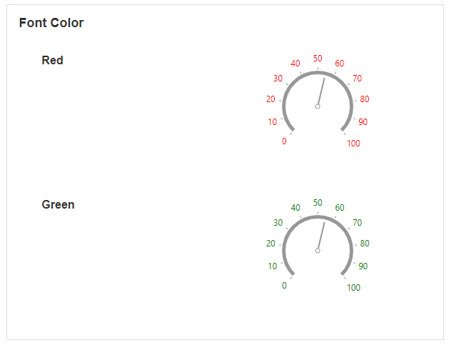

#### Tick Interval

This determines the distance between ticks on the outer circle of the Circular Gauge.

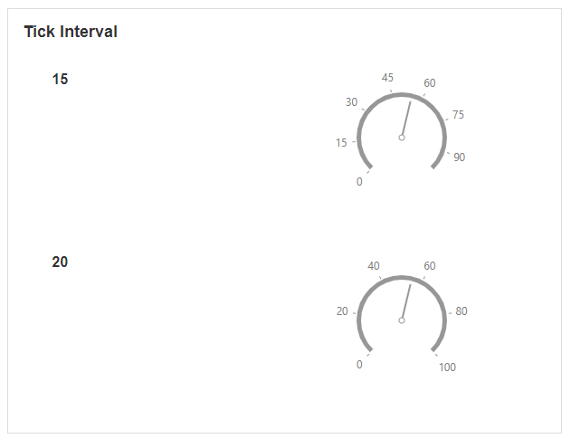

#### Primary Value Indicator Type

This determines the style of the primary indicator showing on the Circular Gauge.

This determines the shape of the marker that points to the value on the Circular Gauge. Options include a rectangle needle, triangle needle, two-color needle, range bar, triangle marker, and text cloud.

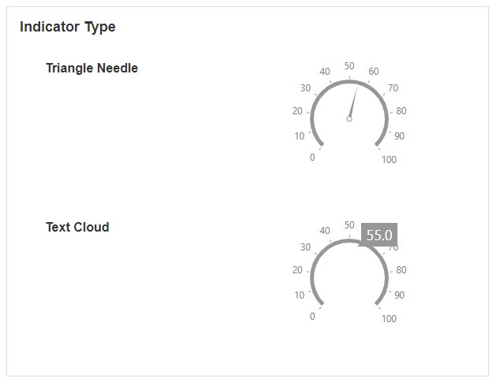

#### Primary Value Format Text as Percentage

This is only available if the indicator type is a text cloud. Enabling this will show the text on the screen as a percentage.

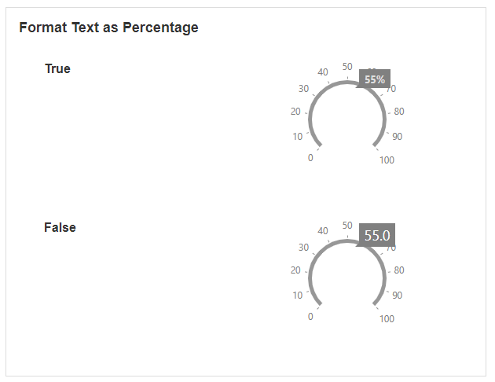

#### Primary Value Indicator Color

This determines the color of the indicator.

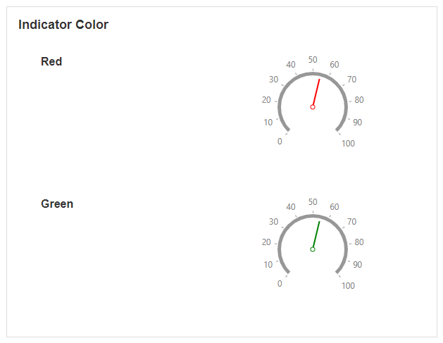

#### Primary Value Indicator second color

This option is only available if the indicator type is a two-color needle. It determines the color of the second needle.

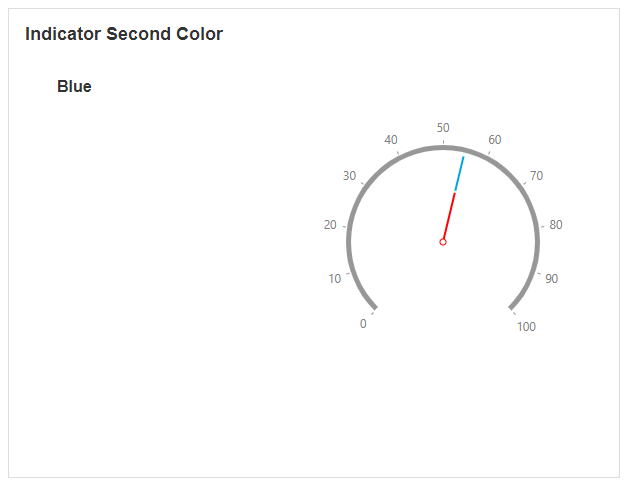

#### Primary Value Indicator offset

This determines how far away the needle or marker is when pointing to the value.

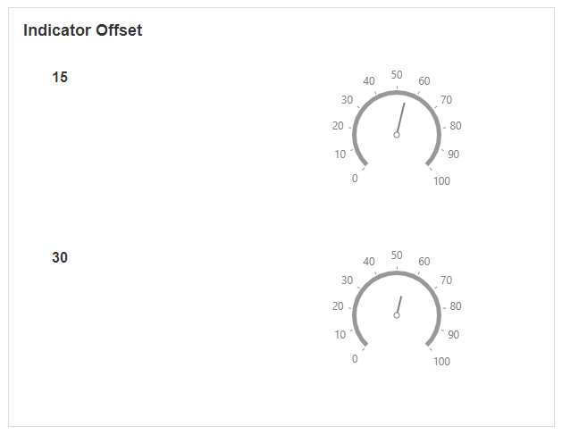

#### Sub Value Indicator Type

This determines the style of the sub-values showing on the Circular Gauge. The indicator refers to the shape of the marker that points to the value on the gauge.

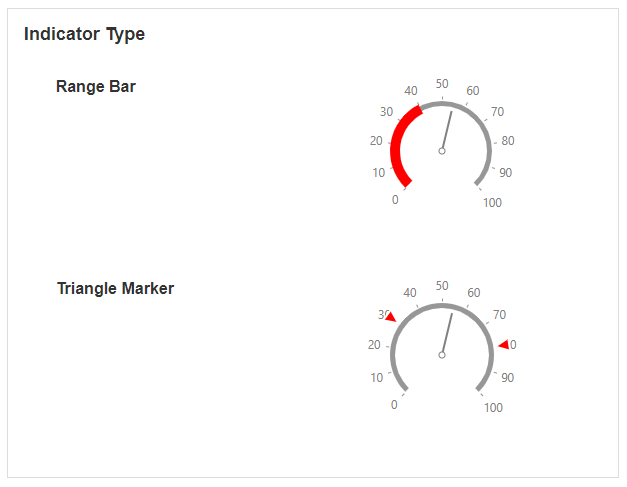

#### Sub Value Format Text as Percentage

This is only available if the indicator type for the sub-value is a text cloud. Enabling this will show the text on the screen as a percentage.

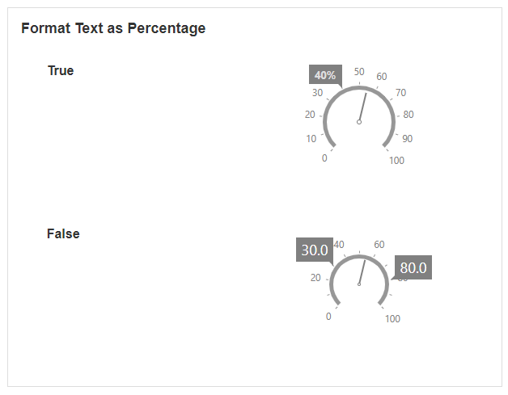

#### Sub Value Indicator Color

This determines the color of the sub-values.

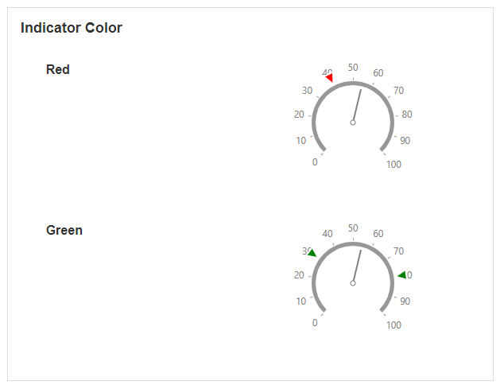

#### Sub Value Indicator Second Color

This option is only available if the sub-value indicator type is a two-color needle. It determines the color of the second needle.

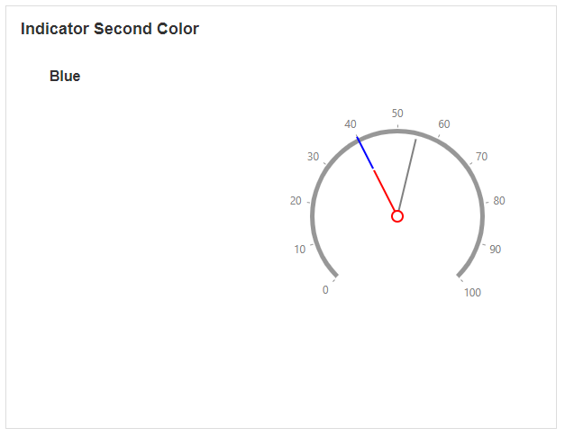

#### Sub Value Indicator Offset

This determines how far away the needle or marker is when pointing to the sub-value.

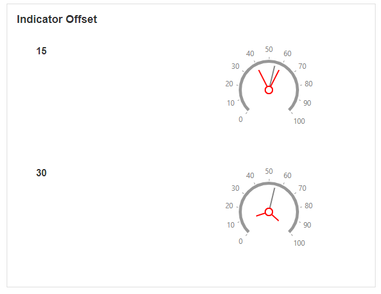

### Behavior

#### Common Properties

The _disabled_ property is common to most Blocks;

[See the Common Properties article for more details on common behavior properties.](../common-properties.md#behavior)

#### Start Range and End Range

The start and end range define the boundaries of where the values of the Circular Gauge should start and end.

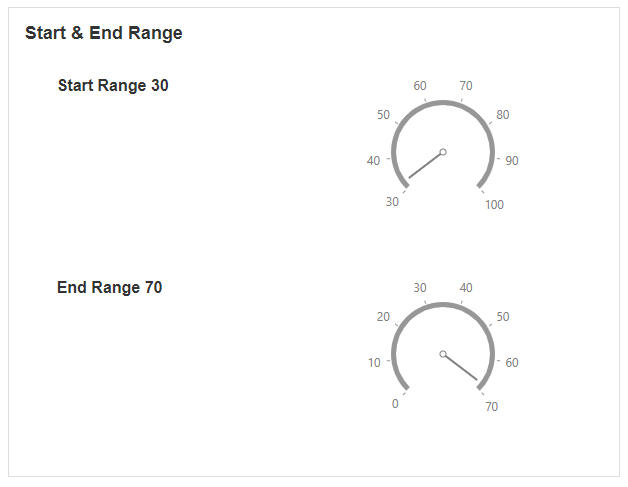

### Range

The range allows you to change the color of different ranges on the gauge.

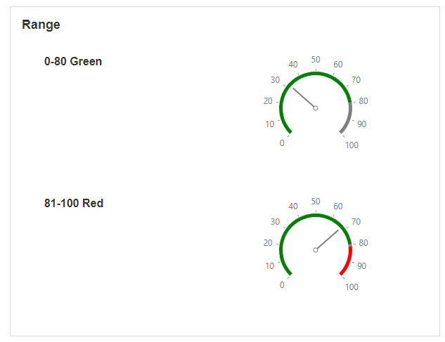

### Value

You can show but a single value on the Circular Gauge, as well as sub-values.

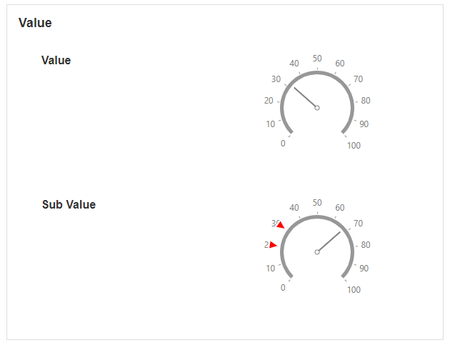
