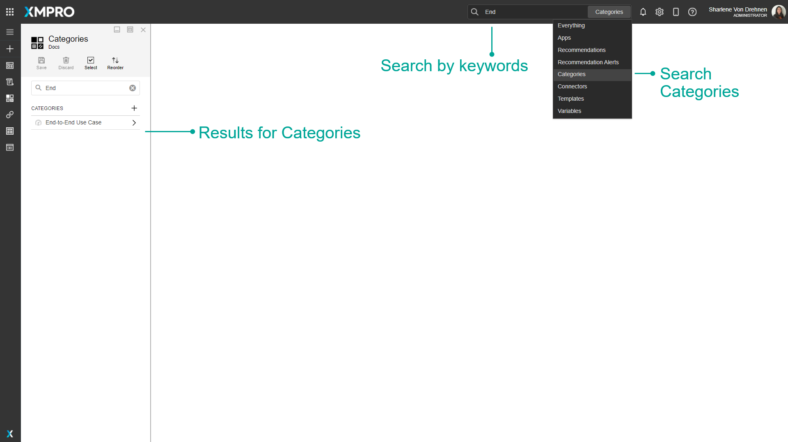
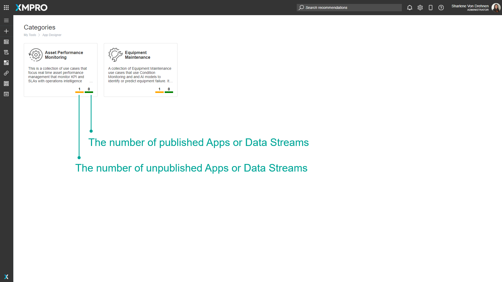
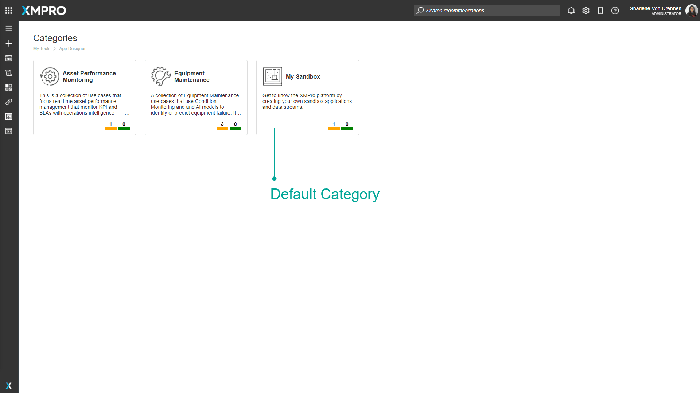
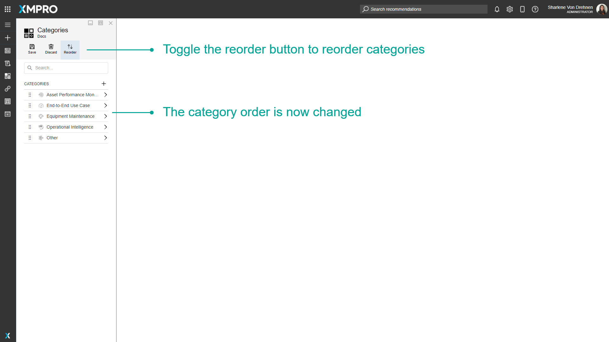
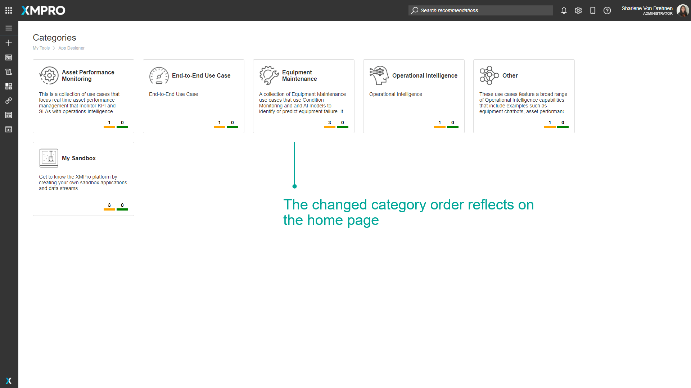

# Category

## Overview

A Category is a container that groups related [Data Streams](data-stream/index.md) and [Applications](application/index.md). Categories are shared between core XMPro Products to provide a homogenous environment. They are displayed as cards on the home page of the Data Stream Designer and App Designer. Clicking on the card will navigate to a dashboard showing the Data Streams or Apps associated with that Category.

Categories are useful as they allow you to group your Data Streams, Applications, or other XMPro Objects into logical areas. Organizations have the flexibility to create Categories based on their specific requirements such as the organizational structure of their asset hierarchy.

> [Watch Video](https://www.youtube.com/embed/2GznBa2cKHo)

## Finding Categories

The search bar can be used to find any specific Categories that you may be looking for. There is a dropdown option where you can specify to search through everything in App Designer, or only for Categories.

## Empty Categories

A Category that doesn't have any Apps or Data Streams inside it will not be shown on the dashboard.

## App and Data Stream Indicators

An indication of the state of the items contained within a Category is shown at the bottom of each tile. What the numbers represent is as follows:

1. The number of published Apps or Data Streams.
2. The number of unpublished Apps or Data Streams.

## Default Category

The Data Stream Designer or App Designer will have one Category defined after it is initially installed, called "My Sandbox". This Category is used as a default Category as there is a requirement for all Data Streams or Apps to belong to a Category. In terms of the Application, no [Data Stream](data-stream/index.md) or [Application](application/index.md) is allowed to exist if it doesn't belong to a Category.

After installing Data Stream Designer or App Designer, you can create any Category you like. However, when the default Category is left empty (not containing any Data Streams or Apps), it will not display on the landing page after at least one other Category is created. You will still be able to see it on the Categories page and create Data Streams or Apps in it. Once you've created a Data Stream or App in it, it will show up on the landing page once again.

## Deleting a Category

If you delete a Category, all of the Apps or Data Streams inside of that Category get put into My Sandbox.

## Order

The way Categories are displayed on the list can be reordered. This can be done by selecting the reorder option and selecting and dragging the Categories to reorder them.

## Further Reading

* [How to Create and Manage Categories](../how-tos/manage-categories.md)
