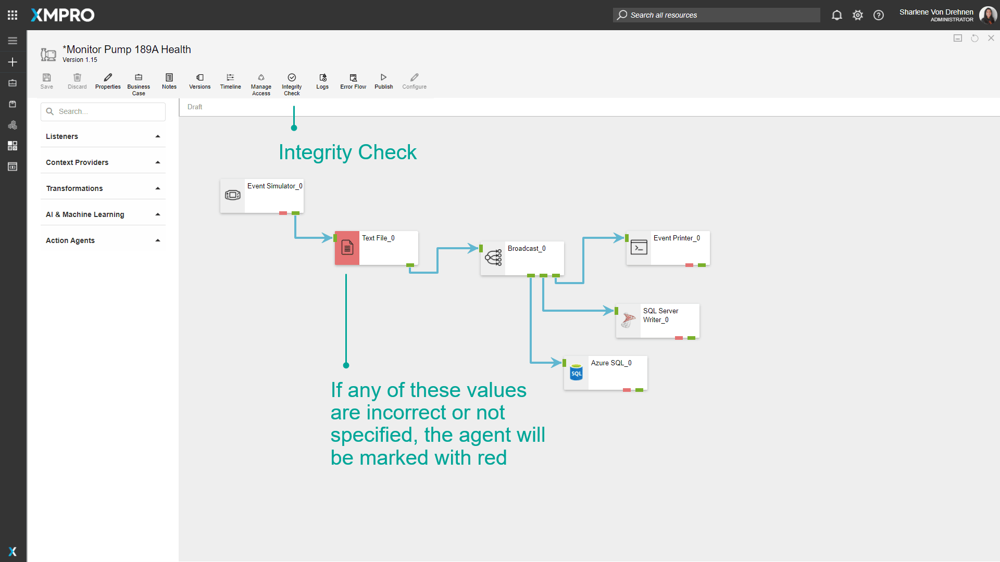
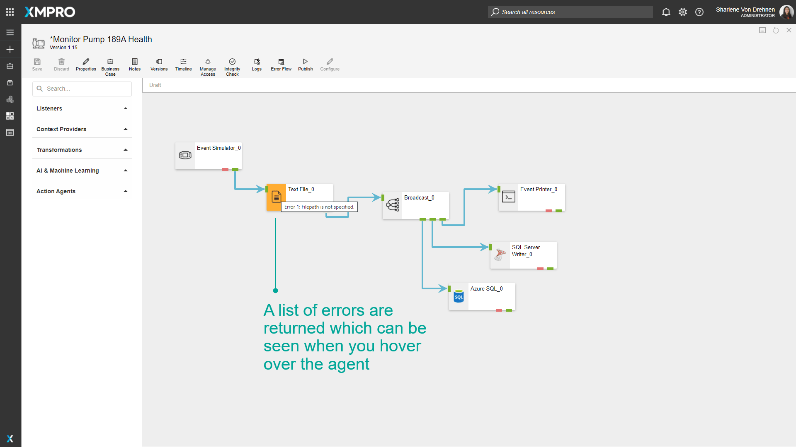

# Verifying Stream Integrity

## Verifying Stream Integrity

Data Stream Designer offers the capability to verify if the Agents in your Stream are configured correctly and warns you if there are any issues with them. This is done to ensure the integrity of your Data Stream and to make sure all input fields are valid and accurate.

To verify the integrity of your Stream, you can simply click on the “_Integrity Check_” button. When clicking this button, each agent will call the _Validate_ method in its code. This method contains a set of rules that needs to be satisfied, for example, the SQL Server Agent needs to have the following values specified:

* SQL Server instance name
* Username
* Password (if SQL authentication is used)
* Database name
* Table name

If any of these values are incorrect or not specified, the Agent will be marked with red, and its code will return a list of errors that it found, which you will see in the form of a list when you hover over the Agent with your mouse cursor. To read more about how the code works, [see the Building Agents article](../../how-tos/agents/building-agents.md).

## Further Reading

* [How to Run an Integrity Check](../../how-tos/data-streams/run-an-integrity-check.md)
