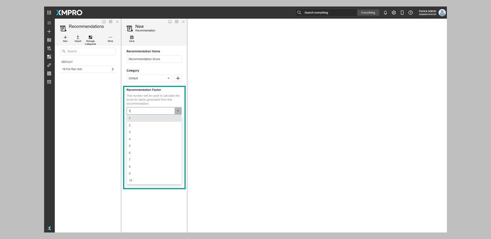
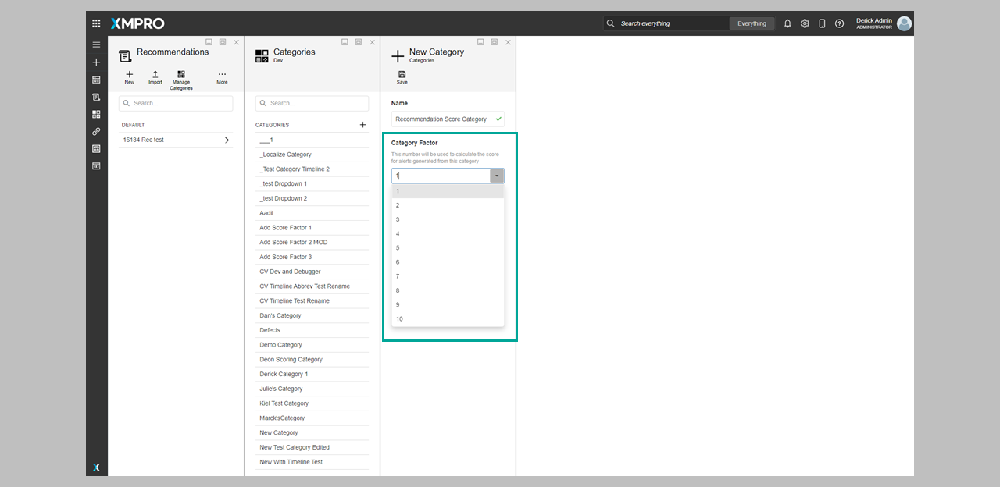
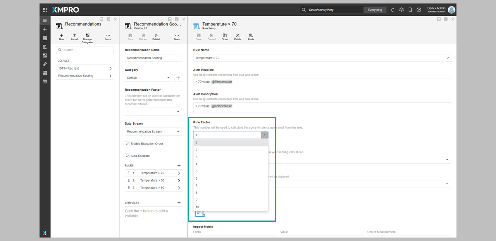
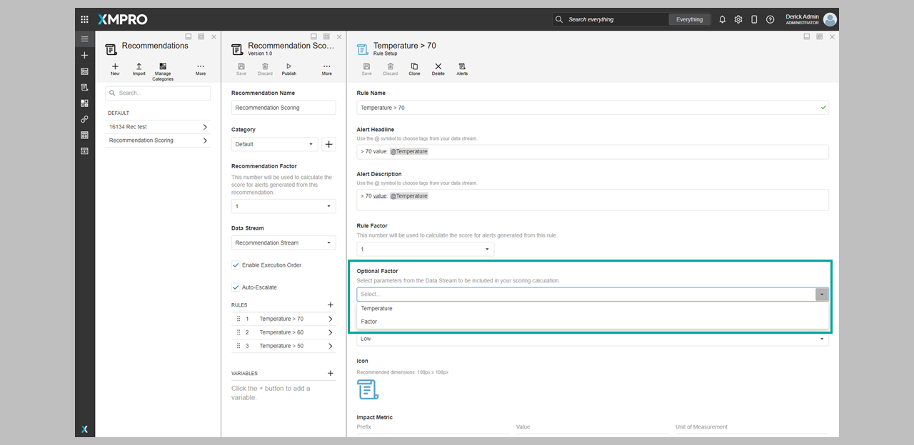
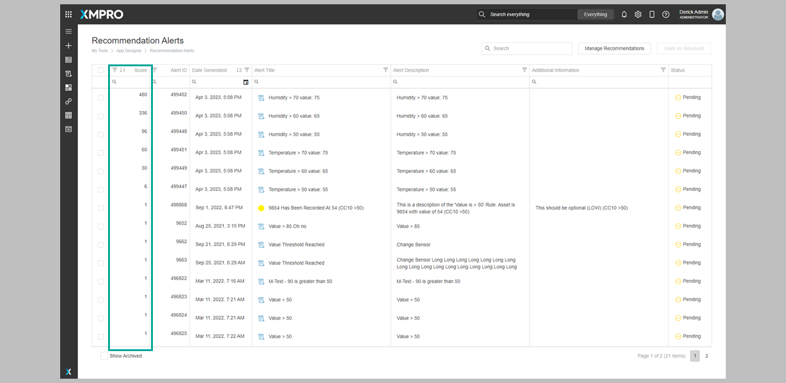
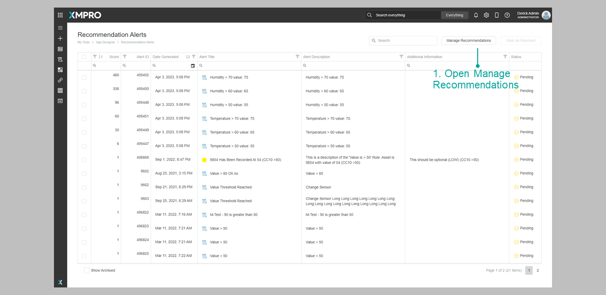
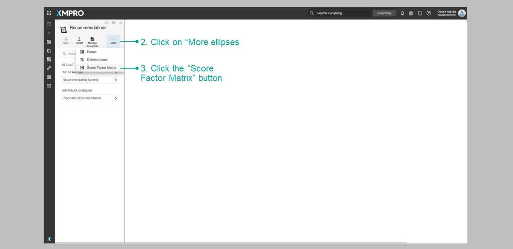
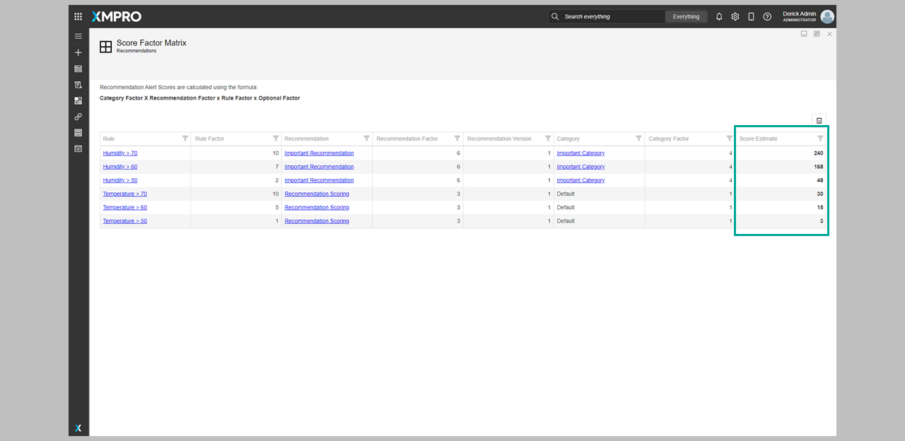
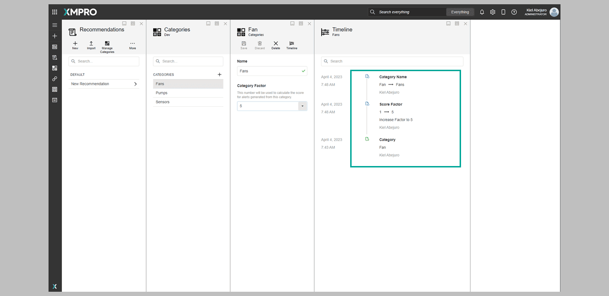
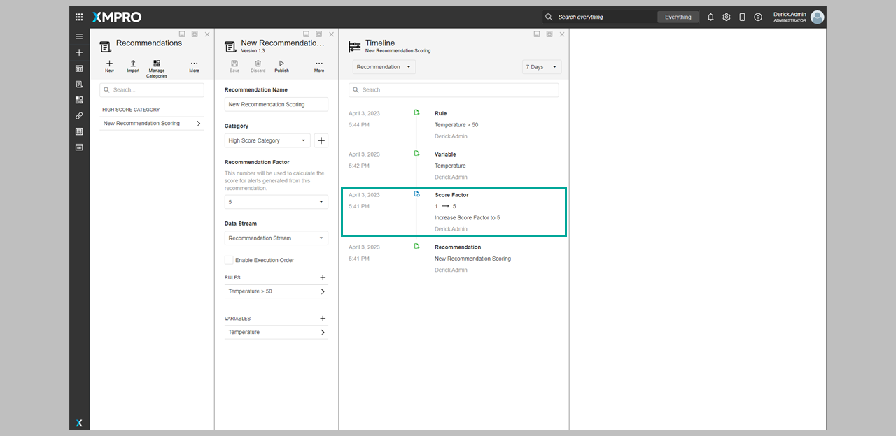

# Scoring

## What is Alert Ranking and Alert Scoring?

When setting up a Recommendation, authors are able to influence the order in which Alerts will be shown. Ranking and Scoring help the alert recipient prioritize recommendations according to their importance.

## What is the difference between Alert Ranking and Alert Scoring?

[**Alert Ranking**](../../how-tos/recommendations/create-rules.md#create-rules) allows users to rank a recommendation as High/Medium/Low.

**Alert Scoring** is an alternate fine-tuning of the alert ranking by specific factors such as recommendation, category, rule, and an optional value from the Data Stream.

By allowing the author to assign a calculated score to an Alert instead of a ranking, you can have even more detailed control over its importance level.

This Score also helps the alert recipient to understand its relative importance.

> [!NOTE]
> Authors still have the option to use Alert Ranking instead of Alert Scoring if they prefer.

## How is the scoring calculated?

This feature allows recommendation authors to assign numerical values (1-10) to various aspects during configuration. These values are then multiplied, resulting in an alert score.

```
score = recommendation factor * category factor * rule factor * optional factor
```

The score is calculated at the time the alert is generated and is not recalculated should any of the factors be updated.

## Where are scoring values added?

The values used to score an Alert could be configured in these different areas:

* [**Recommendation**](../../how-tos/recommendations/manage-recommendations.md#create-a-recommendation) – assesses the significance of the recommendation itself



* [**Recommendation Category**](../../how-tos/manage-categories.md#adding-a-new-category) – evaluates the importance of the recommendation's category



* [**Recommendation Rule**](../../how-tos/recommendations/create-rules.md#create-rules) **-** when managing a rule within a recommendation



* [**Recommendation Optional**](../../how-tos/recommendations/create-rules.md#create-rules) - an Optional Rule Factor value retrieved from the Data Stream.



## Viewing the recommendation scoring

When viewing the **Recommendation Alerts** list, The Recommendation Scoring is displayed on the Score Column, and the Alerts are arranged in a descending order based on their Scoring.



You can also view the Scores using the **Score Factor Matrix**. To open the Score Factor Matrix:

1. Open Manage Recommendations
2. Click on _“More”_ ellipses
3. Click the "_Score Factor Matrix"_ button







> [!NOTE]
> This table only shows an estimate as the Optional Factor of the Recommendation could not be determined until the Alert is generated.

## Viewing the Score Factor history on a timeline

The changes made on a Score Factor Recommendation can be viewed on a timeline in the following areas:

* **Category Timeline** – when observing score factor changes within this timeline.



* **Recommendation & Rule Timeline** – when viewing score factor changes within this timeline.


