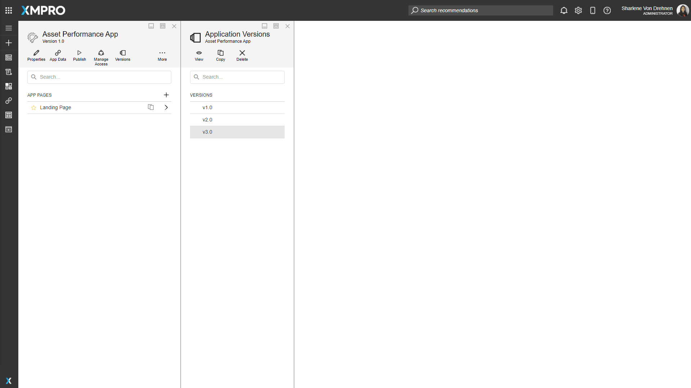
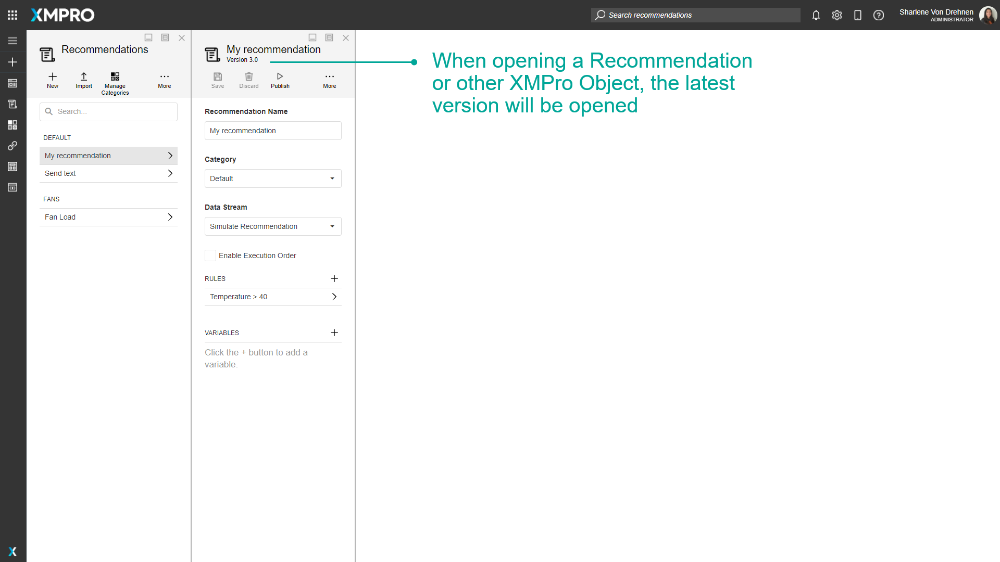
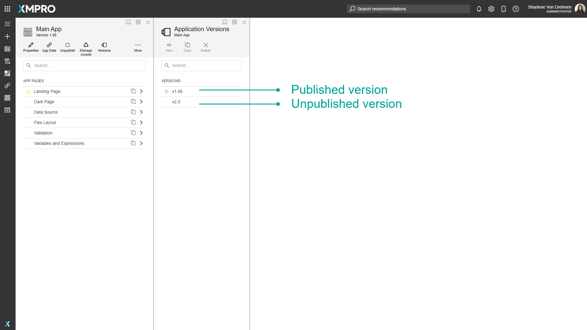
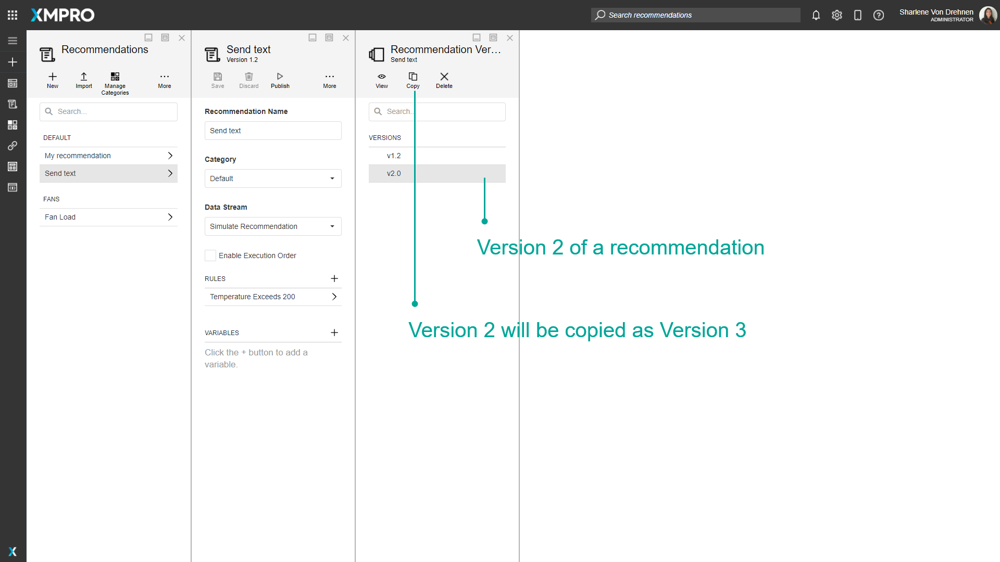
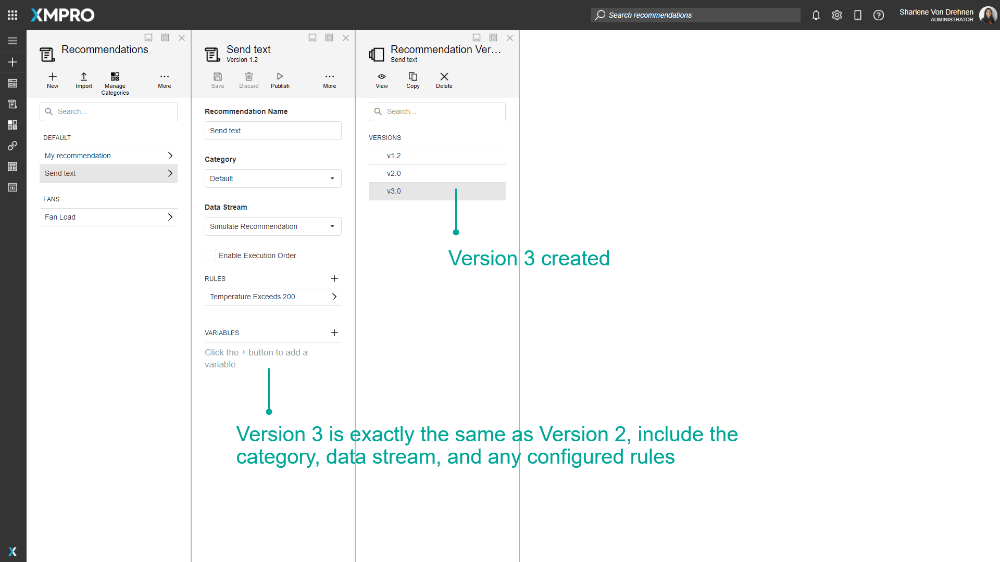
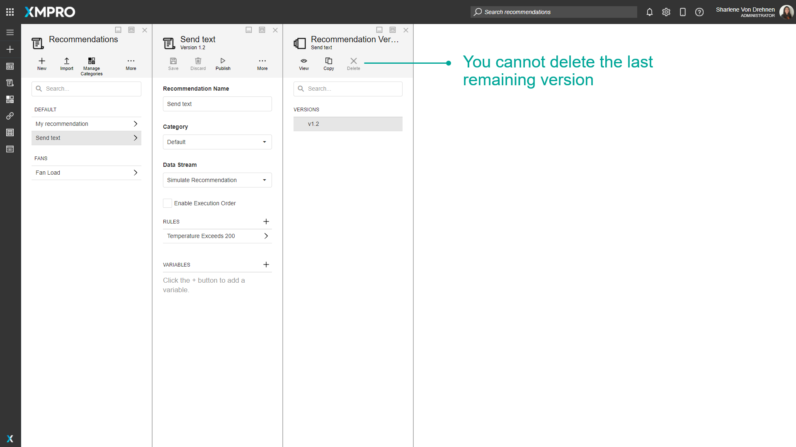

# Version

## Version Management

Versioning provides traceability, which is the ability to view all revisions and changes made throughout an XMPro Object's history, including changes made during each development stage. Adding new versions also allows different team members to work on and make changes to an XMPro Object that is currently in use by other people. This allows others to continue using it without any downtime.

Making changes on a new version of an XMPro Object also allows you to maintain a version of it before you made changes, which can also act as a backup mechanism. If major issues are found in the new version, you are easily able to switch back to an older one if needed.

Each XMPro Object keeps track of different versions, including:

* Data Streams
* Agents and Connectors
* Applications
* Recommendations
* Forms

> [Watch Video](https://www.youtube.com/embed/3oqlQJxFaOg)

Minor version increases are automatically handled by the system every time you make changes to the particular XMPro Object and save those changes. However, control over how major version increases are handled is given, to some extent, to the user as versions can easily be copied or removed.

Copying a version allows you to continue working and making changes to the XMPro Object while maintaining a version of it before you made changes, which can also act as a backup mechanism.

To view the available versions for a particular XMPro Object, click on the "_Versions_" button.

When you open an XMPro Object, the latest version is automatically opened. Even if there is an older version published, the latest version will still be opened.

## Published Versions

A published version is a version of the XMPro Object that is published and viewable and usable to others. [See the Publish article for more details on published XMPro Objects.](../how-tos/publish/index.md)

Versions that are published will display a green play symbol next to the version number.

## Copying Versions

When copying a version, all properties and inner components of the XMPro Object's version will be duplicated as a new version.

## Deleting Versions

Published versions cannot be deleted. When an XMPro Object only has a single version or one last remaining version, that version also cannot be deleted.

## Actions on the Version

| **Action** | **Description** |
| --- | --- |
| View/Open | Opens that particular version of the XMPro Object. |
| Copy | Copies the selected version as a new version, with a higher version number. |
| Delete | Deletes the Version. |

## Further Reading

* [How to manage Versions](../how-tos/manage-versions.md)
