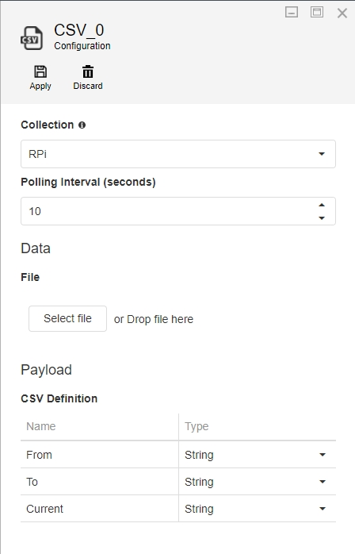
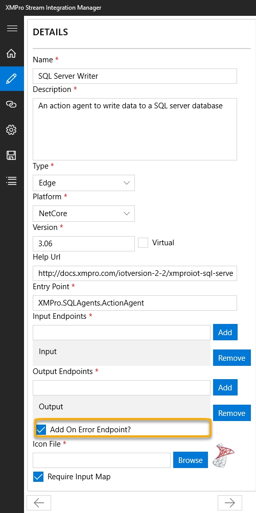

# Building Agents

## Overview

To get started with developing a new Agent, create a new C# library project in Visual Studio and import the [XMPro.IoT.Framework](https://www.nuget.org/packages/XMPro.IOT.Framework/) NuGet package. This article covers the agent categories and the interfaces available for each, detailed documentation for each interface, and a complete MQTT Listener example.

## Categories

When writing the code for an Agent, you will have to implement a number of interfaces. Which interfaces to implement depends on the category under which your Agent will fall:

### Listeners

Listeners are created by implementing _IAgent_ and _IPollingAgent_ interfaces. To push the events to the next receiver, the _OnPublish_ event should be invoked and the events should be passed as arguments.

### Action Agents / Functions

Action Agents are created by implementing the _IAgent_ and _IReceivingAgent_ interfaces. The _Receive_ method will be called every time events are received by this Agent. To publish these events again, the same logic as per the Listener Agent can be used.

### Context Providers

Context Providers are created by implementing the _IAgent_, _IPollingAgent_ interfaces. They are very similar to Listeners; however, Context Providers publish all available records/events when polled instead of only publishing the newer/changed ones.

### Transformations

Transformations are implemented in a similar way as Action Agents, except that all Transformations should have the _Require Input Map_ flag set to _false_ and must not implement the _GetInputAttributes_ method, hence it should be:

```csharp
public IEnumerable<XMIoT.Framework.Attribute> GetInputAttributes(string endpoint, IDictionary<string, string> parameters)
{

throw new NotImplementedException();

}
```

### Connectors

Connector Agents handle read, insert, update, and delete requests for a specific data source. They are used with the [XMPro Stream Connector](https://xmpro.gitbook.io/integrations/xmpro-stream) in Application Designer and implement the _IAgent_ and _IMapAndReceiveAgent_ interfaces.

> [!NOTE]
> The current Connector Agents wrap existing Connectors using a shared base class. Documentation on how to build custom Connector Agents will be provided in a future release.

## Interfaces

The interfaces that can be implemented are as follows:

* [IAgent](building-agents.md#iagent)
* [IPollingAgent](building-agents.md#ipolling-agent)
* [IReceivingAgent](building-agents.md#ireceivingagent)
* [IPublishesError](building-agents.md#ipublisherror)
* [IAgentLogger](building-agents.md#iagentlogger) (v4.4.19)

The matrix below shows which interface needs to be implemented for which category Agent:

| Agent Category | IAgent | IPollingAgent | IReceivingAgent | IMapAndReceiveAgent | IPublishesError | IAgentLogger |
| --- | --- | --- | --- | --- | --- | --- |
| _Listener_ | Required | Recommended | Optional | - | Optional | Optional |
| _Context Provider_ | Required | Recommended | Optional | - | Optional | Optional |
| _Transformation_ | Required | Optional | Required | - | Optional | Optional |
| _Action Agent / Function_ | Required | Optional | Required | - | Optional | Optional |
| _AI & Machine Learning / Gen AI_ | Required | Optional | Required | - | Optional | Optional |
| _Connector_ | Required | - | - | Required | Optional | Optional |

> [!NOTE]
> The _IPollingAgent_ interface is not strictly required for _Listeners_ or _Context Providers_, however, it is generally used in most cases. Not implementing _IPollingAgent_ for a _Listener_ or _Context Provider_ should be considered an advanced option.

## IAgent



_IAgent_ is the primary interface that must be implemented by all Agents as it provides the structure for the workings of the Agent. After implementing this interface, there are several methods you have to add to your project that forms part of this predefined structure.

### Settings/Configurations

Some Agents need to be provided with configurations by the user, for example, for a CSV listener Agent to get records from a CSV file, it needs the following:

* Polling interval (in seconds)
* CSV file
* CSV Definition

Each of these settings should be referenced in the code and must correspond to the settings template created when [packaging your Agent](packaging-agents.md).

> [!NOTE]
> A template is a JSON representation of all the controls and their layout that will be used to capture the settings from a user.

An example of the settings template (generated using the [XMPro Package Manager](https://www.microsoft.com/en-au/p/xmpro-package-manager/9n3f4wnslgzk)) is shown in the image below. The settings in this example consist of the following controls:

* Group (Data)
* File Upload
* Group (Payload)
* Grid


Each control has a _Key_, which uniquely identifies it in the template and allows the Agent code to access its value at any time. To get the value contained in a setting, use the following code:

```csharp
string mySetting = parameters["myUniqueKey"];
```

Before a template is rendered on the screen, or if a postback occurs on any control in the template, the method below would be called to allow the Agent an opportunity to make any necessary runtime changes to the template, for example, verifying user credentials, displaying all tables of a selected database in a drop-down list, etc. In this example, no changes are being made to the template but, if needed, they can be added to the _**todo**_ section.

> [!NOTE]
> For a postback to occur after a user navigates out of a setting field, the _Postback_ property needs to be set to _true_ when packaging the Agent.

```csharp
public string GetConfigurationTemplate(string template, IDictionary<string, string> parameters)
{

//parse settings JSON into Settings object
var settings = Settings.Parse(template);
//populate the settings/configuration controls with the user selected values
new Populator(parameters).Populate(settings);
// ToDo: update the controls, values or the data sources here
//return the updated settings xml
return settings.ToString();

}
```

### Validate

If a user tries to run an Integrity Check on a Data Stream in Data Stream Designer, all Agents will be requested to validate the configurations they have been provided. An Agent has to use this opportunity to inform the user about any configurations that are incorrect, for example, credentials that have expired, required values that are missing, etc.

To validate the configurations/ settings in an Agent, the _Validate_ method needs to be implemented. This method returns an array of errors that occurred. If validation was successful, an empty array would be returned.

The example code below verifies if a user has specified a broker address, topic, and payload definition for an MQTT Agent:

```csharp
public string[] Validate(IDictionary<string, string> parameters)
{

int i = 1;
var errors = new List<string>();
this.config = new Configuration() { Parameters = parameters };

if (String.IsNullOrWhiteSpace(this.Broker))
errors.Add($"Error {i++}: Broker is not specified.");

if (String.IsNullOrWhiteSpace(this.Topic))
errors.Add($"Error {i++}: Topic is not specified.");

var grid = new Grid();
grid.Value = this.config["PayloadDefinition"];
if (grid.Rows.Any() == false)
errors.Add($"Error {i++}: Payload Definition is not specified.");
return errors.ToArray();

}
```

### Output Payload

Each Agent has the responsibility to inform the _Engine_ about the structure of the payload that will be produced by the Agent. To do this, implement the following method:

```csharp
IEnumerable<Attribute> GetOutputAttributes(string endpoint, IDictionary<string, string> parameters)
```

This method returns a collection that has an Attribute type, which is a type that represents the name and type of a given attribute in the outgoing payload. As from XMPro.IOT.Framework version 3.0.2, comparison/ equality operations are also supported in _Attribute_, for example:

```csharp
new XMIoT.Framework.Attribute("Name1", Types.DateTime).Equals(new XMIoT.Framework.Attribute("Name2", Types.String));
```

### Create

Each Agent needs to implement a method called _Create,_ which will be invoked when your Agent is being hosted. User-defined configuration is passed as a parameter to this method and should be stored in a class variable as far as possible for later use. This is a good point to provide any resources needed for the working of your Agent.

```csharp
void Create(Configuration configuration)
{
    this.config = configuration;
    // ToDo: Provision any resources or write Startup logic.
}
```

### Start

The _Start_ method needs to be implemented by all Agents. This method will be invoked when your Agent is hosted and starts to work.

```csharp
void Start()
```

### Destroy

Each Agent needs to implement a _Destroy_ method, which will be invoked if the _Create_ method was called successfully, when a data stream is either being unpublished or it encounters an error and fails to start.

Use this method to release any resources or memory that your Agent may have acquired during its creation and lifetime.

```csharp
void Destroy()
```

### Publishing Events

To push the events to the next Agent, your Agent should invoke the _OnPublish_ event with the events passed as arguments. Using the streaming overload is recommended to enable [Event-Level Streaming](#upgrading-to-event-level-streaming):

```csharp
this.OnPublish?.Invoke(this, new OnPublishArgs(eventStream, "EndpointName"));
```

The `eventStream` variable is an instance of `IAsyncEnumerable<byte[]>`.

`OnPublishArgs` automatically converts between `JArray` and `IAsyncEnumerable<byte[]>`, so downstream agents consuming either format will receive data correctly.

> [!NOTE]
> Use the legacy `JArray` overload for [Agent-Level Streaming](../../concepts/agent/event-level-streaming-vs-agent-level-streaming.md#agent-level-streaming): `this.OnPublish?.Invoke(this, new OnPublishArgs(eventJArray, "EndpointName"))` where `eventJArray` is a `JArray`.

> [!CAUTION]
> Please note that OnPublishArgs(Array rtr) is obsolete from XMPro.IOT.Framework 3.0.2 onwards. You are now required to specify the endpoint name on which you would like to publish (i.e. OnPublishArgs(Array rtr, string Endpoint))

### Decrypting Values

If an Agent's configuration contains a Secure/Password Textbox, its value will automatically be encrypted. To decrypt the value, use the following set of instructions:

```csharp
var request = new OnDecryptRequestArgs(value);
this.OnDecryptRequestArgs?.Invoke(this, request);
var decryptedVal = request.DecryptedValue;
```

### Custom Events

While building your Agent, you may need to use external libraries or third-party event subscriptions to handle custom events. If these are used, you must catch any exceptions from the event handlers yourself, to prevent uncaught exceptions that could possibly crash the Data Stream if they get through.

## IPollingAgent

The _IPollingAgent_ interface allows time-based operations. Implementing this interface, and opting in to Polling by returning true from the _RequiresPolling_ method, will automatically add a _PollingInterval_ setting to the configuration template of your Agent, which can be used by the user to specify the interval for polling.

Using `PollAsync` is recommended to enable [Event-Level Streaming](#upgrading-to-event-level-streaming). These methods will be called at regular intervals according to the Configuration settings, and can be used to perform any work or logic you wish, for example, querying a third-party system for changes.

```csharp
async Task PollAsync(CancellationToken cancellationToken = default)
```

When implementing `PollAsync`, use the streaming `OnPublishArgs` overload (passing `IAsyncEnumerable<byte[]>`) when publishing output to avoid materialising events into a `JArray`.

> [!NOTE]
> Use the legacy `Poll` method (`void Poll()`) for [Agent-Level Streaming](../../concepts/agent/event-level-streaming-vs-agent-level-streaming.md#agent-level-streaming). If `PollAsync` is not implemented, the Stream Host automatically calls `Poll` instead, and existing agents require no changes.

```csharp
bool RequiresPolling(IDictionary<string, string> parameters)
```

The RequiresPolling method is an advanced option. It is expected that in most cases, this method should simply return a true value, which will not change the behaviour of the Agent. The _PollingInterval_ setting will display as normal, and the _Poll_ or _PollAsync_ methods will be called at that interval, as normal.

Advanced users, however, can use this method to decide to opt-out of Polling settings, by returning false. The _parameters_ method parameter will contain the Stream Object's Configuration, allowing you to determine whether to return true to opt-in, or false to opt out, depending on what settings the user has selected. Opting out will cause the PollingInterval setting to not appear in the configuration tab, and the Poll method to never be called when the Stream is published.

This may be useful when the agent you are building can be configured to either actively query its configured third-party system for data at regular intervals, or set up a persistent connection to the third-party service and passively wait for that connection to deliver data.

If the Agent does not need to query for data at regular intervals, or perform other work or logic on a specific schedule, it is recommended to not implement _IPollingAgent_ rather than always returning false from the _RequiresPolling_ method.

## IReceivingAgent

If your Agent is required to receive inputs from other Agents, you should implement the _IReceivingAgent_ interface.

### Input Payload

Each Agent is responsible to inform the _Engine_ about the structure of the payload it consumes. To achieve this in your Agent, implement the following method:

```csharp
IEnumerable<Attribute> GetInputAttributes(string endpoint, IDictionary<string, string> parameters)
```

This method returns a collection consisting of Attribute, which is a type that represents the name and type of a given attribute in the incoming payload.

#### Input Mapping

In most cases, if an incoming payload structure is supposed to be different from what the parent is sending, i.e. the Input Payload has been specified above, the user will have to map parent outputs to the current Agent's inputs. To enable this, mark the _Require Input Map_ flag as true in the Stream Integration Manager when packaging the Agent.

#### Endpoint

Each Agent can have a number of input and output [endpoints](../../concepts/agent/index.md#endpoints). Endpoints are the points where incoming or outgoings arrows are connected. Each endpoint consists of a _Name\<String>_ attribute. You will be passed an endpoint name when queried for an _Input_ payload definition. Be sure to specify the endpoint name when querying the parent's output payload definition.

### Parent Outputs

All receiving Agents can query the structure of parent Agent outputs connected at a given endpoint by invoking an event, as demonstrated in the example below:

```csharp
var args = new OnRequestParentOutputAttributesArgs(this.UniqueId, "Input");
this.OnRequestParentOutputAttributes.Invoke(this, args);
var pOuts = args.ParentOutputs;
```

### Receiving Events

Events published to a receiving Agent can be received by implementing the following method. Using `ReceiveAsync` is recommended to enable [Event-Level Streaming](#upgrading-to-event-level-streaming):

```csharp
async Task ReceiveAsync(string endpointName, IAsyncEnumerable<byte[]> events, CancellationToken cancellationToken = default)
```

When implementing `ReceiveAsync`, use the streaming `OnPublishArgs` overload (passing `IAsyncEnumerable<byte[]>`) when publishing output to avoid materialising events into a `JArray`.

> [!NOTE]
> Use the legacy `Receive` method for [Agent-Level Streaming](../../concepts/agent/event-level-streaming-vs-agent-level-streaming.md#agent-level-streaming): `void Receive(string endpointName, JArray events)`. If `ReceiveAsync` is not implemented, the Stream Host automatically calls `Receive` instead after converting the stream to a `JArray`, and existing agents require no changes.

The _endpointName_ parameter will identify which endpoint the events have been received at.

> [!NOTE]
> It is not guaranteed that the _Start_ method will be invoked before the _Receive_ or _ReceiveAsync_ methods. Use the _Create_ method to execute any logic that needs to be executed before the _Receive_ or _ReceiveAsync_ methods are called.

## IPublishError

An Agent can publish messages to an error endpoint by implementing the _IPublishesError_ interface. An unhandled error in an Agent will be captured and error information will be published to the error endpoint.



Implement the interface member:

```csharp
public event EventHandler<OnErrorArgs> OnPublishError;
```

To push the error to the next Agent, the _OnPublishError_ event should be invoked, and the error information should be passed as arguments:

```csharp
this.OnPublishError?.Invoke(this, new OnErrorArgs(AgentId, Timestamp, Source, Error, DetailedError, Data));
```

> [!NOTE]
> Error endpoints should be enabled in XMPro Stream Integration Manager when packaging the Agent. This can be done by selecting the "Add On Error Endpoint?" checkbox. See the image above for an example.

## IAgentLogger

An Agent can output logging to the the [Data Stream Logs](../data-streams/check-data-stream-logs.md#view-data-stream-logs) by implementing the _IAgentLogger_ interface. Like [IPublishError](building-agents.md#ipublisherror), this can be used for errors, but it can also be used to log information or warning messages too.

The prerequisite to use this interface are [XMPro.IoT.Framework](https://www.nuget.org/packages/XMPro.IOT.Framework/) v4.4.19+ and Data Stream Designer v4.4.19+.

1. Add an empty constructor to your Agent entry point class and another constructor that accepts an IAgentLogger. See following code for the contents of the two constructors:

   ```csharp
   private readonly AgentLoggerProxy _loggerProxy;

   public BaseAgent
   {
       _loggerProxy = new AgentLoggerProxy();
   }

   public BaseAgent(IAgentLogger logger)
   {
       _loggerProxy = new AgentLoggerProxy(logger);
   }
   ```

2. The IAgentLogger interface contains the logging methods but a proxy class is needed to execute it to avoid compatibility issues with older SH and DS. Create the AgentLoggerProxy class with the following contents:

   ```csharp
   public class AgentLoggerProxy
   {
       private readonly object? _logger;
       private readonly Type? _loggerType;
       private readonly Dictionary<string, MethodInfo?> _methods;

       public AgentLoggerProxy(object? logger = null)
       {
           _logger = logger;
           _loggerType = logger?.GetType();
           _methods = new Dictionary<string, MethodInfo?>();

           if (logger != null)
           {
               // Cache all method infos
               _methods["LogInfo"] = _loggerType?.GetMethod("LogInfo",
                   new[] { typeof(string), typeof(object[]) });

               _methods["LogErrorWithException"] = _loggerType?.GetMethod("LogError",
                   new[] { typeof(Exception), typeof(string), typeof(object[]) });

               _methods["LogError"] = _loggerType?.GetMethod("LogError",
                   new[] { typeof(string), typeof(object[]) });

               _methods["LogWarning"] = _loggerType?.GetMethod("LogWarning",
                   new[] { typeof(string), typeof(object[]) });

               _methods["LogDebug"] = _loggerType?.GetMethod("LogDebug",
                   new[] { typeof(string), typeof(object[]) });
           }
       }

       public void LogInfo(string messageTemplate, params object[] args)
       {
           if (_logger != null && _methods["LogInfo"] != null)
           {
               _methods["LogInfo"]!.Invoke(_logger, new object[] { messageTemplate, args });
           }
       }

       public void LogError(Exception ex, string messageTemplate, params object[] args)
       {
           if (_logger != null && _methods["LogErrorWithException"] != null)
           {
               _methods["LogErrorWithException"]!.Invoke(_logger, new object[] { ex, messageTemplate, args });
           }
       }

       public void LogError(string messageTemplate, params object[] args)
       {
           if (_logger != null && _methods["LogError"] != null)
           {
               _methods["LogError"]!.Invoke(_logger, new object[] { messageTemplate, args });
           }
       }

       public void LogWarning(string messageTemplate, params object[] args)
       {
           if (_logger != null && _methods["LogWarning"] != null)
           {
               _methods["LogWarning"]!.Invoke(_logger, new object[] { messageTemplate, args });
           }
       }

       public void LogDebug(string messageTemplate, params object[] args)
       {
           if (_logger != null && _methods["LogDebug"] != null)
           {
               _methods["LogDebug"]!.Invoke(_logger, new object[] { messageTemplate, args });
           }
       }

       public bool HasLogger => _logger != null;
   }
   ```

3. Call the logging methods of the proxy class. This will now display the logs on Stream Host.

   ```csharp
   protected void LogMessage(string source, string message)
   {
       if (_loggerProxy.HasLogger)
       {
           loggerProxy.LogInfo($"[{source}] {message}");
       }
   }

   protected void LogError(Exception? ex, string message)
   {
       if (_loggerProxy.HasLogger)
       {
           _loggerProxy.LogError(ex, message);
       }
   }
   ```

## Upgrading to Event-Level Streaming

Agent developers upgrading to [Event-Level Streaming](../../concepts/agent/event-level-streaming-vs-agent-level-streaming.md#event-level-streaming) can use the helper class below. It provides extension methods for converting between `IAsyncEnumerable<byte[]>` and commonly-used enumerable types:

```csharp
using System;
using System.Collections.Generic;
using System.IO;
using System.Runtime.CompilerServices;
using System.Text;
using System.Threading;
using System.Threading.Tasks;
using Newtonsoft.Json;
using Newtonsoft.Json.Linq;

namespace XMPro.AgentStreaming
{
    /// <summary>
    /// Shared helper utilities for streaming agent implementations.
    /// Provides JSON serialization/deserialization over byte streams and
    /// conversion helpers between synchronous and asynchronous enumerables.
    /// </summary>
    public static class AgentStreamingHelpers
    {
        /// <summary>
        /// UTF-8 encoding without a byte-order mark (BOM), for consistent JSON byte stream handling.
        /// </summary>
        public static readonly Encoding Utf8NoBOM = new UTF8Encoding(encoderShouldEmitUTF8Identifier: false);

        /// <summary>
        /// Deserializes a stream of UTF-8 JSON byte arrays into a stream of <see cref="JToken"/> objects.
        /// </summary>
        /// <param name="events">The async stream of raw JSON bytes, one JSON value per element.</param>
        /// <param name="encoding">The text encoding to use when reading each byte array. Defaults to <see cref="Utf8NoBOM"/>.</param>
        /// <param name="cancellationToken">Token to cancel enumeration.</param>
        /// <returns>An async stream of deserialized <see cref="JToken"/> values.</returns>
        public static async IAsyncEnumerable<JToken> Deserialize(
            this IAsyncEnumerable<byte[]> events,
            Encoding? encoding = null,
            [EnumeratorCancellation] CancellationToken cancellationToken = default)
        {
            encoding ??= Utf8NoBOM;
            await foreach (var eventBytes in events.WithCancellation(cancellationToken))
            {
                using (var stream = new MemoryStream(eventBytes))
                using (var reader = new StreamReader(stream, encoding))
                using (var jsonReader = new JsonTextReader(reader))
                {
                    yield return await JToken.ReadFromAsync(jsonReader, cancellationToken);
                }
            }
        }

        /// <summary>
        /// Serializes a stream of <see cref="JToken"/> objects into a stream of UTF-8 JSON byte arrays.
        /// The underlying <see cref="MemoryStream"/> is reused across iterations to minimise allocations;
        /// each yielded <c>byte[]</c> is an independent, caller-owned copy safe to retain indefinitely.
        /// </summary>
        /// <param name="events">The async stream of <see cref="JToken"/> values to serialize.</param>
        /// <param name="encoding">The text encoding to use when writing each token. Defaults to <see cref="Utf8NoBOM"/>.</param>
        /// <param name="cancellationToken">Token to cancel enumeration.</param>
        /// <returns>An async stream of serialized JSON byte arrays.</returns>
        public static async IAsyncEnumerable<byte[]> Serialize(
            this IAsyncEnumerable<JToken> events,
            Encoding? encoding = null,
            [EnumeratorCancellation] CancellationToken cancellationToken = default)
        {
            encoding ??= Utf8NoBOM;
            using (var stream = new MemoryStream())
            {
                await foreach (var eventToken in events.WithCancellation(cancellationToken))
                {
                    stream.SetLength(0);
                    stream.Position = 0;
                    using (var writer = new StreamWriter(stream, encoding, 1024, leaveOpen: true))
                    using (var jsonWriter = new JsonTextWriter(writer))
                    {
                        await eventToken.WriteToAsync(jsonWriter, cancellationToken);
                        await jsonWriter.FlushAsync(cancellationToken);
                    }
                    yield return stream.ToArray();
                }
            }
        }

        /// <summary>
        /// Converts an <see cref="IAsyncEnumerable{T}"/> to a blocking <see cref="IEnumerable{T}"/>
        /// by synchronously waiting for each element.
        /// Useful for bridging streaming <c>ReceiveAsync</c> pipelines with legacy <c>Receive</c> code.
        /// </summary>
        /// <typeparam name="T">The element type.</typeparam>
        /// <param name="source">The async enumerable to consume.</param>
        /// <returns>A synchronous enumerable that blocks on each element.</returns>
        public static IEnumerable<T> ToBlockingEnumerable<T>(this IAsyncEnumerable<T> source)
        {
            var enumerator = source.GetAsyncEnumerator();
            try
            {
                while (true)
                {
                    if (!enumerator.MoveNextAsync().AsTask().GetAwaiter().GetResult())
                        break;
                    yield return enumerator.Current;
                }
            }
            finally
            {
                // Suppress disposal exceptions to avoid masking the original enumeration error.
                // When the source stream fails (e.g., network error, deserialization failure),
                // both MoveNextAsync() AND DisposeAsync() may throw if the underlying connection
                // is already in a bad state. Without this suppression, the disposal exception
                // would replace and hide the original error, making root cause analysis extremely
                // difficult. This is a standard C# pattern (see IEnumerator<T>.Dispose documentation
                // and .NET's ConfigureAwait infrastructure) — we prioritize propagating the original
                // enumeration error over secondary cleanup failures.
                try { enumerator.DisposeAsync().AsTask().Wait(); } catch { /* suppress disposal exceptions */ }
            }
        }

        /// <summary>
        /// Wraps a synchronous <see cref="IEnumerable{T}"/> as an <see cref="IAsyncEnumerable{T}"/>,
        /// yielding each item with an <see cref="Task.Yield"/> to allow other async work to proceed.
        /// Useful for feeding legacy synchronous data into a streaming pipeline.
        /// </summary>
        /// <typeparam name="T">The element type.</typeparam>
        /// <param name="items">The synchronous sequence to adapt.</param>
        /// <param name="cancellationToken">Token to cancel enumeration.</param>
        /// <returns>An async enumerable that yields each item from <paramref name="items"/>.</returns>
        public static async IAsyncEnumerable<T> ToAsyncEnumerable<T>(
            this IEnumerable<T> items,
            [EnumeratorCancellation] CancellationToken cancellationToken = default)
        {
            foreach (var item in items)
            {
                cancellationToken.ThrowIfCancellationRequested();
                yield return item;
                await Task.Yield();
            }
        }
    }
}
```

## Example

The code below is an example of a basic MQTT Listener Agent. Take note of how the interfaces and methods have been implemented.

> [!NOTE]
> Please note that this example uses the _M2MqttDotnetCore 1.0.7_ NuGet package.

```csharp
using Newtonsoft.Json.Linq;
using System;
using System.Collections.Generic;
using System.Linq;
using System.Text;
using uPLibrary.Networking.M2Mqtt;
using uPLibrary.Networking.M2Mqtt.Messages;
using XMIoT.Framework;
using XMIoT.Framework.Settings;
using XMIoT.Framework.Settings.Enums;namespace XMPro.MQTTAgents
{
    public class Listener : IAgent
    { 
        private Configuration config;
        private MqttClient client;
        private string Broker => this.config["Broker"];
        private string Topic => this.config["Topic"];
        
        public long UniqueId { get; set; }
        public event EventHandler<OnPublishArgs> OnPublish;
        public event EventHandler<OnDecryptRequestArgs> OnDecryptRequest;
        
        public void Create(Configuration configuration)
        {
            this.config = configuration;
            this.client = new MqttClient(this.Broker);
            this.client.MqttMsgPublishReceived += Client_MqttMsgPublishReceived;
        }
        
        public void Start()
        {
            if (this.client.IsConnected == false)
            {
                this.client.Connect(Guid.NewGuid().ToString());
                this.client.Subscribe(new string[] { this.Topic }, new byte[] { MqttMsgBase.QOS_LEVEL_EXACTLY_ONCE });
            }
        }
        
        private void Client_MqttMsgPublishReceived(object sender, uPLibrary.Networking.M2Mqtt.Messages.MqttMsgPublishEventArgs e)
        {
            try
            {
                this.OnPublish?.Invoke(this, new OnPublishArgs(ToEventStream(e.Message), "Output"));
            }
            catch (Exception ex)
            {
                Console.WriteLine($"{DateTime.UtcNow}|ERROR|XMPro.MQTTAgents.Listener|{ex.ToString()}");
            }
        }

        private static async IAsyncEnumerable<byte[]> ToEventStream(byte[] messageBytes)
        {
            var array = JArray.Parse(Encoding.UTF8.GetString(messageBytes));
            foreach (JToken token in array)
                yield return Encoding.UTF8.GetBytes(token.ToString(Newtonsoft.Json.Formatting.None));
        }

        public void Destroy()
        {
            if (this.client?.IsConnected == true)
                this.client.Disconnect();
        }
        
        public string GetConfigurationTemplate(string template, IDictionary<string, string> parameters)
        {
            var settings = Settings.Parse(template);
            new Populator(parameters).Populate(settings);
            return settings.ToString();
        }
        
        public string[] Validate(IDictionary<string, string> parameters)
        {
            int i = 1;
            var errors = new List<string>();
            this.config = new Configuration() { Parameters = parameters };
            
            if (String.IsNullOrWhiteSpace(this.Broker))
                errors.Add($"Error {i++}: Broker is not specified.");
            
            if (String.IsNullOrWhiteSpace(this.Topic))
                errors.Add($"Error {i++}: Topic is not specified.");
            
            var grid = new Grid();
            grid.Value = this.config["PayloadDefinition"];
            
            if (grid.Rows.Any() == false)
                errors.Add($"Error {i++}: Payload Definition is not specified.");
            
            return errors.ToArray();
        }
        
        public IEnumerable<XMIoT.Framework.Attribute> GetOutputAttributes(string endpoint, IDictionary<string, string> parameters)
        {
            var grid = new Grid();
            grid.Value = parameters["PayloadDefinition"];
            foreach (var row in grid.Rows)
            {
                yield return new XMIoT.Framework.Attribute(row["Name"].ToString(), (Types)Enum.Parse(typeof(Types), row["Type"].ToString()));
            }
        }
    }
}
```

## Further Reading

* [Packaging Agents](packaging-agents.md)
