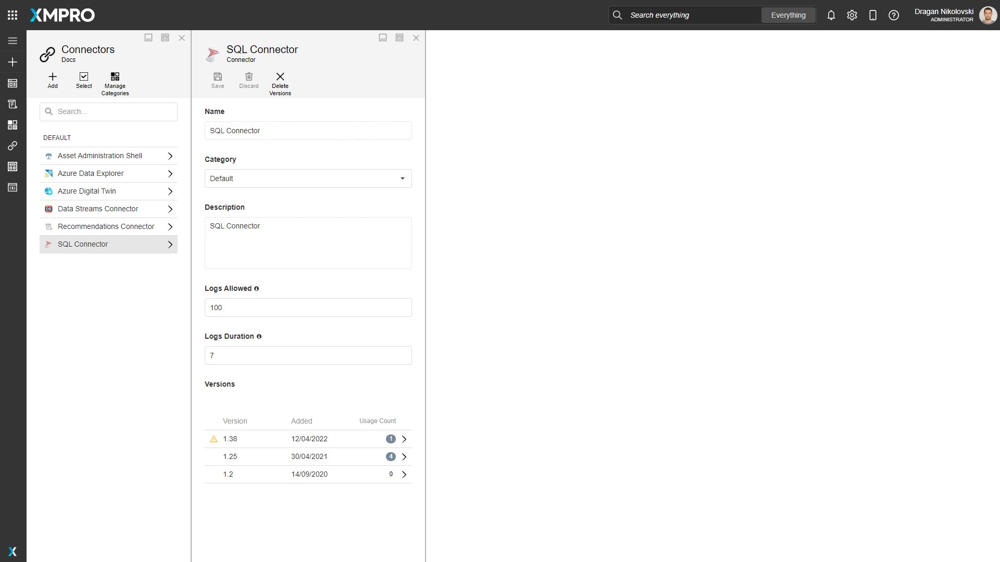
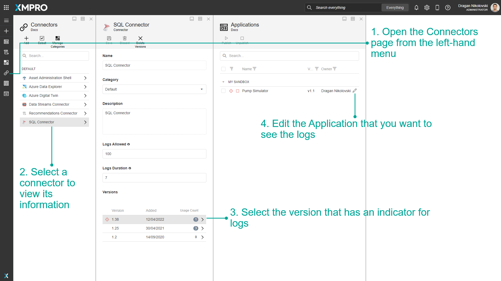
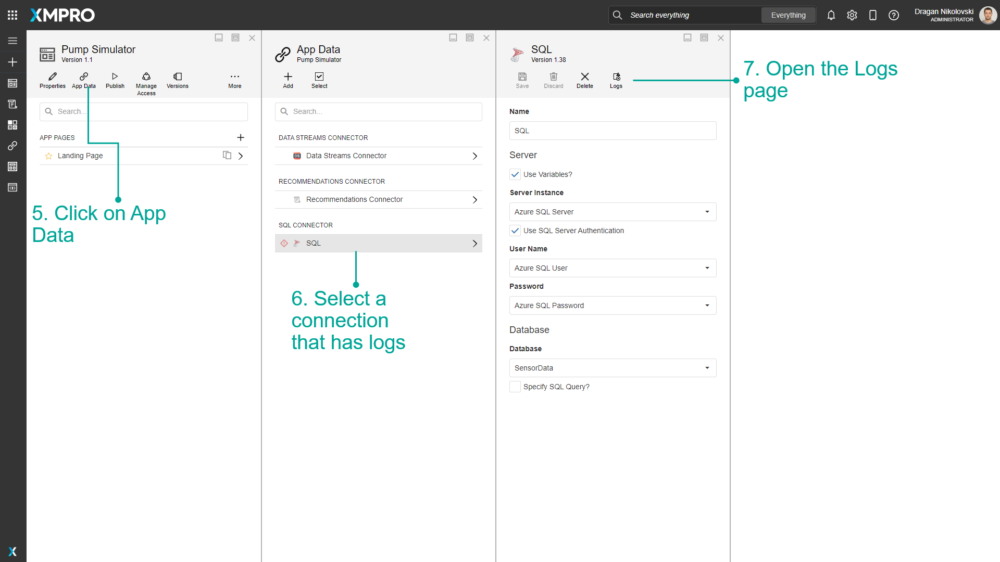
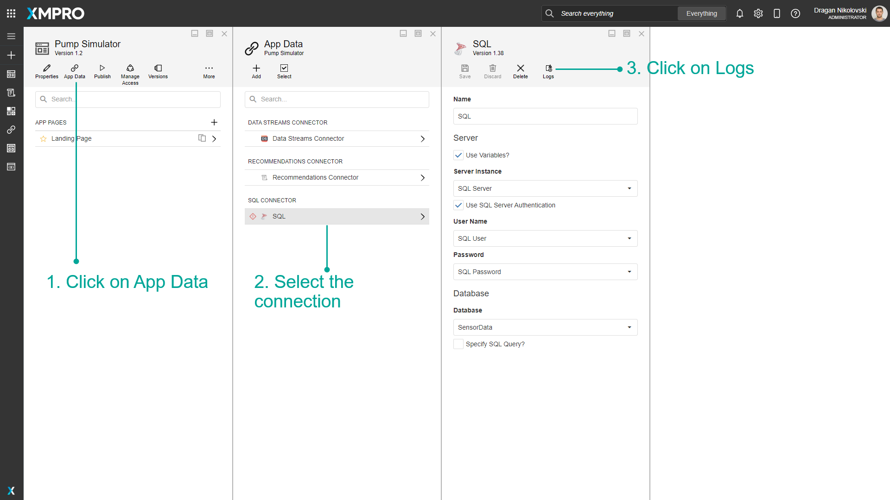
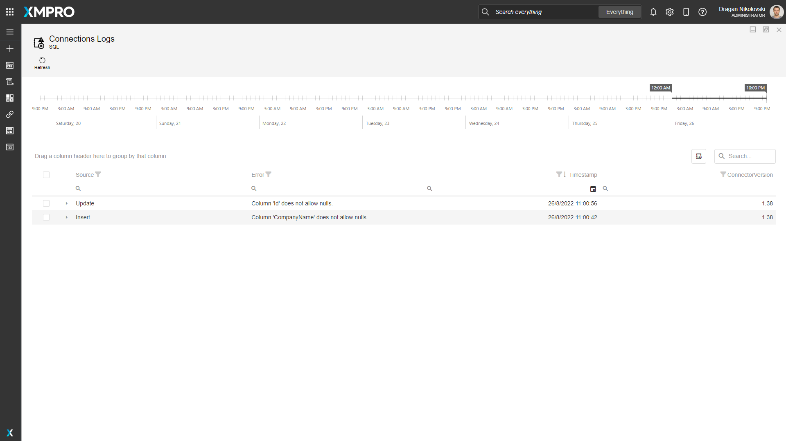
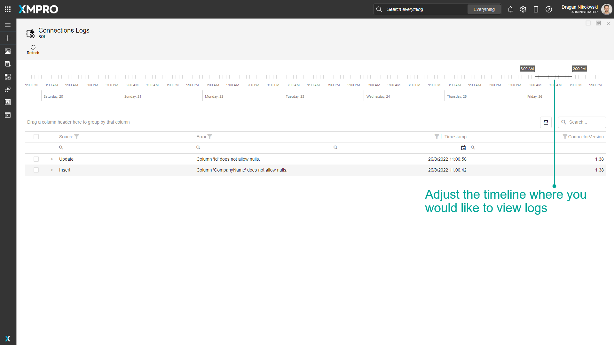
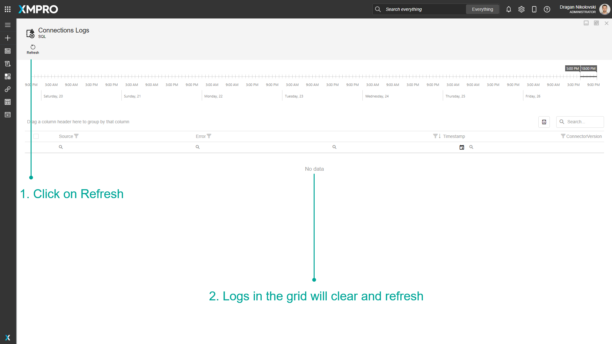
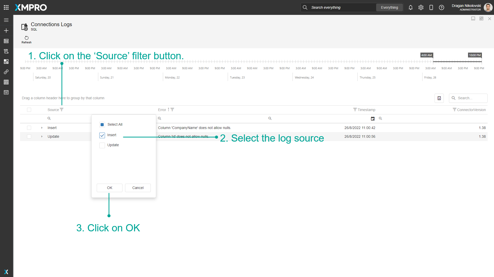
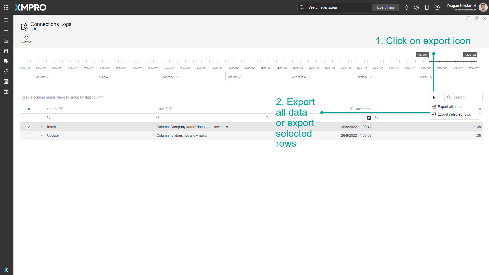

# Check Connector Logs

Logs allow the composer of an App, the developer writing a new Connector, or an Administrator to view messages generated by a Connector when it is in use in an App.

Log entry limits are configured per Connector but applied per App Connection. The Connection's log is cleared if it is upgraded to a newer version of the Connector or it is removed from the App.

Logs are saved for Connectors that implement the logging functionality.

> [!NOTE]
> It is recommended that you read the articles listed below to improve your understanding of Applications, Connections, and Connectors.
>
> * [Applications](manage-apps.md)
> * [Connectors](../connectors/manage-connectors.md)
> * [Connections](manage-connections.md)

### Configuring Connector Log Limits

The log entries are not stored indefinitely. The oldest will be cleared according to the combination of the number of log entries and the duration. The log entry limits apply to all versions of the Connector.

A Connector that is in development or experiencing errors may need a higher number and duration during troubleshooting.

#### Logs Allowed

The number of log entries retained. The maximum is 1000, the minimum is 1, and the default is 100.

#### Logs Duration

The duration, in days, of how long the logs are retained. The maximum is 90, the minimum is 1, and the default is 7.

> [!WARNING]
> Only the Administrator can change the limits.

### Indicator

An icon in front of the Connector indicates if there are errors logged:

| Icon | Description |
| --- | --- |
|  | Red indicates there are new logs for that Connector that no one has opened yet. |
|  | Yellow indicates there are logs for that Connector that have been viewed. |

## View Connector Logs

To view the logs for a Connector, follow the steps below:

1. Open the Connectors page from the left-hand menu.
2. Select a Connector to view its information.
3. Select the version that has an indicator for logs.
4. Edit the Application that you want to see the logs.

1. Click on App Data.
2. Select a Connection that has logs.
3. Open the Logs page.

## View Connection Logs

To view the logs for a Connection, follow the steps below:

1. Click on App Data
2. Select the Connection
3. Click on Logs

The Logs page is automatically maximized.

Adjust the timeline slider above the grid to view logs within a specific time range.

## Refresh Connection Logs

To refresh Connection logs, follow the steps below:

1. Click on Refresh.
2. Logs in the grid will clear and refresh.

## Filter Connection Logs

To filter Connection logs, follow the steps below:

1. Click on the 'Source' filter button.
2. Select the log source.
3. Click on OK.

## Export Connection Logs

To export Connection logs, follow the steps below:

1. Click on the export icon.
2. Export all data or export selected rows.

