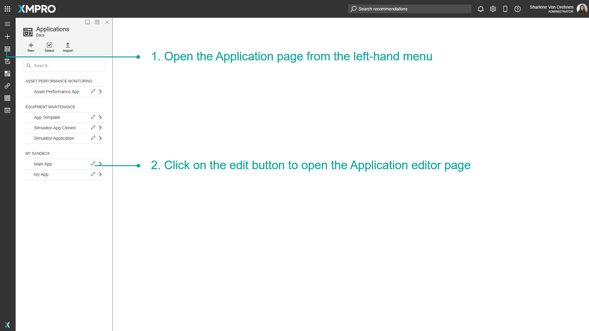
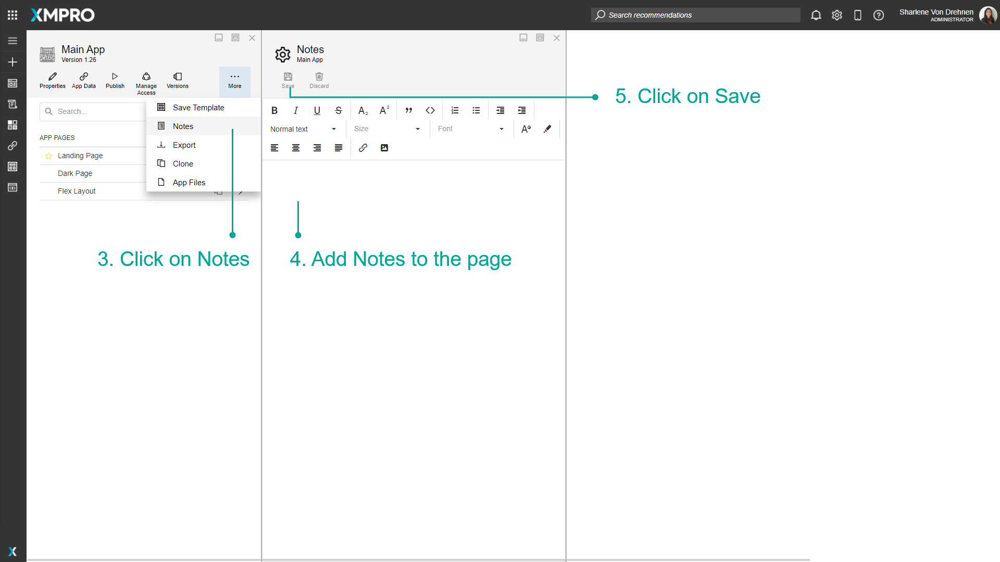
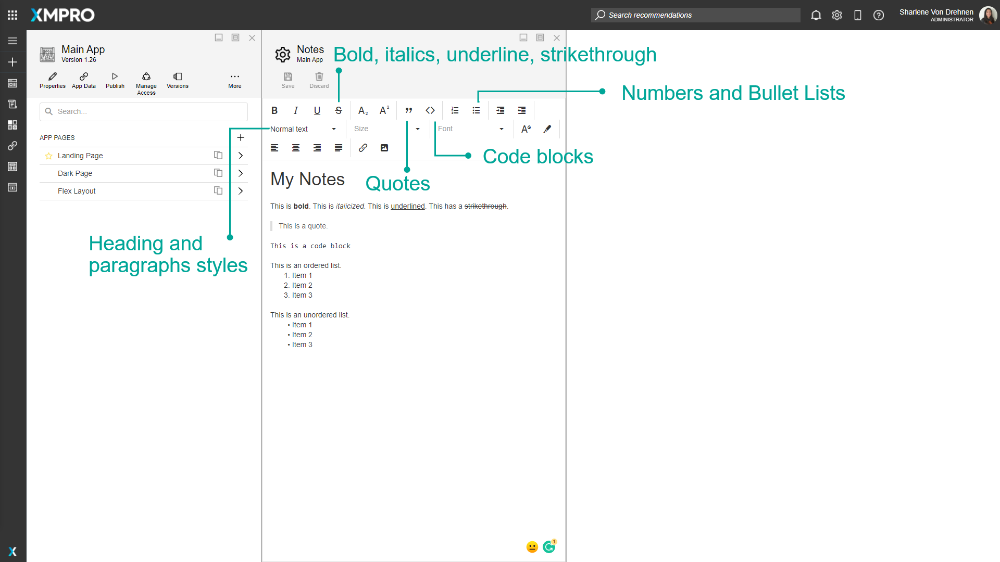
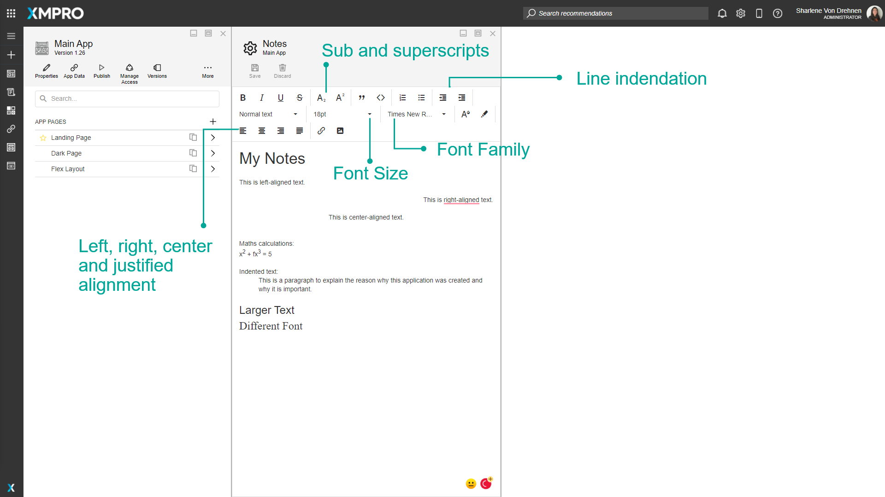
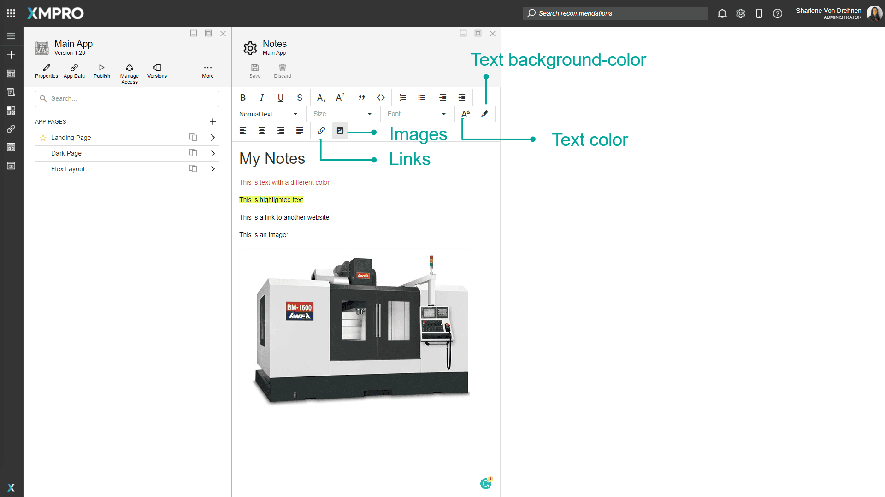

# Create and Maintain Notes

Notes are a way to share information about an Application between creators of the App and for future reference. They are useful when you want to communicate and record technical or non-technical information about the Application. The Notes are for the Application, so no matter how many Pages the Application has, the Notes will always remain the same. Notes are also saved across versions.

> [!NOTE]
> It is recommended that you read the article listed below to improve your understanding of Applications.
>
> * [Application](../../concepts/application/index.md)
> * [How to Manage Apps](manage-apps.md)

## Adding Notes

To add Notes to the Notes page, follow the steps below:

1. Open the _Application_ page from the left-hand menu.
2. Click on the _edit_ button to open the Application editor page.

   

3. Click on _Notes_.
4. Add Notes to the page.
5. Click on _Save_.

   

## Styling Notes

Notes can be styled using the HTML editor and the options at the top of the note. They include the following styles:

* Bold
* Italics
* Underline
* Strikethrough
* Subscripts and superscripts
* Quotes
* Code blocks
* Numbered lists
* Bullet Lists
* Indentation
* Heading and paragraph styles
* Font size
* Font family
* Font color
* Font background-color
* Left, right, centered, and justified alignment
* Links to websites
* Images

