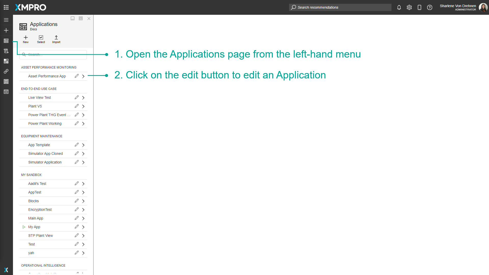
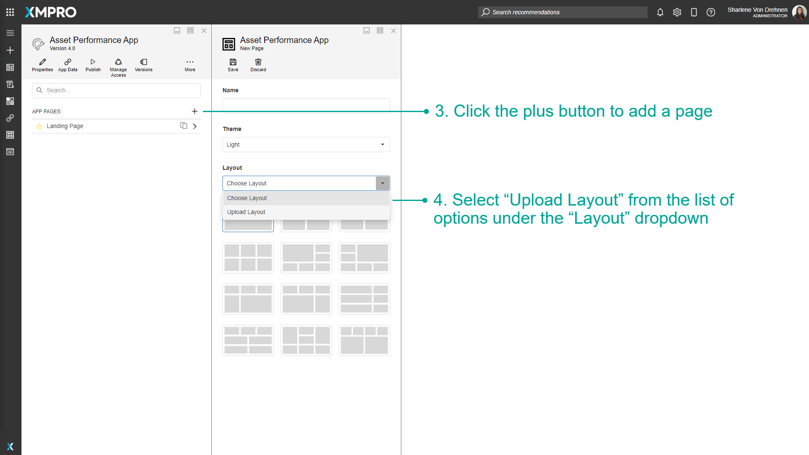
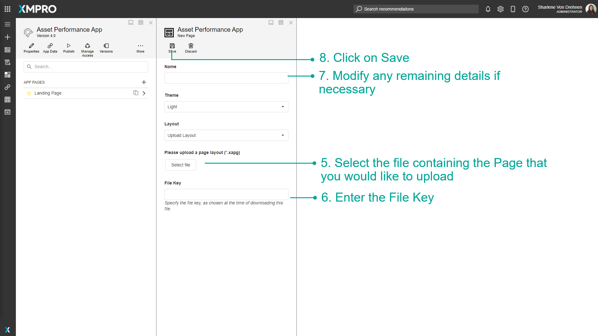

# Import an App Page

App Pages can be exported as a file and imported as a template to other companies or instances of XMPro Products. This allows you to continue working on the same App Page in a different environment without having to start from scratch.

The layout of the template is preserved - data sources must be configured.

> [!NOTE]
> It is recommended that you read the article listed below to improve your understanding of Pages.
>
> * [Page](../../concepts/application/page.md)
> * [Import, Export, and Clone](../import-export-and-clone.md)
> * [How to Manage Pages](manage-pages.md)

## How to Import an App Page

To import an App Page, follow the steps below:

1. Open the Applications page from the left-hand menu.
2. Click on the edit button to edit an Application.

1. Click the plus button to add a page.
2. Select "Upload Layout" from the list of options under the "Layout" dropdown.

1. Select the file containing the Page that you would like to upload.
2. Enter the File Key.
3. Modify any remaining details if necessary.
4. Click on Save.

