# Manage App Files

Files can be uploaded and used within the Application. The interface for App Files allows you to use, rename, delete, and perform more actions on a file that has been uploaded to the Application. App Files are useful in many scenarios, for example, if you need specific files to integrate Unity or D3 Visualizations onto the Page.

> [!NOTE]
> It is recommended that you read the article listed below to improve your understanding of App Files.
>
> * [App Files](../../concepts/application/app-files.md)
> * [How to Manage Apps](manage-apps.md)

## Uploading App Files

To upload new App Files, follow the steps below:

1. Click on the _Applications_ page from the left-hand menu.
2. Click on the _edit_ button for the App.

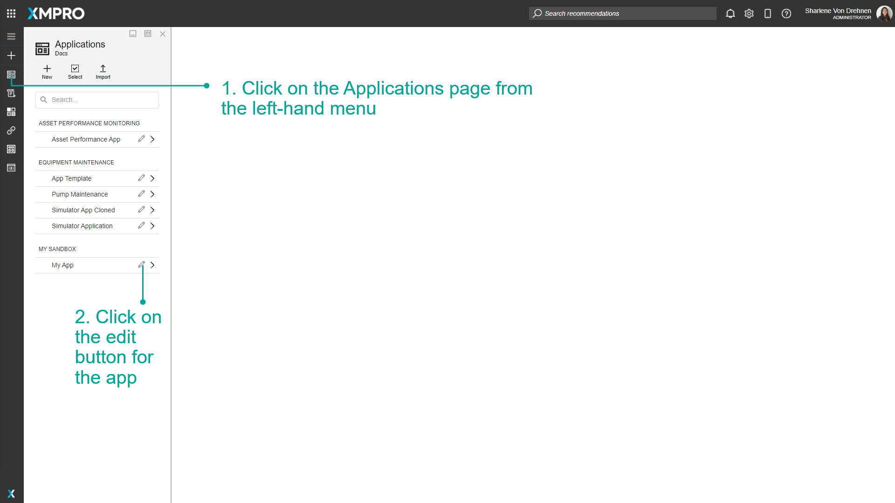

1. Click on _App Files_.
2. Click on _New Directory_.

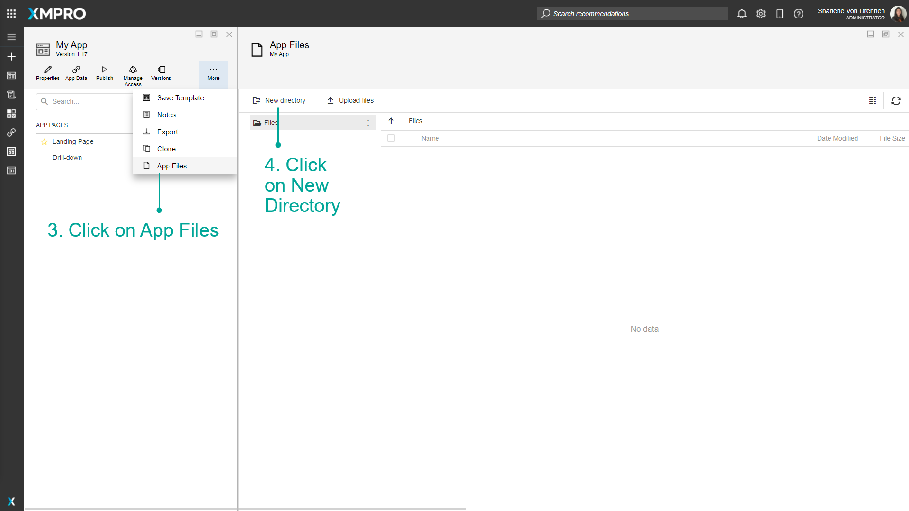

1. Enter the name of the folder.
2. Click on _Create_.

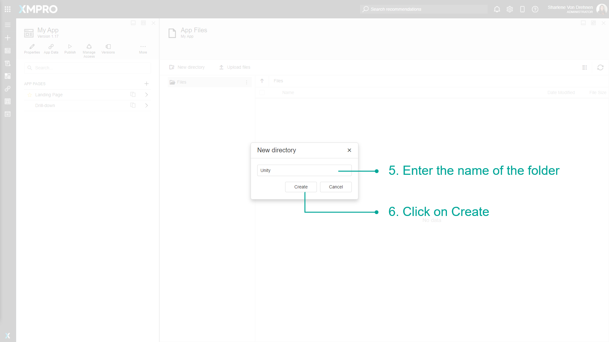

1. Click on the folder you want to store files in to enter it.
2. Drag and Drop Files into the file area or Click _Upload Files_.

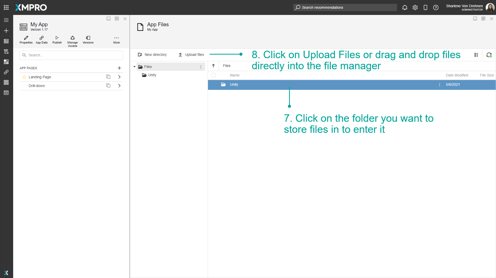

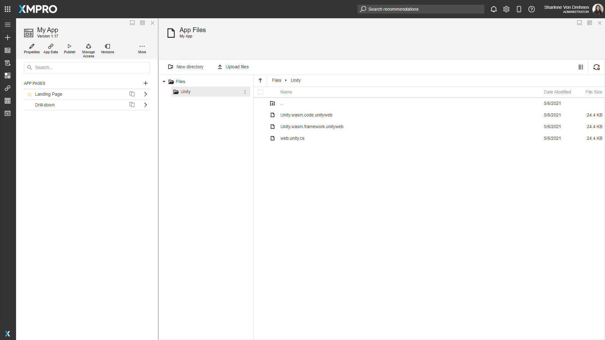

## Copying/Moving App Files around

To copy or move App Files to different folders, follow the steps below:

1. From the edit application page, click on _App Files._
2. Navigate to the file you want to copy or move.
3. Highlight the file.
4. Click on _Copy to_ or _Move to_.

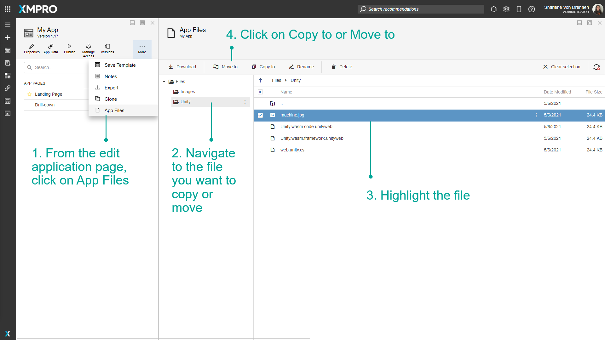

1. Select the new location you want to move or copy the file to.
2. Click on _Move/Copy._

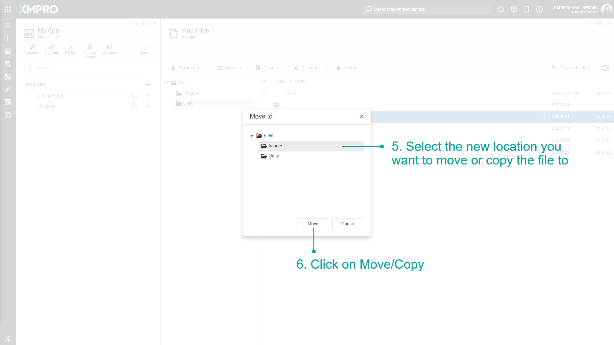

## Renaming App Files

To rename App Files, follow the steps below:

1. From the edit application page, click on _App Files._
2. Navigate to the file you want to rename.
3. Highlight the file.
4. Click on _rename._

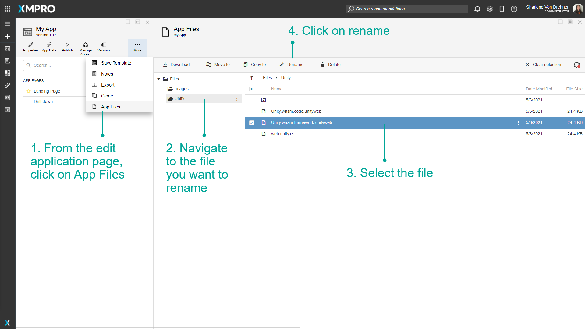

1. Enter a new name.
2. Click on _Save_.

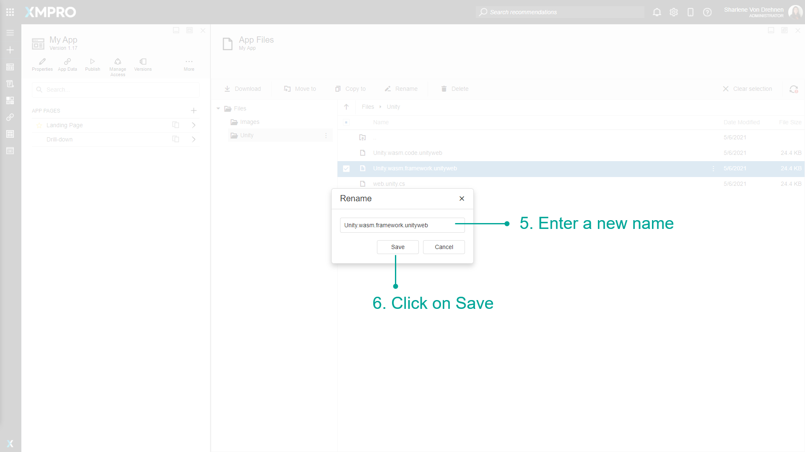

## Deleting App Files

To delete App Files, follow the steps below:

1. From the edit application page, click on _App Files._
2. Navigate to the file you want to delete.
3. Highlight the file.
4. Click on _delete._

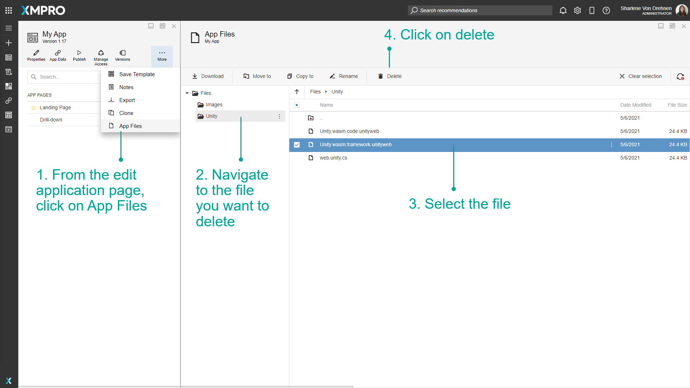

1. Confirm you want to delete the file.

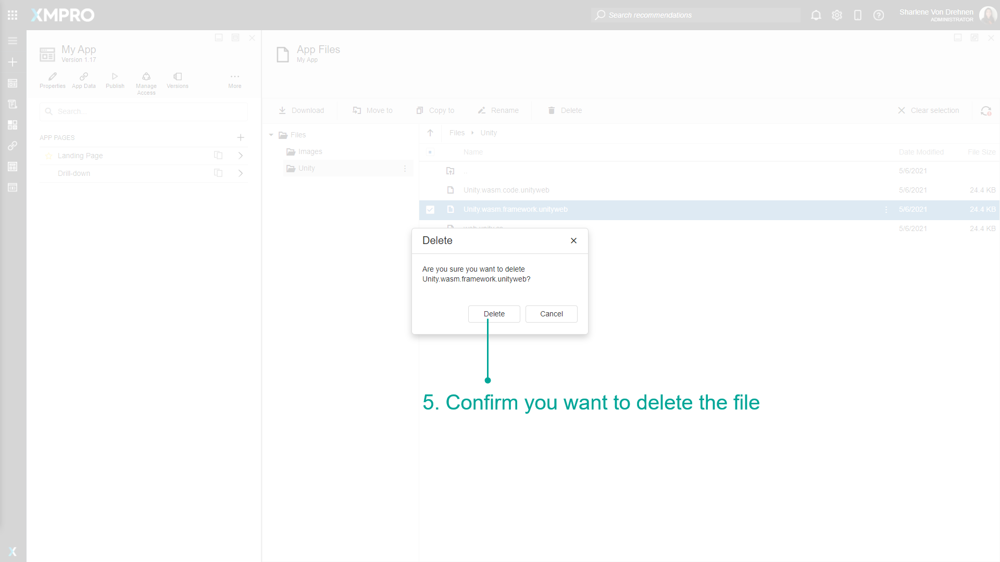

## Downloading App Files

To download App Files, follow the steps below:

1. From the edit application page, click on _App Files._
2. Navigate to the file you want to download.
3. Highlight the file.
4. Click on _download._
5. The file will appear in your downloads.

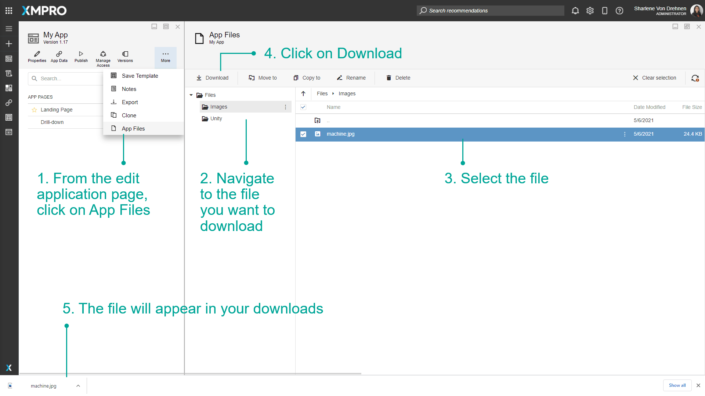

## Using App Files

To use App Files in the application itself, follow the steps below:

1. Add a block on the page which uses a file selector, such as _Unity_ or _D3 Visualization_.
2. Highlight the block.
3. Click on Block Properties.
4. Use the file selector to select the file you want to use in the application.
5. To add more files to the file manager directly from here, click on the plus sign.
6. Upload files, download, move, copy, rename or delete files directly from here.

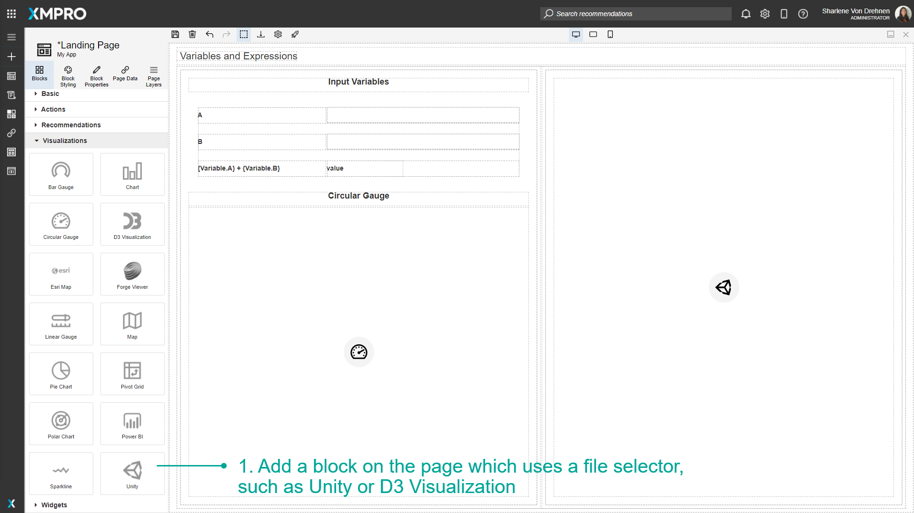

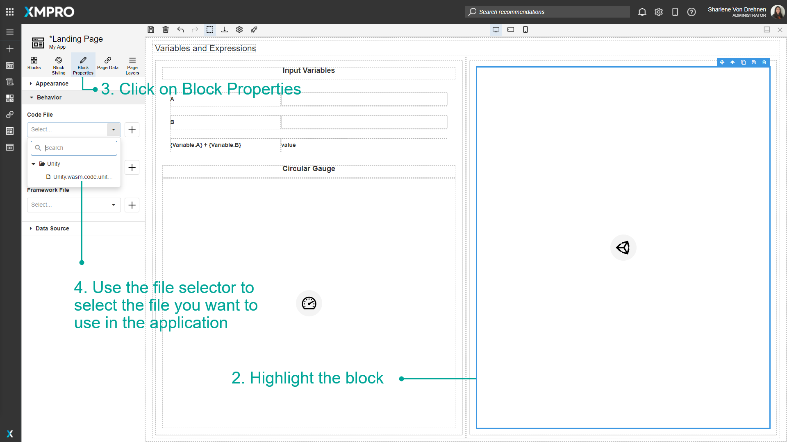

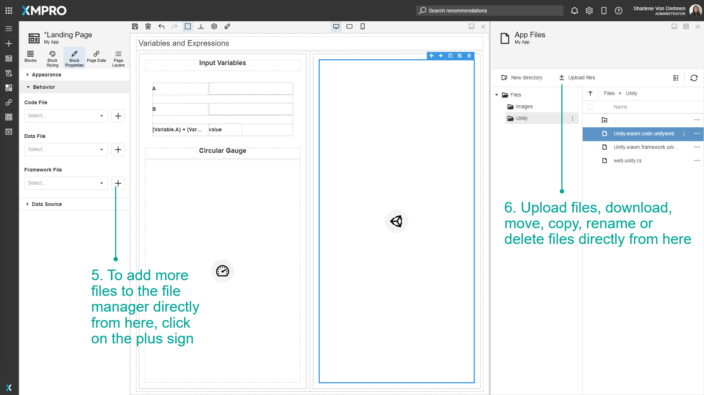
