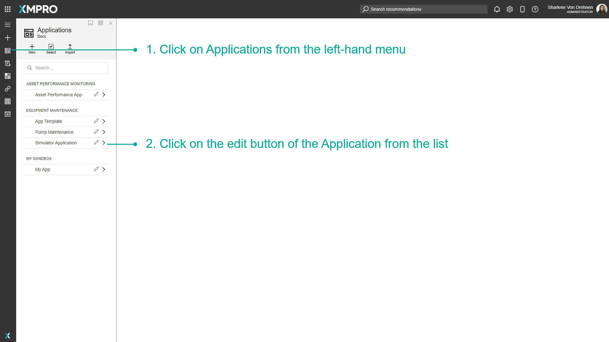
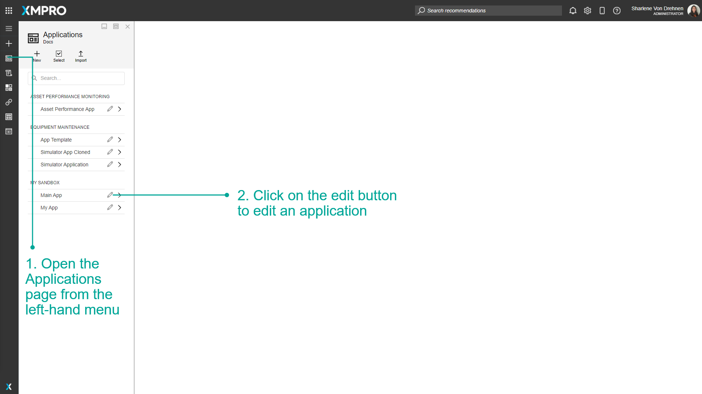
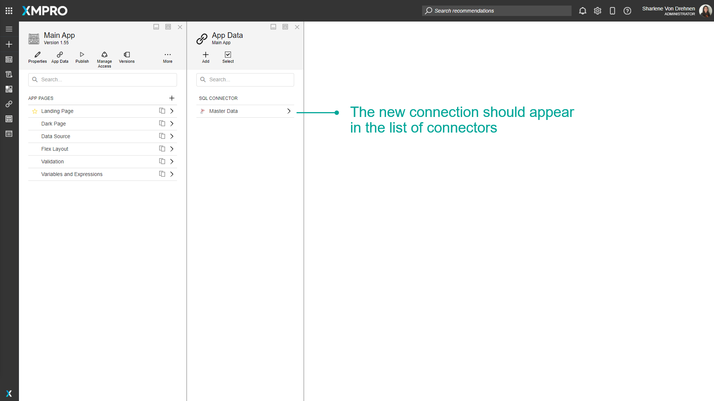
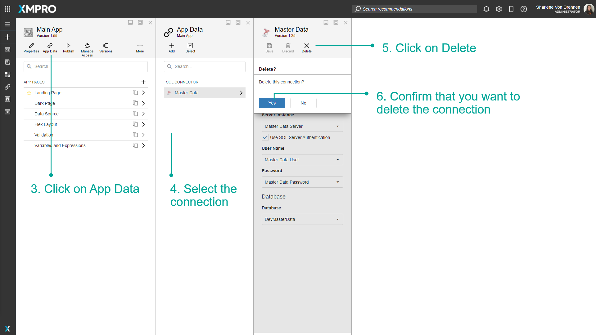
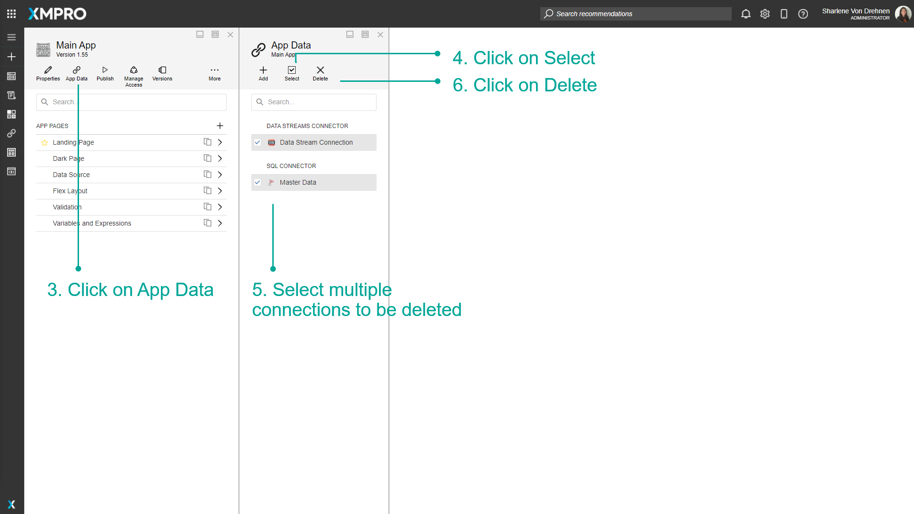
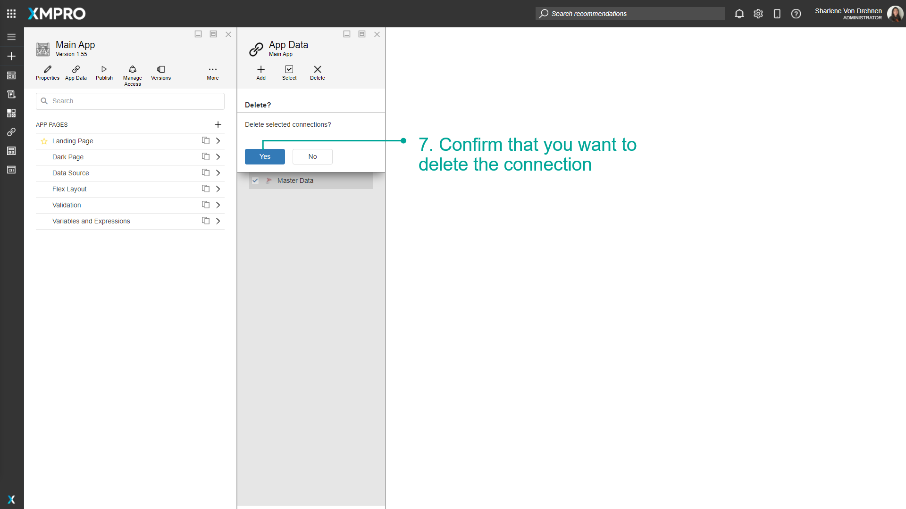
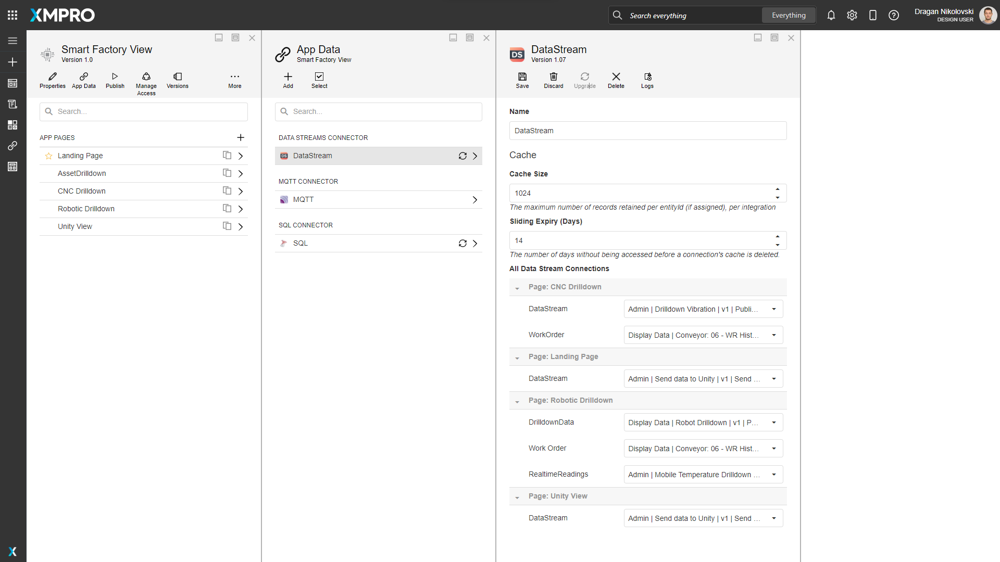

# Manage Connections

The parameters defined in a Connection allow the App to connect to a source of data like a SQL Database and expose the entities as Data Sources within the Page. Connection parameters can include credentials such as a username, password, path, URL, or location identifier that you can use to make a remote connection to the Data Source.

For example, Connection parameters to connect to an SQL Database would include the Server Name, Authentication type, Username, and password.

> [!NOTE]
> It is recommended that you read the article listed below to improve your understanding of Data Integration.
>
> * [Data Integration](../../concepts/application/data-integration.md)
> * [How to Manage Pages](manage-pages.md)

## Adding a Connection to the Application

Connections can be added directly to an Application by adding it to the App Data. To add a Connection to an Application, follow the steps below:

1. Open the _Applications_ page from the left-hand menu.
2. Click on the _edit_ button to edit an application from the list.

3\. Click on _App Data._  
4\. Click on _add._  
5\. Select a connector, for example, the SQL connector.  
6\. Enter the details of the Connection, including it's name.  
7\. Click on _Save_.

The new Connection should appear in the list of connectors, and can now be used in the application to add Data Sources. The Connection can be used for all pages within the application it was added to.

## Deleting a Connection

### Single Connection

To delete a single Connection, follow the steps below:

1. Open the _Applications_ page from the left-hand menu.
2. Click on the _edit_ button to edit an application.

3\. Click on _App Data._  
4\. Select the Connection.  
5\. Click on _Delete._  
6\. Confirm that you want to delete the Connection.

### Multiple Connections

To delete multiple Connections, follow the steps below:

1. Open the _Applications_ page from the left-hand menu.
2. Click on the _edit_ button to edit an application.

3\. Click on _App Data._  
4\. Click on _Select_.  
5\. Select multiple Connections to be deleted.  
6\. Click on _Delete_.

7\. Confirm that you want to delete the Connection.

> [!NOTE]
> You can cancel the multi-select by clicking on the select button again.

## Data Stream Connections

Navigate to the Data Stream Connector to access a comprehensive inventory of the Data Stream Connections for the Application. The connections are categorized based on the respective pages where they are utilized.

You can use this list to verify the current version of the Data Stream in use and make any necessary updates if required.

## Further Reading

* [How to Manage Data Sources](manage-data-sources.md)
