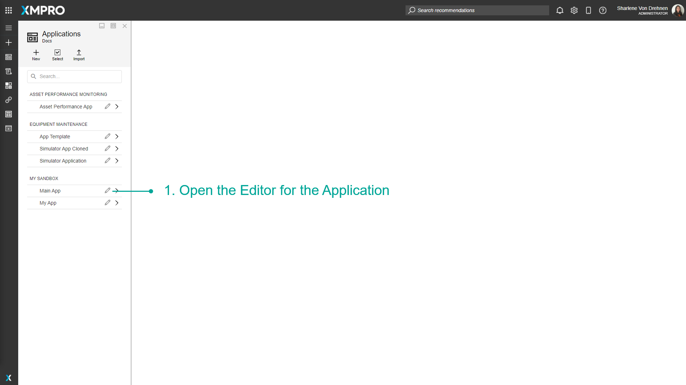
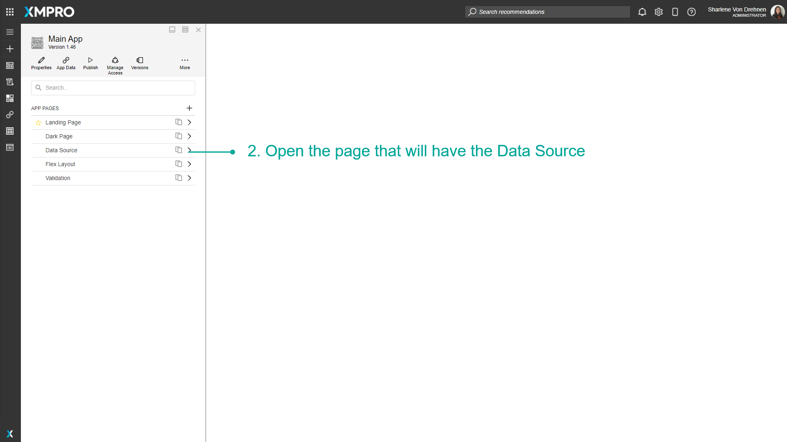
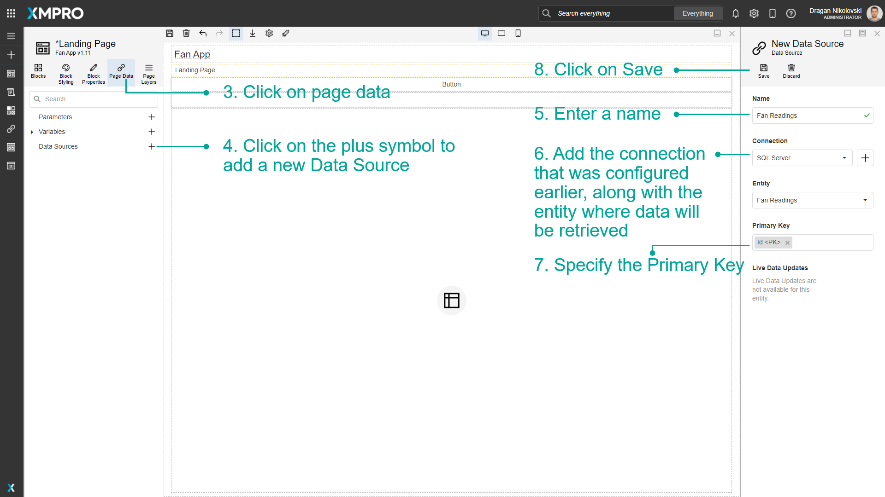
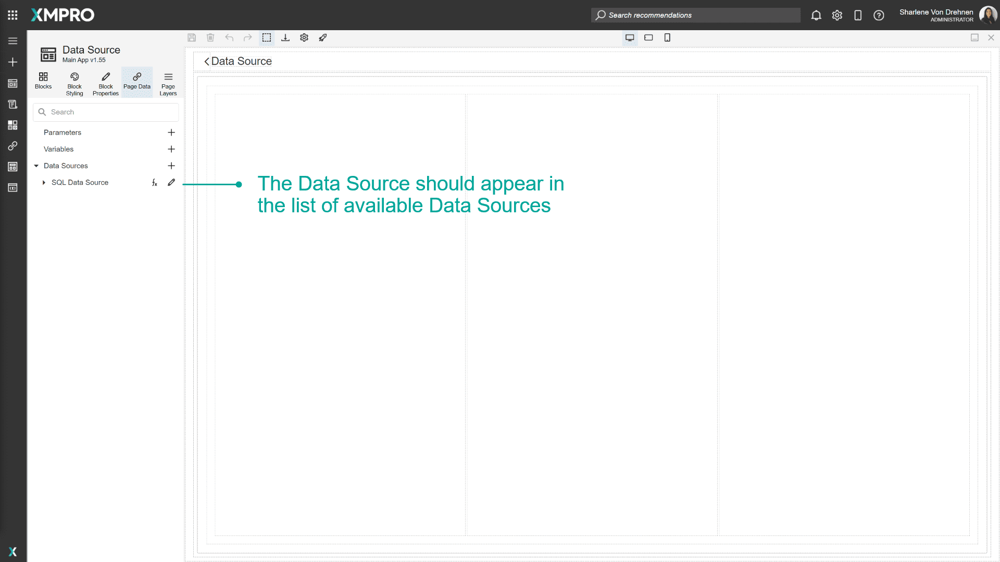
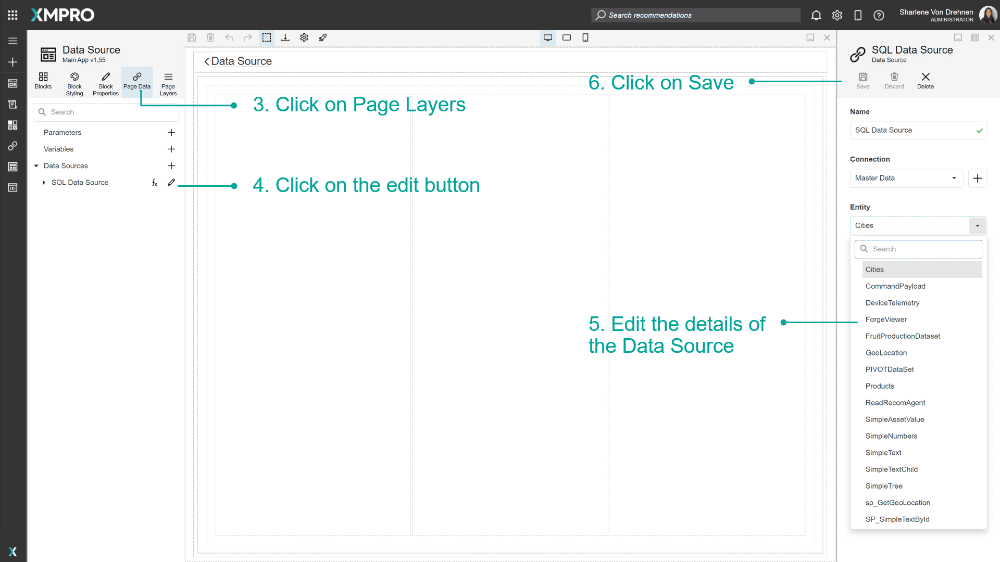
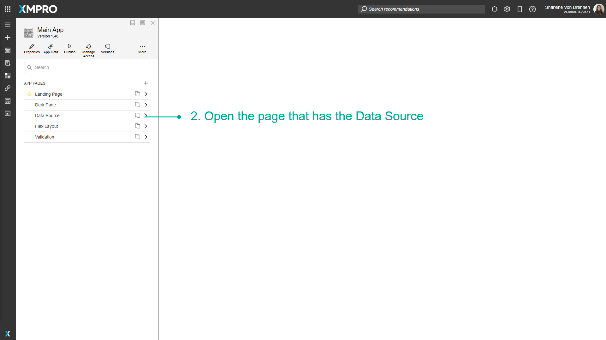
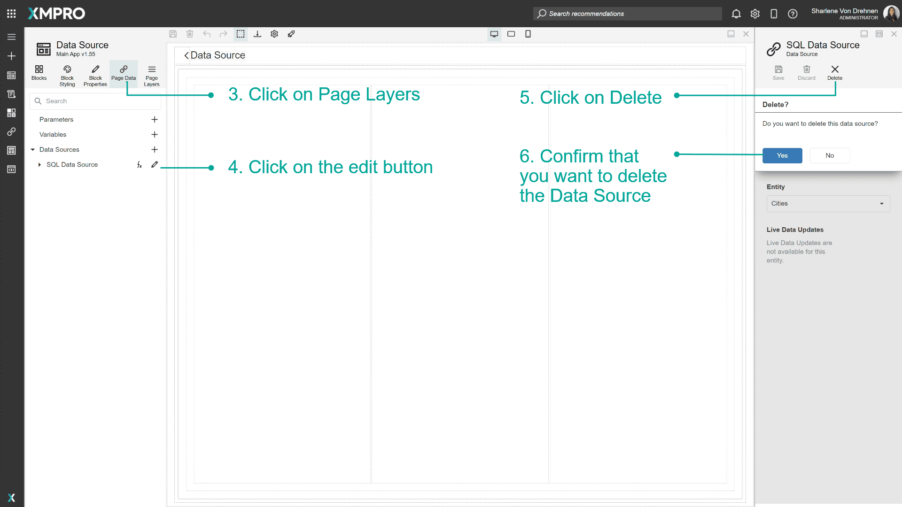

# Manage Data Sources

Data Sources can be created for a Page in the Application. They are a way to link to a specific Entity in a Connection's Entities, for example, a table in a SQL database. Data Sources are managed through the Page Data tab of a Page. Data Sources allow you to display, use, manipulate or store data from a connected source of data such as an SQL Server Database.

> [!NOTE]
> It is recommended that you read the article listed below to improve your understanding of Data Integration.
>
> * [Data Integration](../../concepts/application/data-integration.md)
> * [How to Manage Connections](manage-connections.md)

## Creating a Data Source

To create a Data Source on the Page of an Application, follow the steps below:

1. Open the Editor for the Application.

   

2. Open the Page that will have the Data Source.

   

3. Click on _Page Data_.
4. Click on the _plus_ symbol to add a new Data Source.
5. Enter a name.
6. Add the Connection and Entity where data will be retrieved.
7. Specify the [Primary Key](../../concepts/application/data-integration.md#primary-key).
8. Click on _Save_.

   

   

## Edit a Data Source

To edit a Data Source, follow the steps below:

1. Open the Editor for the Application.

   

2. Open the Page that has the Data Source.

   

3. Click on _Page Data_.
4. Click on the _edit_ button.
5. Edit the details of the Data Source.
6. Click on _Save_.

   

## Delete a Data Source

To delete a Data Source, follow the steps below:

1. Open the Editor for the Application.

   

2. Open the Page that has the Data Source.

   

3. Click on _Page Data_.
4. Click on the _edit_ button.
5. Click on _Delete_.
6. Confirm that you want to delete the Data Source.

   

## Further Reading

* [How to use Data Sources in the Page](use-data-sources-in-the-page.md)
