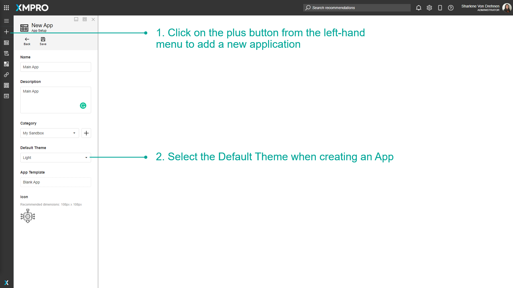
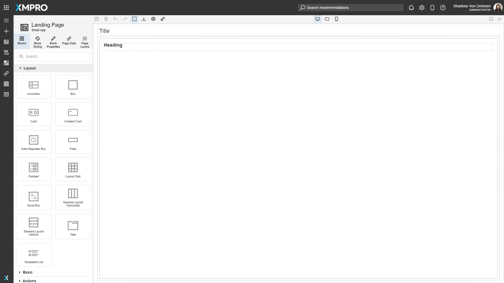
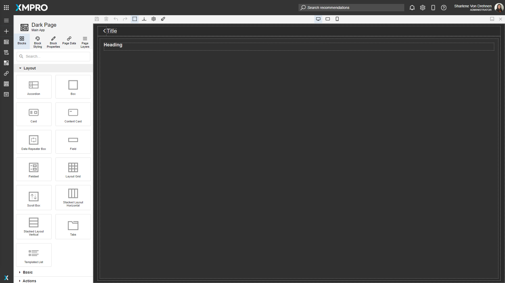
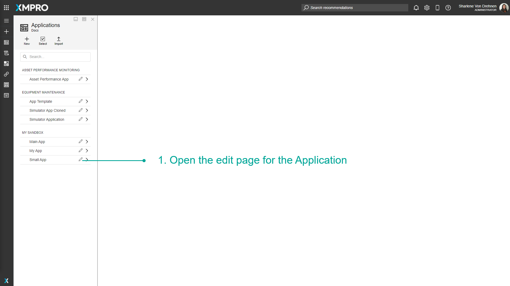
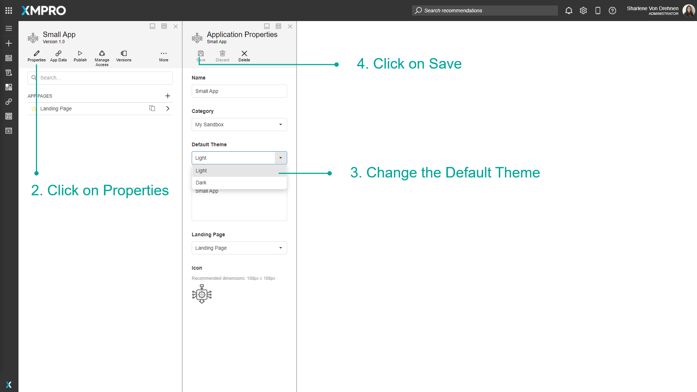
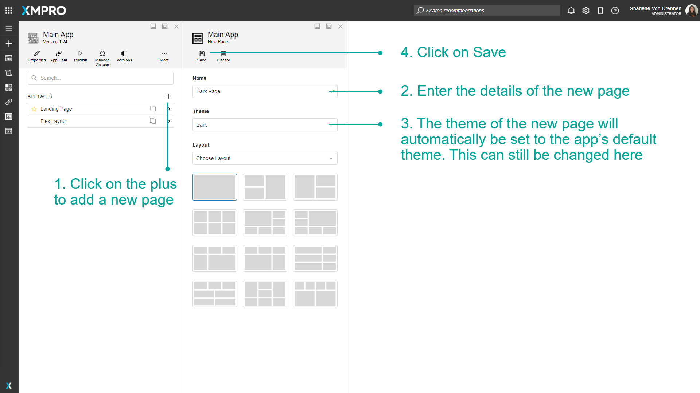
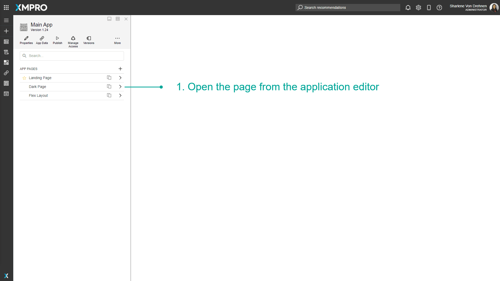
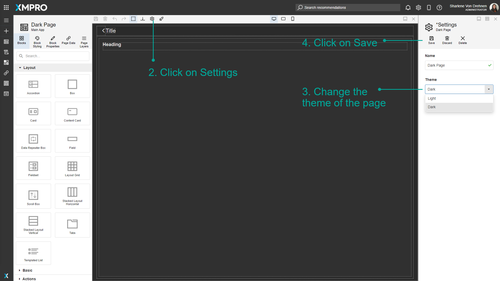

# Manage Themes

The Application can either be Light-Themed or Dark-Themed. This depends on the overall design of the Application and can be configured when creating the App, and can also be edited after the app has been created. This is useful as some users or developers prefer to have a certain consistent light or dark-colored theme across their app, and this option allows you to customize the app to fit that preference.

> [!NOTE]
> It is recommended that you read the article listed below to improve your understanding of Applications.
>
> * [Application](../../concepts/application/index.md)
> * [How to Manage Apps](manage-apps.md)

## Default Theme when creating a new App

The Default Theme is the theme that will be automatically selected when you create a new Page within the Application. For example, if the Default Theme for the overall Application is dark, when you create a new Page, the Default Theme for that Page will always be set to dark.

To choose the Default Theme when creating a new Application, follow the steps below:

1. Click on the _plus_ button from the left-hand menu to add a new application.
2. Select the Default Theme when creating an App.

The background will either be light or dark depending on the theme.

## Changing the Default Theme of an App

To edit the Default Theme for the overall App, follow the steps below:

1. Open the edit page for the Application.

1. Click on _Properties._
2. Change the Default Theme.
3. Click on _Save_.

> [!NOTE]
> Changing the Default Theme of the App does not change the Themes of the individual Pages that are already configured.

## Choosing a Theme when creating a page

When creating a new page, follow the steps below:

1. Click on the _plus_ to add a new page.
2. Enter the details of the new page.
3. The theme of the new page will automatically be set to the app's default theme. This can still be changed here.
4. Click on _Save._

## Changing the theme for a page

To edit the Theme of an existing Page, follow the steps below:

1. Open the page from the application editor.

1. Click on _Settings._
2. Change the Theme of the Page.
3. Click on _Save_.

