# Manage Widgets

Widgets are collections of Blocks or layouts that you can group together and re-use for other Apps and Pages. For example, if there is a common group of Blocks that is repetitive to continuously recreate, these Blocks can be selected and turned into a Widget. When a Widget is created, it is added as a Block in the Blocks toolbox and can then be dragged onto the canvas and re-used as many times as needed on any Page.

> [!NOTE]
> It is recommended that you read the article listed below to improve your understanding of Widgets.
>
> * [UI Block (Toolbox)](../../concepts/application/block.md)
> * [How to Manage Pages](manage-pages.md)

## Creating a Widget

When a Widget is created, you can specify if the Widget can only be seen and used by you, or everyone else in the company. If everyone has access to it, anyone can drag and drop your Widget into their own apps. The owner of the Widget is the only one who can edit or delete it.

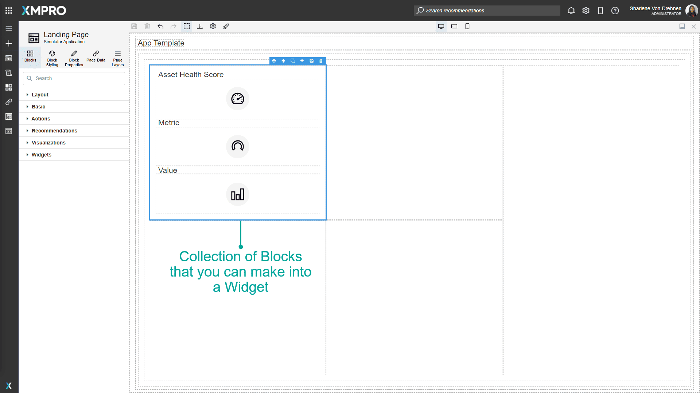

To create a Widget, follow the steps below:

1. Select the Blocks you would like to save as a Widget.
2. Click the save button to create a new Widget.
3. Enter the name.
4. The visibility determines who will be able to see and use your Widget. If set to _everyone_, anyone in your company or organization can drag and drop your Widget into their own Apps.
5. Choose an icon. Sample icons can be found in the [Icon Library](../../resources/icon-library.md).
6. Click _Create_.

   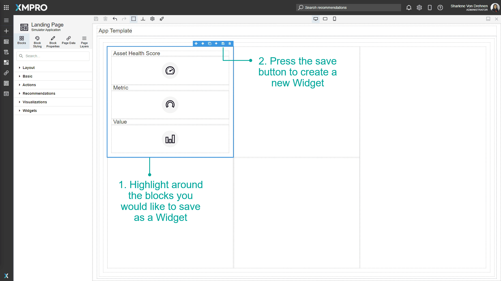

   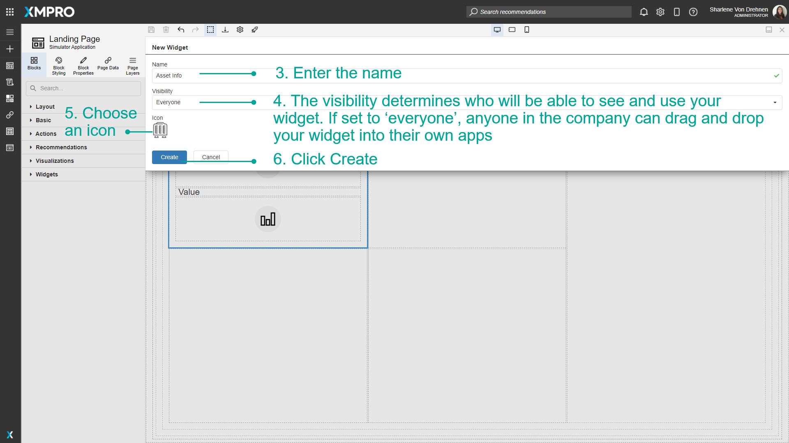

When a Widget is created, it will show in the toolbox, under _'Blocks'_ in the _'Widget'_ category.

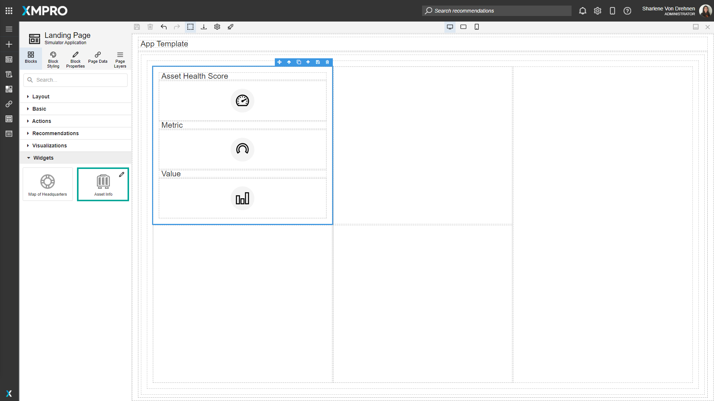

## Using Widgets

The Widget can be dragged and dropped anywhere on the canvas, and this will create the same set of blocks as before.

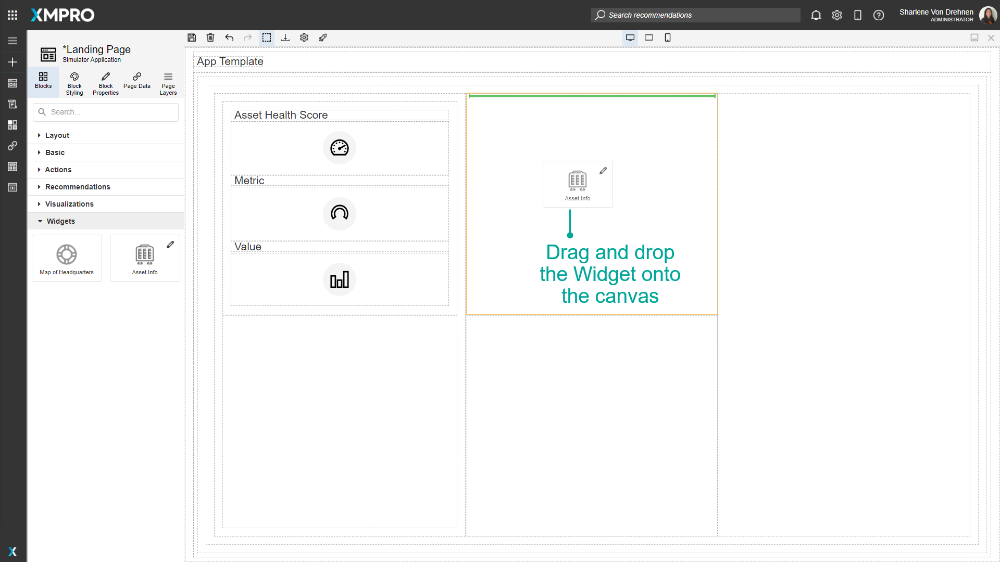

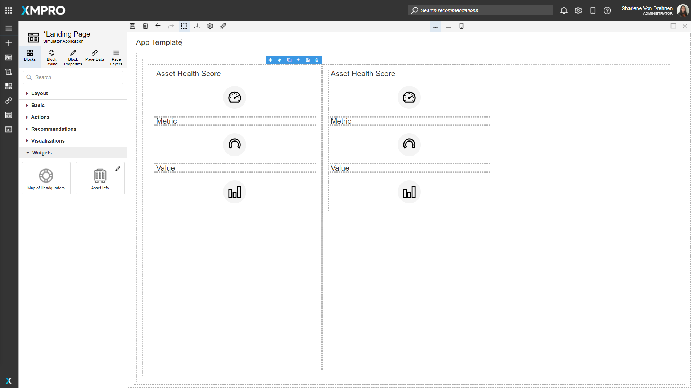

## Deleting a Widget

When a Widget is deleted, it will be removed from the sidebar and you will no longer be able to drag it onto the canvas. Deleting a Widget will not affect anything previously dropped onto the canvas on any Page.

1. Select Edit. Note that you will not be able to edit the Widget unless you are the owner of it.
2. Select Delete.

   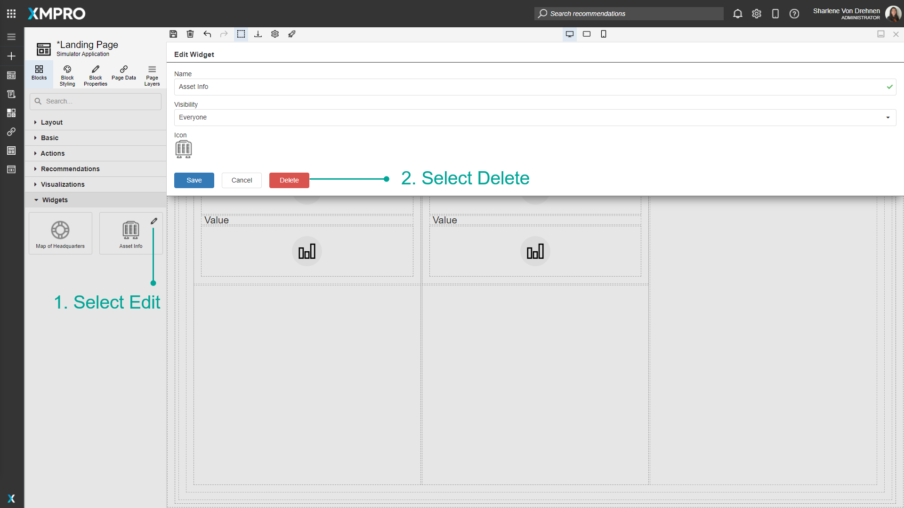

3. Confirm that you would like to delete the Widget.

   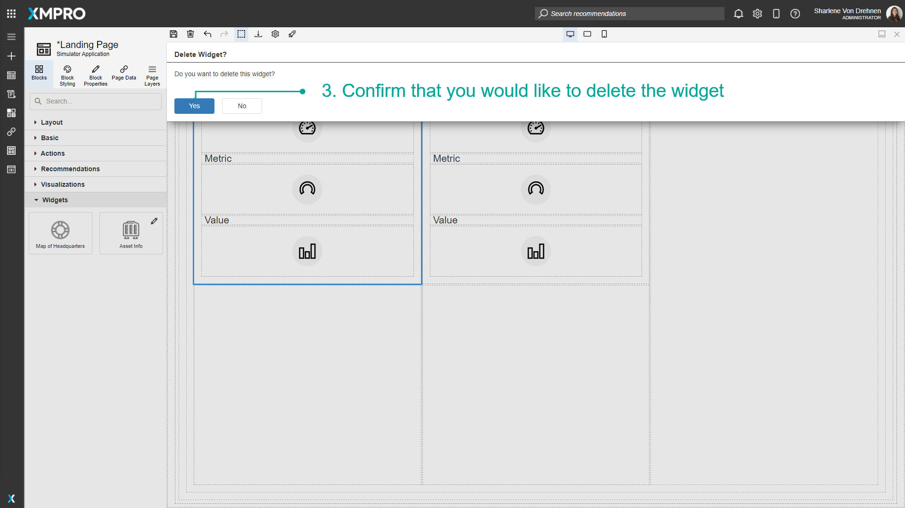

## Importing Widgets

Widgets that were built in one Application can be imported to another Application. A single file can contain multiple Widgets that can be uploaded. To import Widgets, follow the steps below:

1. Click on Blocks.
2. Click on Import Widgets.
3. Select a file.
4. Enter a File Key.
5. Click on upload.

   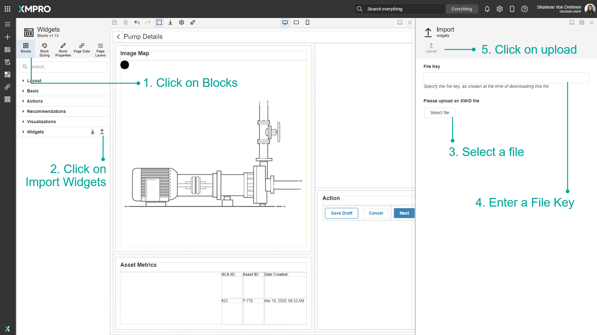

6. Select the Widgets you would like to upload.
7. Click on Save.

   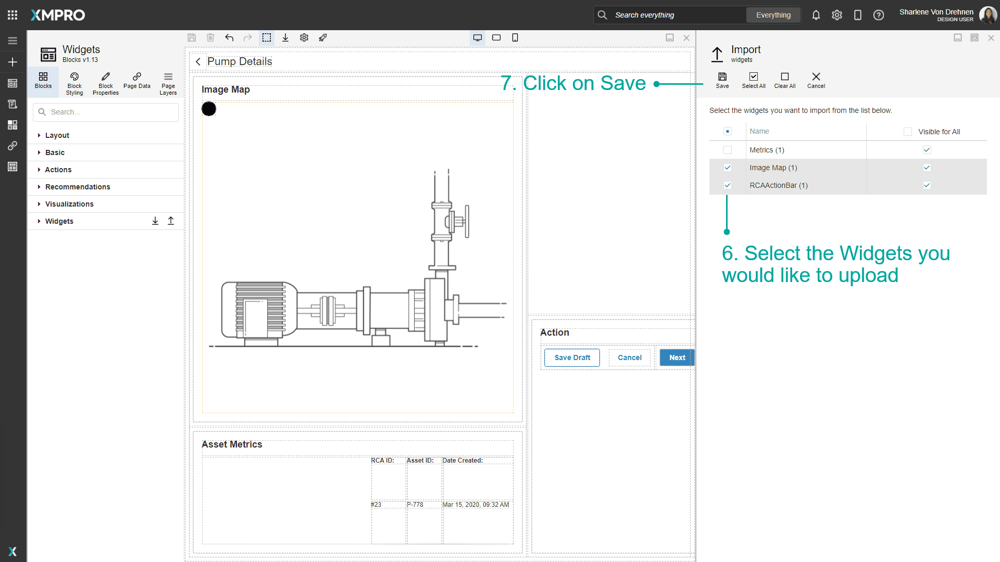

> [!NOTE]
> New Widgets will appear in the list of Widgets.

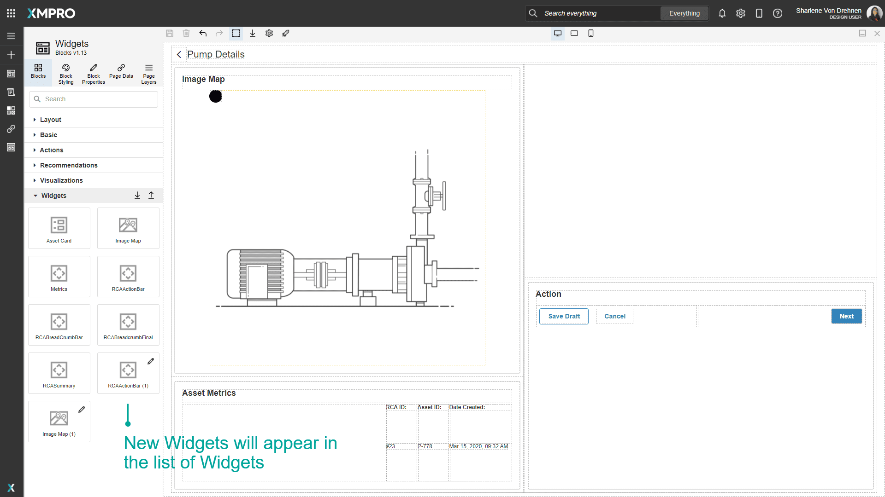

## Exporting Widgets

If you want certain Widgets that were built in your Application to be used in another Application, you can export those Widgets.

1. Click on Blocks.
2. Click on export Widgets.
3. Select the Widgets you would like to export.
4. Click on Export.

> [!NOTE]
> You can choose multiple Widgets to export at once. They will all be exported into one file.

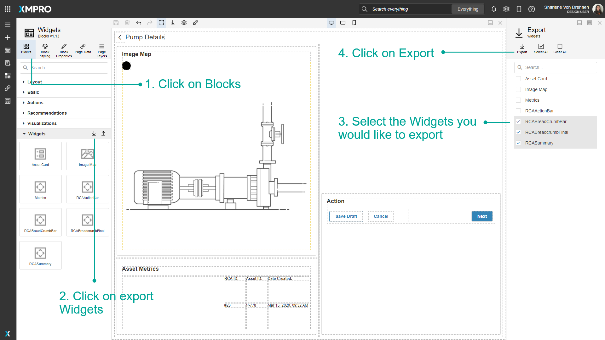

1. Enter a File Key.
2. Click OK.

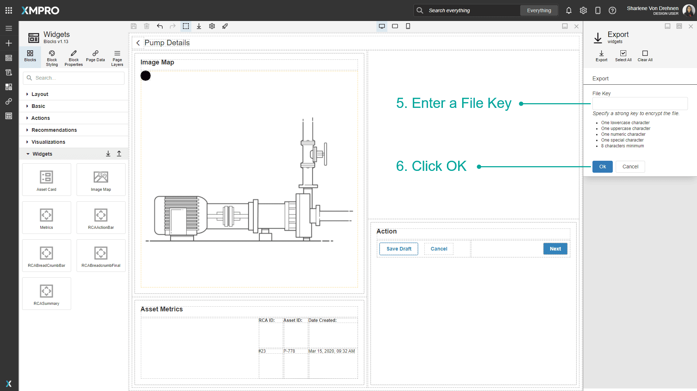
