# Navigate Between Pages

It is possible to allow navigation between Pages of an App by configuring the Action of a Block. This allows you to separate your content within the application into sections that can be easily navigated by the user.

> [!NOTE]
> It is recommended that you read the article listed below to improve your understanding of Navigating between Pages.
>
> * [Navigation and Parameters](../../concepts/application/navigation-and-parameters.md)
> * [How to Manage Pages](manage-pages.md)

## Configuring Navigation between Pages

To add Navigation between Pages, make sure the Application has more than one Page. [See the Manage Pages article to read more about adding Pages.](manage-pages.md)

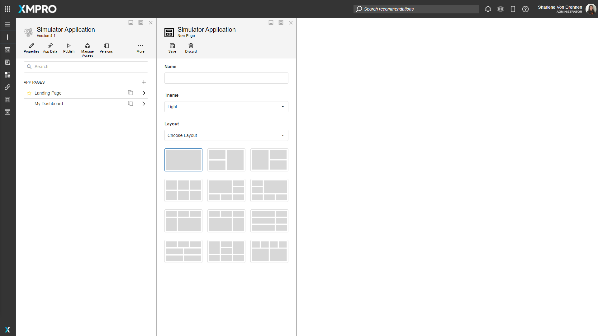

When a new Page is created, they are automatically configured to have links going back to the landing page, which can be seen at the top of the screen.

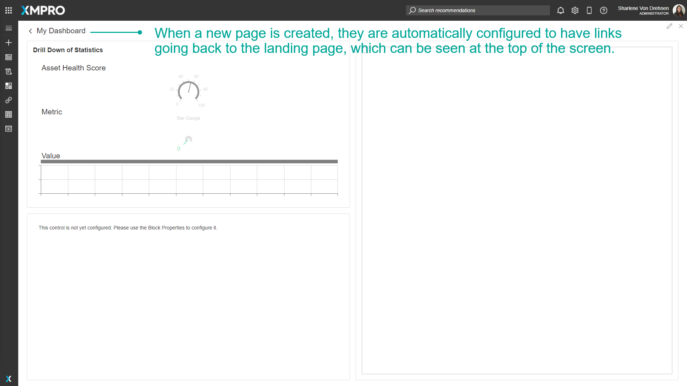

Some Pages do not automatically have links to other Pages. For example, the Landing page does not have links going to other pages. To add Navigation between Pages, follow these steps:

1. Click on _Applications_ from the left-hand menu.
2. Click on the _edit_ button of the Application from the list.

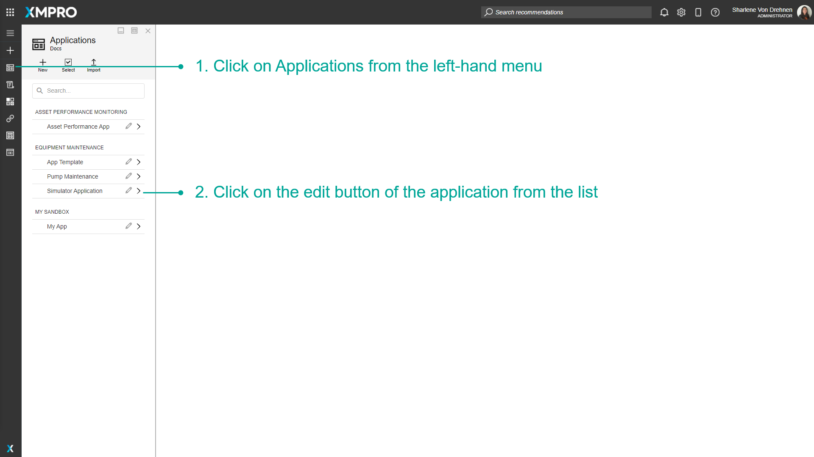

3\. Select a Page from the Application's Edit menu.  
4\. Click on _Blocks_.  
5\. Under '_Actions_', select an action such as a button.  
6\. Drag and drop it onto the Page of the application.

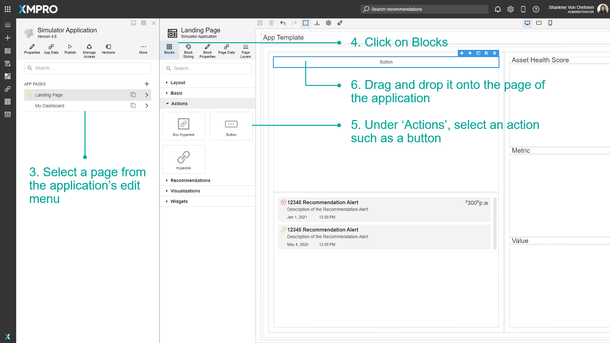

7\. Select the button.  
8\. Click on _Block Properties._  
9\. Under '_Action_,' click on the _Navigate To_ Dropdown and select _Page_.

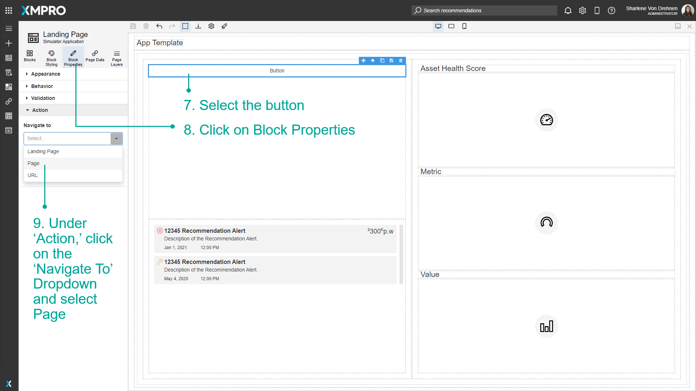

10\. Select the page you want to navigate to.

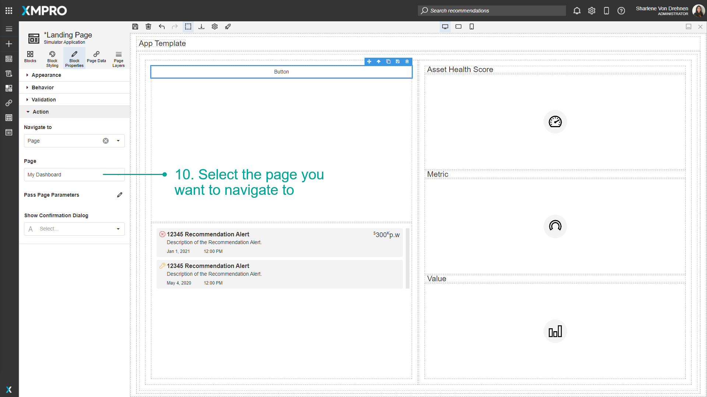

11\. Under '_Appearance,_' give the button a name.  
12\. Click on _Save_.

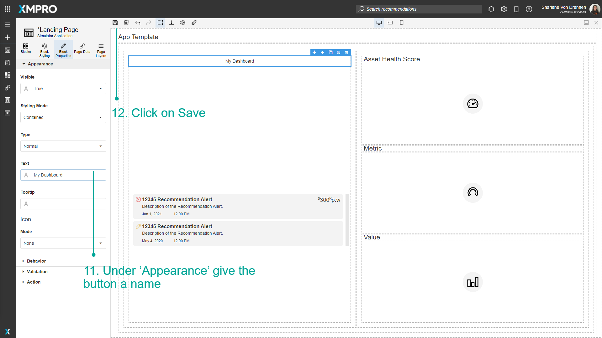

## Navigating between Pages at Runtime

After the Navigation between Pages has been added, you can Launch the App to see what it will look like at runtime. Follow the steps below to Launch and view the App:

1. Click on _Launch_.
2. The button is visible on the Page. Click on the button to navigate to the other selected Page.

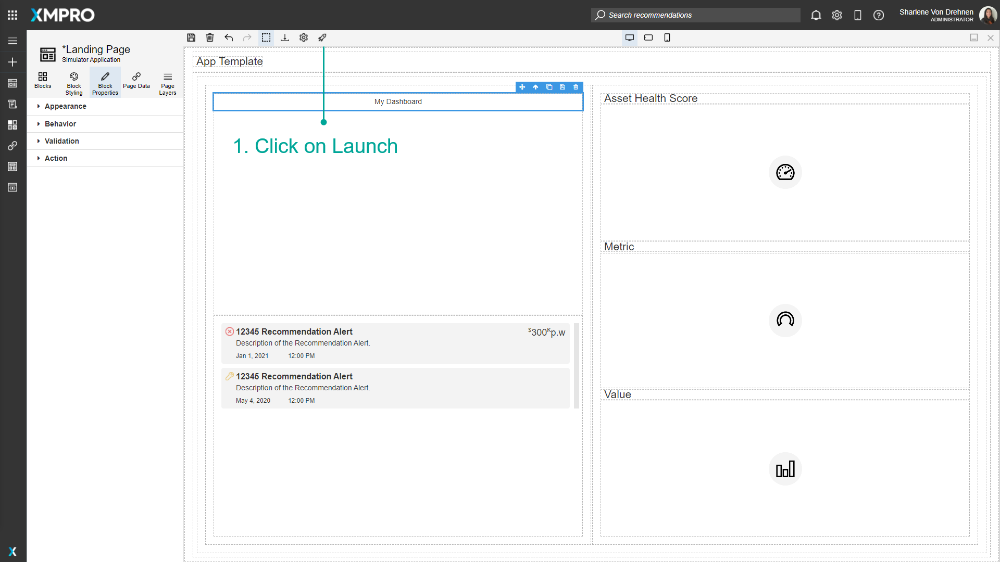

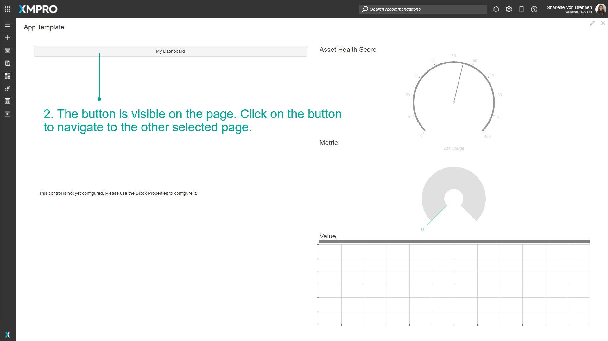

3\. The page will open.

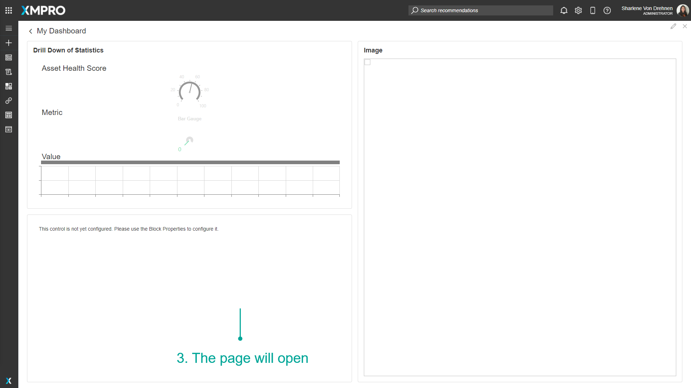

## Deleting Navigation between Pages

You can delete the navigation functionality by either deleting the Block itself or by deleting the settings under _Action_ in the _Block Properties_ tab.

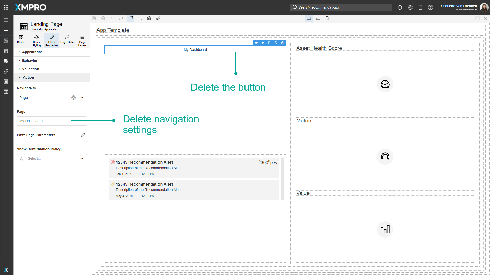

## Navigating Using Back URL

You can include a back URL to the current page when configuring a Navigate To URL, so that the user can return to the original page. For example, you want to open an Alert from a custom templated list and the alert drill-down needs a back URL.

To append a back URL, follow these steps:

1. Click on _Block Properties_.
2. Under '_Action_', click on the _Navigate To_ Dropdown and select _URL_.
3. Toggle the URL mode to Expression Mode.
4. Click the dropdown to edit the expression value.

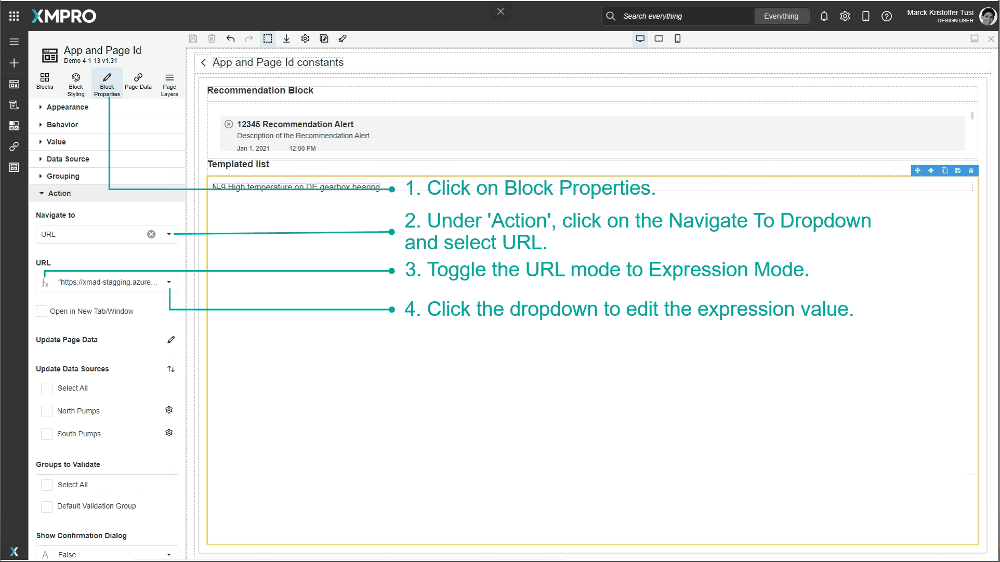

5\. Note the current page parameters under Constants.

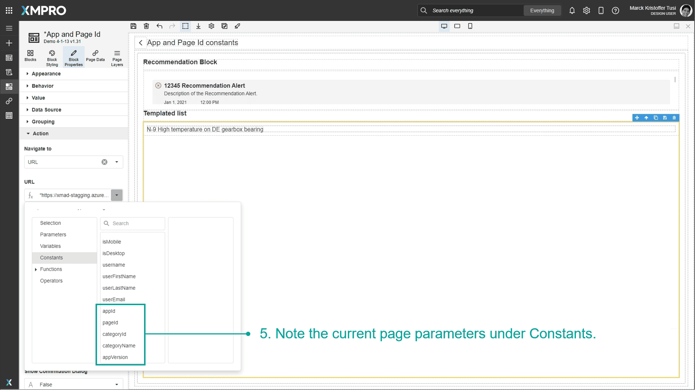

6\. Configure the URL with back parameters, similar to the below:

```
"https://xmad-sample.azurewebsites.net/viewalert;id="+"12345"+";backUrl=render;backParams=\{\\"appId\\":\\""+appId+"\\",\\"pageId\\":\\""+pageId+"\\",\\"categoryName\\":\\""+categoryName+"\\",\\"appVersion\\":\\""+appVersion+"\\"\\}"
```

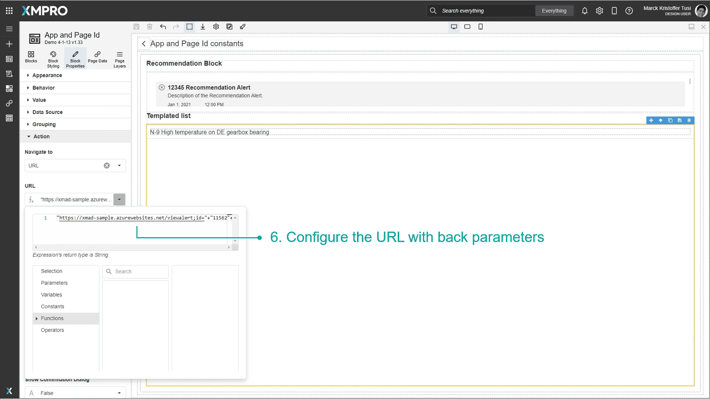

## Copying App Link

You can copy the App link if you want to share it. This creates a link to the published app version - or to the latest version if there is no published version.

1. Click More.
2. Click Copy App Link.

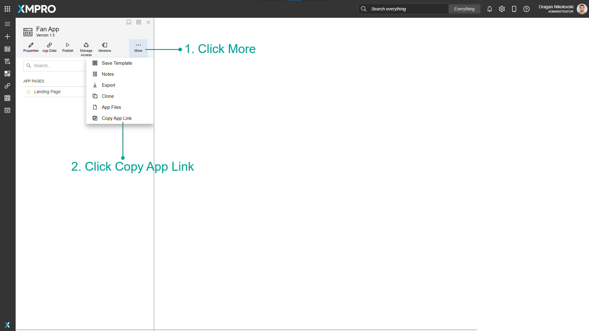

## Copying Page Link

You can copy a specific App Page link if you want to share it. This will create a link to the specific app version and page.

1. Open the Page.
2. Click Copy Page Link.

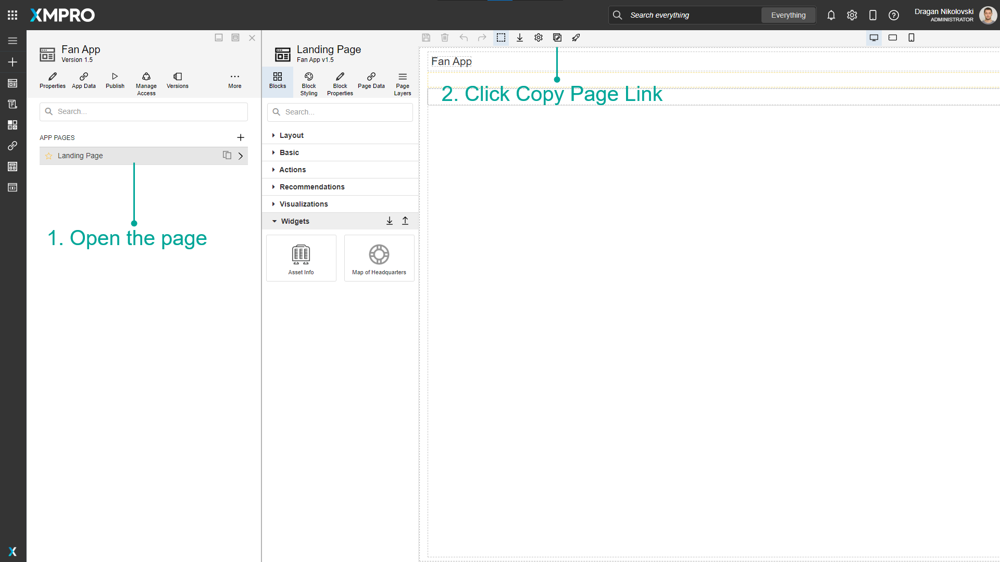

## Further Reading

* [How to Pass Parameters between Pages](pass-parameters-between-pages.md)
