# Pass Parameters Between Pages

You can use Parameters if you want to send particular values to another Page. For example, if you have a list of machines, and a user selects one, the Application may open a new Page that displays information for that particular machine. In that case, you may want to pass the ID of the machine the user clicked on to the Page that is being opened.

> [!NOTE]
> It is recommended that you read the article listed below to improve your understanding of Navigating between Pages.
>
> * [Navigation and Parameters](../../concepts/application/navigation-and-parameters.md)
> * [How to Navigate Between Pages](navigate-between-pages.md)

## Adding a Parameter to the Page

A Parameter needs to be added to the Page that is receiving the data. In this example, there are two Pages that exist in the Application: the main Landing Page and the secondary Page. The second page is the Page where the Parameter is made. To add a Parameter to a page, follow the steps below:

1. Click on _Applications_ from the left-hand menu.
2. Click on the _edit_ button of the Application from the list.

3\. Click on the page where you want to data to be sent to.  
4\. Click on _Page Data_.  
5\. Click on the _plus_ to add a Parameter.

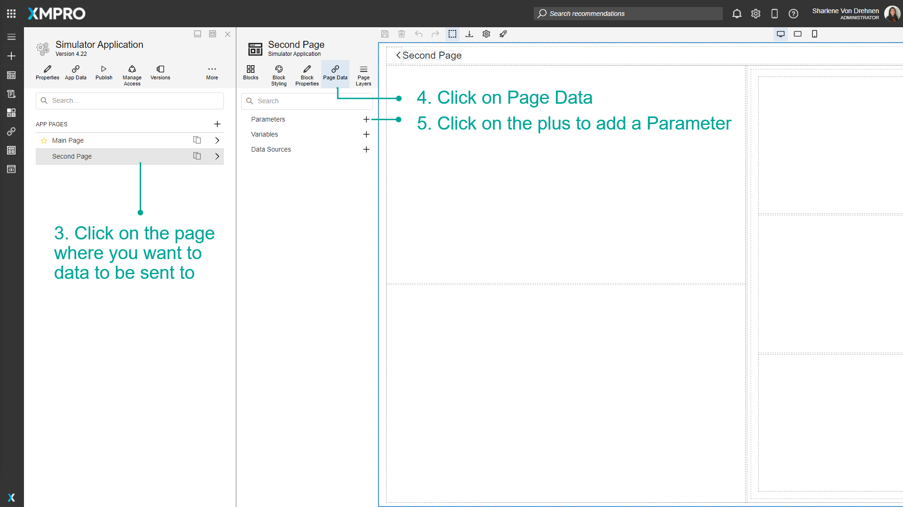

6\. Add the name and type of the new Parameter.  
7\. Click on _Create_.  
8\. Click on _Save_.

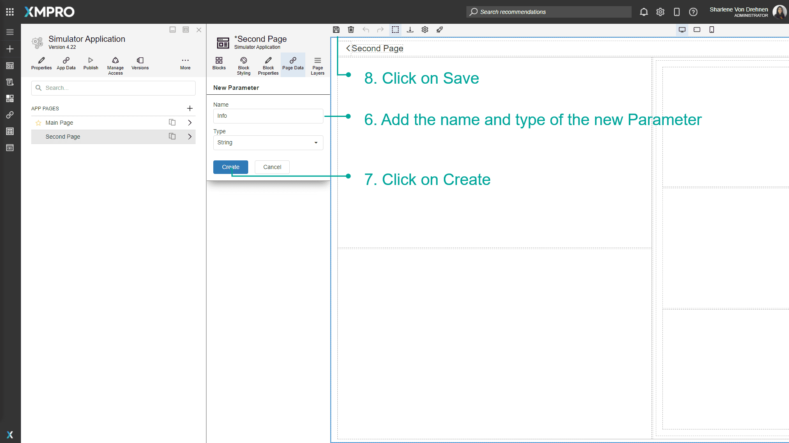

Now that a Parameter has been added, create a textbox or a way to display the value when it is passed to the Page during runtime.

1. Add a textbox to the Page so you will be able to display the value when it is passed from the main page to this page.

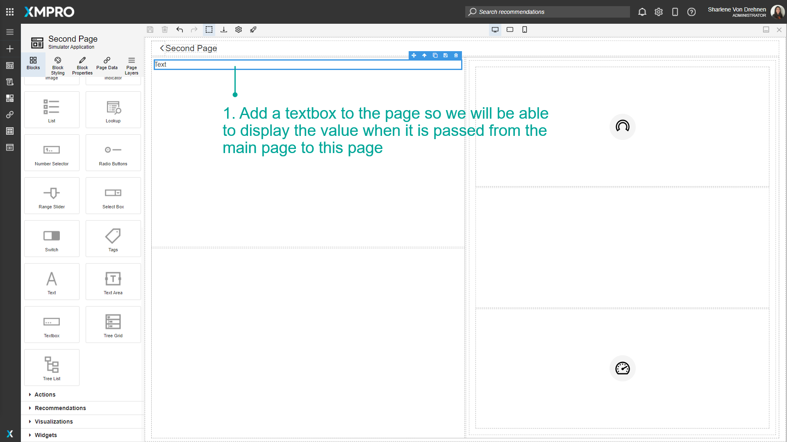

2\. Click on _Block Properties_.  
3\. Click on the '_A_' button to toggle between static and dynamic text.  
4\. Select the Parameter from the dropdown.  
5\. Click on _Save_.

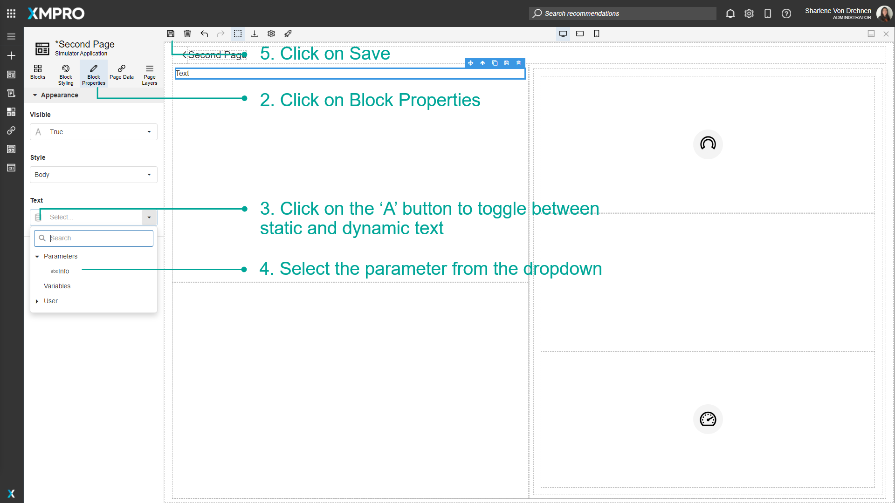

The data has to be sent from the main page to the secondary page. To pass data from the main Landing Page using the Parameter you just created, follow the steps below:

1. Go to the page you will be sending data from.
2. Select the button/link that navigates to the second page.
3. Click on _Block Properties_.
4. Click on the _Edit_ button under Pass Page Parameters.
5. Configure if the data being passed is dynamic or static.
6. Add/Select a value that you would like to pass to the parameter on the second page.
7. Click on _Apply_.

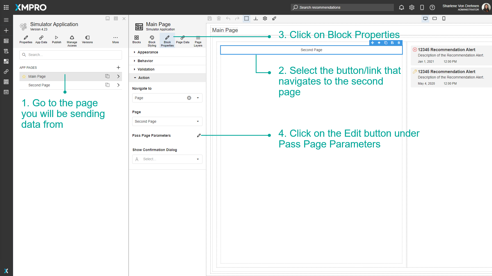

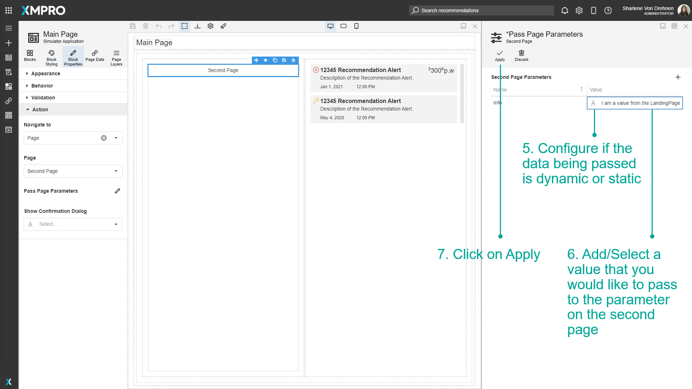

## Passing Dynamic Data to the Page

When navigating between pages, you can also pass dynamic data - such as the Chart value - to the next page using page parameters. First, configure the [Chart](../../blocks-toolbox/visualizations/chart.md) block then follow the steps below:

1. Click on Block Properties.
2. Under _'_Appearance' set Show Drilldown to True.

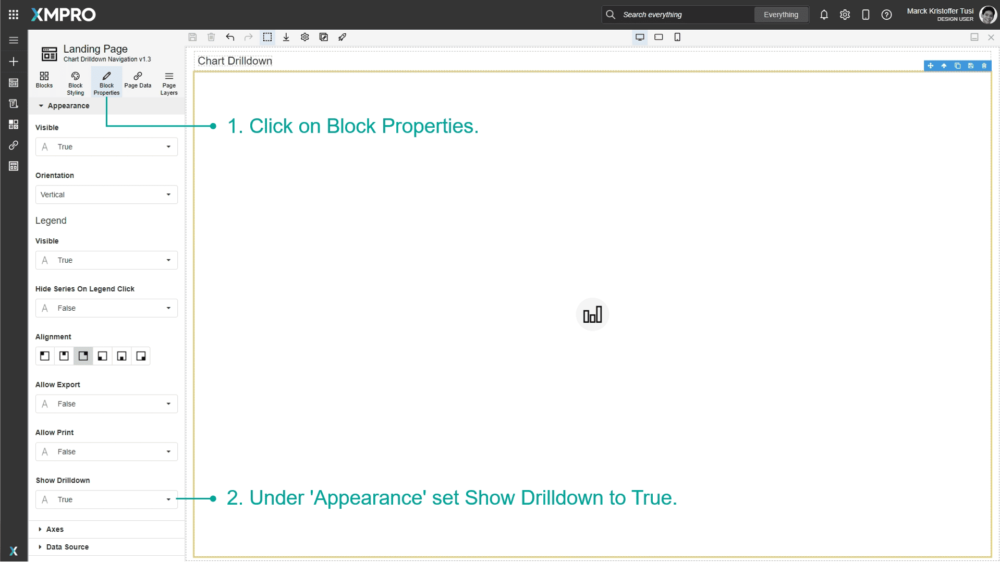

3\. Under 'Action', click on the Navigate To Dropdown and select Page.

4\. Select the page you want to navigate to.

5\. Click Pass Page Parameters.

6\. Pass Page Parameter blade will open.

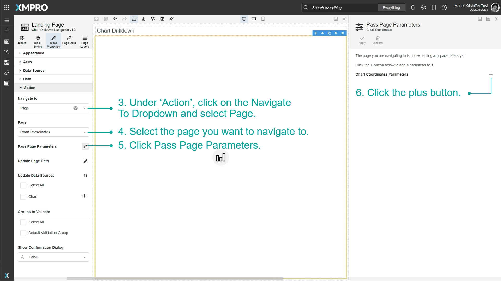

7\. Type in the name of the parameter and select the type.

8\. Click Add.

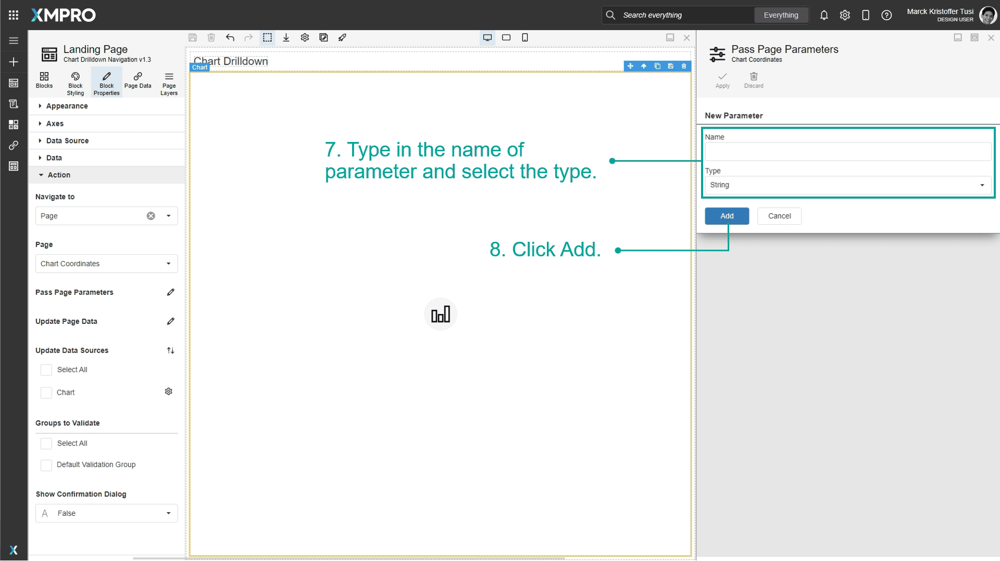

9\. Change the field type to Dynamic Value.

10\. Select the Chart value you want to pass on the next page.

11\. Click _Apply_.

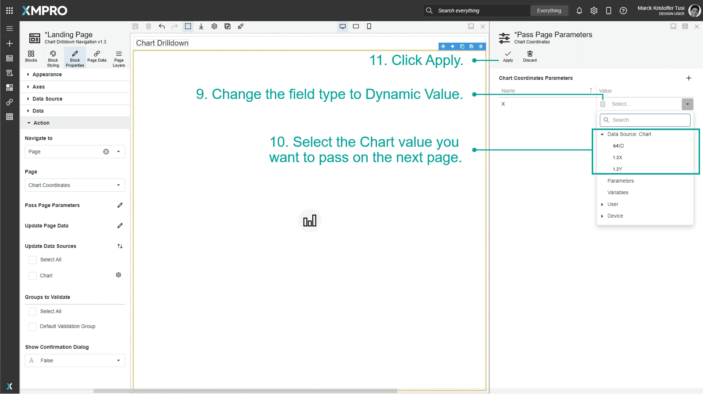

## View values passed to other pages at runtime

Once the Parameter has been configured, launch the application to see how the data will be passed between Pages at runtime.

1. Click on _Launch_.

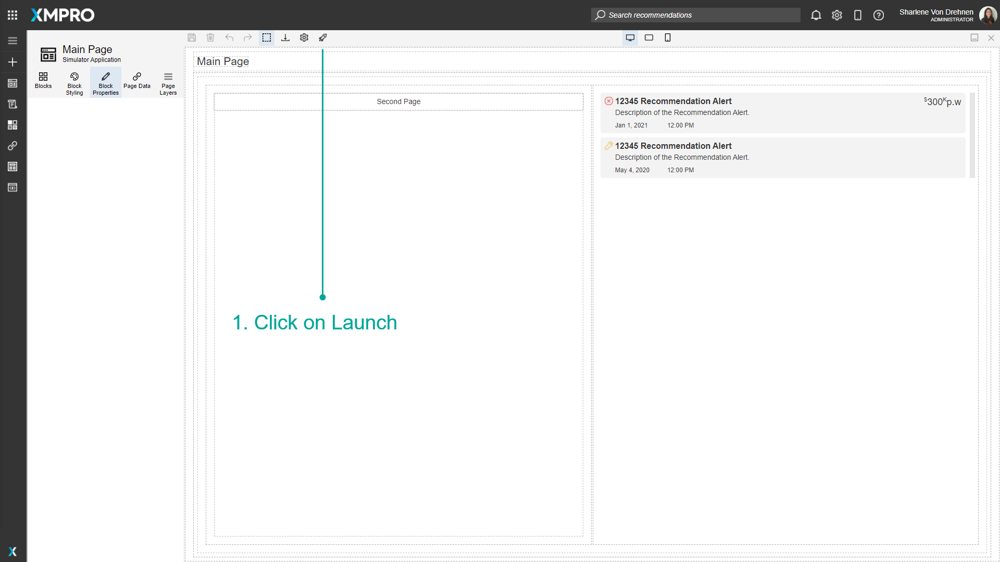

2\. Click on the link that goes to the second page.  
3\. The data sent from the first page should reach the second page.

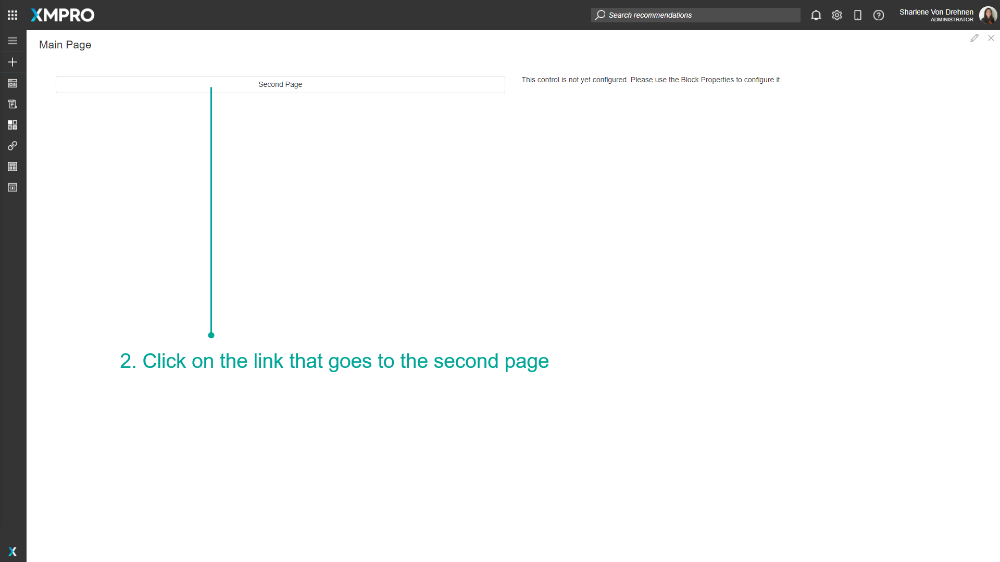

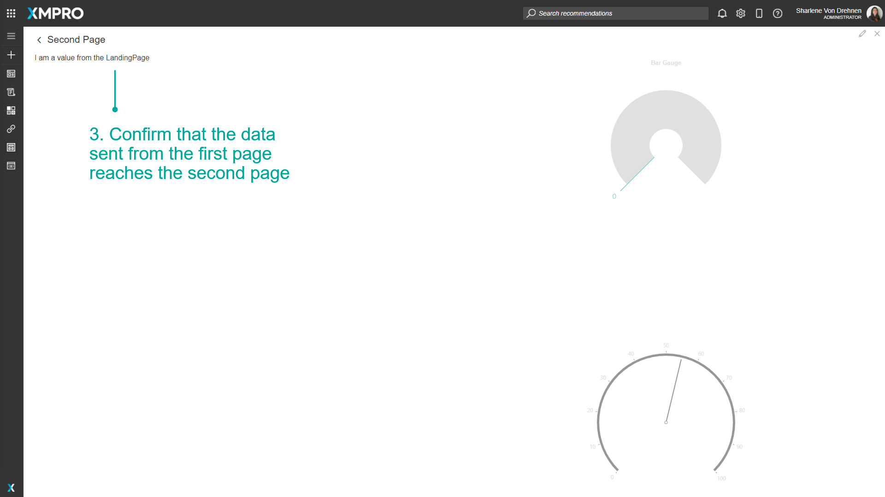

## Edit a Parameter

To edit a Parameter, follow the steps below:

1. Click on _Page Data_.
2. Click on the _pencil/edit_ button for the Parameter.

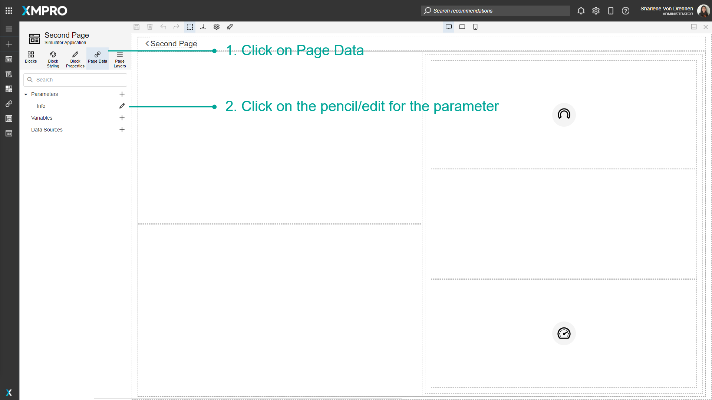

3\. Make changes to the Parameter.  
4\. Click on _Save_.

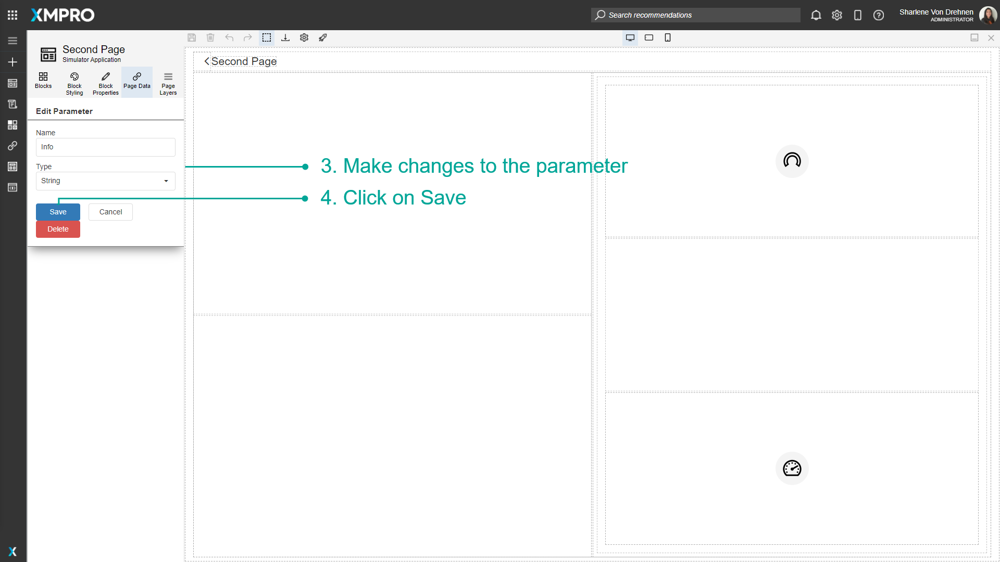

## Delete a Parameter

To delete a Parameter, follow the steps below:

1. Click on _Page Data_.
2. Click on the _pencil/edit_ button for the Parameter.

3\. Click on _Delete._

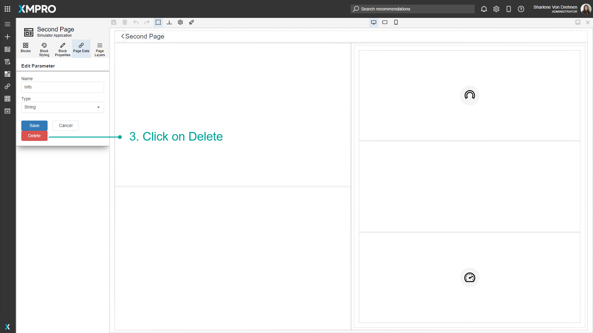

4\. Confirm that you would like to delete the Parameter.

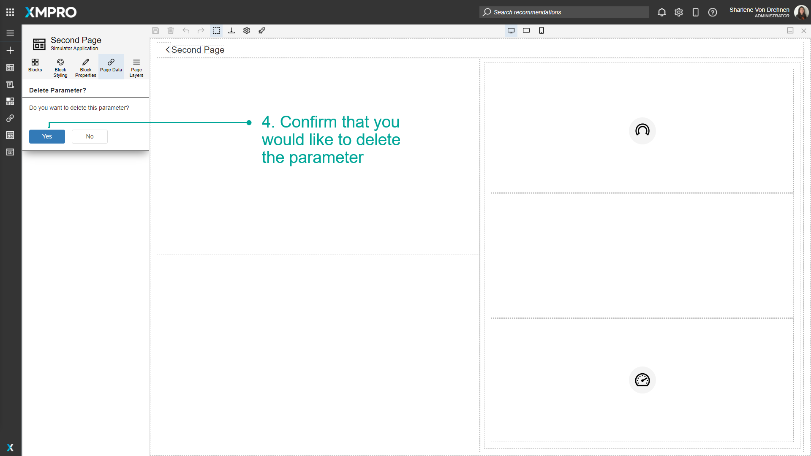
