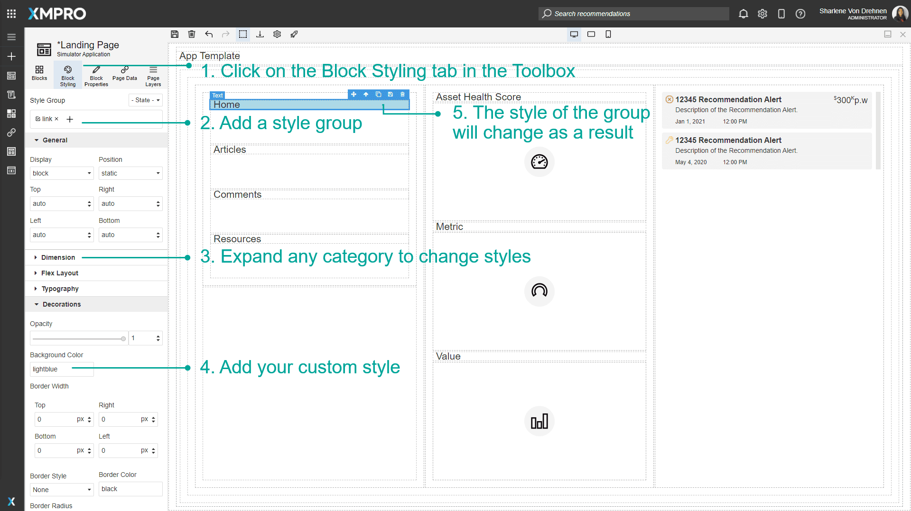
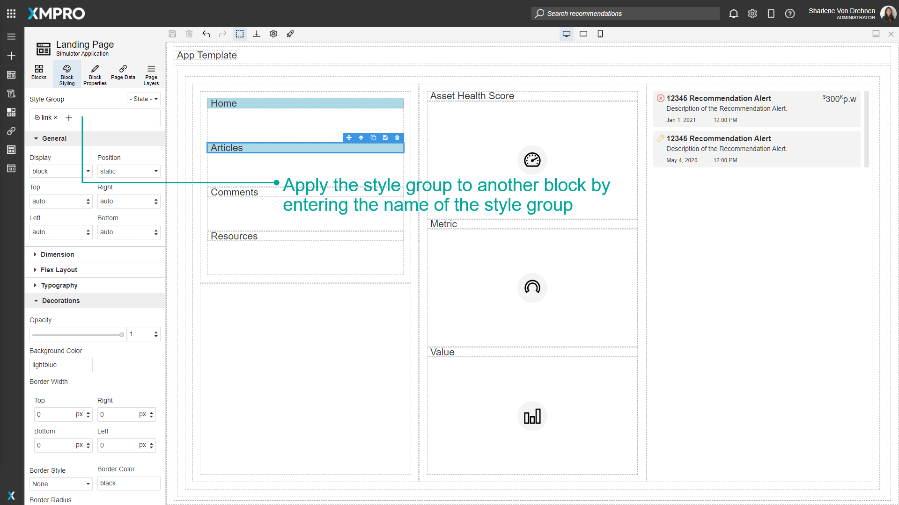
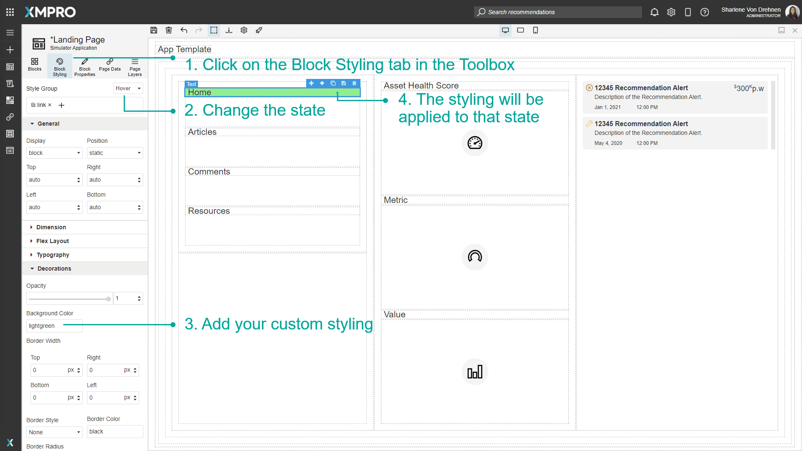
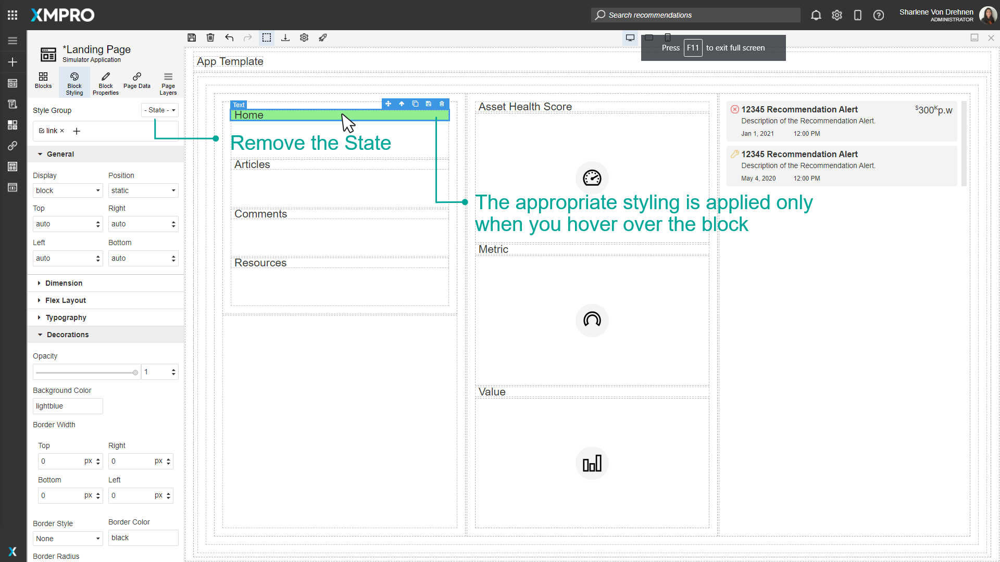
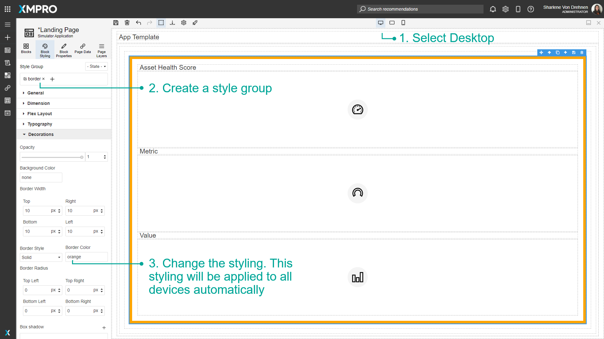
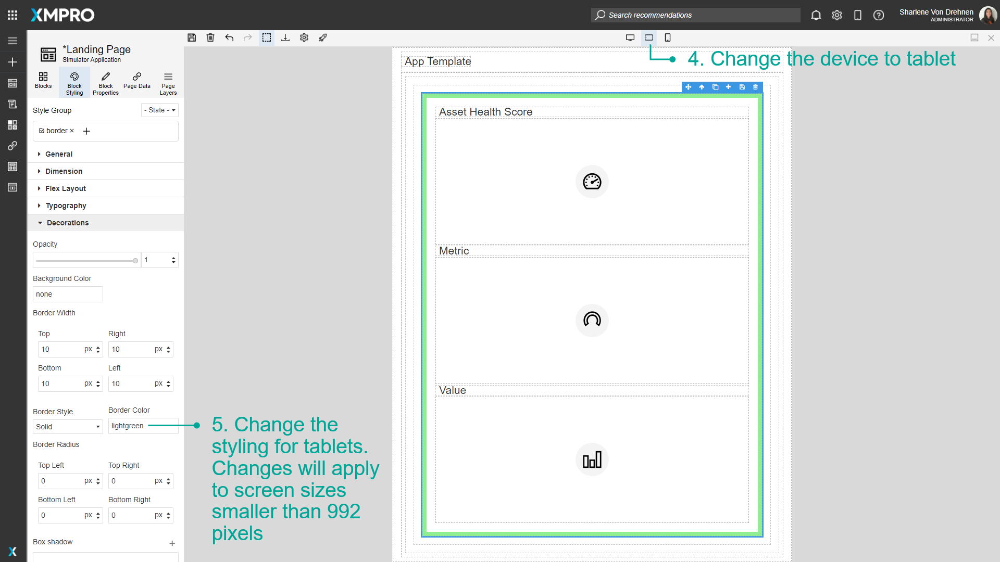
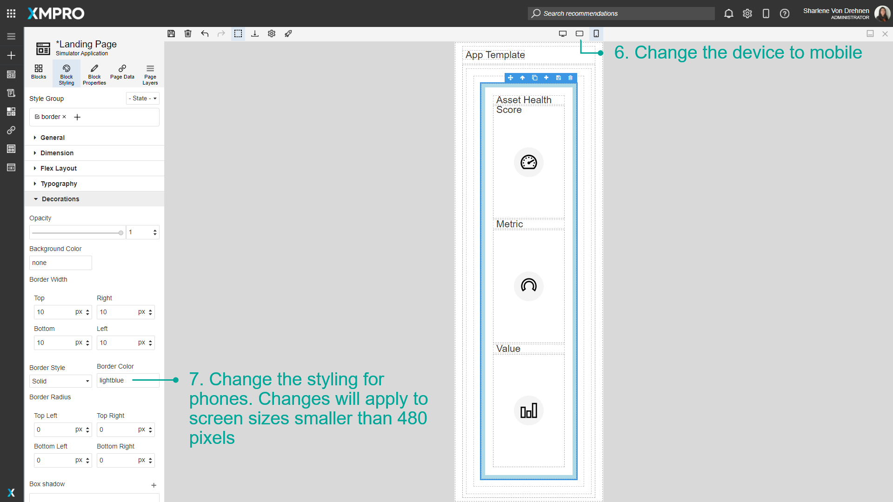

# Use Block Styling and Devices

Block Styling includes options that allow you to change the text color, background color, borders, typography, dimensions, or other styling options of the Block. You can use it to customize the look and feel of the Application based on themes or color palettes for your specific organization. The style and position of the Blocks can also be customized for different devices, which is important in ensuring that users have a good user experience regardless of the screen size they are viewing your Application on.

> [!NOTE]
> It is recommended that you read the article listed below to improve your understanding of Devices and Block Styling.
>
> * [Device](../../concepts/application/devices.md)
> * [Block Styling](../../concepts/application/block-styling.md)
> * [How to Manage Pages](manage-pages.md)

## Adding a Style Group

Style Groups can be created and customized by the user and applied to Blocks on the Canvas. To style a Block, make sure the Block you want to style is selected.

1. Click on the Block Styling tab in the Toolbox.
2. Add a Style Group by typing a name in the field under _'Style Group'_ and pressing enter.
3. Expand any category to change styles.
4. Add your custom style.
5. The style of the group will change as a result.

The created style group can then be applied to other Blocks. Select a different Block and enter the name of the new style Block in the field under _'Style Group'._

## Adding Style to States

States include events such as hovering over a Block, clicking a Block, or changing the style for every second Block. To change the styling of a state, select the Block you want to style.

1. Click on the Block Styling tab in the Toolbox.
2. Change the state.
3. Add your custom styling.
4. The styling will be applied to the Block for that state.

In this example, if the user hovers over the Home text, the background will change from light blue to light green. To see the hovering effect in action, no state should be selected. The background color will remain light blue, and will only change to light green when the user hovers over it.

## Configure styling between Desktop, Tablet, and Mobile Phones

To configure the styling between devices, follow the steps below:

1. Select Desktop.
2. Create a style group.
3. Change the styling. This styling will be applied to all devices automatically.
4. Change the device to tablet.
5. Change the styling for tablets. Changes will apply to screen sizes smaller than 1366 pixels.
6. Change the device to mobile.
7. Change the styling for phones. Changes will apply to screen sizes smaller than 896 pixels.

## Further Reading

* [How to Design Pages for Mobile](design-pages-for-mobile.md)
* [How to Use Flex](use-flex.md)
