# Use Data Sources in the Page

Once a Data Source has been added to a Page, it can be used on a number of Blocks. Data Sources can be bound to certain Blocks that allow you to store data or display data, such as a data grid. These can be used if you want to display data in a grid view to the user, or if you want the user to enter some details and have it stored directly into the connected Data Source, such as an SQL Server Database.

> [!NOTE]
> It is recommended that you read the article listed below to improve your understanding of Data Integration.
>
> * [Data Integration](../../concepts/application/data-integration.md)
> * [How to Manage Data Sources](manage-data-sources.md)

## Adding a Data Source to a page

To add a Data Source onto the Page of an Application, follow the steps below:

1. Open the Editor for the Application.

1. Drag a Block that can display data, such as a Data Grid.

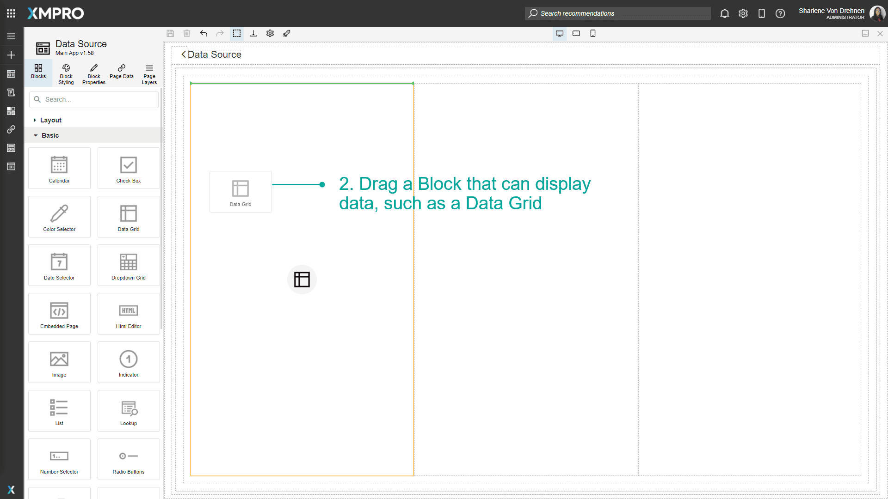

1. Highlight the Block that you want to bind the Data Source to.
2. Select _Block Properties_.
3. Select a Data Source from the list.
4. Click on _Save_.

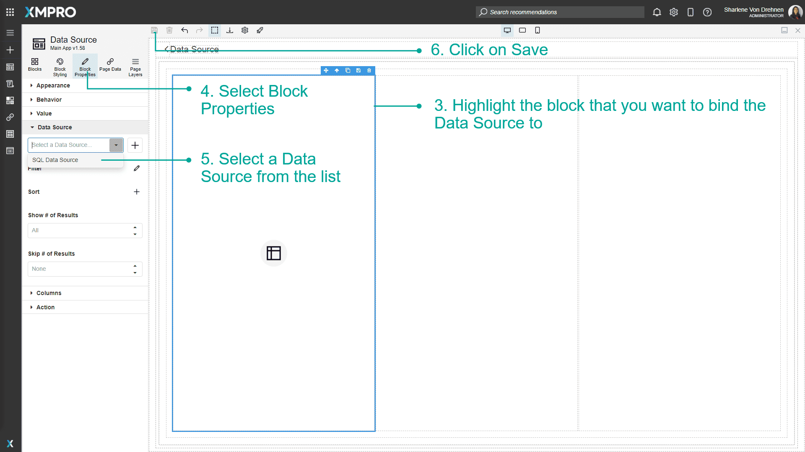

The block highlight color will change to yellow to show it has a Data Source. Click on _Launch_ to launch the Application and view the data.

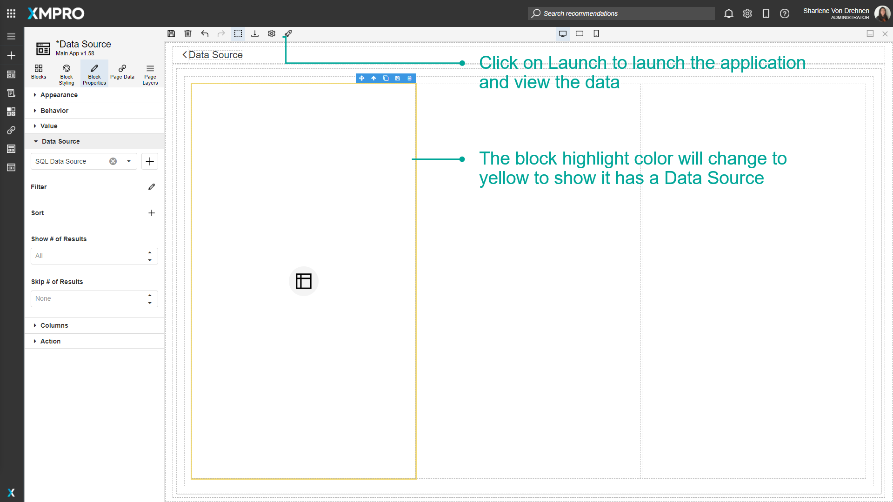

> [!NOTE]
> If the Data Source is properly configured, the data will display and can be visible when the app is launched.

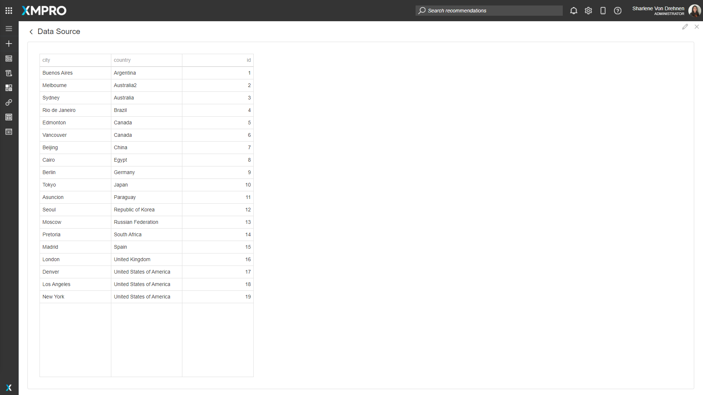

## Filtering records from a Data Source

To filter and limit the number of records the Data Source displays, follow the steps below:

1. Open the Editor for the Application.

1. Highlight the block of the Data Source you want to filter.
2. Click on the _edit_ button to Filter.

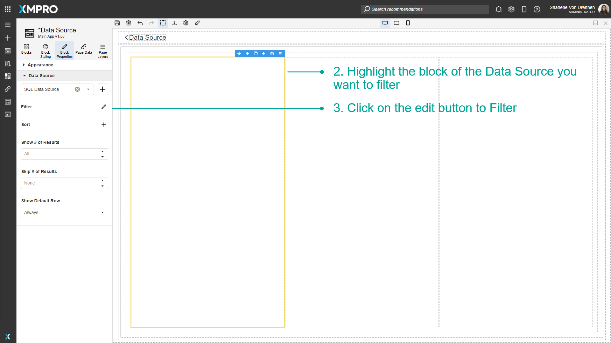

1. Add a filtering condition or group.

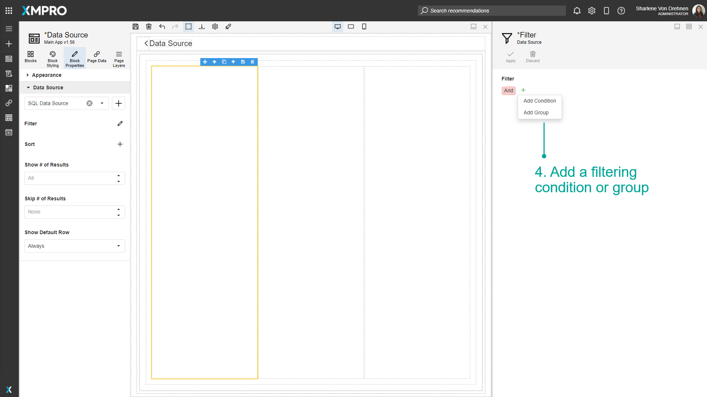

1. Click on _Apply_.
2. Click on _Save_.

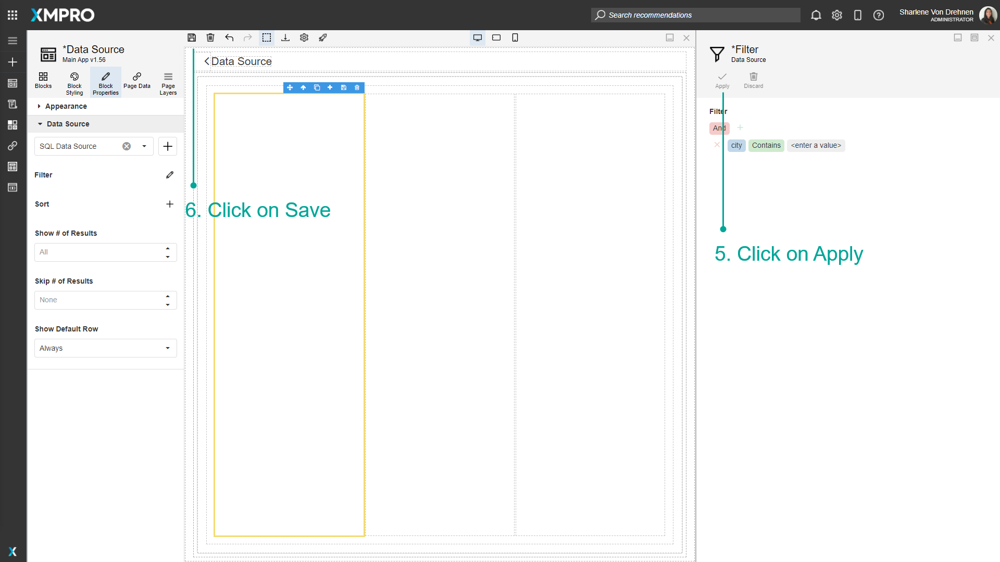

## Sorting records from a Data Source

To sort the records the Data Source displays, follow the steps below:

1. Open the Editor for the Application.

1. Highlight the block of the Data Source you want to sort.
2. Click on the _plus_ button to add a new field to sort by.

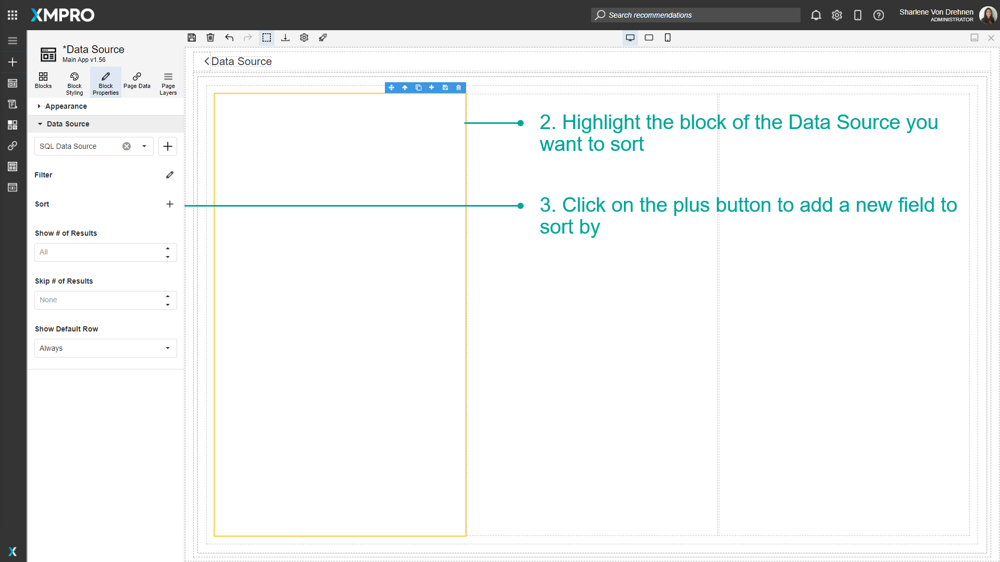

1. Sort the field in ascending or descending order.
2. Click on _Save_.

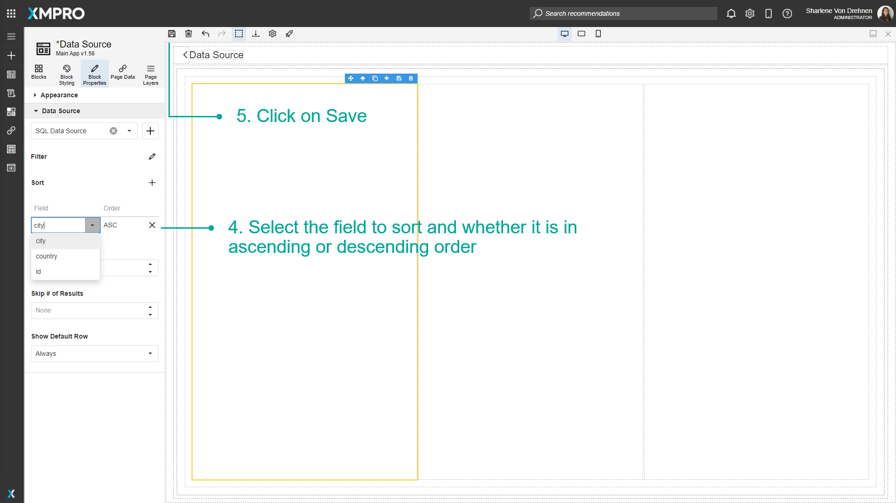

## Showing specific records from a Data Source

### Show # of Results

To show a limited number of the records the Data Source displays, follow the steps below:

1. Highlight the block of the Data Source.
2. Click on _Block Properties_.
3. Show the number of results.
4. Click on _Save_.

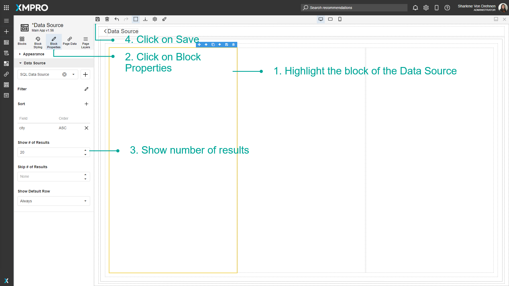

### Skip # of Results

To skip certain rows, follow the steps below:

1. Highlight the block of the Data Source.
2. Click on _Block Properties_.
3. Skip a number of results.
4. Click on _Save_.

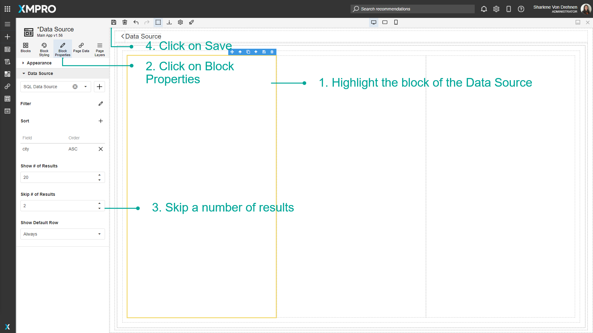

## Show Default Row

To change the settings for the default row, follow the steps below:

1. Highlight the block of the Data Source.
2. Click on _Block Properties_.
3. Change the default row.
4. Click on _Save_.

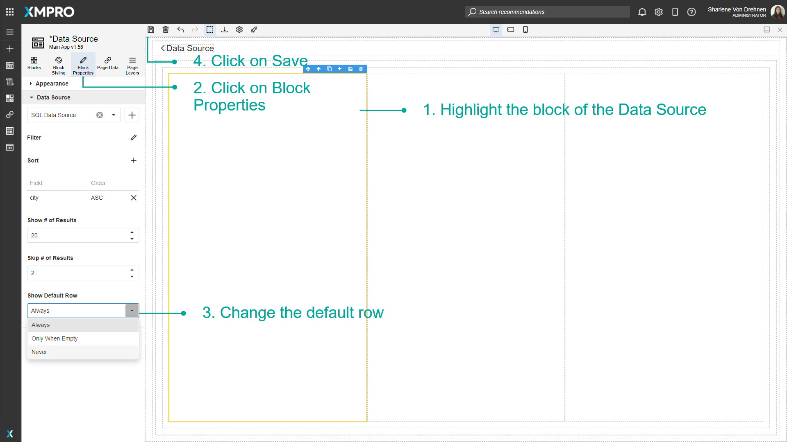
