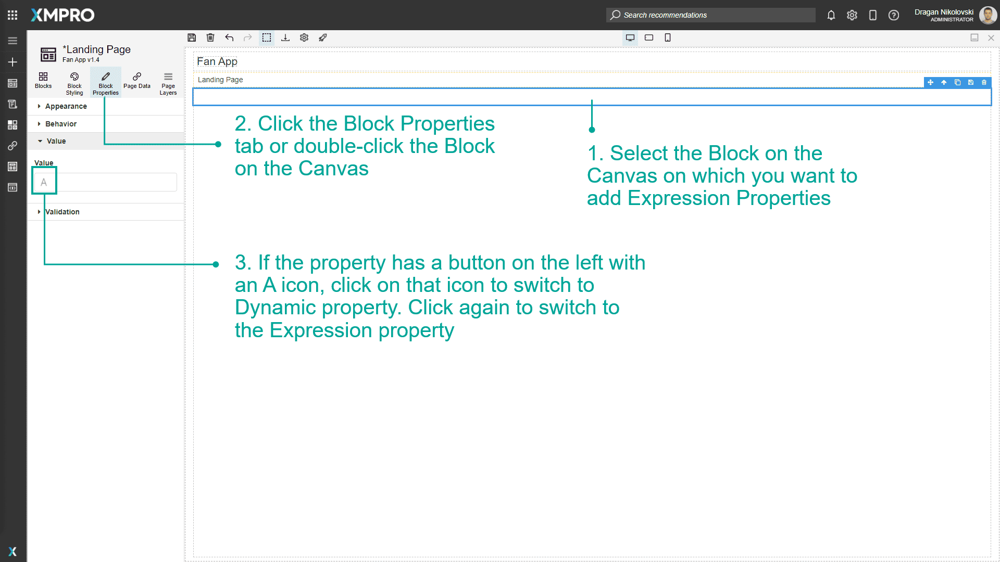
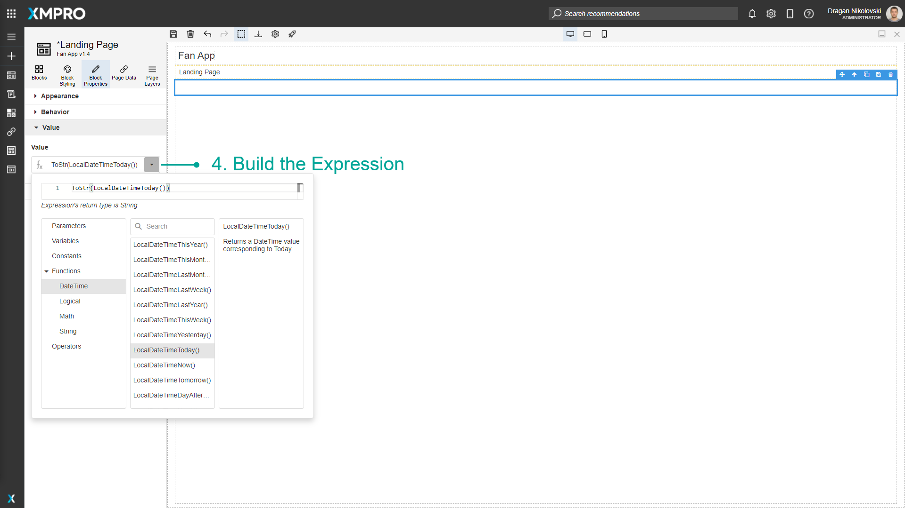

# Use Expression Properties

Expression Properties allow you to create short scripts to create a custom value. This custom value can be calculated from other Variables, Parameters, user input, data from Data Sources, and various Functions, Constants, and Operators. [See the Variable and Expressions article to learn more about Expressions](../../concepts/application/variables-and-expressions.md).

> [!NOTE]
> It is recommended that you read the article listed below to improve your understanding of Properties.
>
> * [Block Properties](../../concepts/application/block-properties.md)
> * [How to Manage Pages](manage-pages.md)

### How to Enable Expression Properties

To enable Expression Properties, follow the steps below:

1. Select the Block on the Canvas on which you want to add Expression Properties.
2. Click the Block Properties tab or double-click the Block on the Canvas.
3. If the property has a button on the left with an A icon, click on that icon to switch to Dynamic Property. Click again to switch to the Expression Property.

   

4. Build the Expression.

   
