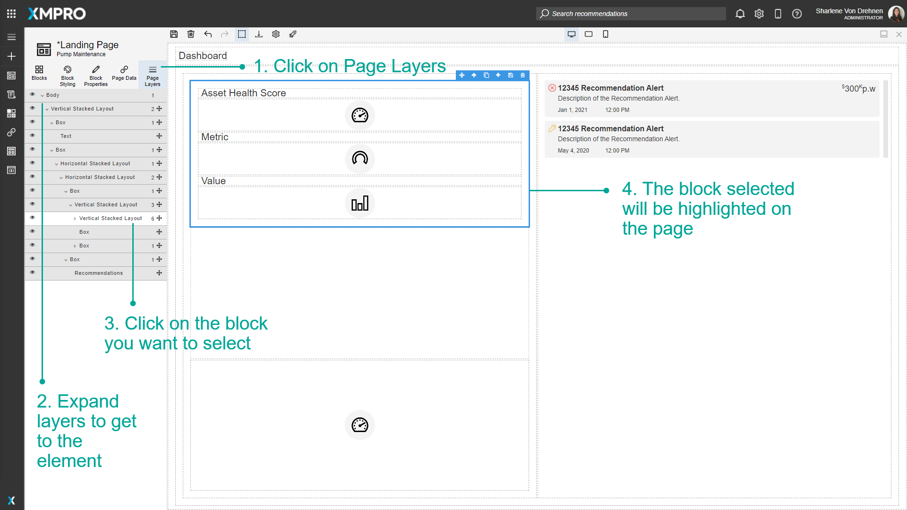
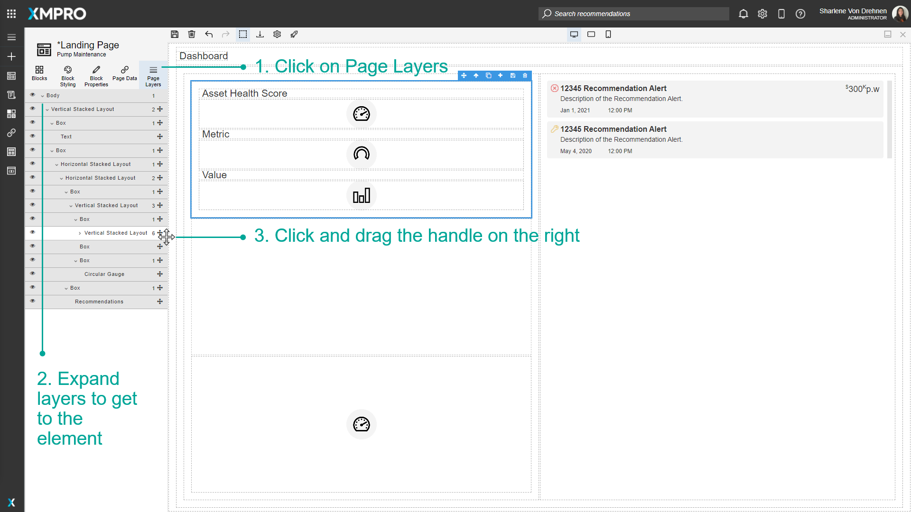
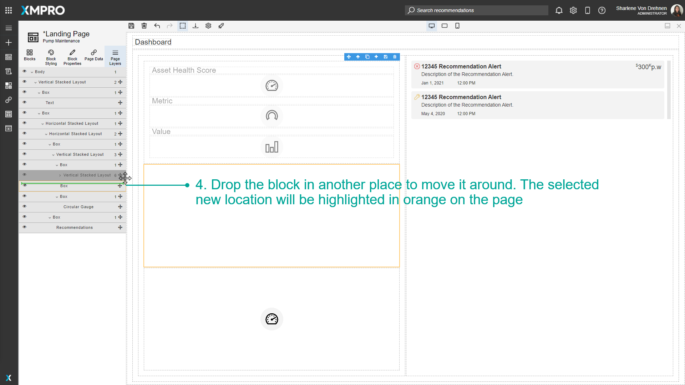
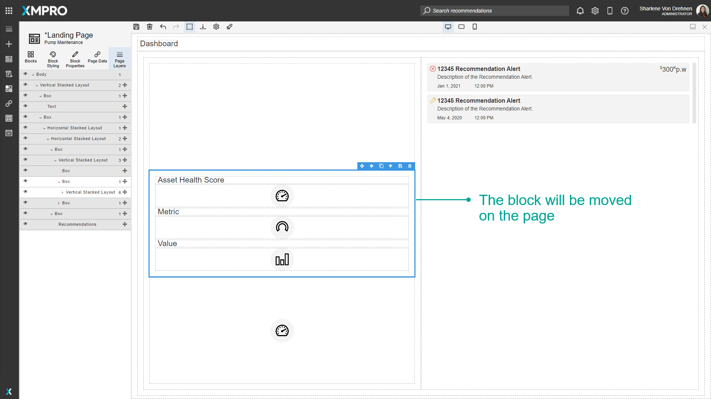
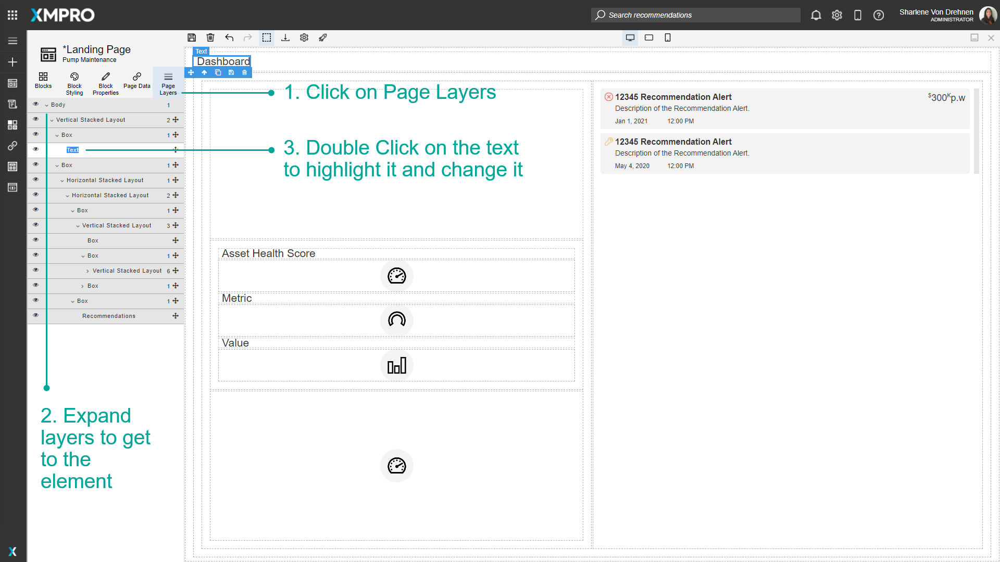
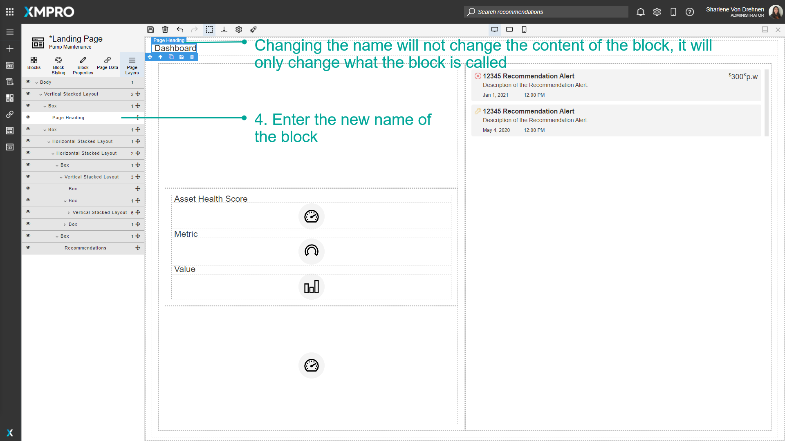
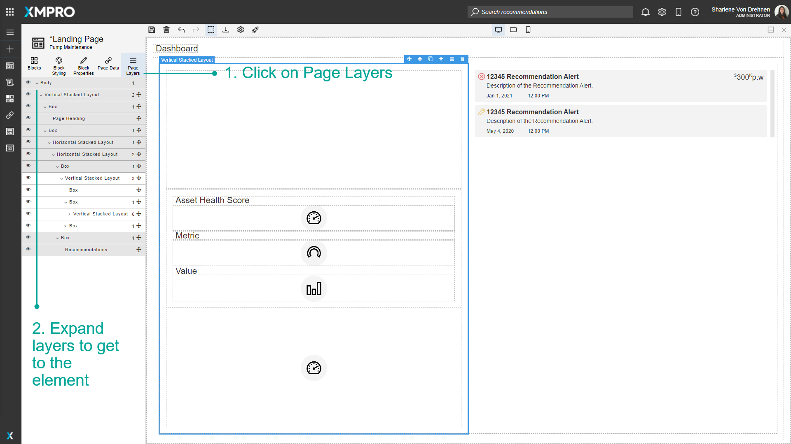
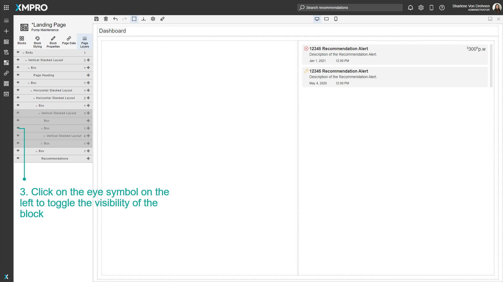

# Use Page Layers

Blocks are organized on the Canvas in a hierarchy. A list view of this hierarchy is visible by selecting the Page Layers tab in the toolbox. This can make selecting Blocks simpler and easier as some Applications may have many nested layers and it can be difficult to select them on the Canvas itself. Each Block that is selected also displays a list of any children Blocks if applicable. This allows you to find the exact Block you need to manipulate.

> [!NOTE]
> It is recommended that you read the article listed below to improve your understanding of Page Layers.
>
> * [Page Layers](../../concepts/application/page-layers.md)
> * [How to Manage Pages](manage-pages.md)

## Selecting a block

Individual Blocks can be selected from the Page Layers view. To select a block on the Page using the Page Layers list, follow the steps below:

1. Click on _Page Layers_.
2. Expand layers to get to the element.
3. Click on the Block you want to select.
4. The Block selected will be highlighted on the Page.

## Moving blocks around

Clicking and dragging the handle on the right of the Block will re-arrange itself in the list as well as the page. To move Blocks around, follow the steps below:

1. Click on _Page Layers_.
2. Expand layers to get to the element.
3. Click and drag the handle on the right.
4. Drop the Block in another place to move it around. The selected new location will be highlighted in orange on the Page.

The Block will be moved on the Page.

## Renaming blocks

Renaming Blocks will not affect what the block looks like at runtime, it will only change the text or label that will appear when you hover over the Block. To rename Blocks, follow the steps below:

1. Click on _Page Layers_.
2. Expand layers to get to the element.
3. Double Click on the text to highlight it and change it.

4\. Enter the new name of the Block.

> [!NOTE]
> Changing the name will not change the content of the Block, it will only change what the Block is called.

## Hide and Show blocks

You can press the hide on the left to hide elements on the page. This will hide the elements on the page and also in runtime view as well.

1. Click on Page Layers.
2. Expand layers to get to the element.
3. Click on the eye symbol on the left to toggle the visibility of the Block.

