# Use Validation

Validation is a way of making sure the user has correctly entered data when they are filling out a form. The Validation occurs when they press the submit button. This prevents the user from submitting data that is inaccurate or in the wrong format.

> [!NOTE]
> It is recommended that you read the article listed below to improve your understanding of Applications.
>
> * [Block Properties](../../concepts/application/block-properties.md)
> * [How to Manage Pages](manage-pages.md)

## Adding Validation to Forms

To add Validation to forms, follow the steps below:

1. Add a form control such as a Fieldset.
2. Create your form.
3. Add input blocks such as textboxes, number selectors, or text areas, which allow validation to be configured.
4. Highlight the field you want to validate.
5. Click on _Block Properties_.
6. Enter if the field is required. Required means the user must enter a value for the field.
7. If required, enter the error message the user will see if they do not enter a value.
8. If applicable, enter a regex if the value needs to have a specific pattern. For example, if the field needs at least two words, or must have an @ symbol for an email.
9. If applicable, enter the error message if the pattern is not provided.

   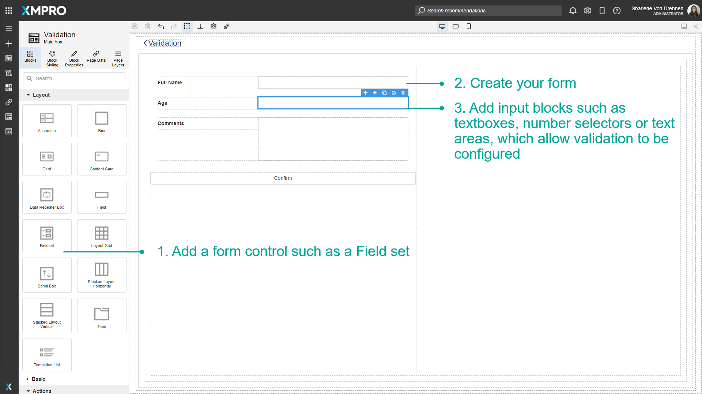

   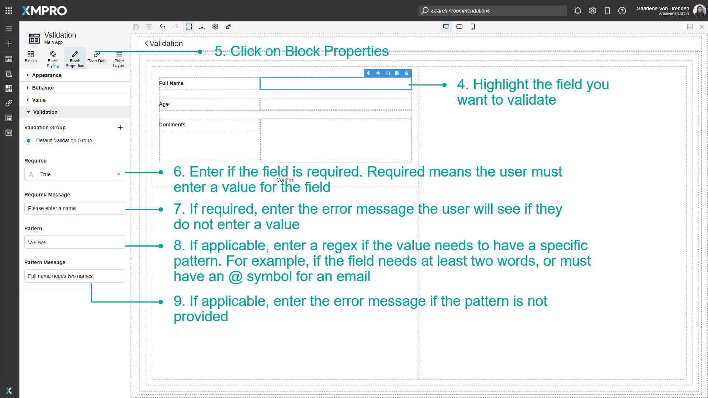

   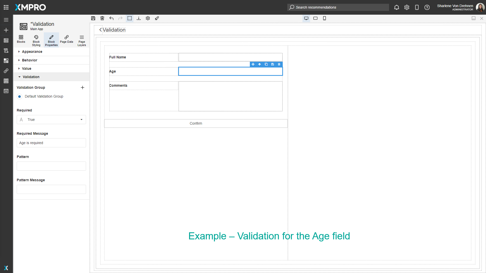

   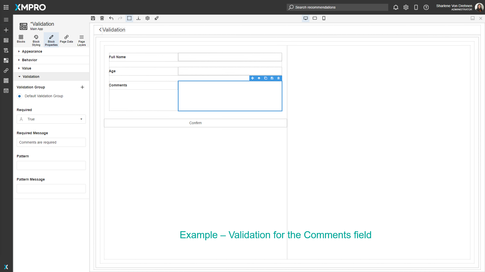

10. Highlight the submit or confirm button.
11. Click on _Block Properties_.
12. Select the Validation Groups to validate.

    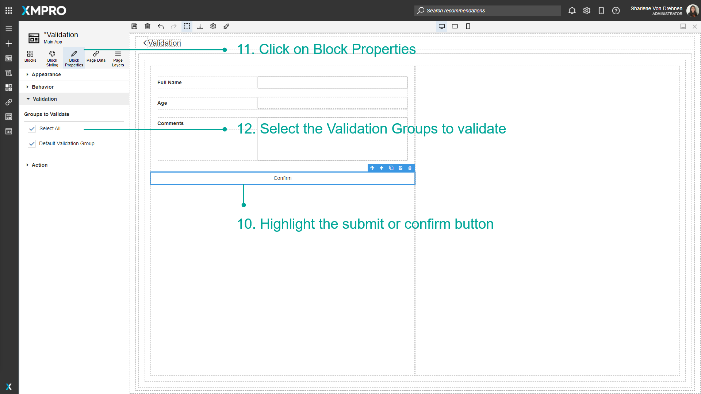

## Viewing Validation at runtime

At runtime, if the 'submit' or 'confirm' button is pressed without valid inputs, the fields will be highlighted in red and the corresponding error warning will show.

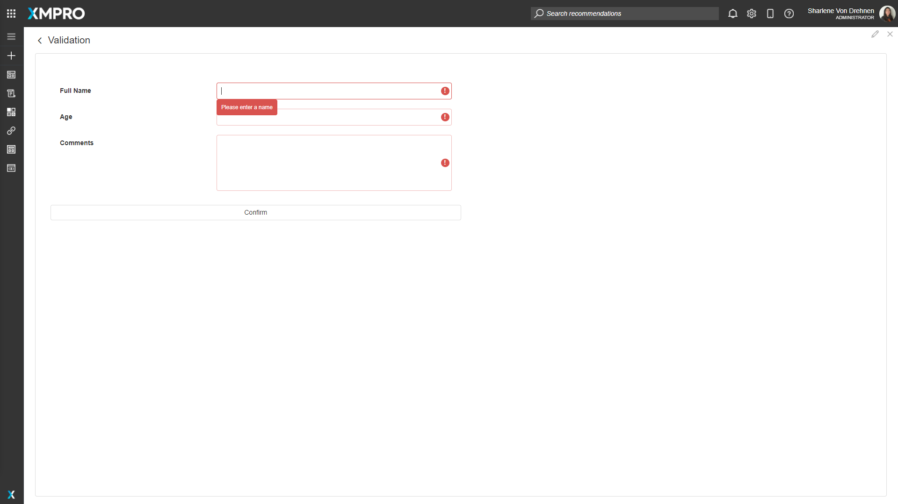

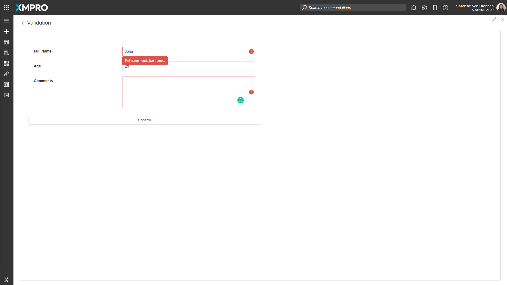

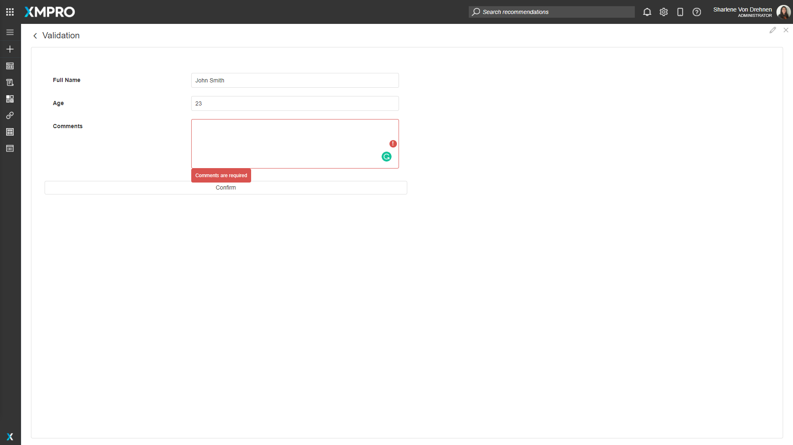

Once all fields are valid, all errors will disappear from the screen and the user will be able to press the submit or confirm button.

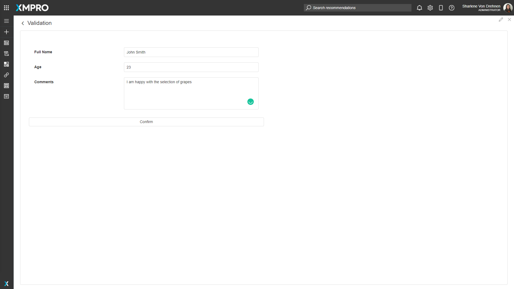

## Validation Groups

Validation Groups can be used when there are multiple forms on the page that need to be separated.

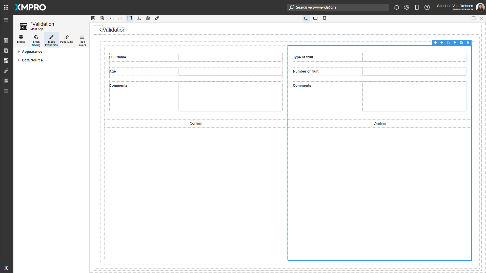

To organize validation groups, follow the steps below:

1. Select the field for the second form.
2. Click on _Block Properties_.
3. Expand _Validation_.
4. Click on the _plus_ to create a new validation group.

   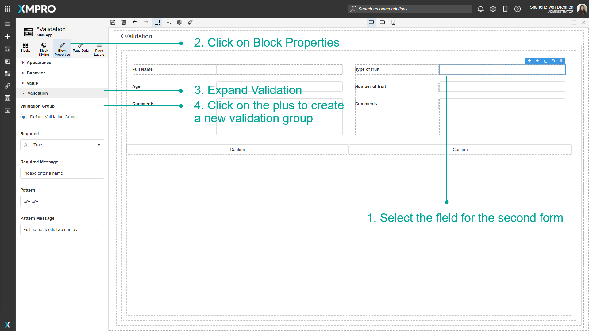

5. Enter the name of the validation group.
6. Click on _Create_.

   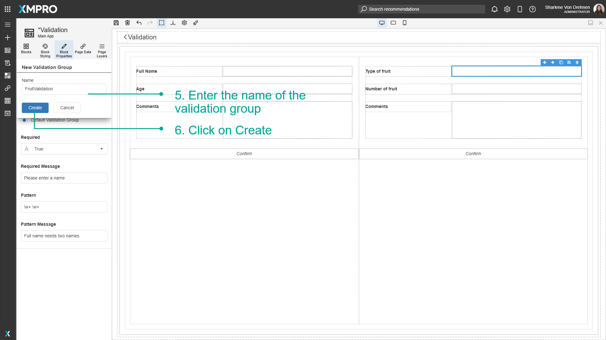

7. Highlight each of the fields on the new form.
8. Click on their _Block Properties_.
9. Add them to the new validation group.

   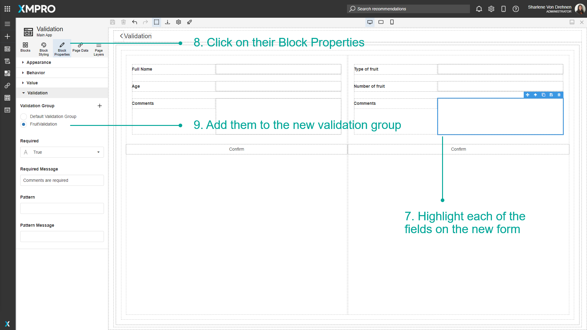

10. Highlight the submit button for the new form.
11. Click on _Block Properties_.
12. Select the new validation group.

    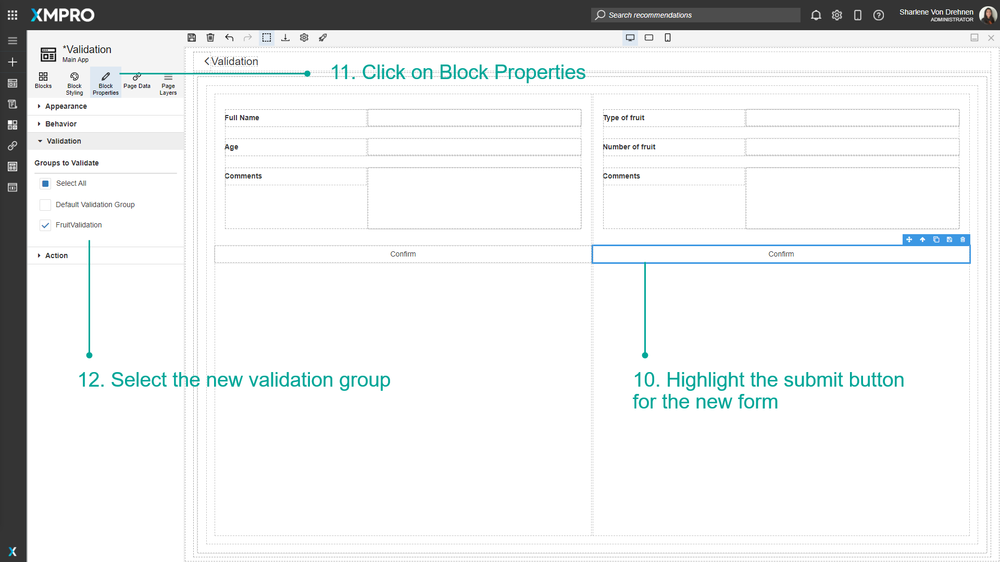

The validation will only be applied to that validation group.

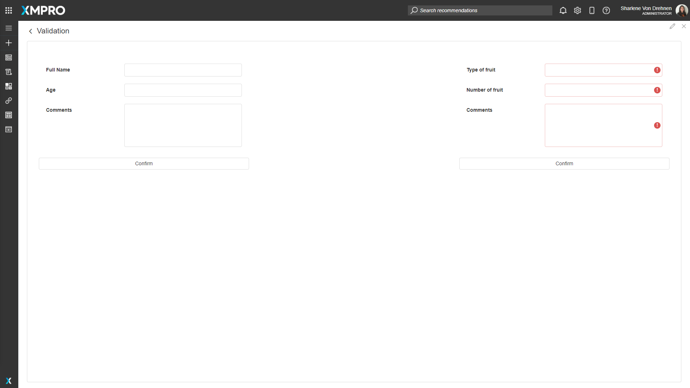
