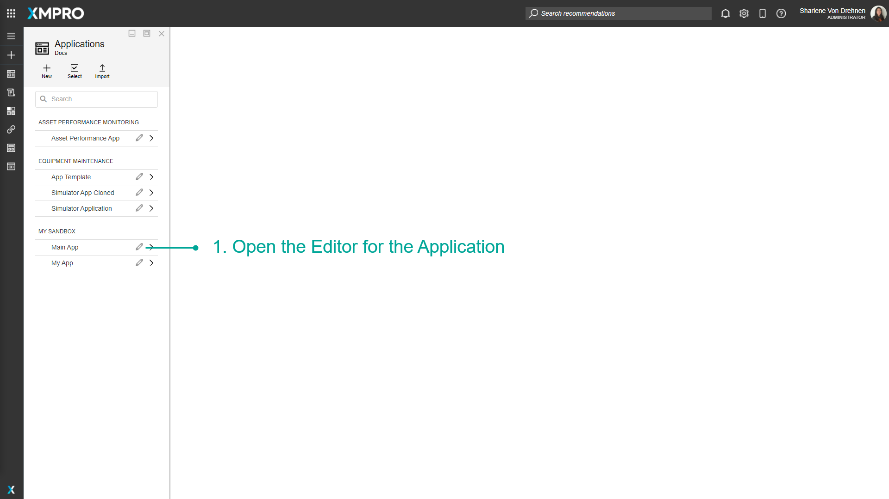
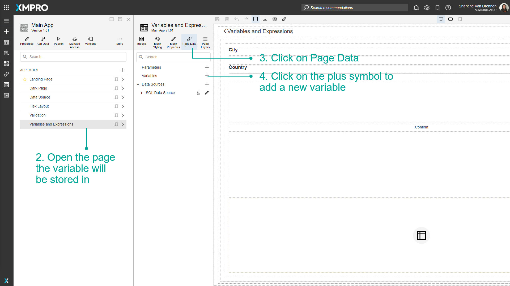
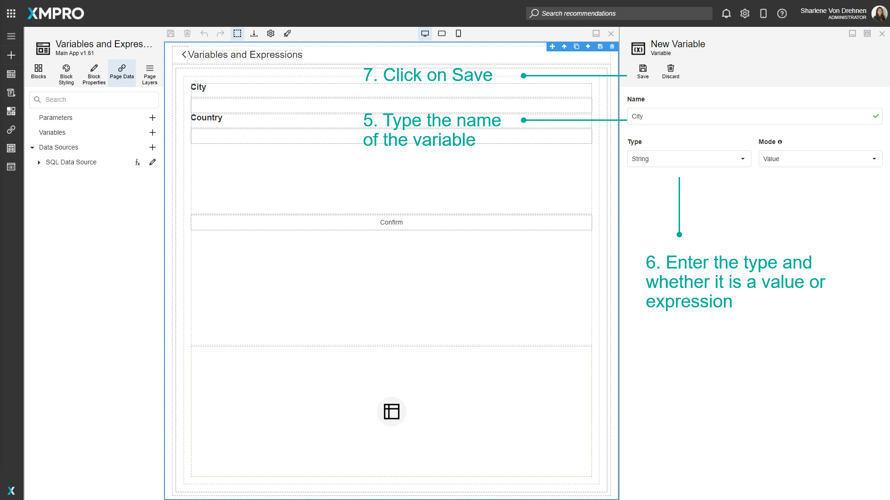
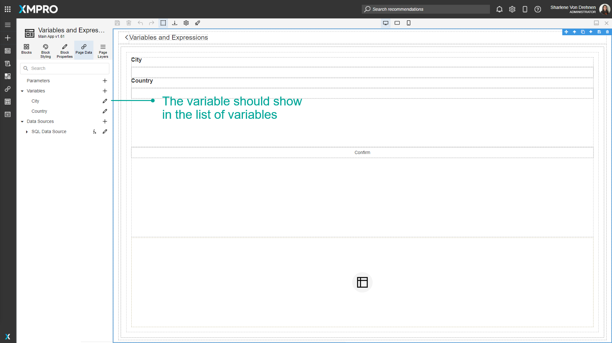
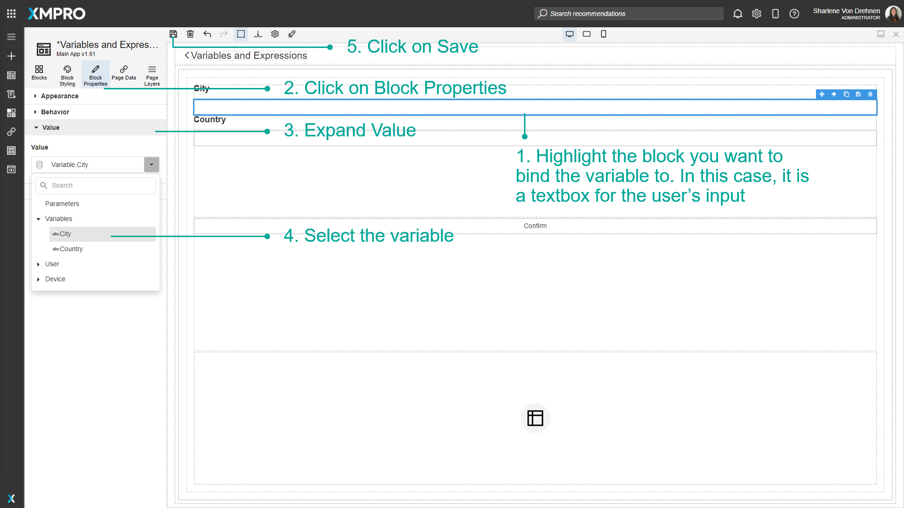
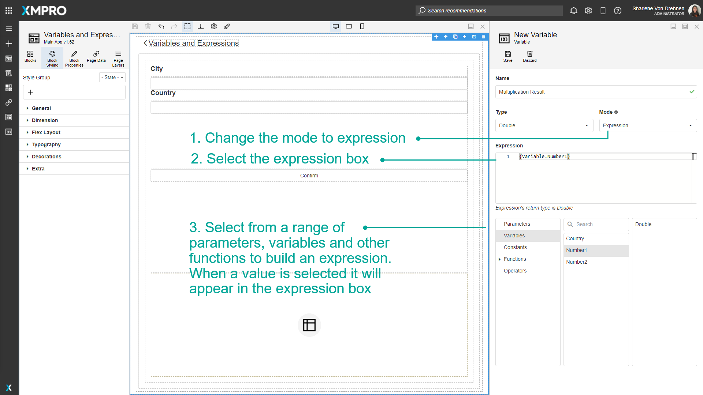
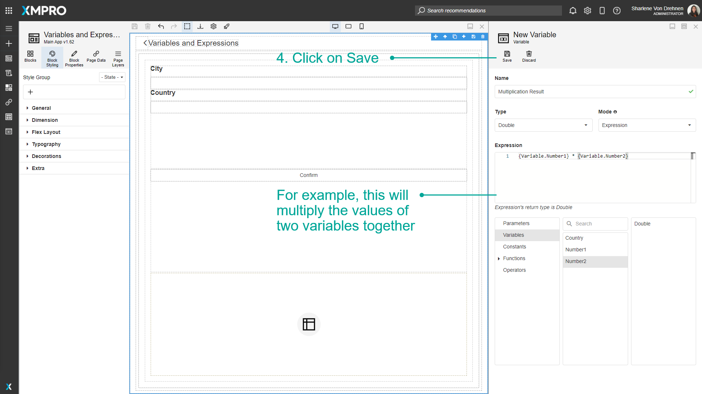
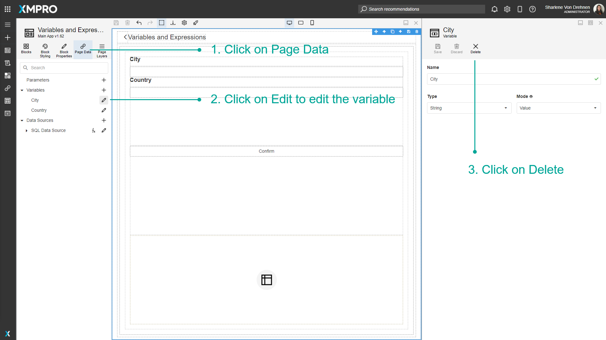
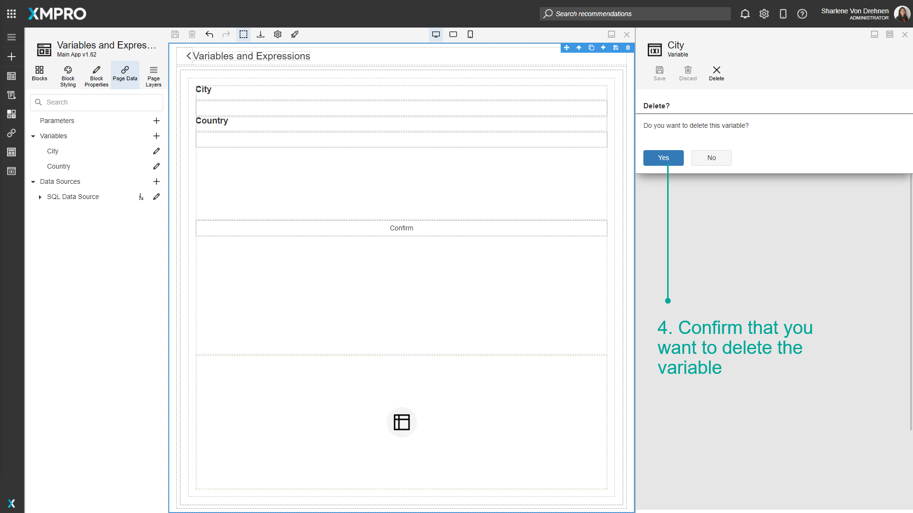

# Use Variables & Expressions

Variables are placeholders used to hold and maintain certain values. In some cases, it is possible to not know some of the values that you might want to display or use within the Application. In this case, you can use Variables where the real value can be substituted in later. Expressions can also be configured and are useful for doing certain calculations and returning results which can also be used in the Application.

> [!NOTE]
> It is recommended that you read the article listed below to improve your understanding of Variables and Expressions.
>
> * [Variables and Expressions](../../concepts/application/variables-and-expressions.md)
> * [How to Manage Pages](manage-pages.md)

## Adding a Variable

To add a Variable to the Application, follow the steps below:

1. Open the editor for the Application.

   

2. Open the page the Variable will be stored in.
3. Click on _Page Data_.
4. Click on the _plus_ symbol to add a new Variable.

   

5. Type the name of the Variable.
6. Enter the type and whether it is a value or expression.
7. Click on _Save_.

   

The Variable should show in the list of Variables.

## Using a Variable

To use a Variable, follow the steps below:

1. Highlight the Block you want to bind the Variable to. In this case, it is a textbox for the user's input.
2. Click on _Block Properties_.
3. Expand _Value_.
4. Select the Variable
5. Click on _Save_.

## Adding Expressions

When adding a Variable, there is an option to build an expression. The example below shows an expression that multiplies the values of two variables together. To build an expression, follow the steps below:

1. Change the mode to _expression_.
2. Select the expression box.
3. Select from a range of parameters, Variables, and other functions to build an expression. When a value is selected it will appear in the expression box.

> [!NOTE]
> Numbers are identified as integers by default. Convert to other data types using:
>
> * a method e.g.`ToLong(0)`for the value 0 as a long
> * `2.0`for the value 2 as a double

1. Click on _Save_.

## Deleting a Variable

To delete a Variable, follow the steps below:

1. Click on _Page Data_.
2. Click on _Edit_ to edit the Variable.
3. Click on _Delete_.

1. Confirm that you want to delete the Variable.

