# Manage Data Streams

A Data Stream is a visual representation of a flow of data, which is depicted by the use of Agents that are connected by arrows that allow data to flow from one Agent to the next. Data streams are built in an interactive canvas environment that allows you to drag Agents from the toolbox to a drawing area. These Agents allow you to complete certain actions on the data. This includes aggregating, filtering, displaying, or re-saving the data into another database.

> [!NOTE]
> It is recommended that you read the article listed below to improve your understanding of Data Streams.
>
> * [Data Stream](../../concepts/data-stream/index.md)

## Creating a Data Stream

To create a Data Stream, follow the steps below:

1. Open the _New Data Streams_ page from the left-hand menu.
2. Give the Data Stream a name.
3. Enter a description.
4. Enter the type (streaming or recurring).
5. Enter the category under which the Data Stream is found in the Data Stream list.
6. Give the Data Stream an icon. Sample icons can be found in the [Icon Library](../../resources/icon-library.md).
7. Enter the Collection the Data Stream will have.
8. Click _Save_.

<figure style="text-align: center;">
  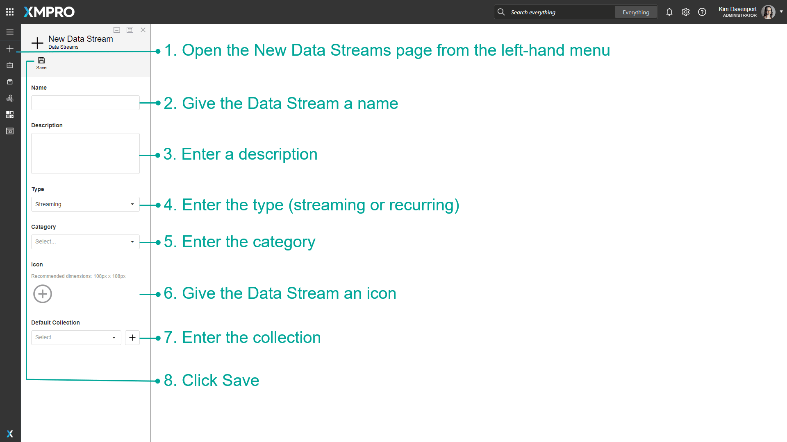
  <figcaption style="text-align: center; color: #666;">Fig 1: Creating a Data Stream</figcaption>
</figure>

<figure style="text-align: center;">
  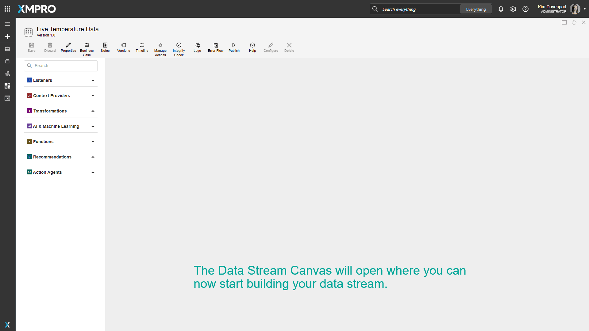
  <figcaption style="text-align: center; color: #666;">Fig 2: A newly created Data Stream</figcaption>
</figure>

## Opening a Data Stream

Data Streams can be opened via the _Data Streams_ Page on the left-hand menu, or via the main page that contains the list of Categories.

To open Data Streams from the left-hand menu:

1. Open the _Data Streams_ page from the left-hand menu.
2. Select the Data Stream you want to open.

<figure style="text-align: center;">
  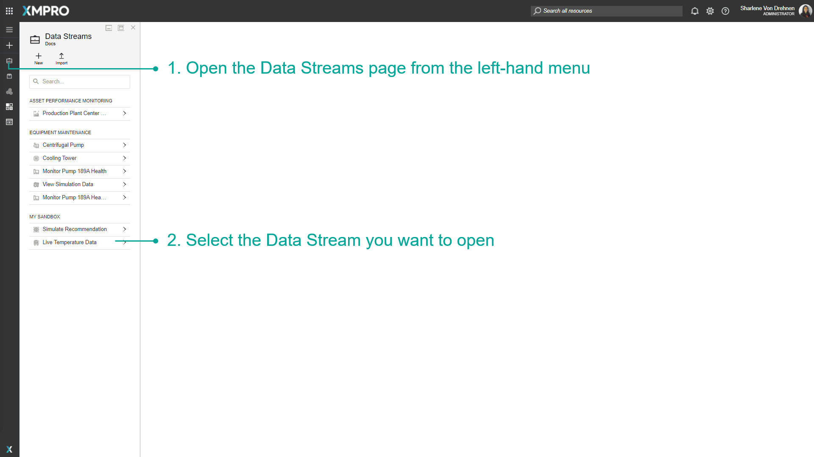
  <figcaption style="text-align: center; color: #666;">Fig 3: Opening a Data Stream from the left-hand menu</figcaption>
</figure>

To open Data Streams from the list of categories:

1. Click the Logo to open the landing page.
2. Click the Category of the Data Stream.

<figure style="text-align: center;">
  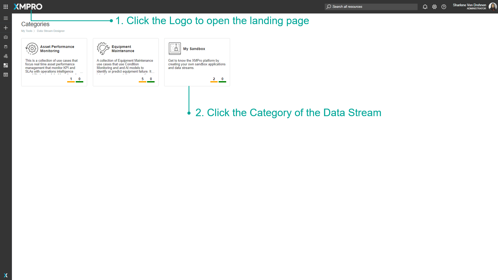
  <figcaption style="text-align: center; color: #666;">Fig 4: Finding a Data Stream from the landing page of categories</figcaption>
</figure>

1. Click the Data Stream you want to open.

<figure style="text-align: center;">
  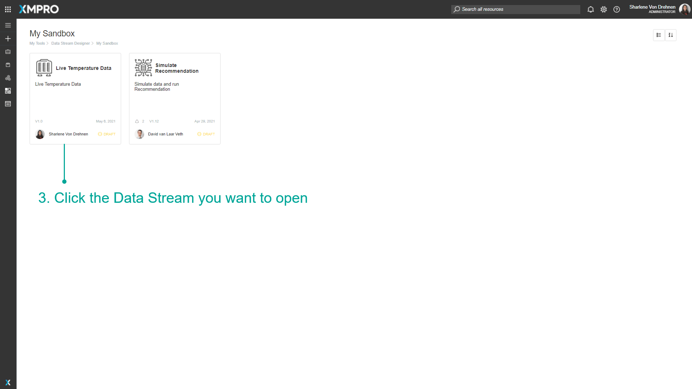
  <figcaption style="text-align: center; color: #666;">Fig 5: Opening a Data Stream from a category</figcaption>
</figure>

## Adding an Agent to the Canvas

To add Agents to the canvas, drag and drop Agents from the left-hand toolbox to make up the data flow for your Data Stream. An Agent that has been added to the canvas is called a Stream Object. [See the Agents article for more information on Agents.](../../concepts/agent/index.md)

1. Enter part of the Agent name to filter the toolbox (or expand a category to view the list of Agents).
2. Click and drag an agent onto the Canvas.
3. Click the output endpoint and drag it to an input endpoint to connect two Stream Objects.

<figure style="text-align: center;">
  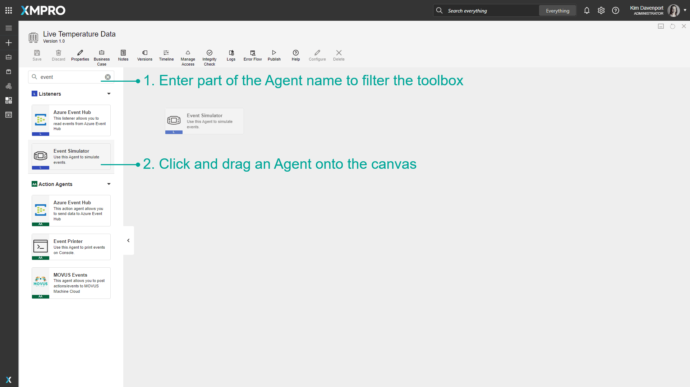
  <figcaption style="text-align: center; color: #666;">Fig 6: Adding an Agent to the Canvas</figcaption>
</figure>

<figure style="text-align: center;">
  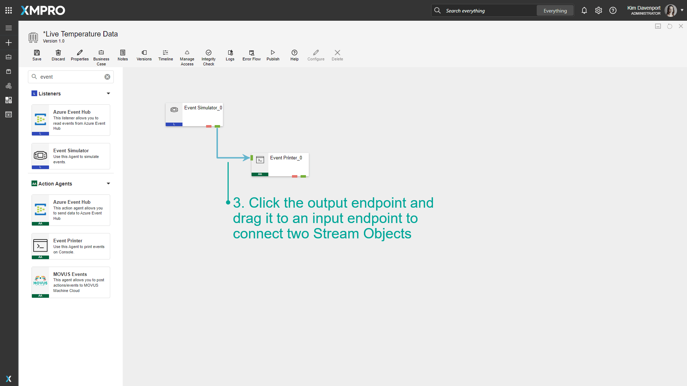
  <figcaption style="text-align: center; color: #666;">Fig 7: Connecting two Agents</figcaption>
</figure>

## Copying and Pasting Stream Objects

Stream Objects that are in the Data Stream can be copied and pasted using keyboard shortcuts. To copy a Stream object:

1. Select a Stream Object to highlight it.
2. To highlight multiple Stream Objects, hold the ctrl key while you are selecting them.
3. Once the Stream Object(s) are highlighted in yellow, press and hold ctrl + C.
4. To paste the Stream Object that was just copied, press and hold ctrl + P.

> [!NOTE]
> You can also copy a Stream Object from one Data Stream and paste it into a different Data Stream.

<figure style="text-align: center;">
  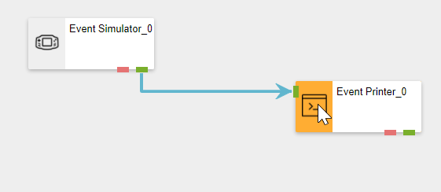
  <figcaption style="text-align: center; color: #666;">Fig 8: Copying a Stream Object</figcaption>
</figure>

## Deleting a Stream Object

To delete a Stream Object on the canvas, follow the steps below:

1. Click a Stream Object to select it.
2. Click Delete.

<figure style="text-align: center;">
  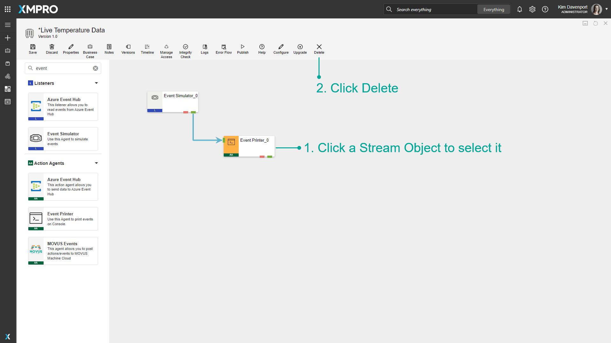
  <figcaption style="text-align: center; color: #666;">Fig 9: Deleting a Stream Object using the Delete Button</figcaption>
</figure>

You can also delete Stream Objects that are on the Data Stream canvas by using the 'delete' keyboard shortcut.

1. Select an Agent to highlight it.
2. To highlight multiple Agents, hold the ctrl key while you are selecting them.
3. Once the Stream Object/s are highlighted in yellow, click on the delete key on the keyboard.

<figure style="text-align: center;">
  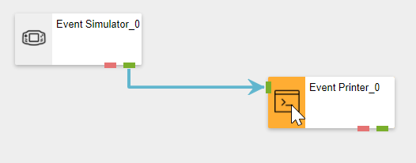
  <figcaption style="text-align: center; color: #666;">Fig 10: Deleting a Stream Object using the keyboard</figcaption>
</figure>

## Deleting a Data Stream

To delete a Data Stream, follow the steps below:

1. Click Properties.
2. Click Delete.

<figure style="text-align: center;">
  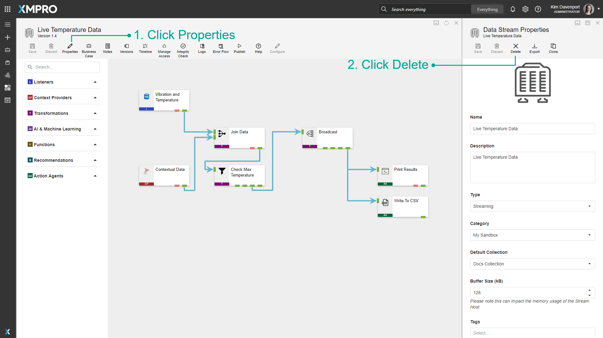
  <figcaption style="text-align: center; color: #666;">Fig 11: Deleting a Data Stream</figcaption>
</figure>

## Sharing Access to a Data Stream

Data Streams can be shared between users with differing permisson. [See the Manage Access article to read more about managing access to users.](../../concepts/manage-access.md) To share a Data Stream, follow the steps below:

1. Click _Manage Access_.
2. Click _Add_.
3. Enter the user to which you want to grant access.
4. Choose between read, write, or co-owner permissions.
5. Click _Ok_.

<figure style="text-align: center;">
  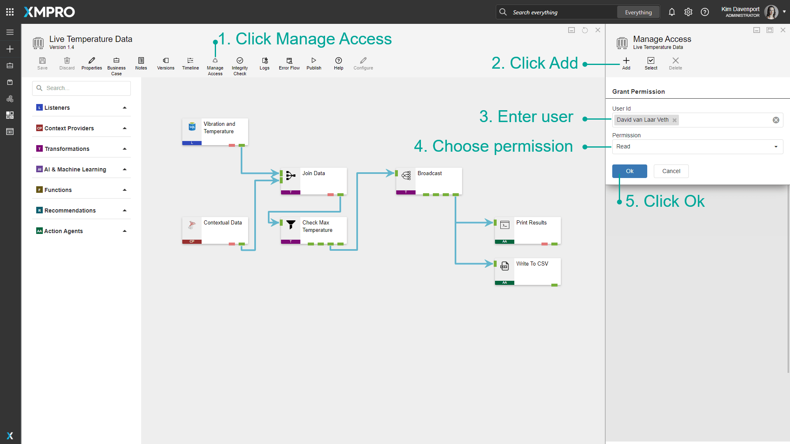
  <figcaption style="text-align: center; color: #666;">Fig 12: Sharing Access to a Data Stream</figcaption>
</figure>

## Changing Access to a Data Stream

To change permissions of existing users, follow the steps below:

1. Click on _Manage Access._
2. Select the user.

<figure style="text-align: center;">
  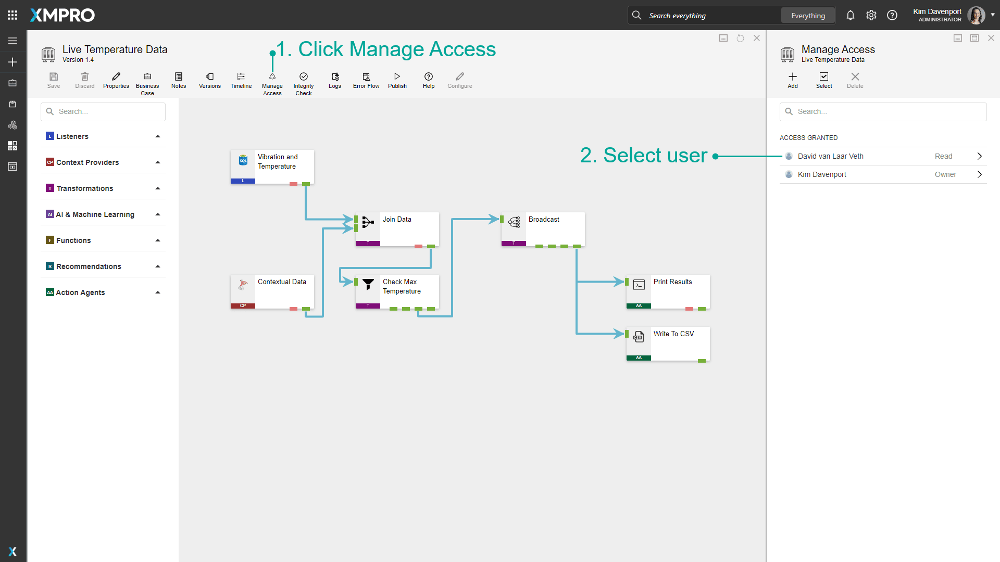
  <figcaption style="text-align: center; color: #666;">Fig 13: Changing Access to a Data Stream</figcaption>
</figure>

1. Change their permissions.\
2. Or, delete permissions for the user.

<figure style="text-align: center;">
  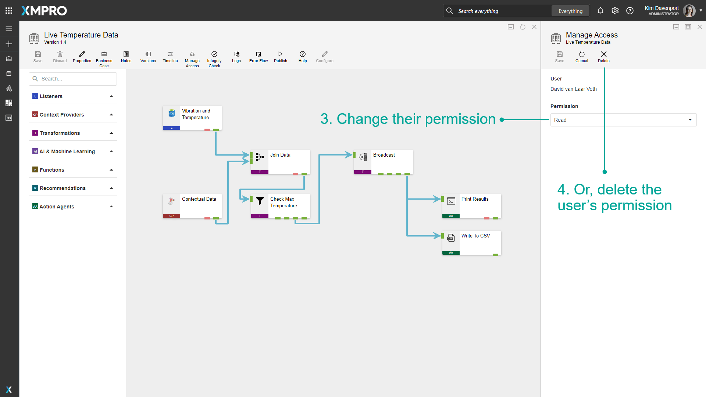
  <figcaption style="text-align: center; color: #666;">Fig 14: Changing or deleting permission to a Data Stream</figcaption>
</figure>

## Removing Access to a Data Stream

To remove the permissions for multiple users, follow the steps below:

1. Click _Manage Access_.
2. Click _Select_.
3. Select multiple users.
4. Click _Delete_.

<figure style="text-align: center;">
  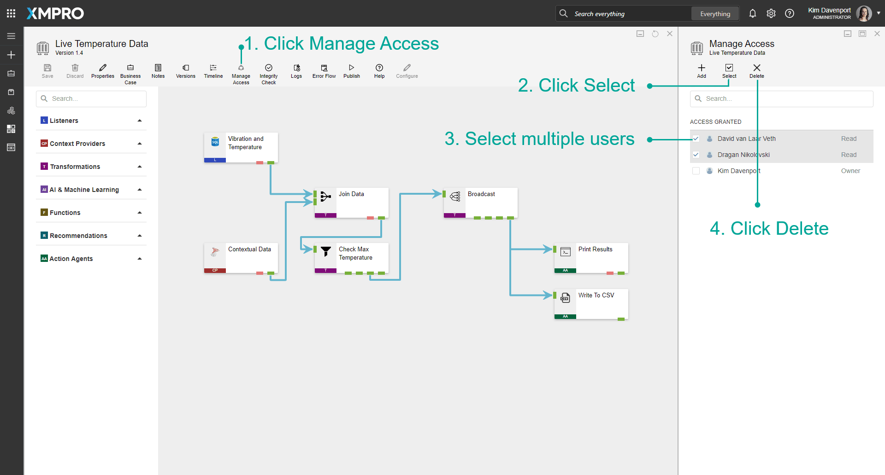
  <figcaption style="text-align: center; color: #666;">Fig 15: Removing Access to a Data Stream for multiple users</figcaption>
</figure>

## Cloning a Data Stream

To clone a Data Stream, follow the steps below:

1. From within the Data Stream canvas, click _Properties_.
2. Click _Clone_. This button may not initially be visible on the _Properties_ page but can be found in the menu that appears if you hover with your mouse cursor over the "_More_" button.
3. Specify the name for the cloned Data Stream.
4. Choose a category to copy the Data Steam to. Please note that this should not be the same as the category of the original Data Stream.
5. Click _Save_.

<figure style="text-align: center;">
  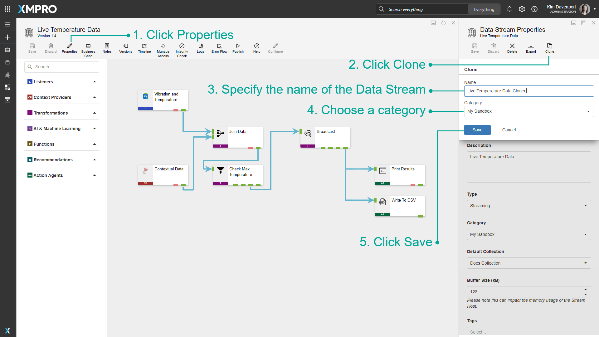
  <figcaption style="text-align: center; color: #666;">Fig 16: Closing a Data Stream</figcaption>
</figure>

<figure style="text-align: center;">
  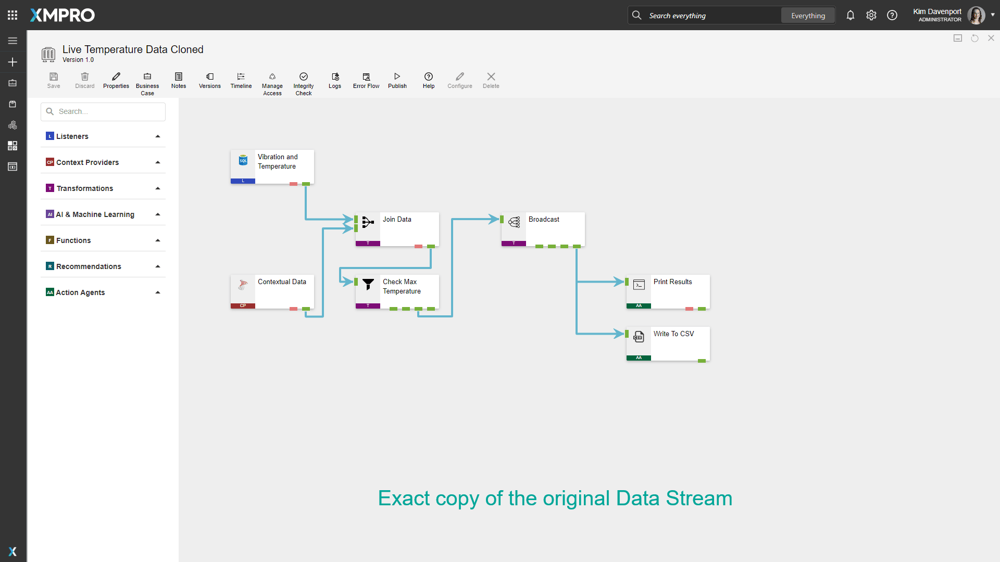
  <figcaption style="text-align: center; color: #666;">Fig 17: The cloned Data Stream</figcaption>
</figure>

## Further Reading

* [How to Manage Recurrent Data Streams](manage-recurrent-data-streams.md)
* [How to Use Business Cases and Notes](use-business-case-and-notes.md)
* [How to Run an Integrity Check](run-an-integrity-check.md)
* [How to Manage Live View](use-live-view.md)
* [How to Troubleshoot a Data Stream](troubleshoot-a-data-stream.md)
* [How to Upgrade a Stream Object Version](upgrade-a-stream-object-version.md)
* [How to Setup Input Mappings](setup-input-mappings.md)
* [How to Use Error Endpoints](use-error-endpoints.md)
* [How to Use the Timeline](use-the-timeline.md)
