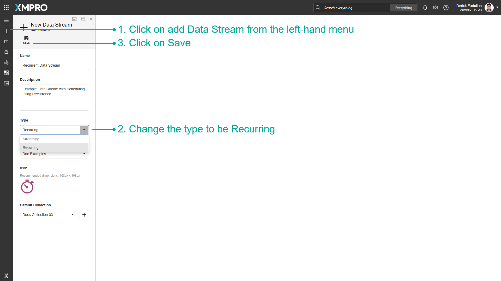
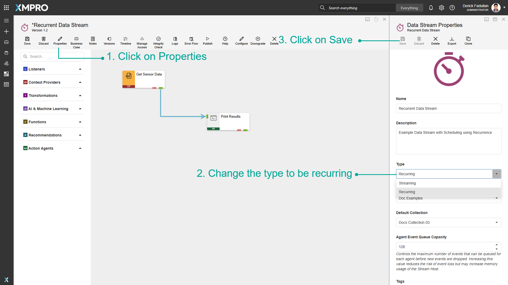
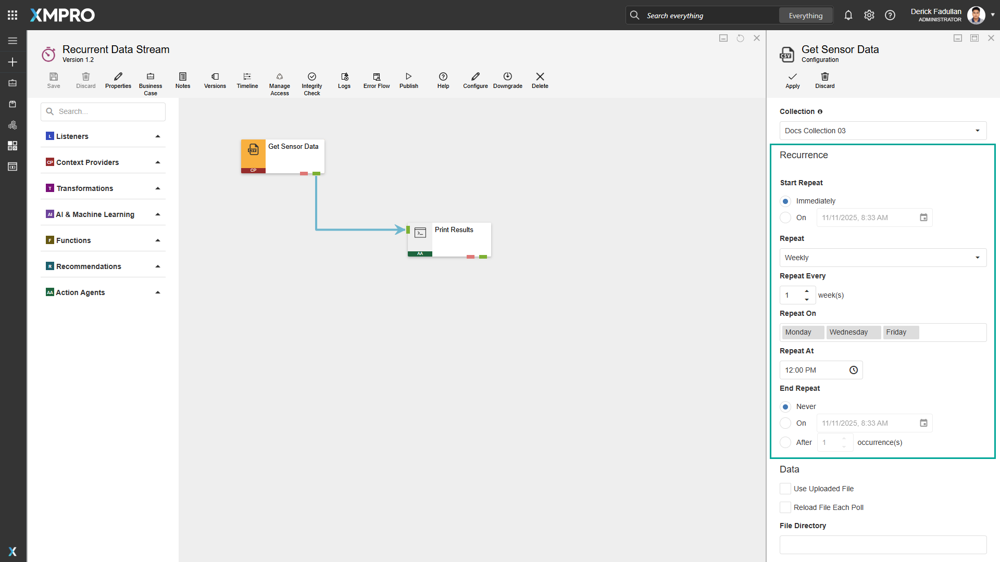

# Manage Recurrent Data Streams

Data Streams of the Streaming type will run polling Agents at a set interval, for instance, every 10 seconds, whereas Recurrent Data Streams run on a customizable schedule, for instance, once a day at 12 AM. This may be useful if you only want to read data or perform an action with the data at certain points during the day, or if you want to perform actions on the data once a week, month or year.

> [!NOTE]
> It is recommended that you read the articles listed below to improve your understanding of Data Streams.
>
> * [Data Stream](../../concepts/data-stream/index.md)
> * [How to Manage Data Streams](manage-data-streams.md)

## Creating Recurrent Data Streams

The streaming type of the Data Stream can be configured at the time of the Data Stream's creation.

1. Click on _add Data Stream_ from the left-hand menu.
2. Change the Type to be Recurring.
3. Click on _Save_.

To change an existing Data Stream to recurring, go into the _properties_ menu and change the type to be recurring.

1. Click on _Properties_.
2. Change the Type to be Recurring.
3. Click on _Save_.

## Configuring Recurrence for Agents

When a Data Stream is set to be recurring, opening the configuration menu for listeners or context providers will allow you to make changes to the schedule for when they occur.

To configure recurrence for Agents, follow the steps below:

1. Add Agents to the Data Stream Canvas.
2. Click on Configure for an Agent. Instead of polling intervals, the configuration menu will ask you to configure recurrence.
3. Configure the schedule for the Agent.

### Recurrence

The following table describes the Recurrence configuration properties:

<table>
<colgroup>
<col style="width: 15%">
<col style="width: 85%">
</colgroup>
<thead>
<tr>
<th>Property</th>
<th>Description</th>
</tr>
</thead>
<tbody>
<tr>
<td><strong>Start Repeat</strong></td>
<td>Specify whether the Agent's schedule should start <strong>Immediately</strong> when the Data Stream is published or <strong>On</strong> a configured date and time.    Note: If the <strong>Start Repeat (On)</strong> is already in the past at the time the Data Stream is published, the Agent waits to execute on the next scheduled <strong>Repeat</strong>.</td>
</tr>
<tr>
<td><strong>Repeat</strong></td>
<td>The schedule's unit of time. The available options are: <strong>Seconds</strong>, <strong>Minutes</strong>, <strong>Hourly</strong>, <strong>Daily</strong>, <strong>Weekly</strong>, <strong>Monthly</strong>, or <strong>Yearly</strong>.</td>
</tr>
<tr>
<td><strong>Repeat Every</strong></td>
<td>How frequently the repeat interval occurs. For example, every 30 seconds, every 2 weeks, etc.</td>
</tr>
<tr>
<td><strong>Repeat On</strong></td>
<td>Specify when the Repeat occurs (applies to <strong>Weekly</strong>, <strong>Monthly</strong>, and <strong>Yearly</strong>): • For <strong>Weekly</strong>, select one or more days of the week (e.g., Monday, Wednesday, Friday). • For <strong>Monthly</strong>, choose the day of the month (1-31). • For <strong>Yearly</strong>, select the month and day.</td>
</tr>
<tr>
<td><strong>Repeat At</strong></td>
<td>The time of day that the Agent executes (applies to <strong>Daily</strong>, <strong>Weekly</strong>, <strong>Monthly</strong>, and <strong>Yearly</strong>).</td>
</tr>
<tr>
<td><strong>End Repeat</strong></td>
<td>Choose for the recurrence to <strong>Never</strong> end, end <strong>On</strong> the specified date, or end <strong>After</strong> the specified number of occurrences.    Note: If the Data Stream is published and the <strong>End Repeat</strong> conditions are already met (the <strong>On</strong> date is in the past, or the <strong>Start Repeat On</strong> date is in the past and calculated occurrences up to the current date have reached the set <strong>After</strong> value), the Agent will not execute.</td>
</tr>
</tbody>
</table>

> [!WARNING]
> **Execution Behavior Examples:**
>
> We always execute first on the configured **Start Repeat**. When **Start Repeat** and the scheduled **Repeat** fall on the same day, the Agent executes at the **Start Repeat** time but skips the **Repeat At** time to avoid duplicate execution on the same day. The regular schedule resumes on the next occurrence on a different day.
>
> **Example 1**: If you configure **Start Repeat On** 15 January at 9:00 AM, **Repeat Daily** at 2:00 PM, and publish the Data Stream on 15 January at 8:00 AM, the Agent executes on 15 January at 9:00 AM, skips the 2:00 PM execution that same day, and then resumes the regular daily schedule at 2:00 PM on 16 January.
>
> **Example 2**: If the **Start Repeat** is on Monday, and the **Repeat** is Weekly on Wednesday and Friday, publishing the Data Stream on a Sunday first executes on Monday, and proceed with the scheduled repeats on Wednesday and Friday.
>
> **Recommendation**: To ensure predictable behavior, set the Start **Repeat On** date and time to match the next scheduled **Repeat** when using Daily or less frequent intervals.
