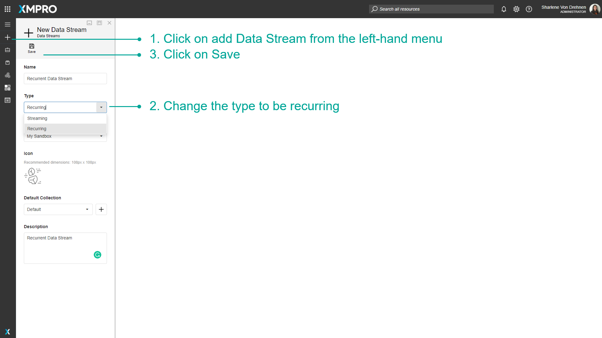
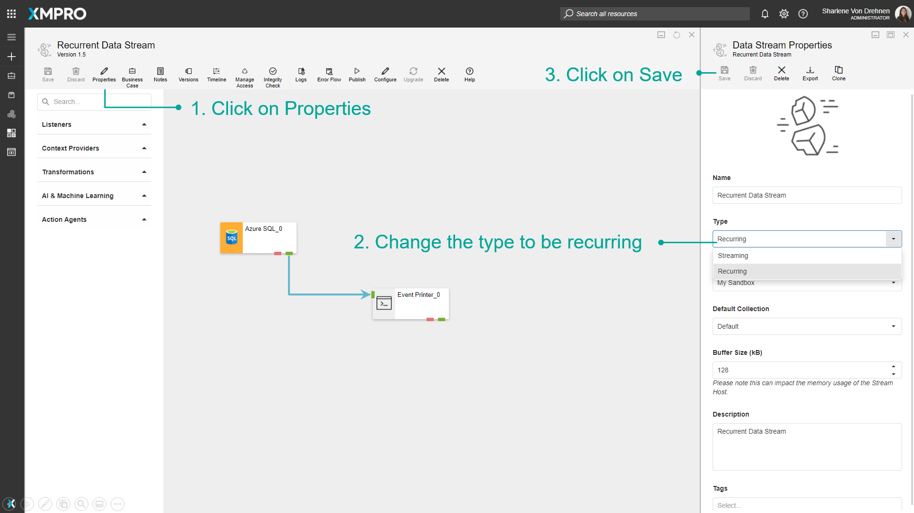
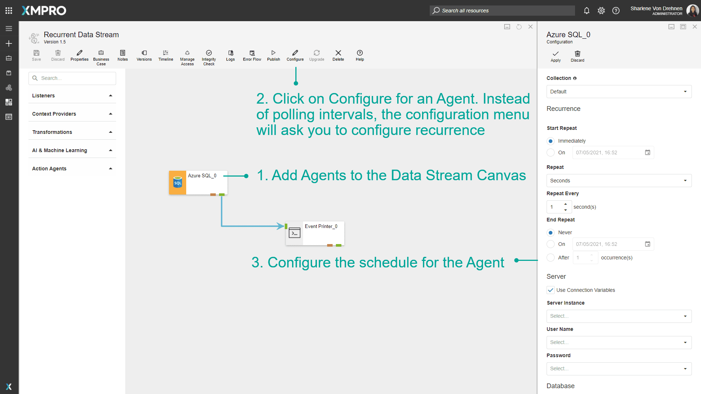
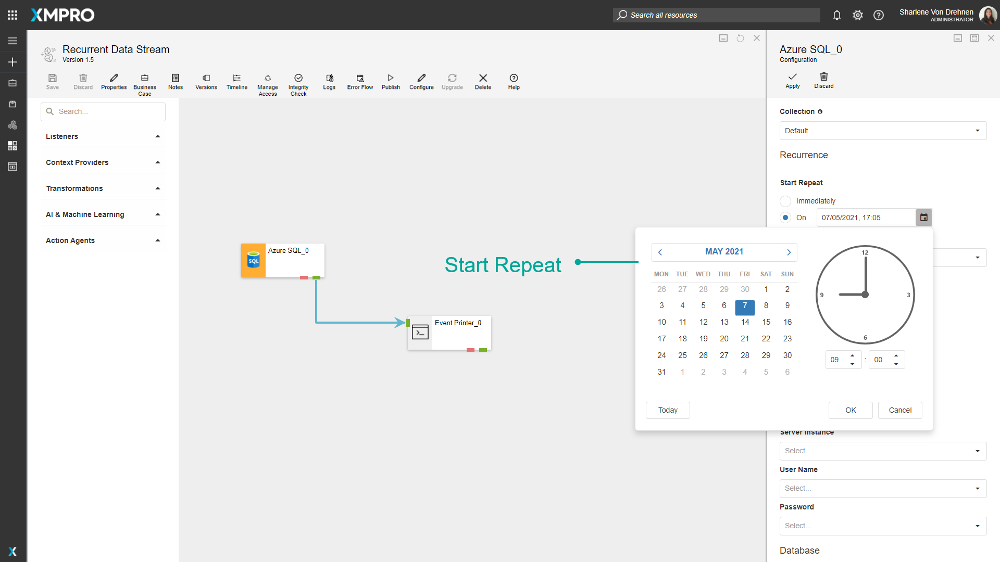
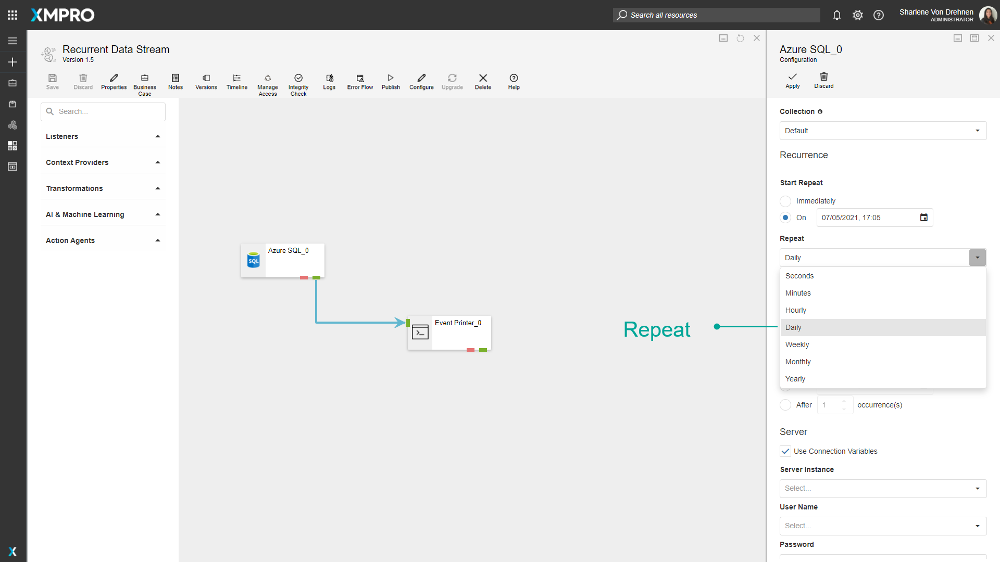
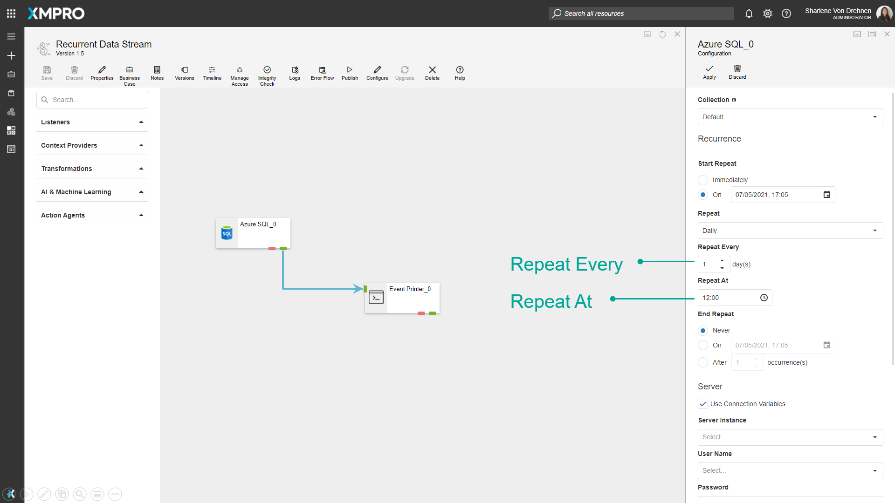
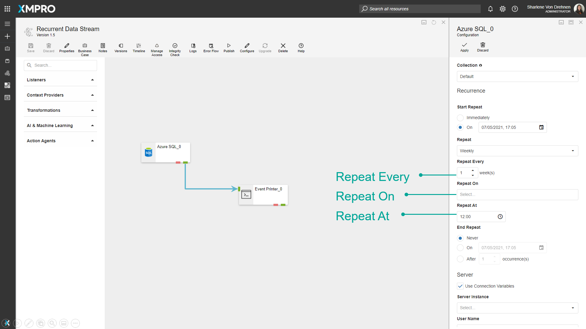
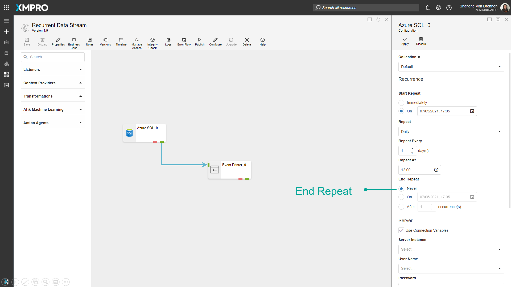

# Manage Recurrent Data Streams

Data Streams of the Streaming type will run polling Agents at a set interval, for instance, every 10 seconds, whereas Recurrent Data Streams run on a customizable schedule, for instance, once a day at 12am. This may be useful if you only want to read data or perform an action with the data at certain points during the day, or if you want to perform actions on the data once a week, month or year.

> [!NOTE]
> It is recommended that you read the article listed below to improve your understanding of Data Streams.
>
> * [Data Stream](../../concepts/data-stream/index.md)
> * [How to Manage Data Streams](manage-data-streams.md)

## Creating Recurrent Data Streams

The streaming type of the Data Stream can be configured at the time of the Data Stream's creation.

1. Click on _add Data Stream_ from the left-hand menu.
2. Change the type to be recurring.
3. Click on _Save_.

To change an existing Data Stream to recurring, go into the _properties_ menu and change the type to be recurring.

1. Click on _Properties_.
2. Change the type to be recurring.
3. Click on _Save_.

## Configuring Recurrence for Agents

When a Data Stream is set to be recurring, opening the configuration menu for listeners or context providers will allow you to make changes to the schedule for when they occur.

To configure recurrence for Agents, follow the steps below:

1. Add Agents to the Data Stream Canvas.
2. Click on Configure for an Agent. Instead of polling intervals, the configuration menu will ask you to configure recurrence.
3. Configure the schedule for the Agent.

_Start Repeat_ - set the time the Agent can start listening for data.

_Repeat_ - How often the action will be repeated. For example, daily.

_Repeat Every, Repeat On_, and _Repeat At_ - How many times it will be repeated. For example, every day, every second day, or on certain weekdays, and at what time.

_End repeat_ - Specifies when to end the recurrence.

