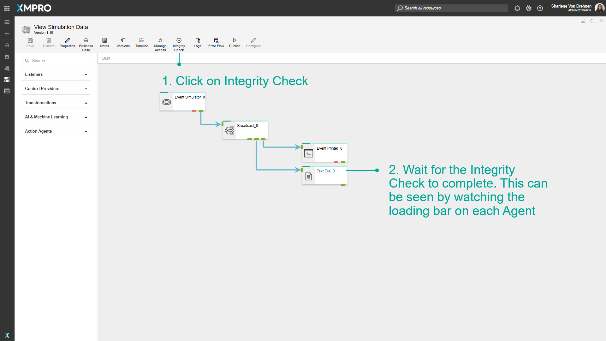
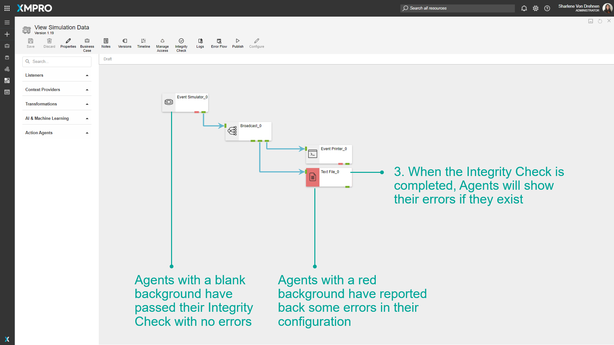
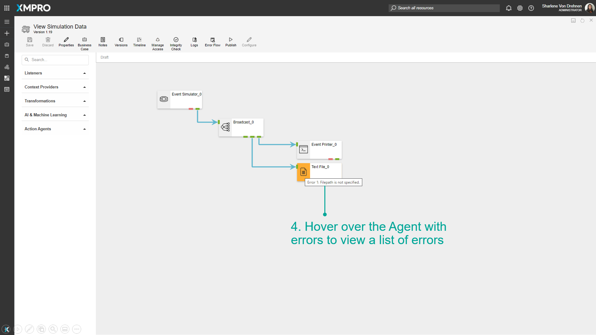
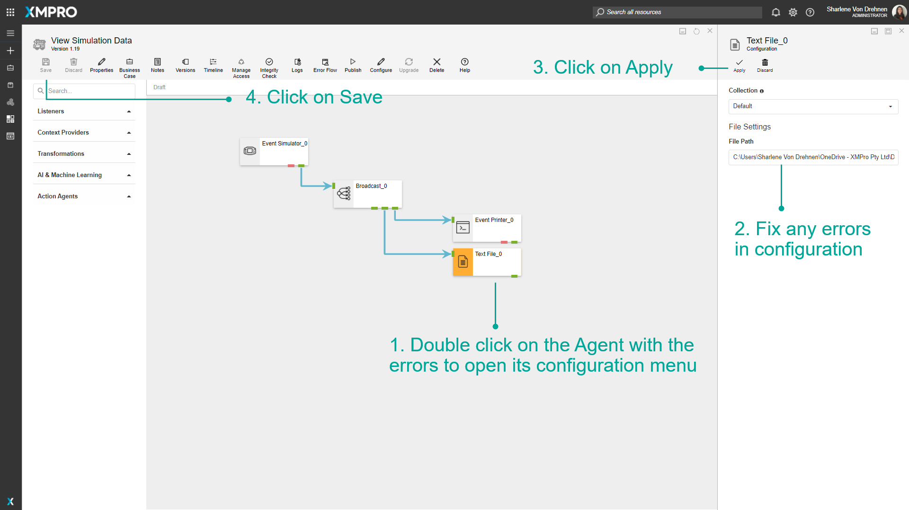
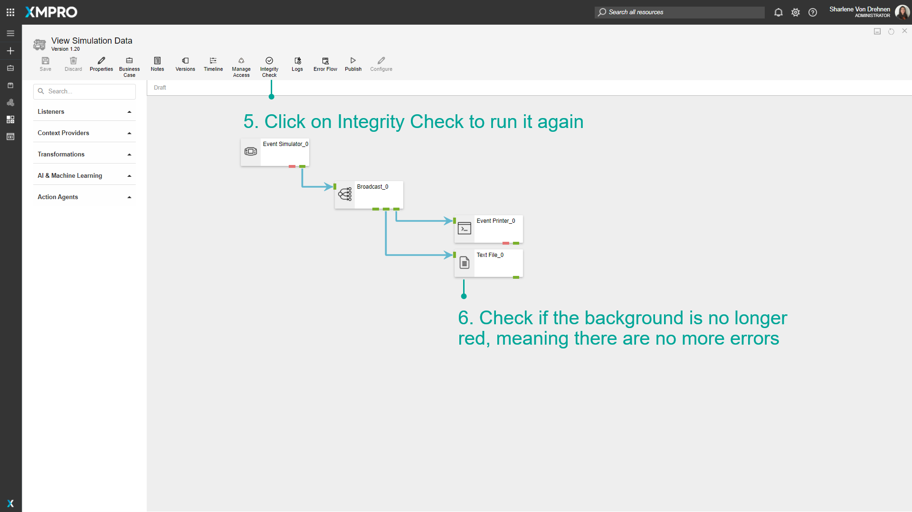

# Run an Integrity Check

When running an Integrity Check on a Data Stream, each Stream Object is checked to verify that it is configured correctly. Errors for the Agent will be displayed if there are any issues found with their configurations. This is done to ensure the integrity of your Data Stream and to make sure all input fields are valid and accurate.

> [!NOTE]
> It is recommended that you read the article listed below to improve your understanding of an Integrity Check.
>
> * [Agent](../../concepts/agent/index.md)
> * [Verifying Stream Integrity](../../concepts/data-stream/verifying-stream-integrity.md)
> * [How to Manage Data Streams](manage-data-streams.md)

## Running an Integrity Check

To run an Integrity Check on a Data Stream, follow the steps below:

1. Click on _Integrity Check_.
2. Wait for the Integrity Check to complete. This can be seen by watching the loading bar on each Agent.
3. When the Integrity Check is completed, Agents will show their errors if they exist.

> [!TIP]
> ✅ **SUCCESS:** Agents with a blank background have passed their Integrity Check with no errors.  
> ❌**ERROR:** Agents with a red background have reported back some errors in their configuration.
  
1. Hover over the Agent with errors to view a list of errors.

> [!NOTE]
> An Integrity Check cannot be run on Agents that have unsaved changes. To run an Integrity Check, discard or save all changes made.

## Fixing Integrity Check errors

The errors are saved to the Stream Object and are not removed until another Integrity Check is performed. Open the configuration panel for the Agents that are showing errors, and fix any errors in the inputted values. In this case, the text file Agent did not have a file path specified.

1. Double click on the Agent with the errors to open its configuration menu.
2. Fix any errors in configuration.
3. Click on Apply.
4. Click on Save.

1. Click on _Integrity Check_ to run it again.
2. Check if the background is no longer red.

