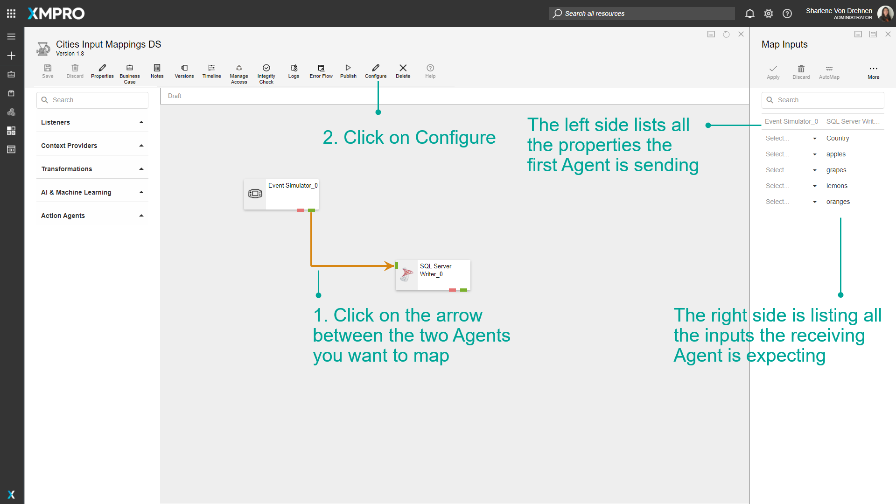
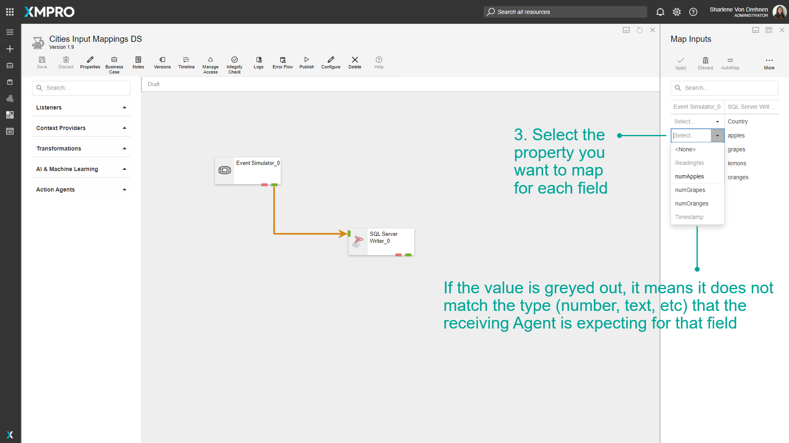
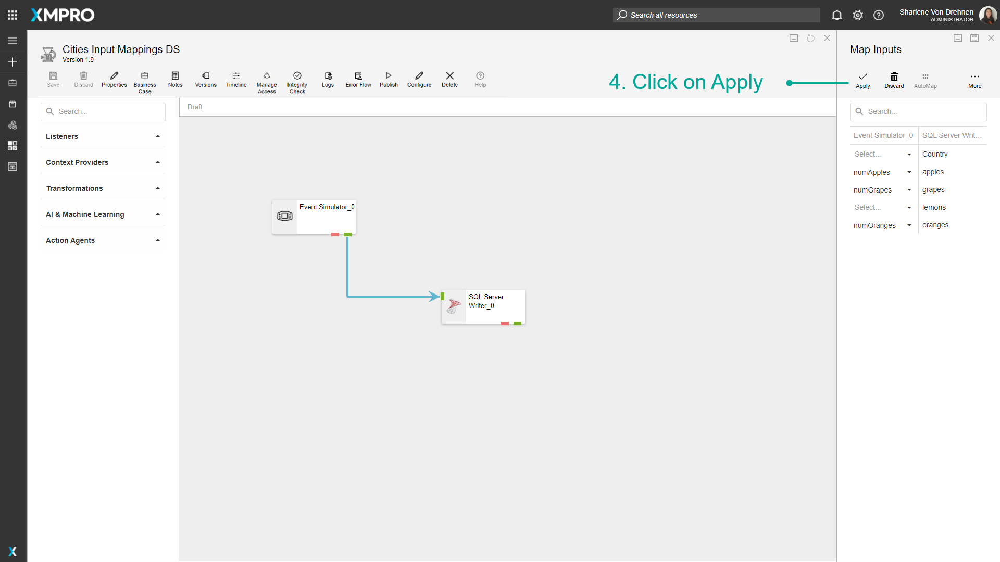
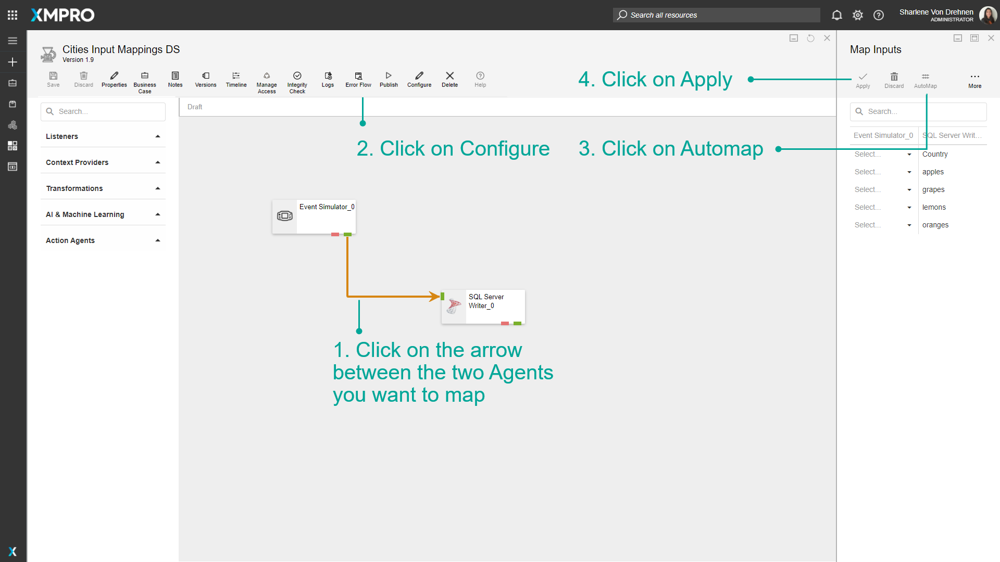
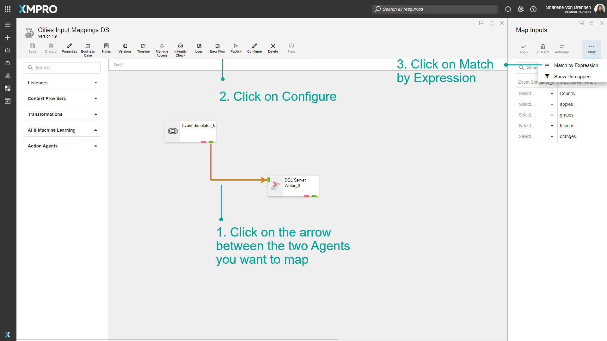
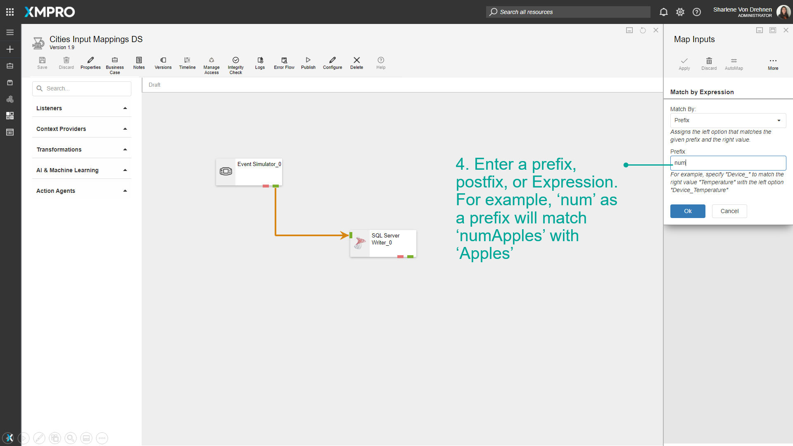
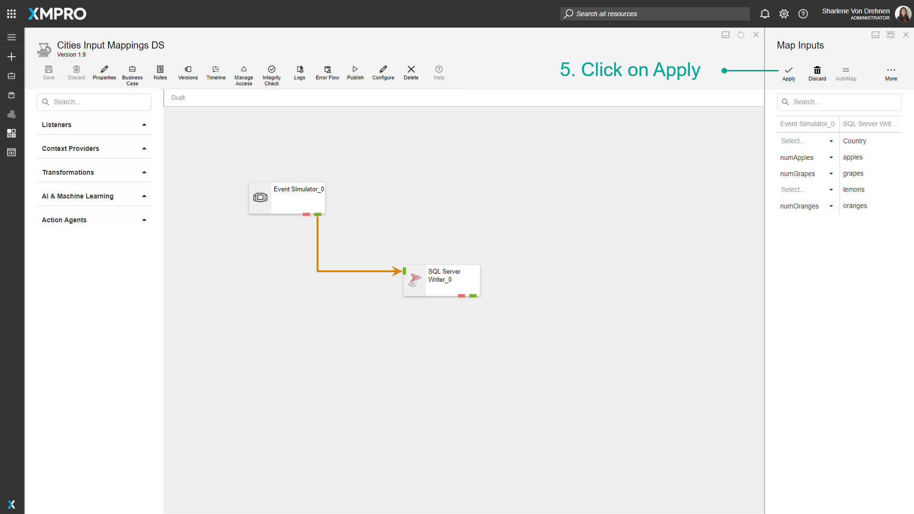
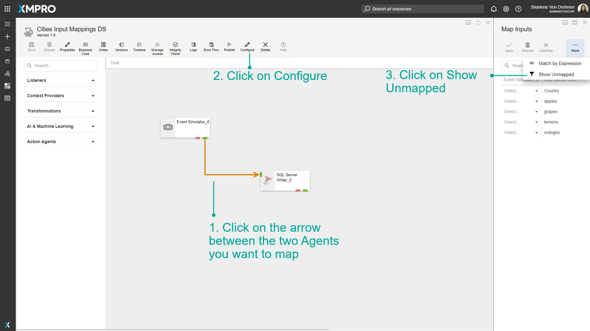
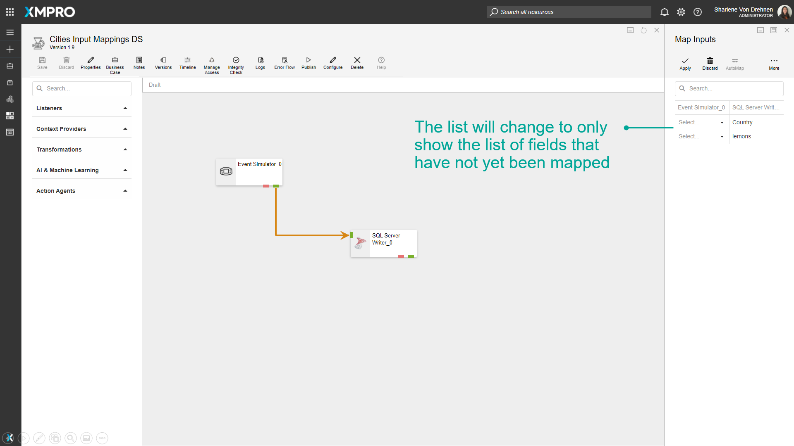

# Setup Input Mappings

Input Mappings allow you to specify that an Agent receives its input in a specific structure. This is possible by configuring the arrows between the two Agents, which allow the user to map the inputs of the Agent to incoming attributes.

This functionality is beneficial if you want to map any incoming data from a preceding Agent to specific attributes that can be saved in rows or columns in a database using an Action Agent, such as an SQL Server Writer.

> [!NOTE]
> It is recommended that you read the article listed below to improve your understanding of Input Mappings.
>
> * [Stream Object Configuration](../../concepts/data-stream/stream-object-configuration.md)
> * [How to Manage Data Streams](manage-data-streams.md)

## Adding Input Mappings

To add Input Mappings between two Agents, follow the steps below:

1. Click on the arrow between the two Agents you want to map.
2. Click on _Configure_. The left side lists all the properties the first Agent is sending. The right side is listing all the inputs the receiving Agent is expecting.
3. Select the property you want to map for each field. If the value is greyed out, it means it does not match the type (number, text, etc) that the receiving Agent is expecting for that field.

1. Click on _Apply_.

## Automap

To map via Automap, follow the steps below:

1. Click on the arrow between the two Agents you want to map.
2. Click on _Configure_.
3. Click on _Automap_.
4. Click on _Apply_.

## Match by Expression

To map via Match by Expression, follow the steps below:

1. Click on the arrow between the two Agents you want to map.
2. Click on _Configure_.
3. Click on _Match by Expression_.
4. Enter a prefix, postfix, or Expression. For example, 'num' as a prefix will match 'numApples' with 'Apples'.

1. Click on _Apply_.

## Show Unmapped

To show Unmapped fields, follow the steps below:

1. Click on the arrow between the two Agents you want to map.
2. Click on _Configure_.
3. Click on _Show Unmapped_.

The list will change to only show the list of fields that have not yet been mapped.

