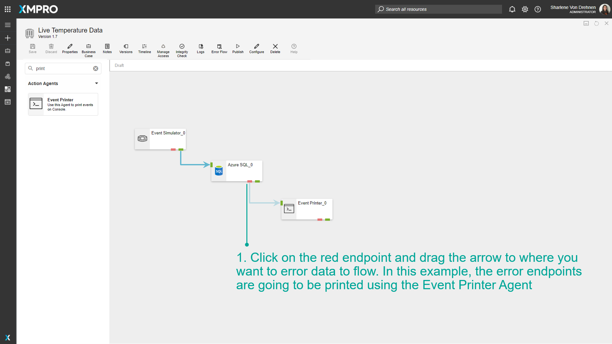
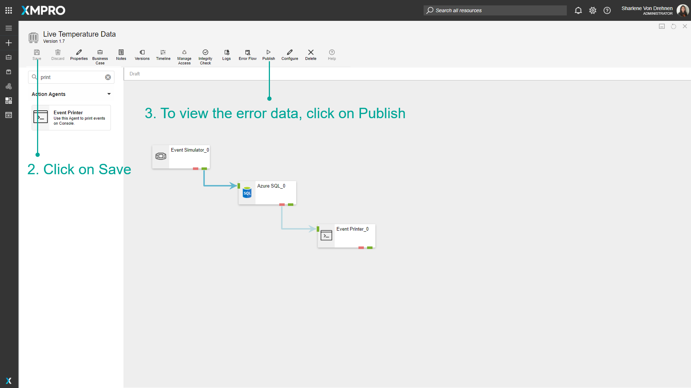
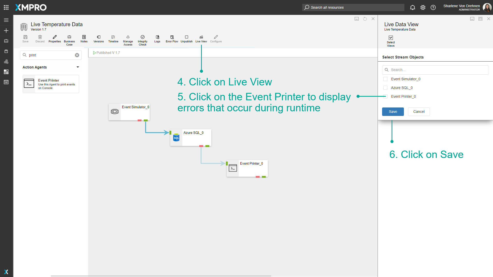
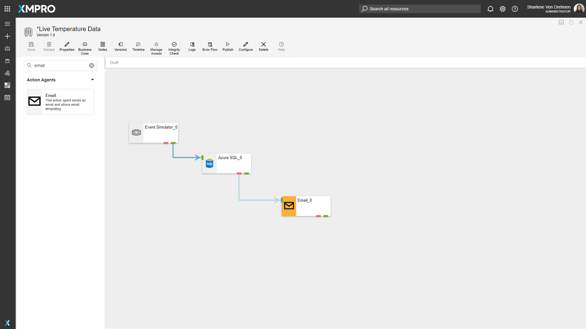
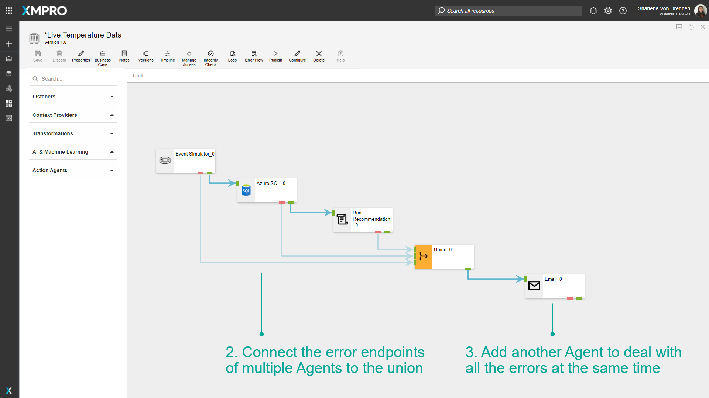

# Use Error Endpoints

When data flows from one Agent to another, a particular Agent may fail to process a certain data point during runtime. When this happens, the data point that failed and the reason why it failed will be passed through the error endpoint instead of going forward to the output endpoint. Each Agent displays its own errors, and therefore this can be a useful tool for debugging particular Agents.

> [!NOTE]
> It is recommended that you read the article listed below to improve your understanding of Agents.
>
> * [Agent](../../concepts/agent/index.md)
> * [How to Manage Data Streams](manage-data-streams.md)

## How to Use Error Endpoints

To use an error endpoint, follow the steps below:

1. Click on the red endpoint and drag the arrow to where you want to error data to flow. In this example, the error endpoints are going to be printed using an _Event Printer_ Agent.
2. Click on _Save_.
3. To view the error data, click on _Publish_.

1. Click on _Live View_.
2. Click on the Event Printer to display errors that occur during runtime.
3. Click on Save.

The data printed for the Error Endpoint includes the AgentID of the Agent that had the error, as well as the timestamp of when the error occurred. The message of the error is also printed. The exact data from the data points are also printed.

Instead of using the Event Printer to print errors, Error Endpoints can also connect to actions that trigger at the time of the error. For example, the following will send an email to a configured email address if an error occurs.

## Handling multiple errors from Error Endpoints

A Union can be used to handle multiple errors at a time. To use the union Agent to do this, follow the steps below:

1. Under the _Transformation Agents_, drag and drop a _Union_ Agent onto the Data Stream.

1. Connect the error endpoints of multiple Agents to the union.
2. Add another Agent to deal with all the errors at the same time.

