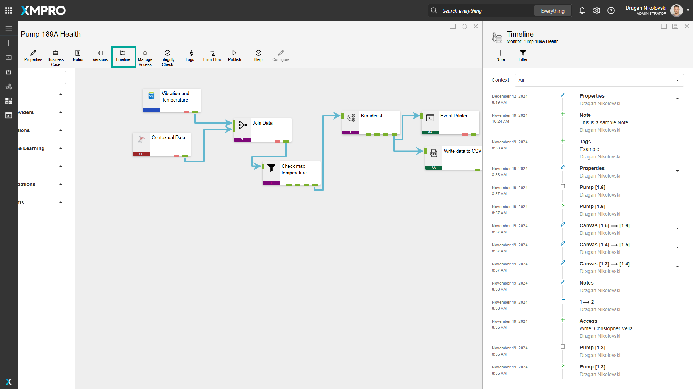
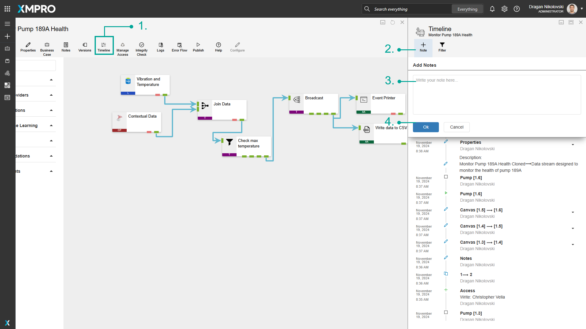
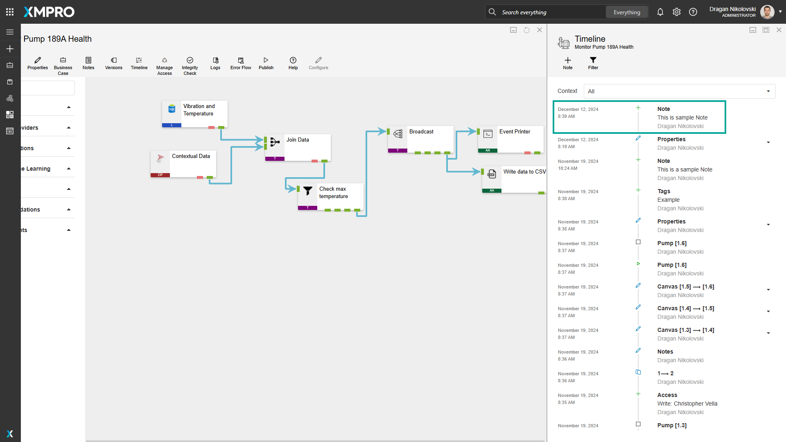
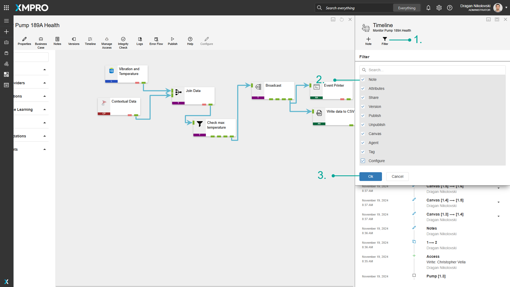
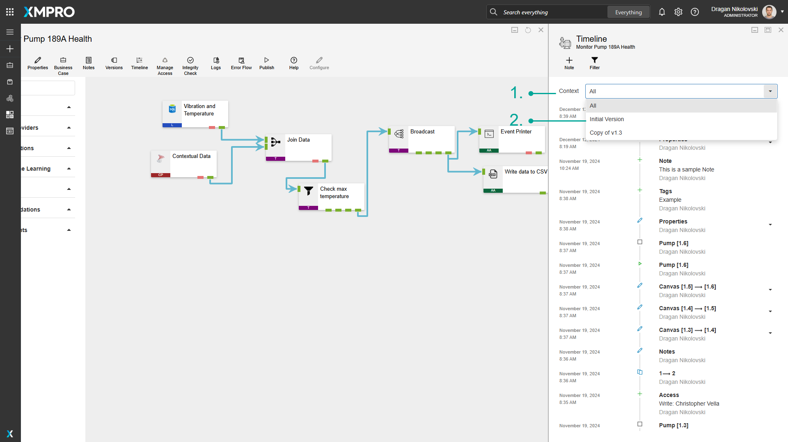

# Use the Timeline

The Timeline displays a record of all the changes users have made to the Data Stream, including any notes made about particular issues. This can therefore be used as a collaboration tool to see the changes users make (even if it's only a single user), as well as notes about things that need to be addressed.

> [!NOTE]
> It is recommended that you read the article listed below to improve your understanding of Timelines.
>
> * [Timeline](../../concepts/data-stream/timeline.md)
> * [How to Manage Data Streams](manage-data-streams.md)

## Viewing the Timeline

To open the Timeline, click "_Timeline_".

## Adding a note

To add Notes to the Timeline, follow the steps below:

1. Click "_Timeline_".
2. Click the "_Note_" button.
3. Type the notes you would like to add.
4. Click "_Ok_".

## Filtering the Timeline

To apply filtering on the Timeline, follow the steps below:

1. Click on _Filter_.
2. Select the type of items you would like to display.
3. Click _OK_.

## Version filtering the Timeline

To apply the version filtering on the Timeline, follow the steps below:

1. Click on the Context dropdown.
2. Select the Version that you would like to see the events.

