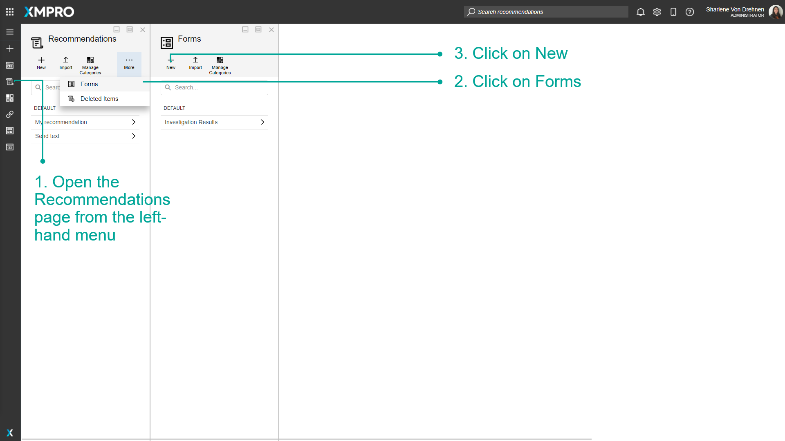
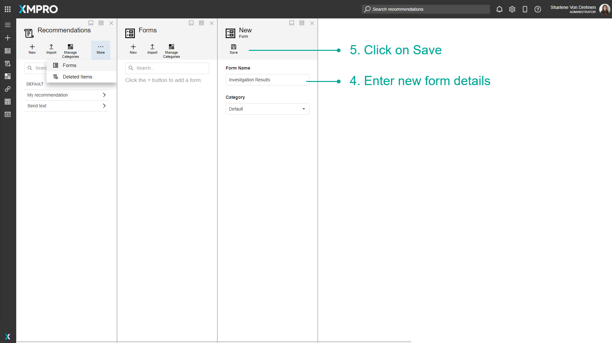
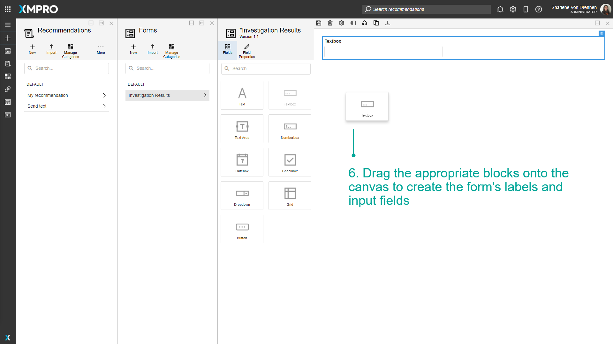
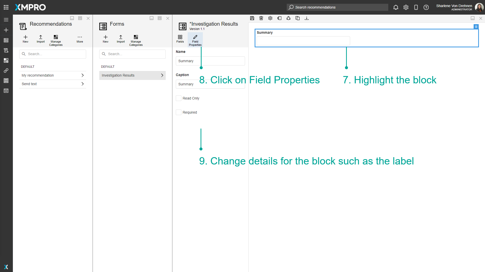
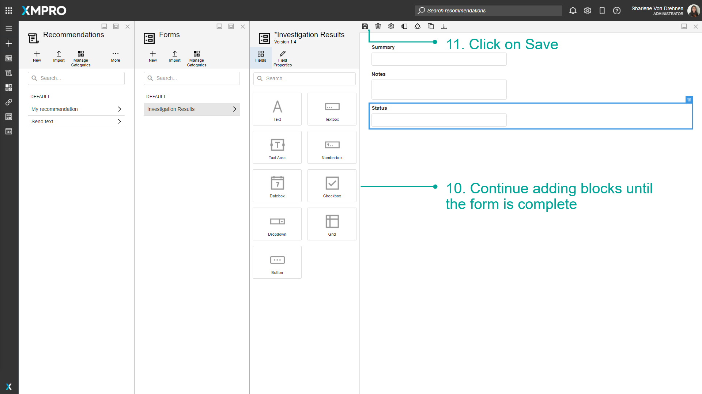
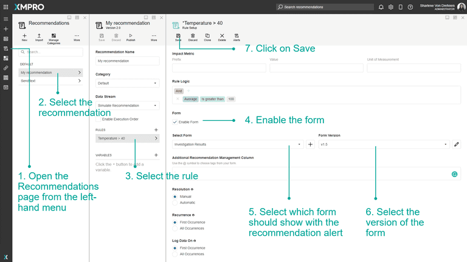
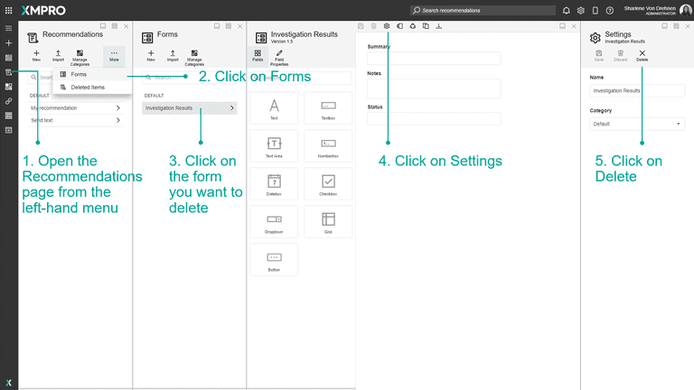
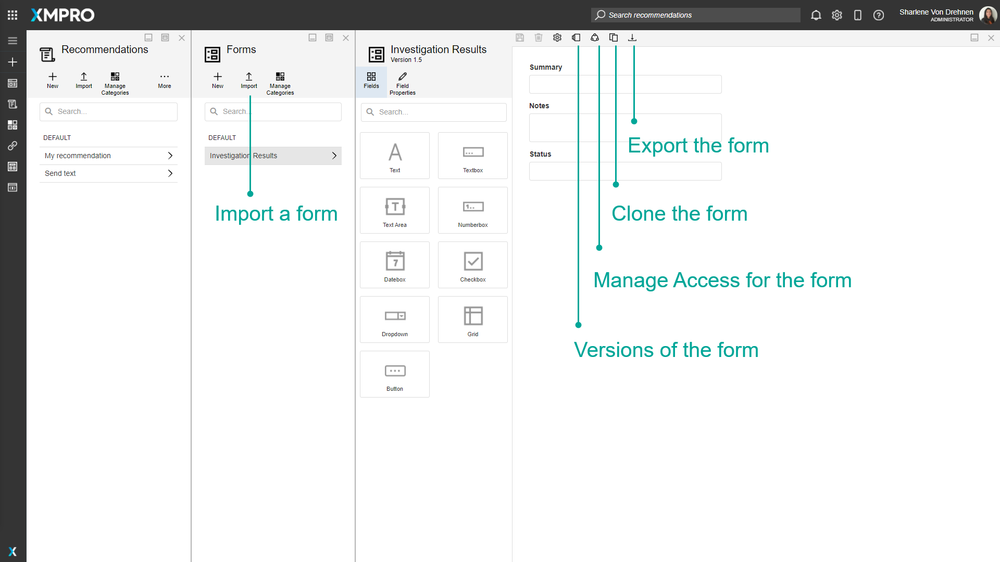

# Manage Forms

A Form is a collection of fields that appear on [Recommendation Alerts](../../concepts/recommendation/recommendation-alert.md). Forms can be created and customized to suit the situation, depending on the Recommendation Alert. Forms are useful if you want relevant information, data, comments, or notes to be entered and changed over the course of resolving an Alert and while it is being actioned.

> [!NOTE]
> It is recommended that you read the articles listed below to improve your understanding of Recommendations.
>
> * [Form](../../concepts/recommendation/form.md)
> * [Manage Recommendations](manage-recommendations.md)

## Creating a Form

To create a Form, follow the steps below:

1. Open the _Recommendations_ page from the left-hand menu.
2. Click on _Forms_.
3. Click on _New_.
4. Enter new Form details.
5. Click on _Save_.
6. Drag the appropriate blocks onto the canvas to create the Form's labels and input fields.
7. Highlight the block.
8. Click on _Field Properties_.
9. Change details for the block such as the label.
10. Continue adding blocks until the Form is complete.
11. Click on _Save_.

Highlighting any of the blocks also gives you the option to delete the block.

Blocks can also be reordered.

## Using the Form with a Recommendation

To get the Form to appear on Recommendation Alerts, add the Form to the applicable rule that will trigger the alert.

1. Open the _Recommendations_ page from the left-hand menu.
2. Select the Recommendation.
3. Select the Rule.
4. Enable the Form.
5. Select which Form should show with the Recommendation Alert.
6. Select the version of the Form.
7. Click on _Save_.

## Deleting the Form

To delete the Form, follow the steps below:

1. Open the _Recommendations_ page from the left-hand menu.
2. Click on _Forms_.
3. Click on the Form you want to delete.
4. Click on _Settings_.
5. Click on _Delete_.

## Actions on the Form

Additional actions on the Form include:

* [Managing versions for the Form](../manage-versions.md)
* [Manage who has access to the Form](../manage-access.md)
* [Import, Export, or Clone a Form](../import-export-and-clone.md)

