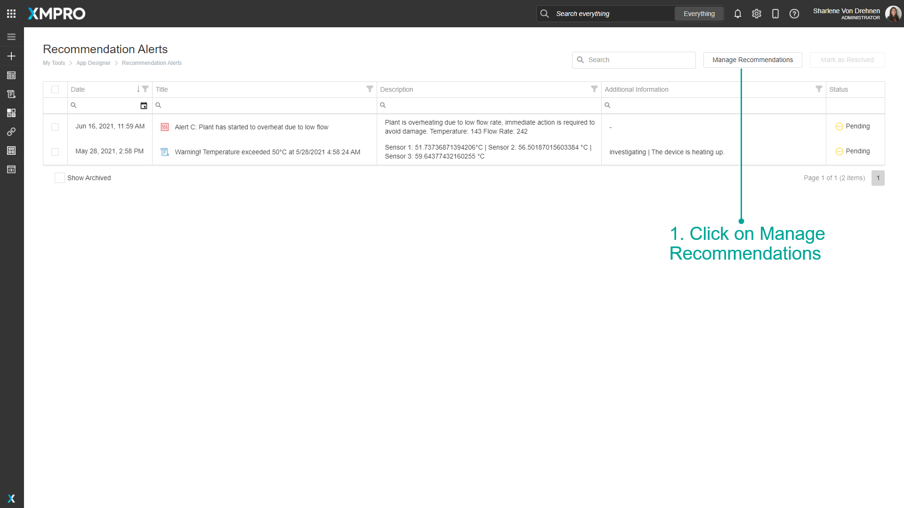
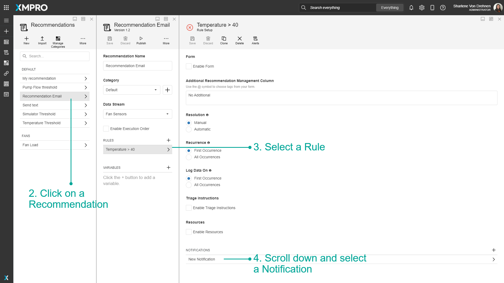
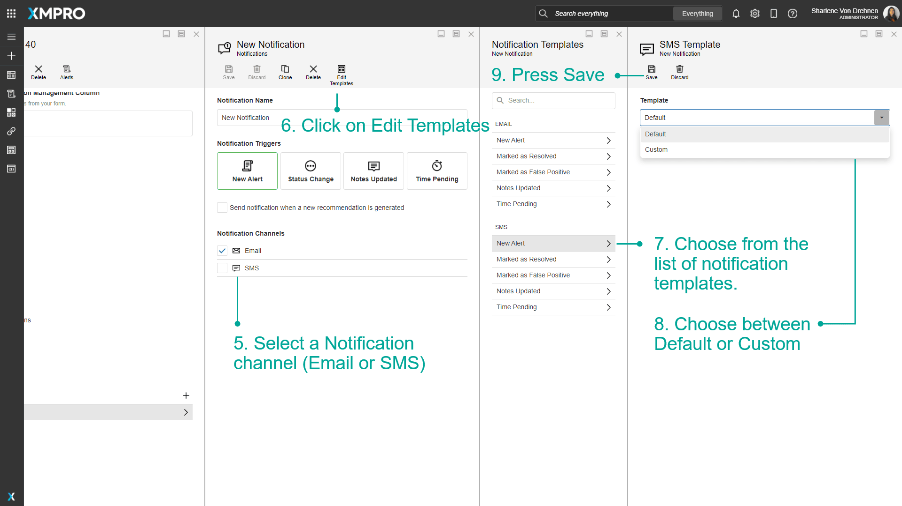
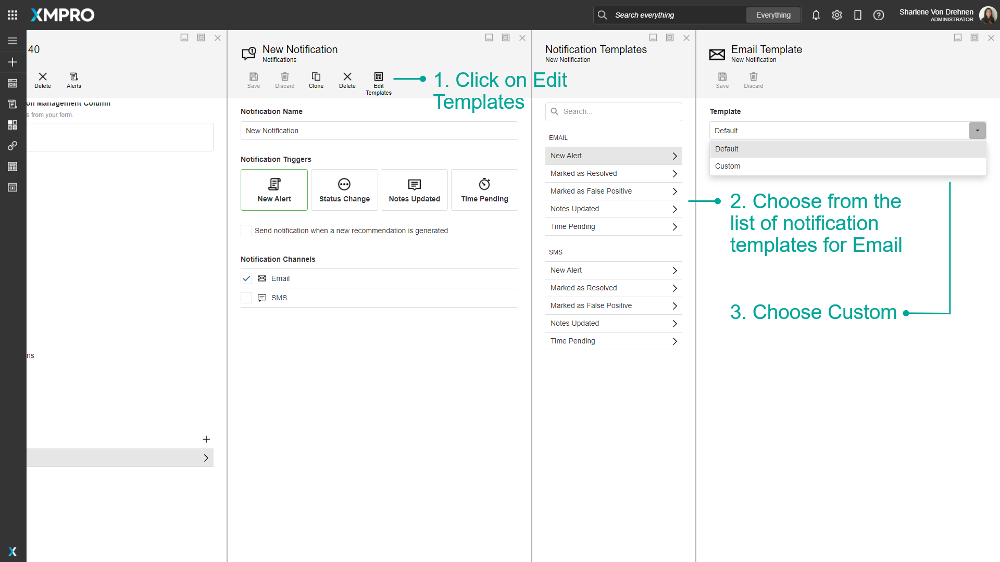
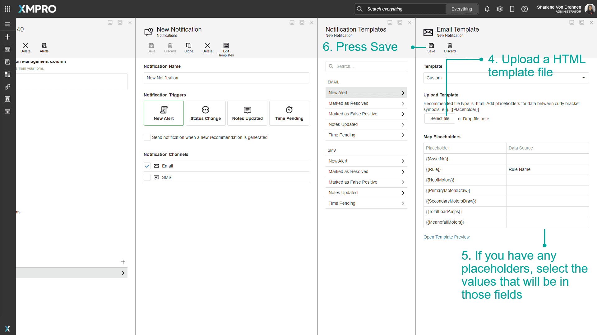
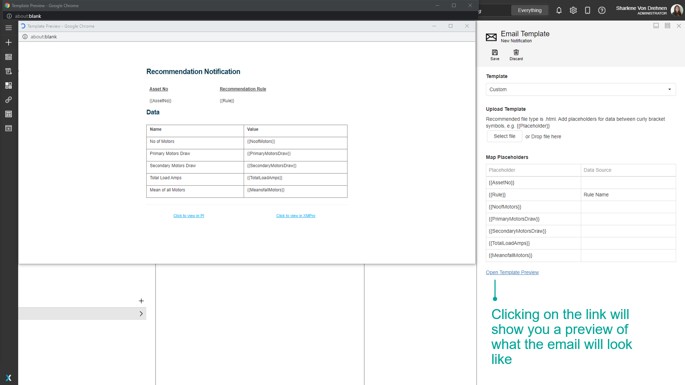
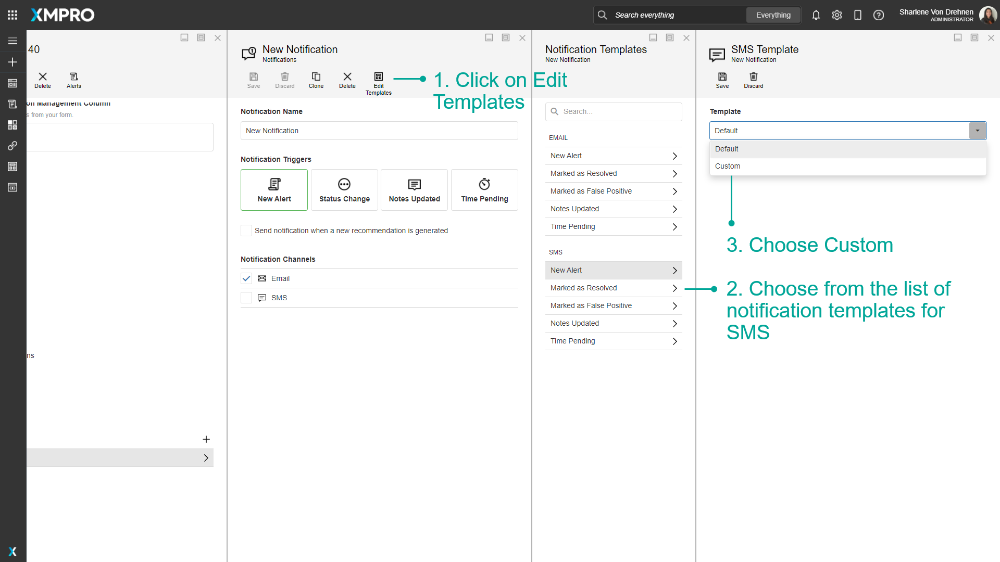
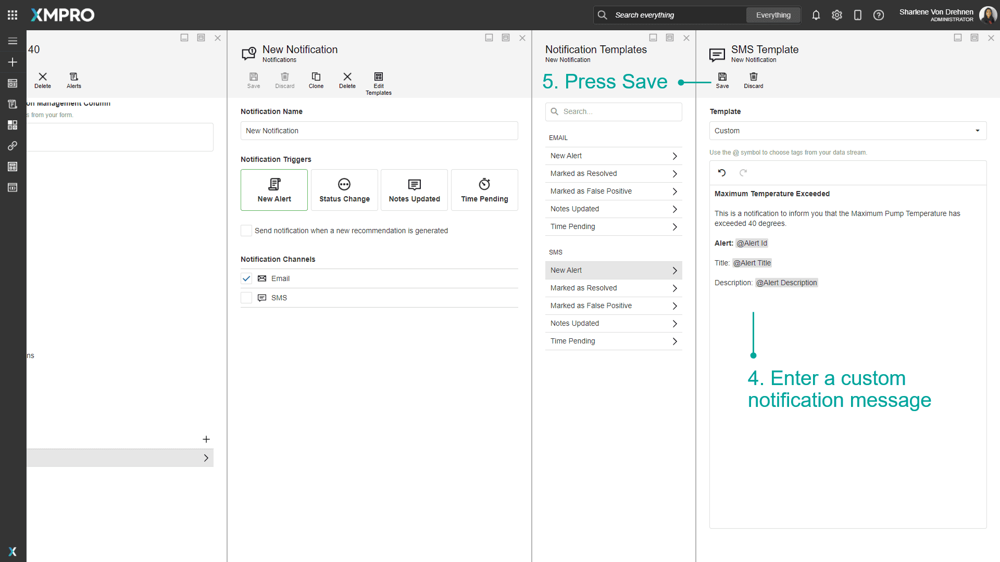
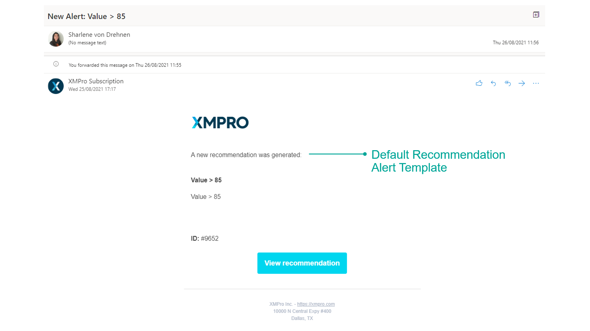
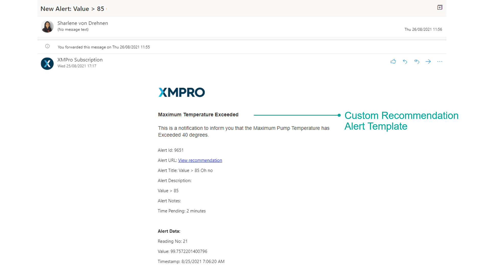

# Manage Notification Templates

When a [Recommendation Alert](../../concepts/recommendation/recommendation-alert.md) is triggered by a critical event, the user can receive a notification via text message or email. The notification contains a message that notifies the user of the Recommendation Alert. You can choose to create a custom message template for when a notification is triggered, or use a default template provided.

> [!NOTE]
> It is recommended that you read the articles listed below to improve your understanding of Recommendations:
>
> * [Notification](../../concepts/recommendation/notification.md)
> * [Manage Notifications](manage-notifications.md)

## Add a Recommendation Notification Template

To change what message template is used when users are notified to a Recommendation Alert, follow the steps below:

1. Click on Manage Recommendations.

 2\. Click on a Recommendation.\
 3\. Select a Rule.\
 4\. Scroll down and select a Notification.

 5\. Select a Notification channel (Email or SMS).\
 6\. Click on Edit Templates.\
 7\. Choose from the list of notification templates.\
 8\. Choose between Default or Custom.\
 9\. Press Save.

## Add Custom HTML Templates for Email

By default, each notification template is set to 'default'. You can add a custom email template instead that includes different styling. The HTML file can also include placeholders for certain data that you would like to show on the notification.

Here is an example of an HTML Template file:

[Download Recommendation Notification Template](../../files/recommendation-notification-template.zip)

To upload a custom email template, follow the steps below:

 1\. Click on Edit Templates on any selected notification.\
 2\. Choose from the list of notification templates for Email.\
 3\. Choose Custom.

 4\. Upload an HTML template file. \
 5\. If you have any custom placeholders, select the values that will be in those fields.\
 6\. Press Save.

> [!NOTE]
> Add capitalized placeholders for data within the HTML file between curly bracket symbols. For example, \{{ALERTID\}}.

> [!NOTE]
> This list of predefined placeholders can be used in the template without mapping:
>
> * ALERTID
> * HREF
> * TITLE
> * DESCRIPTION
> * NOTE
> * PENDINGTIME
> * RULENAME
> * RECNAME (Recommendation Name)

Click the link to see a preview of the email.

## Custom Templates for SMS

By default, each notification template is set to 'default'. To use a custom SMS template instead, follow the steps below:

 1\. Click on Edit Templates on any selected notification.\
 2\. Choose from the list of notification templates for SMS.\
 3\. Choose Custom.\
 4\. Enter a custom notification message.\
 5\. Press Save.

> [!NOTE]
> Use the '@' symbol to choose tags from your Data Stream.

## Examples

### Default Template Example

If ‘Default’ is selected, a default notification message will be sent to your email address or mobile. This is an example of an email notification using a Default Template:

### Custom Template Example

This is an example of an email notification using a Custom Template:

