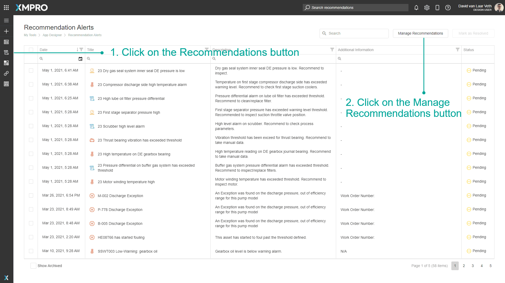
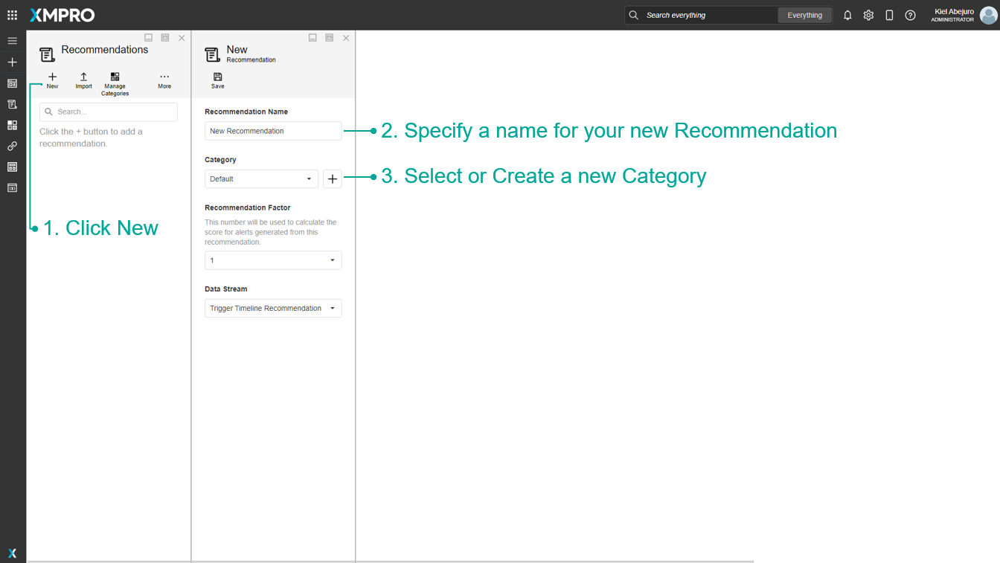
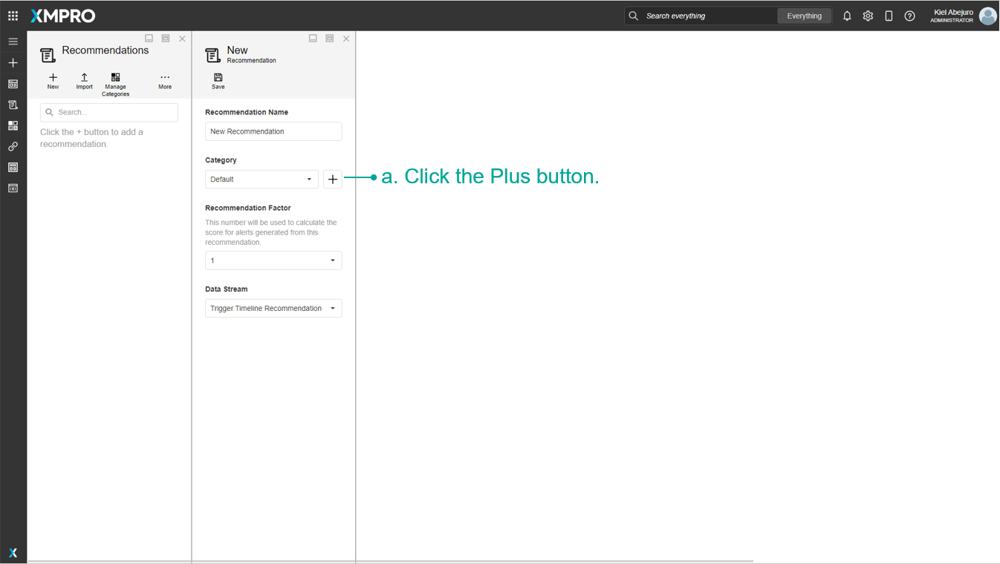
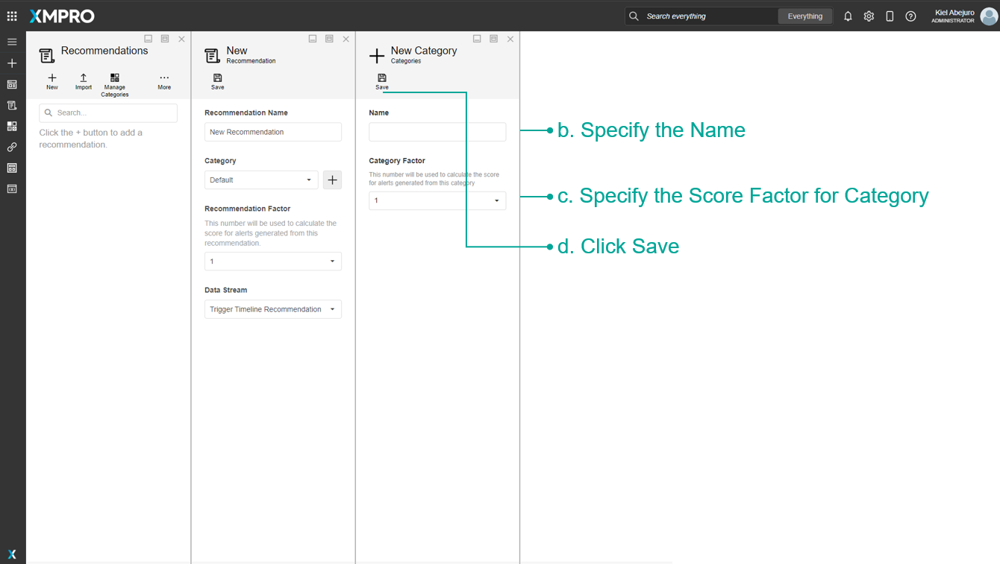
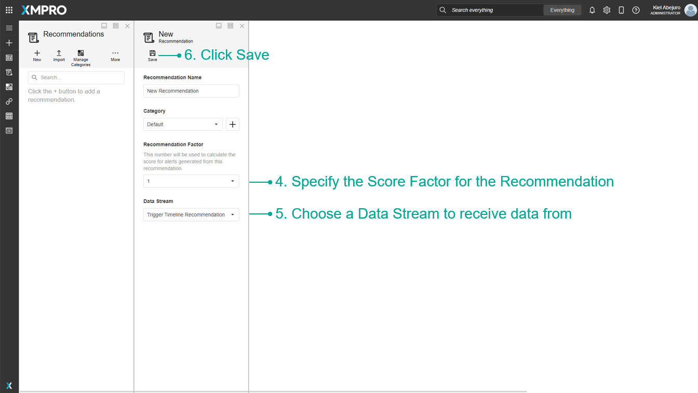
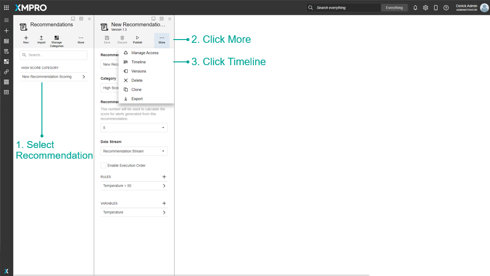
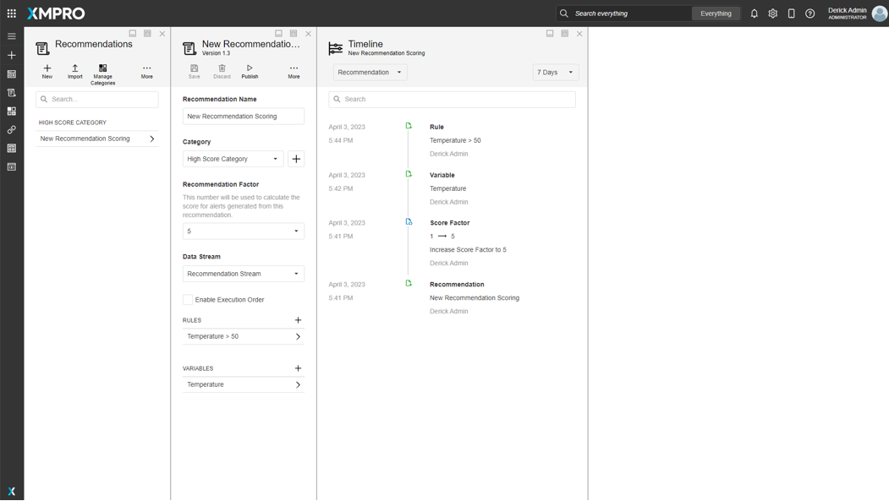
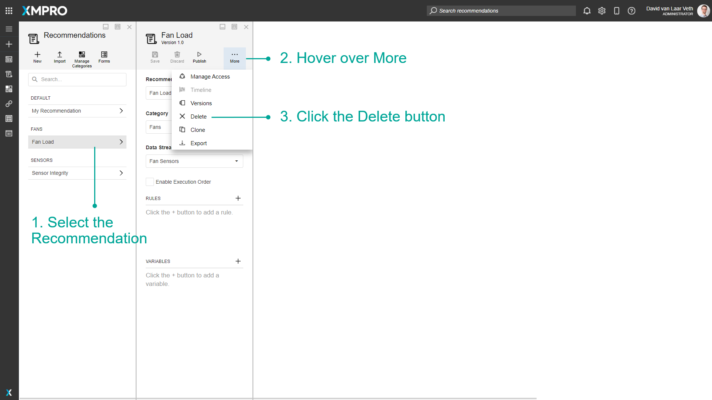
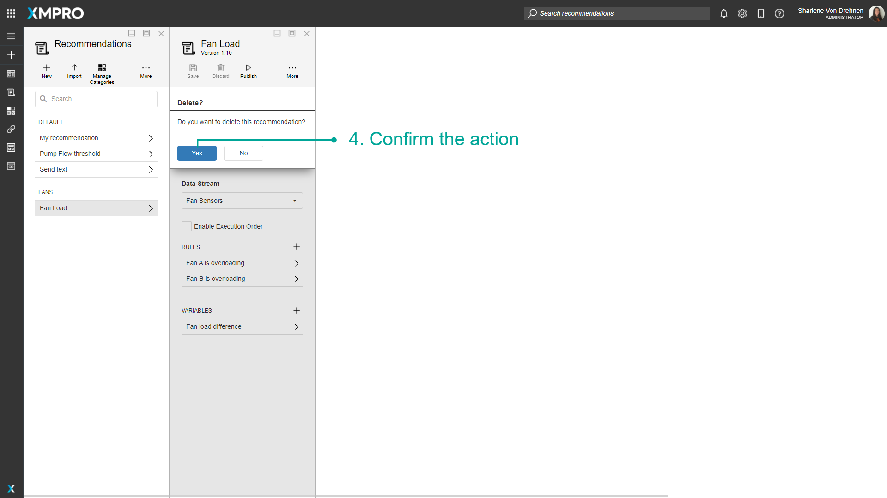

# Manage Recommendations

If a Run Recommendation Agent is added to a [Data Stream](../../concepts/data-stream/index.md), the Recommendation will read the live data in real-time and compare it to the conditions and [Rules](../../concepts/recommendation/rule.md) configured. If any data falls into a Rule's condition then a [Recommendation Alert](../../concepts/recommendation/recommendation-alert.md) is created. A Recommendation Alert notifies specific users of pending issues or dangers associated with the data and allows them to act upon them.

> [!NOTE]
> It is recommended that you read the article listed below to improve your understanding of Recommendations.
>
> * [Recommendation](../../concepts/recommendation/index.md)

## Manage Recommendations

To access the Recommendation management page, follow the steps below:

1. In the App Designer, click the _Recommendations_ button in the left-hand menu.
2. Click the _Manage Recommendations_ button.

> [!NOTE]
> If you do not have the right to view Recommendation Alerts, the Recommendation Alerts grid will not be shown and the second step can be skipped.

## Create a Recommendation

To create a new Recommendation, follow the steps below after navigating to the Recommendation management page:

1. Click _New_.
2. Specify a name for your new Recommendation.
3. Select or create a new Category.

a. Click the Plus button.

b. Specify the Name.

c. Specify the Score Factor for Category

c. Click Save.

1. Specify the Score Factor for the Recommendation

2. Choose a Data Stream to receive data from

3. Click Save

> [!NOTE]
> A Recommendation needs Rules. [See the Manage Rules article to find out how to create a Rule](create-rules.md#create-rules).

## View Recommendation Timeline

The Timeline shows the changes that occur when details in the recommendation is being edited. Follow the steps below to view the timeline:

1. Select Recommendation
2. Click More
3. Click Timeline

## Delete a Recommendation

To delete an existing Recommendation, follow the steps below:

1. Select the Recommendation.
2. Hover over More.
3. Click the Delete button.

1. Confirm the action.

> [!NOTE]
> Deleting a Recommendation will not permanently delete it or any Recommendation Alerts generated by it. Deletion can be undone or made permanent from [Deleted Items](../../concepts/recommendation/deleted-items.md).

## Further Reading

* [How to Manage Rules](create-rules.md)
* [How to Manage Categories](manage-categories.md)
* [How to Subscribe to Notifications](subscribe-to-notifications.md)
* [How to Manage Forms](manage-forms.md)
* [How to Manage Variables](manage-variables.md)
* [How to Manage Alerts](manage-alerts.md)
* [How to Manage Alerts on Mobile](manage-alerts-on-mobile.md)
* [How to Manage Deleted Recommendation Items](manage-deleted-recommendation-items.md)
