# SSO - ADFS

In this article, we will look at how to set up AD FS so that it can be used as an external identity provider for Subscription Manager, allowing single sign-on capability between AD FS and Subscription Manager.

Follow the steps below:

## IIS

1. Navigate to the location in IIS where Subscription Manager was installed.

> [!NOTE]
> You can right-click on the application name in IIS and choose "_Explore_".

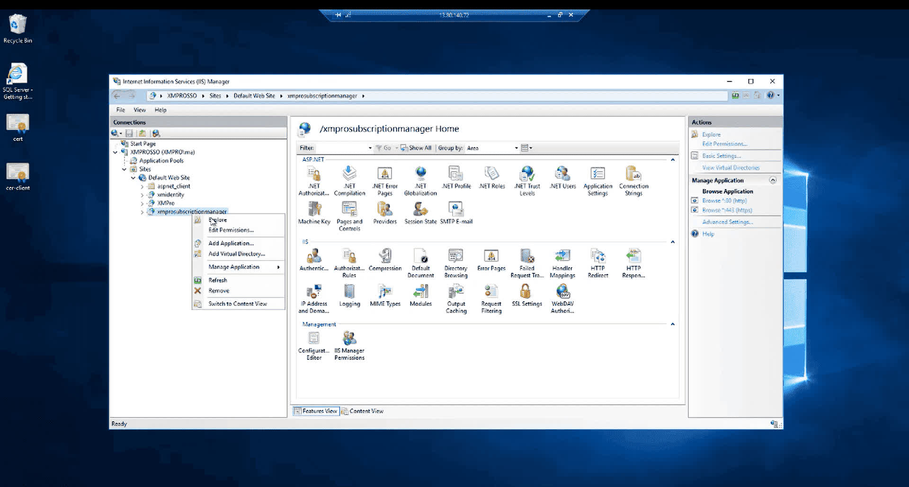

1. Open the _web.config_ file.

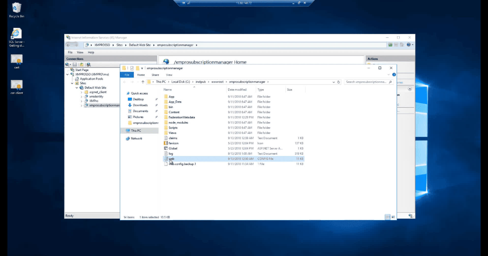

1. Scroll down to the "_xmpro_" section.

> [!NOTE]
> It might be encrypted, which will require you to decrypt it first. For instructions, please refer to the [How to encrypt and decrypt a web.config file](https://docs.xmpro.com/knowledge-base-2/how-to-encrypt-and-decrypt-a-web-config-file/) Knowledge Base article.

1. Under the "_identityProviders_" element, add a new element called "_adfs_".

2. Specify the metadata address of your AD FS, as per the image below:

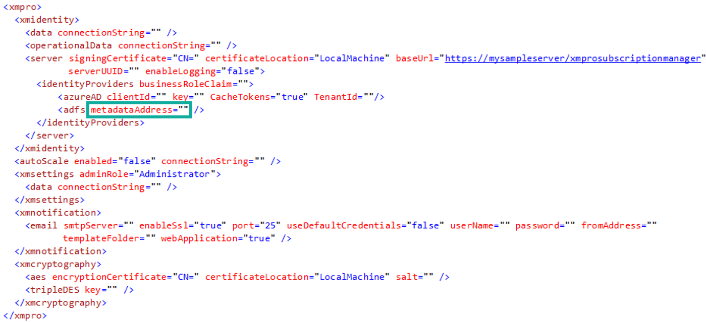

> [!NOTE]
> Set the correct URL for the metadataAddress value. An example of how the URL might look is "_<https://adfs.domain.com/federationmetadata/2007-06/federationmetadata.xml>_".
>
> Verify your URL by browsing to it in a browser.

1. Copy the "_baseUrl_" value in the web.config - you will need it later in this guide.

> [!WARNING]
> You will use this value to create a relying party trust between the Subscription Manager application and AD FS

## Server Manager

1. Log on to your AD FS server and go to Tools –> AD FS Management

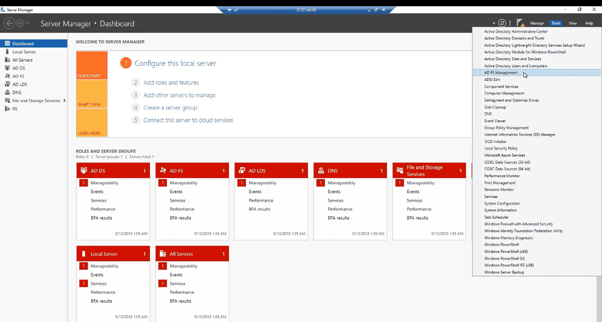

### Relying Party Trust

1. Click _Add Relying Party Trust_

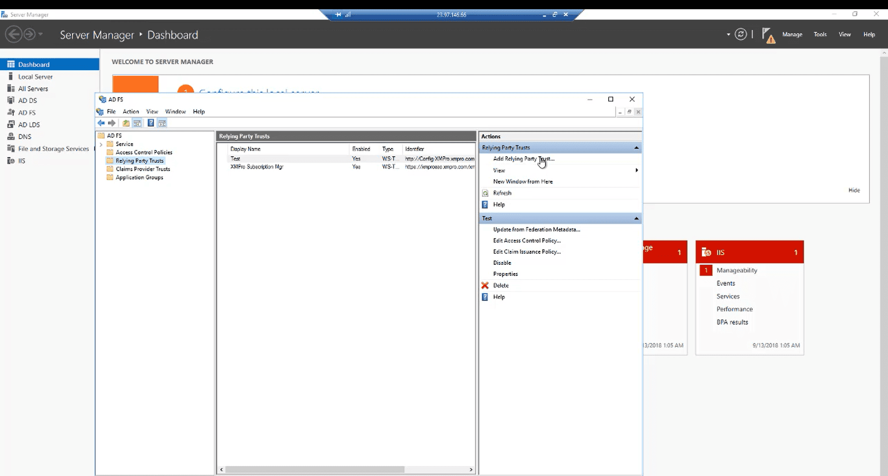

1. Select _Claims aware_ and click Start

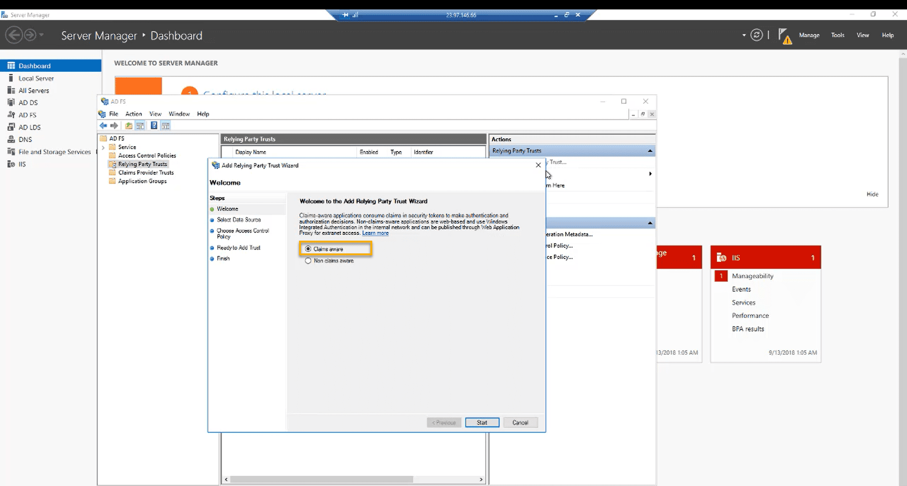

1. Select _Enter data about the relying party manually_ and click Next

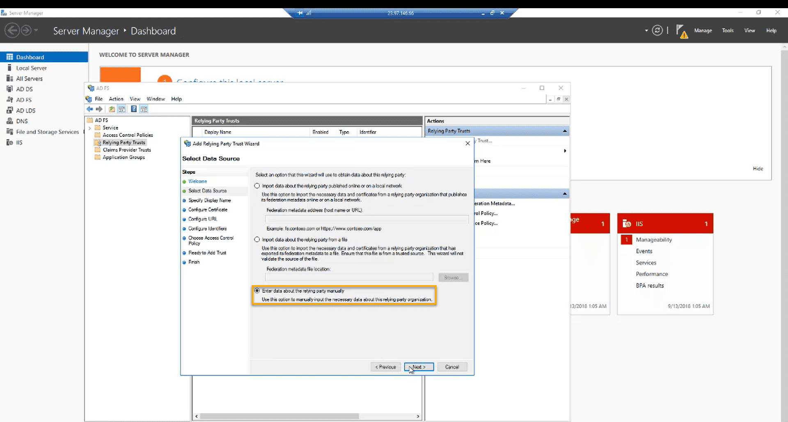

1. Choose a display name and click Next and Next again

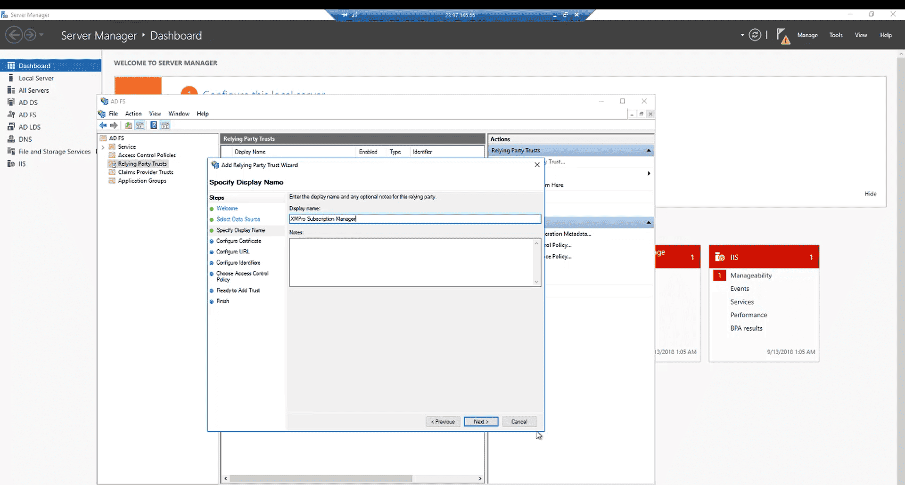

1. Select _Enable support for the WS-Federation Passive protocol_, add the URL and click Next

> [!NOTE]
> This is the base URL you copied from the web.config file.

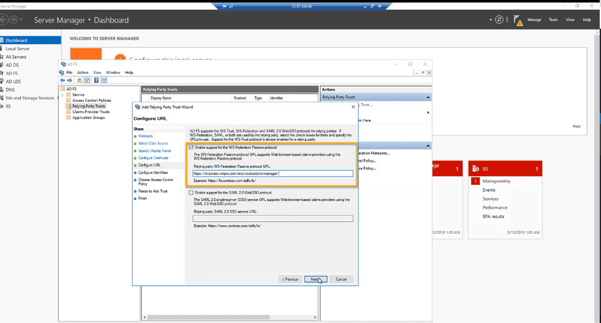

1. Add the identifier for the application. Use the URL for Subscription Manager

2. Add the URL and click Next

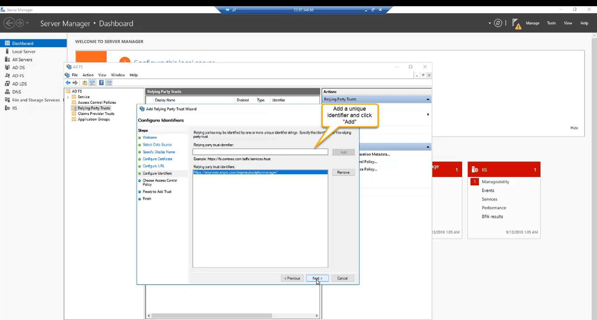

1. Choose an access control policy and click Next. Continue to the last screen

> [!NOTE]
> For this article, we are going to choose _Permit everyone_

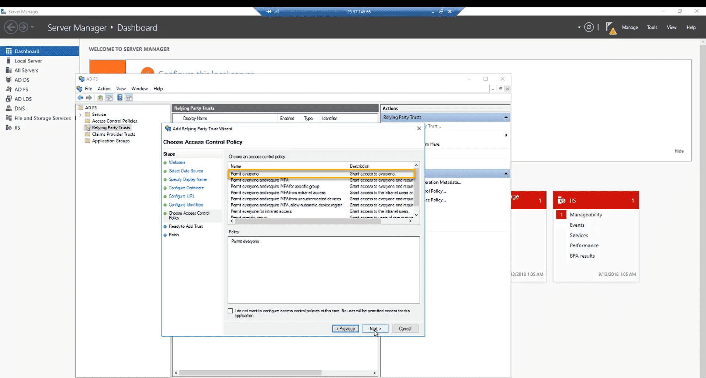

### Claims Issuance Policy

1. Select _Configure claims issuance policy for this application_ and finish

1. In the AD FS Management window, click _Edit Claim Issuance Policy…_ and click _Add Rule_

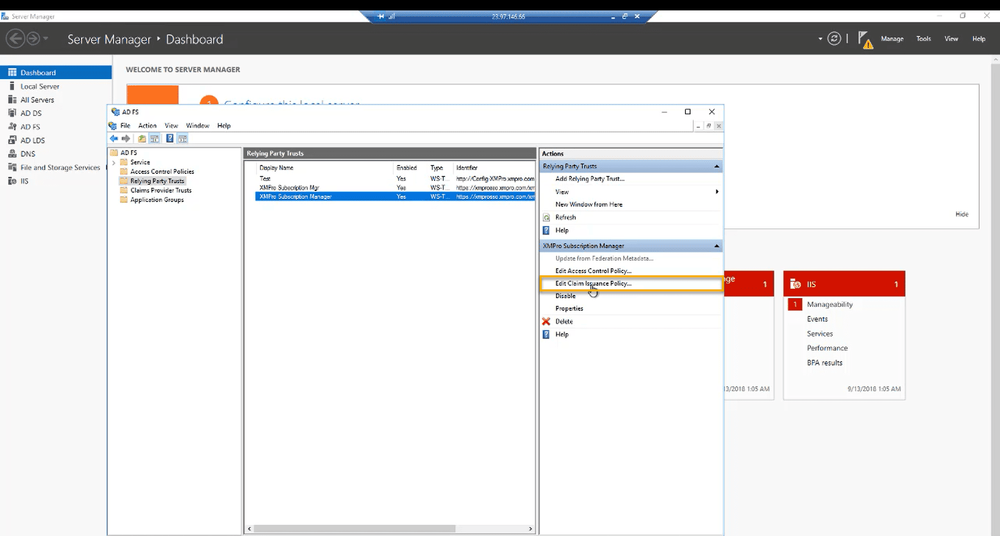

1. In the _Claim rule template_ drop-down, select _Send LDAP Attributes as Claims_ and click Next

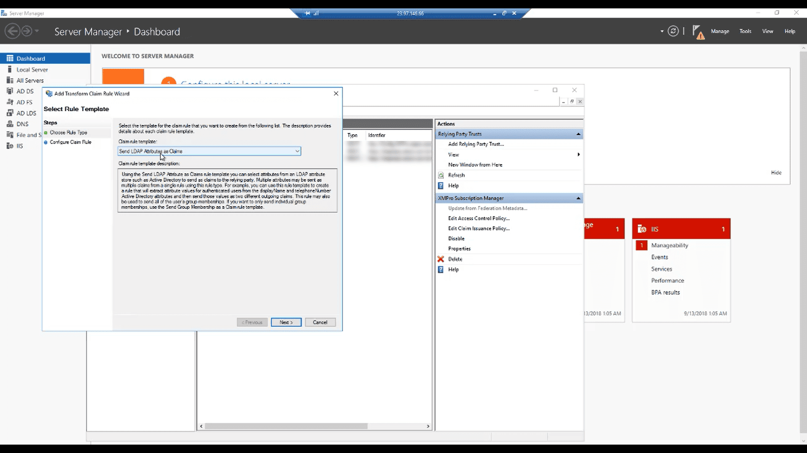

1. Choose a name for the rule and map the claims

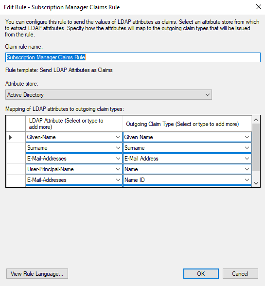

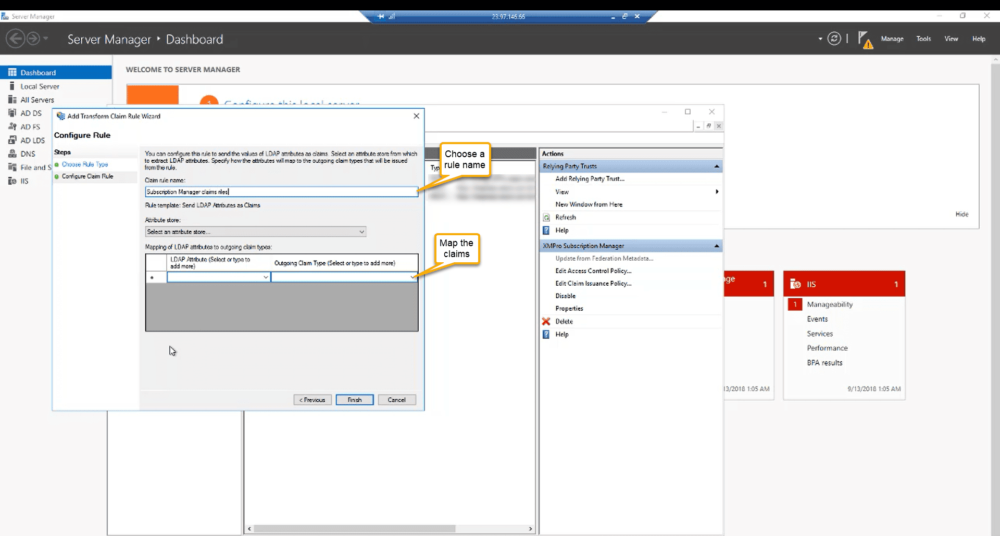

## Login to Subscription Manager using AD FS

Now you should be ready. If you navigate to the Subscription Manager application, you will see the AD FS login option. Log in with your AD FS credentials.

> [!NOTE]
> You will be asked to link your account when you sign in for the first time. If so, fill in your information and click Link Account

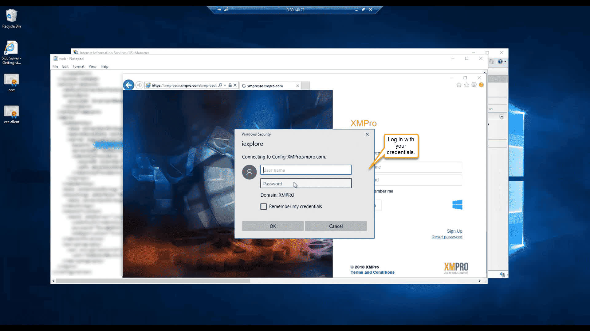

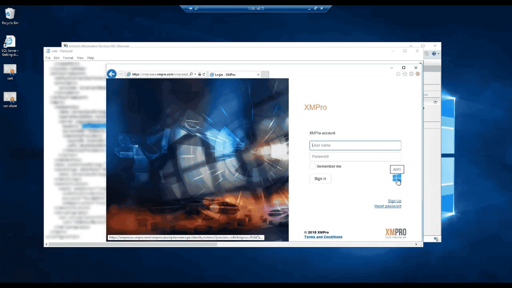
