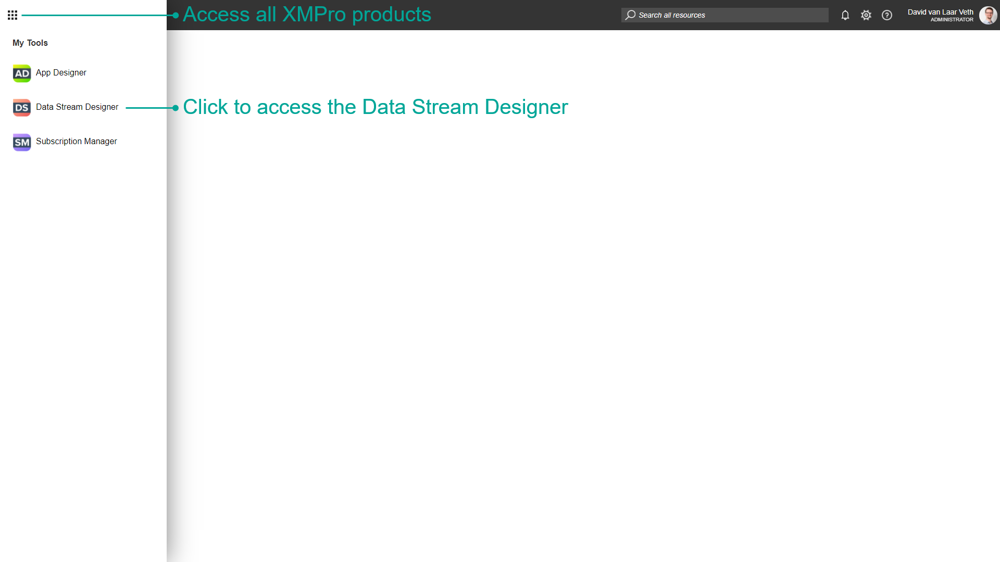
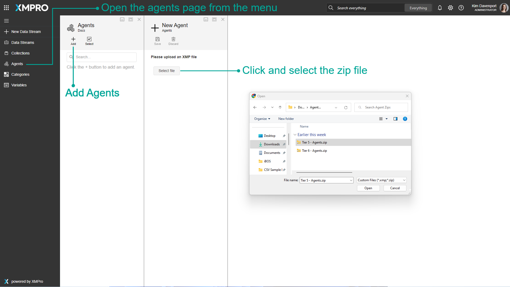
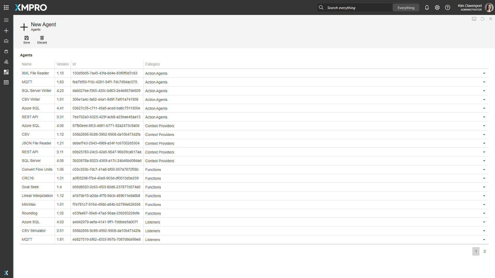
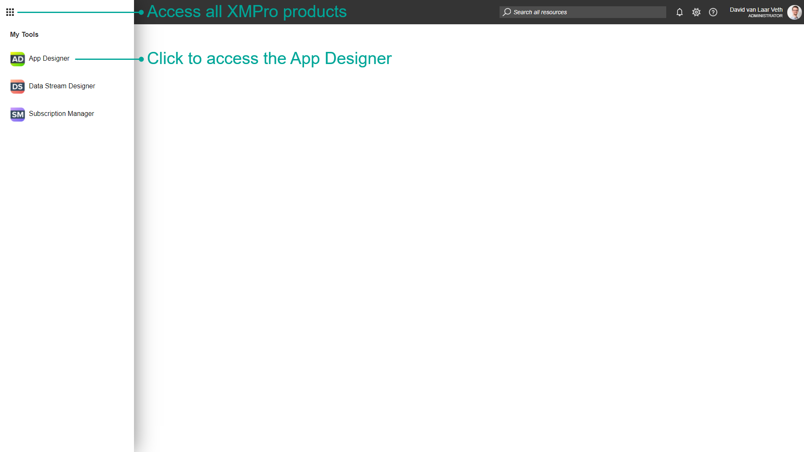
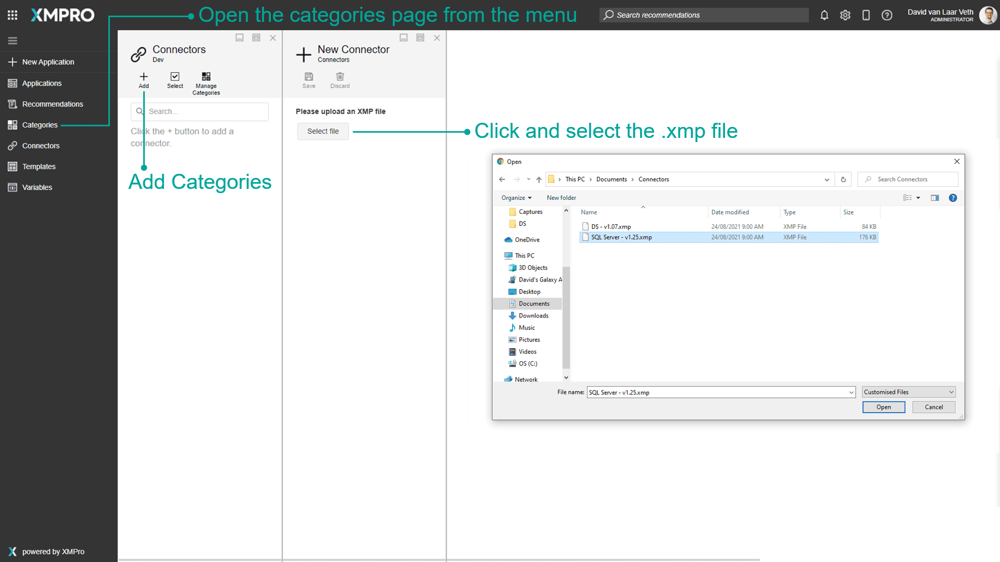

# Install Agents & Connectors

After you have installed App Designer and Data Stream Designer and set up a new Company, you will want to add Connectors and Agents to the Company. This article will show you step-by-step how to upload the default set of Connectors and Agents.

## Data Stream Designer - Agents

1. Log into XMPro as a Company Administrator and navigate to the Data Stream Designer

1. Click the Agents button in the menu on the left to open the Agents page

2. Click the Add button

3. Download the files from each of the following links:

* [Tier 5 - Agents (1 of 2)](https://xmappstore.blob.core.windows.net/tier5/Tier%205%20-%20Agents%20(1%20of%202).zip)
* [Tier 5 - Agents (2 of 2)](https://xmappstore.blob.core.windows.net/tier5/Tier%205%20-%20Agents%20(2%20of%202).zip)
* [Tier 6 - XMPro Internal](https://xmappstore.blob.core.windows.net/tier6/Tier%206%20-%20Agents.zip)

1. Click Select file and upload the _Tier 5 - Agents (1 of 2).zip_ file found in the link above

1. Click Save

1. Click Discard and repeat the above steps for the other 2 files

## App Designer - Connectors

1. Navigate to the App Designer

1. Click the Connectors button in the menu on the left to open the Connectors page

2. Click the Add button

3. Download the file from the following link:

* [Connectors](https://xmappstore.blob.core.windows.net/tier5/Tier%205%20%26%206%20-%20Connectors.zip)

1. Click Select file and upload the zip file found in the link above

1. Click Save
