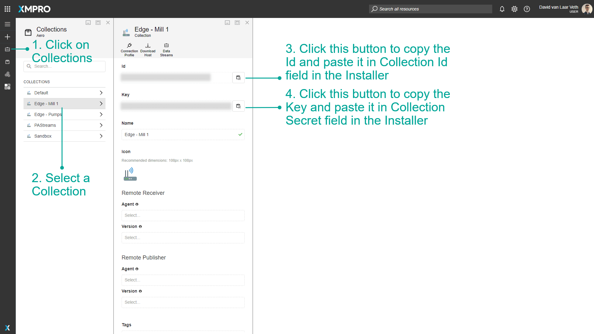

# Stream Host Azure Terraform

## Introduction

This guide covers deploying XMPro Stream Host using the Azure Terraform module. You can deploy Stream Host either as part of the full XMPro platform or as a standalone container that connects to an existing Data Stream Designer instance.

## Prerequisites

Ensure you have completed the [Azure Terraform Prerequisites](../../azure-terraform-preparation.md) which covers:

- Terraform installation
- Azure CLI setup and authentication
- Azure subscription requirements

### For Standalone Deployment

- An existing XMPro Data Stream Designer instance
- Collection ID and Secret from your DS instance

### Sizing Recommendations

The Terraform module allows you to configure Stream Host resources based on your workload:

| Workload Type | CPU Cores | Memory (GB) | Use Case |
| --- | --- | --- | --- |
| Small (Default) | 1 | 4 | Light data processing, few agents |
| Medium | 2 | 8 | Moderate workloads, multiple agents |
| Large | 4 | 16 | Heavy processing, complex transformations |

**Configuration Limits:**

- CPU: 0.25 to 4 cores
- Memory: 0.5 to 16 GB

> [!TIP]
> Start with the default configuration (1 CPU, 4 GB RAM) and scale up based on monitoring metrics.

## Deployment Options

### Option 1: With Full XMPro Platform

When deploying the complete XMPro platform, Stream Host is automatically included. See the [basic example](https://github.com/XMPro/terraform-xmpro-azure/tree/v4.6.0/examples/layered/app) in the terraform-xmpro-azure repository.

### Option 2: Standalone Stream Host

To deploy only Stream Host to connect to an existing DS instance, use the dedicated [Stream Host example](https://github.com/XMPro/terraform-xmpro-azure/tree/v4.6.0/examples/layered/app) from the terraform-xmpro-azure repository.

The example includes:

- Complete Terraform configuration files
- Variable definitions with defaults
- Step-by-step deployment instructions
- Troubleshooting guide

## Quick Start

1. **Clone the repository**

   ```bash
   git clone https://github.com/XMPro/terraform-xmpro-azure.git
   cd terraform-xmpro-azure/examples/stream-host
   ```

2. **Configure your deployment**

   ```bash
   # Copy the example variables file
   # Linux/Mac:
   cp terraform.tfvars.example terraform.tfvars
   
   # Windows:
   copy terraform.tfvars.example terraform.tfvars
   
   # Edit with your specific values
   nano terraform.tfvars   # Linux/Mac
   notepad terraform.tfvars # Windows
   ```

3. **Deploy**

   ```bash
   terraform init
   terraform plan
   terraform apply
   ```

For detailed configuration options and examples, refer to the [Stream Host example README](https://github.com/XMPro/terraform-xmpro-azure/blob/v4.6.0/README.md).

## Getting Collection Credentials

For standalone deployments, you need collection credentials from Data Stream Designer:

1. Open your XMPro Data Stream Designer
2. Navigate to **Collections**
3. Select or create a collection for the Stream Host
4. Go to **Settings** tab
5. Copy the **Collection ID** and **Collection Secret**



## Key Configuration Variables

The Stream Host module supports various configuration options. Here are the most important ones:

### Resource Allocation

- **stream_host_cpu**: CPU cores (0.25 to 4)
- **stream_host_memory**: Memory in GB (0.5 to 16)

### Docker Image Variants

- **stream_host_variant**: Choose the Docker image variant (default: `""` which is the same as `"bookworm-slim"`, other options: `"bookworm-slim-python3.12"`, `"alpine3.21"`)

### Environment Variables

- **SH_PIP_MODULES**: Python packages to install (only available with `bookworm-slim-python3.12` variant)
- **ADDITIONAL_INSTALLS**: System packages to install (works with all variants - APT for Debian, APK for Alpine)
- **Custom variables**: Any additional environment variables (works with all variants)

For a complete list of variables and configuration options, see the [module documentation](https://github.com/XMPro/terraform-xmpro-azure/tree/v4.6.0/modules/_app/stream-host-container).

## Common Configuration Examples

### Python Package Installation

Install Python packages for data processing:

```bash
# In your terraform.tfvars
# First, specify the Python variant
stream_host_variant = "bookworm-slim-python3.12"

# Then configure pip packages (only works with Python variant)
environment_variables = {
  "SH_PIP_MODULES" = "pandas numpy scikit-learn"
}
```

### System Dependencies

Install additional system packages:

```bash
# In your terraform.tfvars
# Use Python variant if you need both Python and system packages
stream_host_variant = "bookworm-slim-python3.12"

environment_variables = {
  "ADDITIONAL_INSTALLS" = "git build-essential python3-dev"  # Works with all variants
  "SH_PIP_MODULES"     = "pandas numpy scikit-learn tensorflow"  # Only works with Python variant
}
```

> [!IMPORTANT]
> The `SH_PIP_MODULES` and `PIP_REQUIREMENTS_PATH` environment variables only work with the `bookworm-slim-python3.12` variant. The `ADDITIONAL_INSTALLS` variable works with all variants (APT for Debian variants, APK for Alpine). See [Docker Variants documentation](docker.md#available-variants) for details.

### Resource Scaling

Adjust resources based on your workload requirements:

```bash
# In your terraform.tfvars
# Medium workload
stream_host_cpu    = 2
stream_host_memory = 8

# Large workload
stream_host_cpu    = 4
stream_host_memory = 16
```

For more advanced configurations including:

- Volume mounts
- Monitoring integration
- Multiple Stream Host deployments
- Custom networking

See the comprehensive examples in the [terraform-xmpro-azure repository](https://github.com/XMPro/terraform-xmpro-azure/tree/v4.6.0/examples/layered/app).

## Troubleshooting

### Stream Host Not Connecting

If the Stream Host doesn't appear in Data Stream Designer:

1. **Check container logs**

   ```bash
   az container logs --resource-group <rg-name> --name <container-name>
   ```

2. **Verify environment variables**

   ```bash
   az container show --resource-group <rg-name> --name <container-name> --query "containers[0].environmentVariables"
   ```

3. **Check network connectivity**
   - Ensure DS server URL is accessible
   - Verify no firewall blocking outbound connections

### Other Common Issues

For comprehensive troubleshooting including:

- Python package installation failures (ensure you're using `bookworm-slim-python3.12` variant)
- Resource allocation problems
- Network connectivity issues
- Container restart loops

Refer to the [troubleshooting section](https://github.com/XMPro/terraform-xmpro-azure/blob/v4.6.0/README.md) in the Stream Host example.

## Best Practices

1. **Start Simple**
   - Use the example configuration as a starting point
   - Test with minimal configuration first
   - Add complexity incrementally

2. **Version Control**
   - Store your Terraform configurations in version control
   - Use `.gitignore` for sensitive files
   - Tag deployments for easy rollback

3. **Security**
   - Never commit credentials to version control
   - Use Azure Key Vault for secrets
   - Enable managed identities where possible

4. **Monitoring**
   - Always configure Application Insights
   - Set up alerts for critical metrics
   - Review logs regularly

## Complete Example Repository

All the code examples, configuration files, and detailed documentation for Stream Host deployment are available in the [terraform-xmpro-azure](https://github.com/XMPro/terraform-xmpro-azure) repository:

- **[Stream Host Example](https://github.com/XMPro/terraform-xmpro-azure/tree/v4.6.0/examples/layered/app)** - Complete standalone deployment
- **[Basic Platform Example](https://github.com/XMPro/terraform-xmpro-azure/tree/v4.6.0/examples/layered/app)** - Full platform with Stream Host
- **[Module Documentation](https://github.com/XMPro/terraform-xmpro-azure/tree/v4.6.0/modules/_app/stream-host-container)** - Detailed variable reference

## Related Documentation

- [Stream Host Docker Installation](docker.md) - For standalone Docker deployments
- [Collection and Stream Host Concepts](../../../concepts/collection.md) - Understanding Stream Host architecture
- [Azure Terraform Deployment Guide](../../deployment/azure-terraform/index.md) - Complete platform deployment guide

## Next Steps

After deployment:

1. Access Data Stream Designer to verify Stream Host connection
2. Create your first data stream
3. Configure agents and connectors
4. Monitor performance and adjust resources as needed
