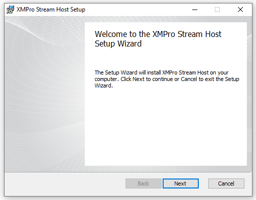
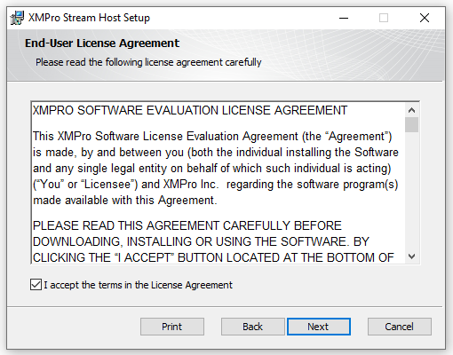
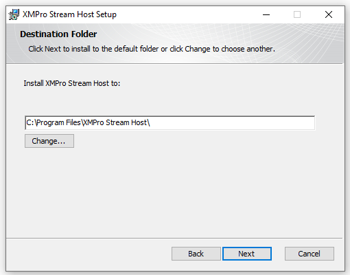
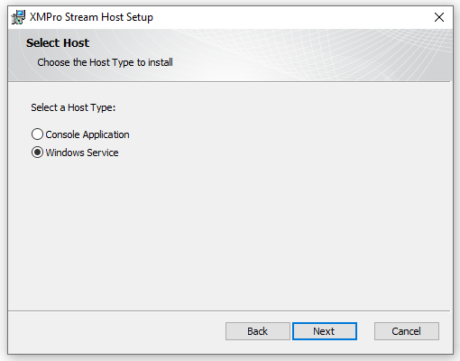
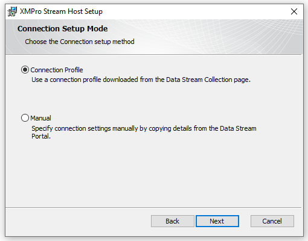
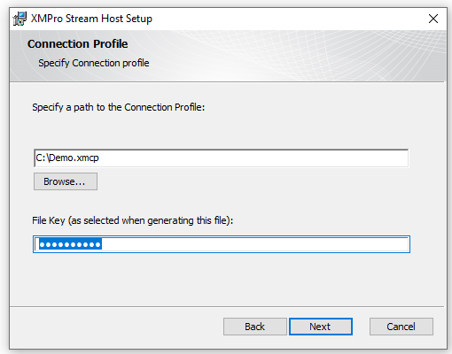
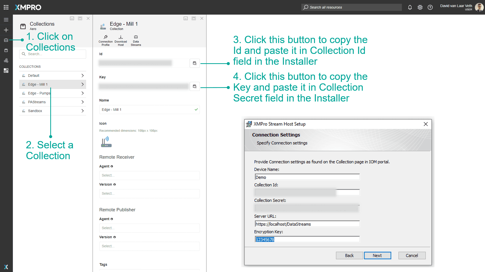

# Windows x64

## Prerequisites

### Downloads

Follow the instructions in the [Install Stream Host](./index.md) guide to download the connection profile and installer.

### Hardware and Software

XMPro Stream Host requires certain hardware and software specifications in order to install and run. Complete these steps in the **1. Preparation** guide:

1. Meet the [**hardware** requirements](../../install.md#hardware-requirements)
2. Install the [**software** requirements](../../install.md#software-requirements)

## Initial Steps

1. Run the executable installer file that you've downloaded as administrator

2. When the installation wizard opens, click Next

1. Read and accept the license agreement by ticking the check box at the bottom and click Next

1. Click the Change button to choose the location for the Stream Host to be installed

2. Browse to the directory you would like to use, or use the default, and click Next

## Host Type Selection

1. Select the host type and click Next

> [!NOTE]
> _Console Application_ is recommended for testing purposes.
>
> It will be listed in the Start menu under the name "_XMPro Stream Host_" and **must be** **manually run as administrator** from the Start menu.

> [!NOTE]
> _Windows Service_ is recommended for production environments.
>
> It will automatically start after installation completes and the name of the service will be the same as the "_Device Name_" you specified when you downloaded the Connection Profile file or manually added the name to the installer.

## Connection Profile

1. Select your preferred setup mode and click Next

### Upload a Collection Profile

Follow these steps if you selected _Connection Profile:_

1. Click Browse and select the Connection Profile file you downloaded earlier in the [guide](./index.md)

2. In the File Key textbox enter the key used to create the Connection Profile

3. Click Next and let the wizard install the Stream Host

> [!NOTE]
> If you selected _Manual_, see the section below for instructions on how to set it up.

### Manual Settings

If you decide to manually set up the connection settings for the Stream Host, you can find the values you need by following the steps below.

1. Choose a name for the device
2. Log into Data Stream Designer and open the _Collections_ page from the left-hand menu
3. Select the Collection you wish to use
4. Copy the _ID_ of the Collection from Data Stream Designer to your clipboard by clicking on the _copy_ button and paste it into the _Collection ID_ field in the installer
5. Copy the _Key_ of the Collection from Data Stream Designer to your clipboard by clicking on the _copy_ button and paste it into the _Collection Secret_ field in the installer
6. Add the _Server URL_ for Data Stream Designer in the installer, for example, "_<http://localhost/DataStreams>_"
7. Add an encryption key that can be used in the _Encryption Key_ field in the installer
8. Click _Next_ and let the wizard install the Stream Host

## Next Step: Agents & Connectors

The stream host installation is complete. Please click below to install the default Agents & Connectors:

- [Install Connectors](../install-connectors.md)
