# Azure

This document will guide you through how to set up the Azure infrastructure and deploy the XMPro Platform.

* [Install](#install)
* [Upgrade](#upgrade)
* [Uninstall](#uninstall)

## Architecture

The following deployment diagram shows an example architecture and the necessary resources for the XMPro platform in Microsoft Azure.

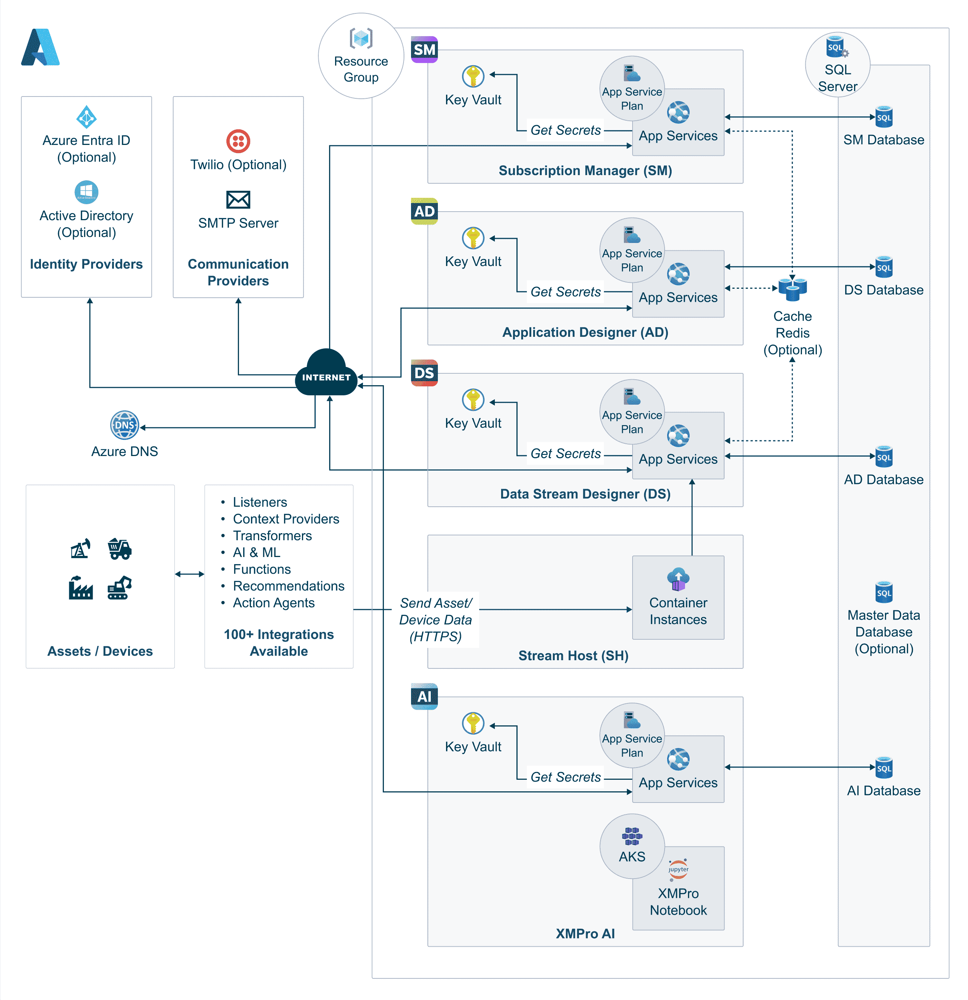

Set up of Cloud Stream Host, Master Data, [Azure Cache](https://docs.microsoft.com/en-us/azure/azure-cache-for-redis/cache-dotnet-how-to-use-azure-redis-cache), or [Twilio](../install.md) is optional and is dependent on client requirements. As a result, these resources will be excluded from this deployment.

## Prerequisites

In order to proceed with the deployment, you are required to complete the steps in the **1. Preparation** guide:

1. Select Azure resources that meet the [**hardware** requirements](../install.md) and [**software** requirements](../install.md).
2. Follow the [certificate and communication steps](../install.md) for an [SMTP Account](../install.md) (Recommended).

As well as having:

* Azure portal administrative access
* Access to Subscription and Resource group

## Install

This section provides information about installing the XMPro platform from scratch in Azure.

1. Log on to the Azure Portal [https://portal.azure.com/](https://portal.azure.com/) (with Company Administrator access)
2. In the search bar type “Deploy” and select “Deploy a custom template”

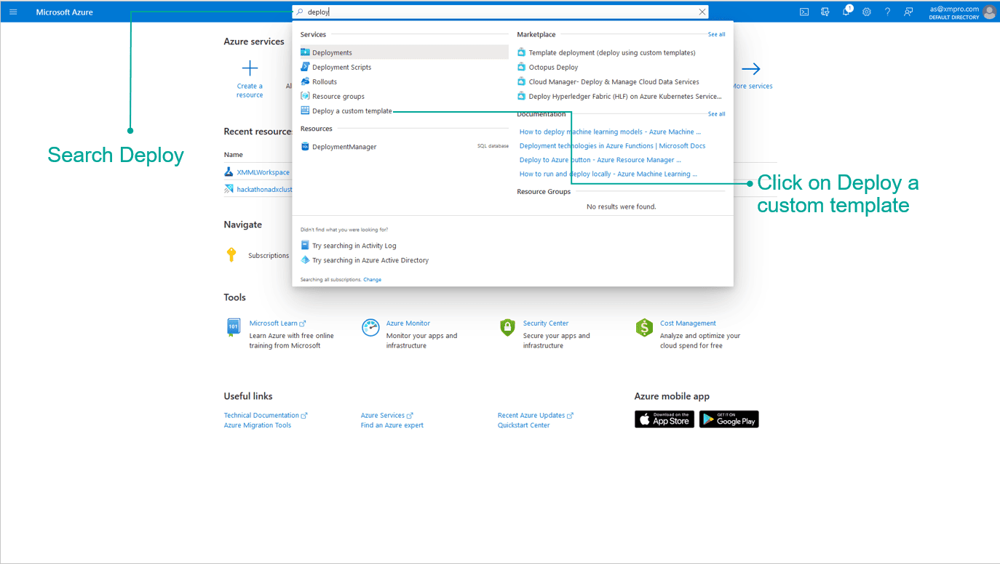

3\. Click "Build your own template in the editor"

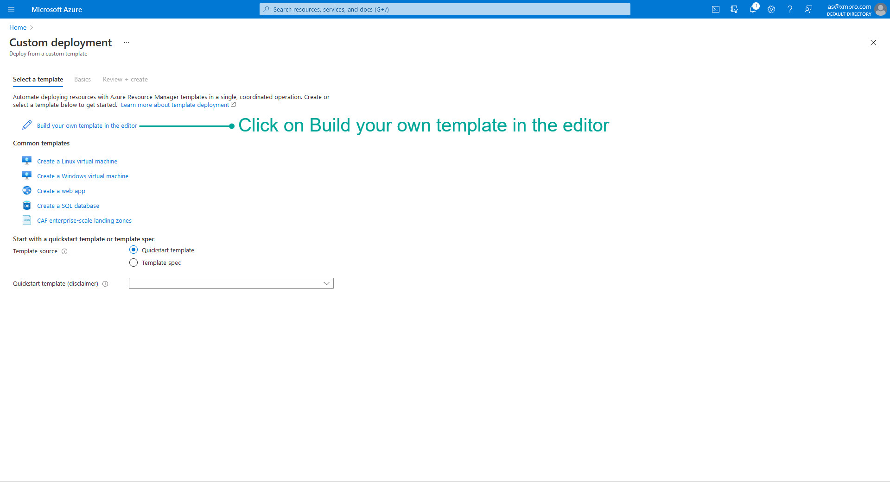

4\. Download the latest [mainTemplate_v4.4.22.json](https://xmmarketplacestorage.blob.core.windows.net/deploymentpackage/Files-4.4.22/mainTemplate_v4.4.22.json) file from your XMPro account manager or support team.

5\. Select "Load File" and then Open the downloaded [mainTemplate_v4.4.22.json](https://xmmarketplacestorage.blob.core.windows.net/deploymentpackage/Files-4.4.22/mainTemplate_v4.4.22.json)

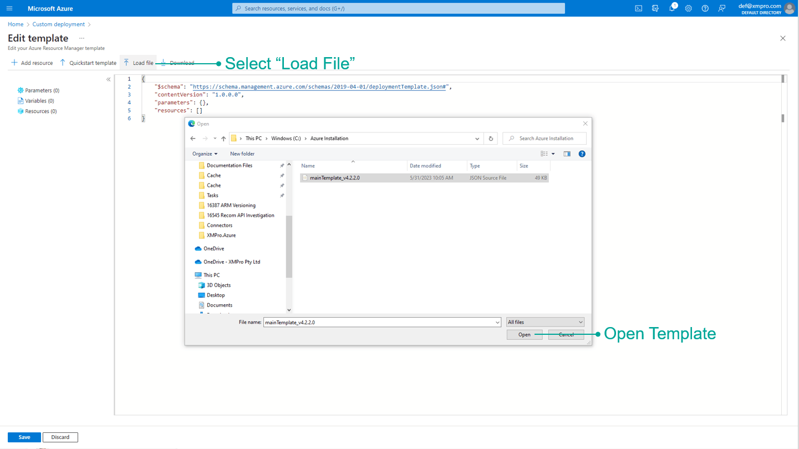

6\. Once loaded, click Save - do not change the template.

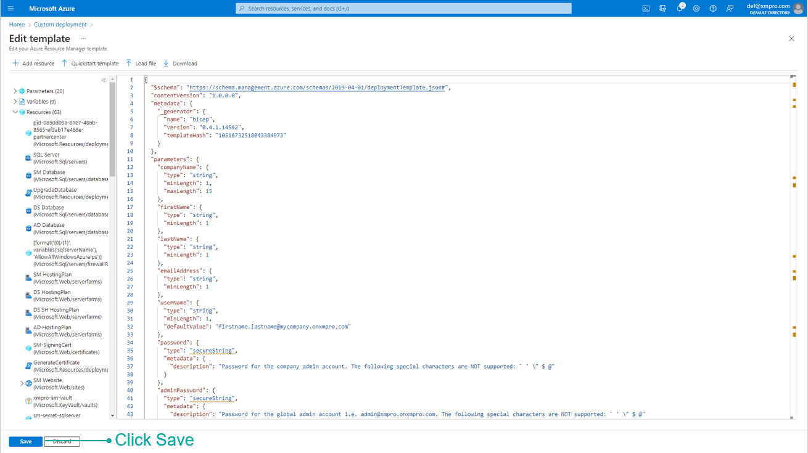

7\. Complete the form.

> [!WARNING]
>
> * Enter the username in the correct format i.e. <firstname.lastname@companyname.onxmpro.com>
> * The following special characters are **not** supported in the passwords: `` ` ' \ $ @ ``
> * Take note of the passwords used as this will not be displayed again and they are required later.

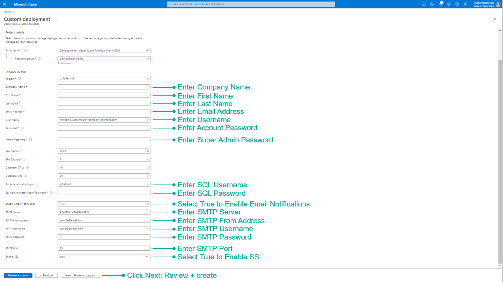

8\. Verify the information is correct and click Create.

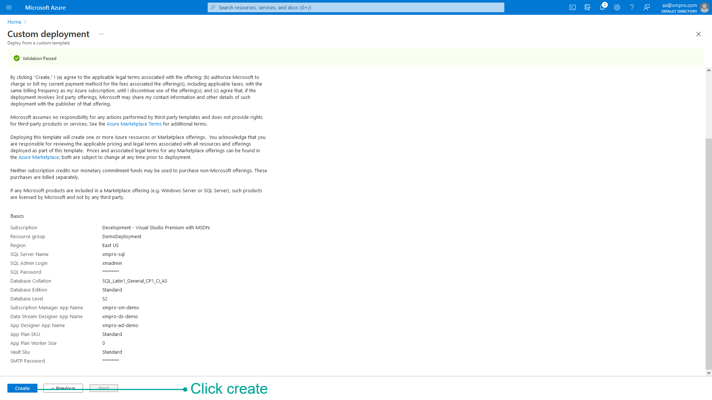

After successful deployment, the following items have been installed:

* Subscription Manager
* Data Stream Designer
* App Designer
* Stream Host

Proceed to [Restart the App Services](#restarting-app-services) after they are all deployed.

### Restarting App Services

This step explains how to restart your app services in the Azure Portal.

1. Type “Resource groups” in the search bar and select “Resource groups”.

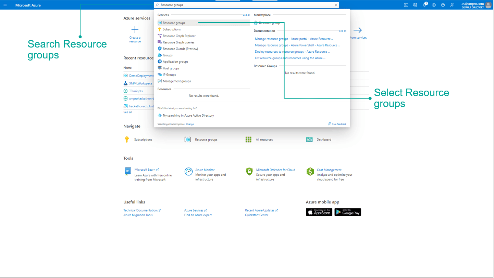

2\. Search for the Resource Group created during installation and select it.

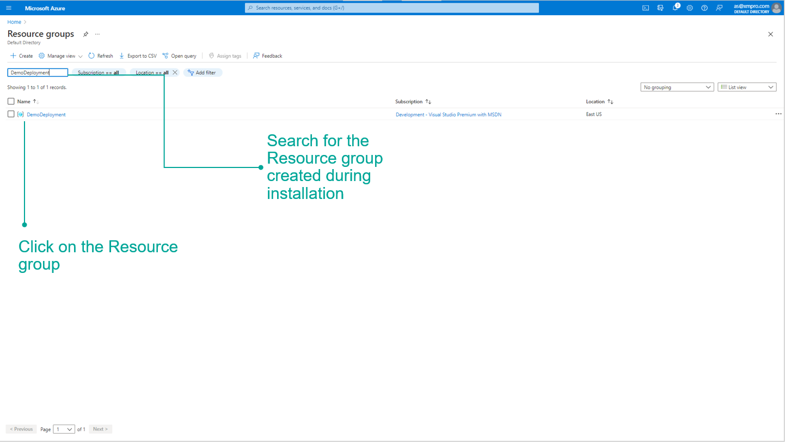

3\. Select Subscription Manager, Data Stream Designer, and App Designer and restart the applications.

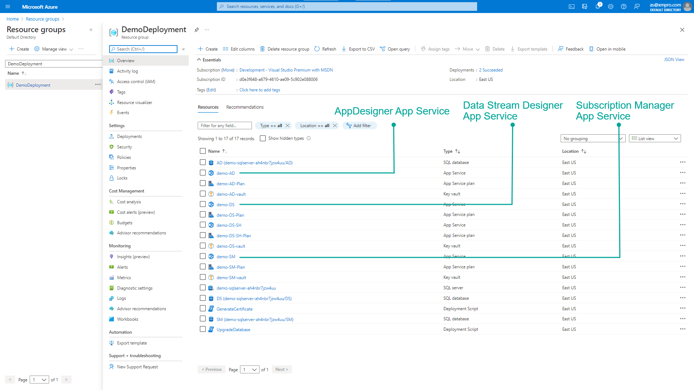

4\. The below GIF shows how to restart your app service.

<video autoplay loop muted playsinline style="max-width: 100%; height: auto;">
  <source src="../../images/pi2gwprnfr.mp4" type="video/mp4">
</video>

### Logins

| User | Type | Password |
| --- | --- | --- |
| <admin@xmpro.onxmpro.com> | Super Admin | as entered during setup |
| <firstname.lastname@companyname.onxmpro.com> | Admin | as entered during setup |

### Request a License

A new company is created as part of the installation process but needs a valid license to work.

> [!NOTE]
> Login using the Super Admin account **<admin@xmpro.onxmpro.com>**.

1\. Click Company in the left menu to open the Companies page.\
2\. Click on the Company.\
3\. Click on the Subscriptions gauge to open the Subscriptions page.\
4\. Click on a Subscription.\
5\. Click the Update License button in the command bar.\
6\. Click _Generate a license request_, enter the number of days, and submit.\
7\. When you have received the license from [XMPro support](http://xmpro.com/support/), upload it.\
8\. Click Save.

This sends a request to XMPro for an App Designer license for this Company.

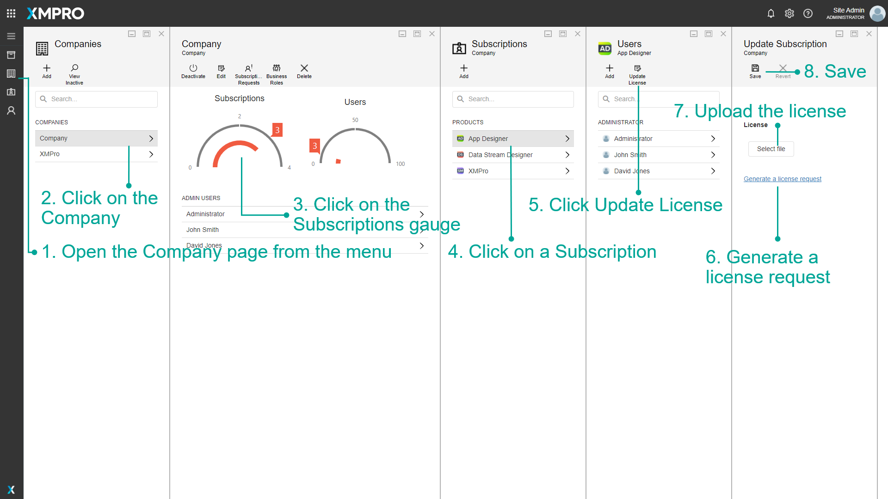

> [!WARNING]
> The _Generate a license request_ link will only work if SMTP was set up during installation.

9\. Change the Product to Data Stream Designer from the list and request another license

> [!NOTE]
> Licenses are given on an individual basis by the [XMPro support team](http://xmpro.com/support/).

When you have received a license for each product through an email sent to the email address given during installation, follow the steps below to upload the license for both App Designer and Data Stream Designer.

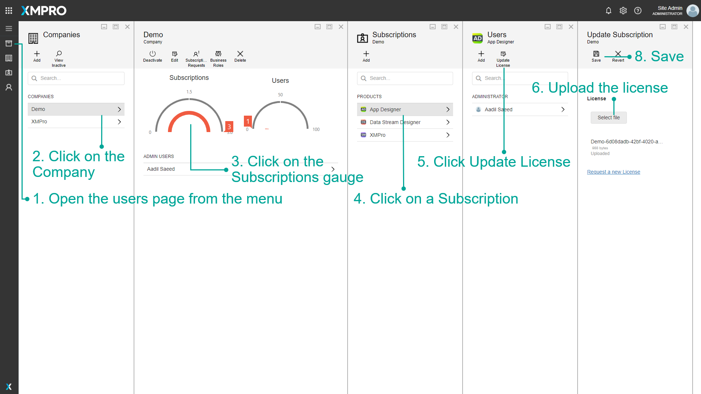

### Next Step: Complete Installation

The installation of the XMPro Platform is now complete but before you can use the platform, some steps are needed to set up the environment. Further instructions about the configuration can be found below:

[Install Connectors](../complete-installation/install-connectors.md)

## Upgrade

> [!WARNING]
> Before beginning the upgrade, back up databases using [this](https://docs.microsoft.com/en-us/azure/azure-sql/database/database-export#the-azure-portal) guide.

Follow the same steps as a new [Install](#install) to upgrade your XMPro platform. Make sure to:

* Download and use the latest [mainTemplate_v4.4.22.json](https://xmmarketplacestorage.blob.core.windows.net/deploymentpackage/Files-4.4.22/mainTemplate_v4.4.22.json).
* Before deploying, stop the SM App Service to avoid file locking issues during MSDeploy.
* Use the same Resource Group and credentials used during the **original** Install when completing the Custom deployment form.

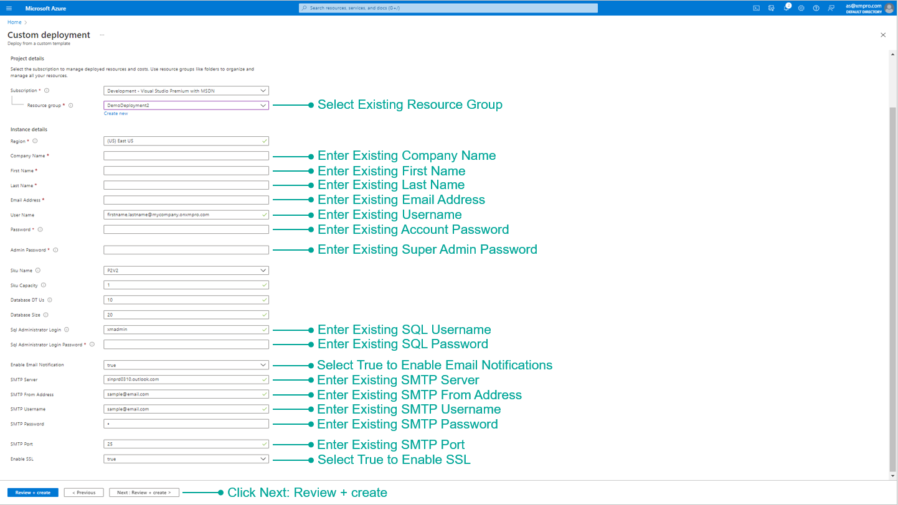

## Known Issues

### Notebook Upgrades with ARM Deployments

When upgrading XMPro instances that use AI Notebooks installed via ARM deployments, you may encounter known issues with the automated upgrade process. These issues primarily affect the Notebook components during ARM-based upgrades.

#### Impact and Scope

* This issue affects users who deploy via ARM and already have AI Notebooks installed
* The issue primarily appears during upgrades to version 4.4.18 and later
* The problem involves compatibility between the ARM template and current Azure implementation

#### Workaround: Manual Notebook Deployment

While automated Notebook upgrades via ARM deployments may fail, you can successfully upgrade Notebooks using the following manual deployment process:

#### Prerequisites

1. Bash terminal
2. Azure CLI 2
3. Helm 3.X

#### Manual Deployment Steps

1. **Login and validate connection to the correct subscription**

```bash
az login
az account show
```

1. **Find the name of the AKS resource**

```bash
az aks list -o table
```

1. **Merge the AKS cluster into kubeconfig**

```bash
az aks get-credentials -n <aks resource name> -g <resource group>
```

1. **Check the kubectl is connected to the AKS instance**

```bash
kubectl config current-context
```

1. **Find the helm deployment**

```bash
helm list -n prod
```

1. **Check the helm deployment values and save to values.yml**

```bash
helm get values xmpro-notebooks -n prod > values.yml | sed -i '1d' values.yml
```

1. **Remove the first line "USER-SUPPLIED VALUES:"**

```bash
sed -i '1d' values.yml
```

1. **Observe the singleuser section in values.yml**

```yaml
singleuser:
  image:
    name: <registry>/base-jupyter-notebook
    tag: <release-version>
```

1. **Set the following values**

* `<registry>` = xmpro.azurecr.io
* `<release-version>` = the desired release tag version e.g. 4.4.18

1. **Deploy the values upgrade using Helm**

```bash
helm upgrade --cleanup-on-fail --install xmpro-notebooks jupyterhub/jupyterhub --namespace prod --create-namespace
```

1. **Wait for the deployment to complete**
2. **Verify the deployment**

```bash
helm list -n prod
```

1. **Verify the values are set correctly**

```bash
helm get values xmpro-notebooks -n prod
```

1. **Verify the pods status**

```bash
kubectl get pods -n prod
```

1. **If required, forcefully restart the notebook pods**

```bash
kubectl delete pods --all -n prod
```

### Issues

### 1. Notebook URLs are mismatched

The URLs for notebook should be in sync in all the places:

* AI AppService > Environment Vars > xmpro:aidesigner:jupyterUrl
* SM DB dbo.ProductUrls > Notebook Url
* Helm Chart Release > xmpro-notebook > values
* `kubectl describe svc proxy-public -n prod` > annotations > service.beta.kubernetes.io/azure-dns-label-name

#### Troubleshooting <a href="#user-content-troubleshooting" id="user-content-troubleshooting"></a>

```bash
# az login to the subscription
az login
```

**Connect to the aks instance**

```bash
az aks list -o table
az aks get-credentials -g <resource-group> -n <aks-instance-name-from-above>
kubectl config set-context <aks-instance-name-from-above>
kubectl config current-context
```

**Get helm deployment details**

```bash
helm ls -n prod
helm get values xmpro-notebooks -n prod
// check the notebook URLs
```

**Get proxy public annotations**

```bash
kubectl get svc -n prod
kubectl describe svc proxy-public -n prod
// check the service.beta.kubernetes.io/azure-dns-label-name annotation
```

**Check the SQL database**

```bash
az resource list -g <resource-group> -o table
az sql server show -g <resource-group> -n <sql-server-instance-name-from-above>
# check the SM DB dbo.ProductUrls > Notebook Url
```

**Force restart all pods**

```bash
kubectl get pods -n prod
kubectl delete pods --all -n prod
```

### 2. Access Denied to Storage Account

After a Notebook upgrade, launching a Jupyter Hub user instance may result in an error such as:

```
MountVolume.MountDevice failed for volume "pvc-64bd7714-7c0e-45ca-88cc-c1bdf816108e": rpc error: code = Internal desc = volume(MC_armupgrade_aks-armup-xmpro-001_centralus#nfs0f17de3935cc49c2ae46#pvc-64bd7714-7c0e-45ca-88cc-c1bdf816108e##prod#) mount "nfs0f17de3935cc49c2ae46.blob.core.windows.net:/nfs0f17de3935cc49c2ae46/pvc-64bd7714-7c0e-45ca-88cc-c1bdf816108e" on "/var/lib/kubelet/plugins/kubernetes.io/csi/blob.csi.azure.com/fd5793275cbf92e1d702e30d03bcf1634564e3690e3b635a763e814f5e09c29/globalmount" failed with mount failed: exit status 1 Mounting command: mount Mounting arguments: -t aznfs -o nconnect=4,sec=sys,vers=3,nolock nfs0f17de3935cc49c2ae46.blob.core.windows.net:/nfs0f17de3935cc49c2ae46/pvc-64bd7714-7c0e-45ca-88cc-c1bdf816108e /var/lib/kubelet/plugins/kubernetes.io/csi/blob.csi.azure.com/fd5793275cbf92e1d702e30d03bcf1634564e3690e3b635a763e814f5e09c29/globalmount Output: [0mmount.nfs: access denied by server while mounting 10.161.100.100:/nfs0f17de3935cc49c2ae46/pvc-64bd7714-7c0e-45ca-88cc-c1bdf816108e[0m [2;31mMount failed  to fix up the reported error.

These particular steps deal with the [Access denied by the server](https://learn.microsoft.com/en-us/troubleshoot/azure/azure-kubernetes/storage/mounting-azure-blob-storage-container-fail#nfs-error2) error.

## Uninstall

This section provides information about uninstalling the XMPro platform from Azure.

1. Open the resource group where XMPro is installed
2. Click Delete resource group

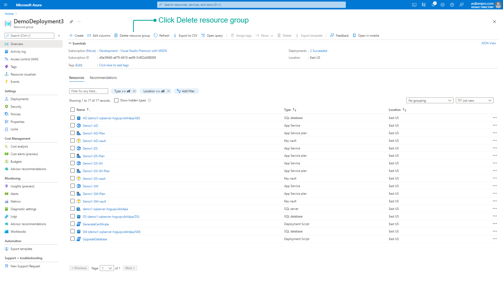

3\. Enter the name of the resource group and click _Delete_

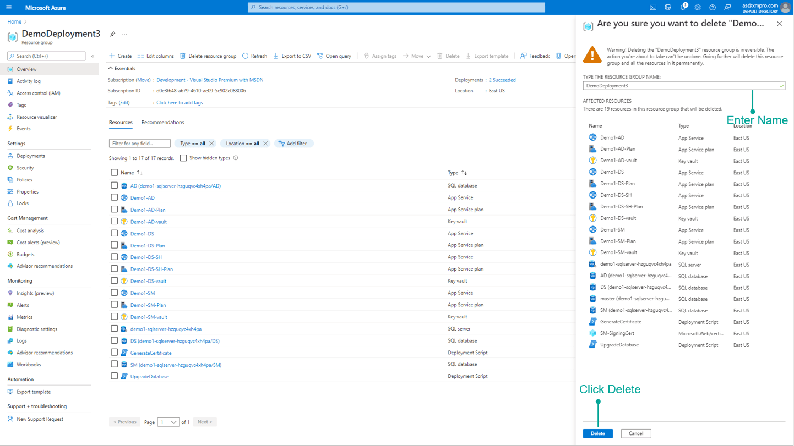
