# Install

## Subscription Manager

1. Start the installation process by running the _Subscription Manager.exe_ file, received from your XMPro.

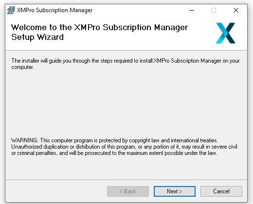

1. Click the "I Agree" button and press "Next"

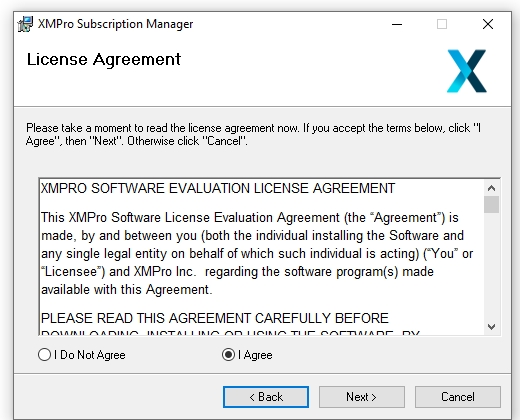

1. Follow the instructions and when the installation is finished click "Close"

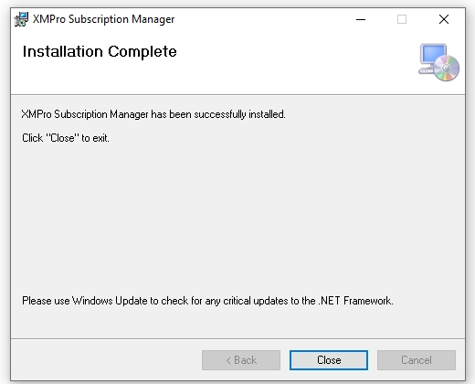

> [!NOTE]
> This "Setup" will install the installer you will use to install the database and website

1. When this initial installation is complete, open the start menu
2. Search for "XMPro Subscription Manager" and click on Run as Administrator

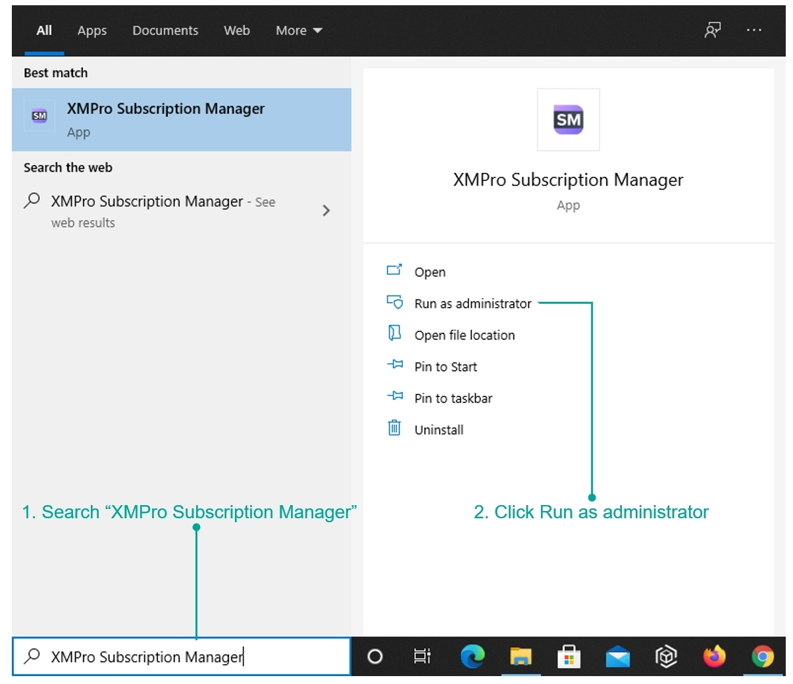

### Component Choice

1. When the installer launches, choose "Install" and click "Next"

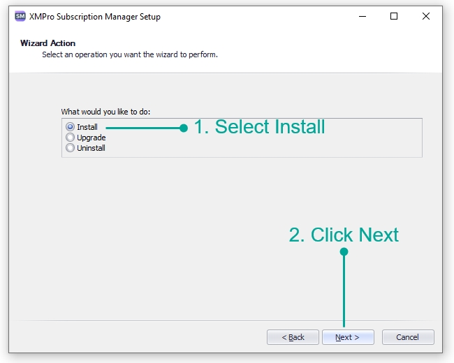

1. Select the components that you would like to install and click "Next"

> [!NOTE]
> If this is the first time you are installing Subscription Manager select both "Database" and "Web Application"

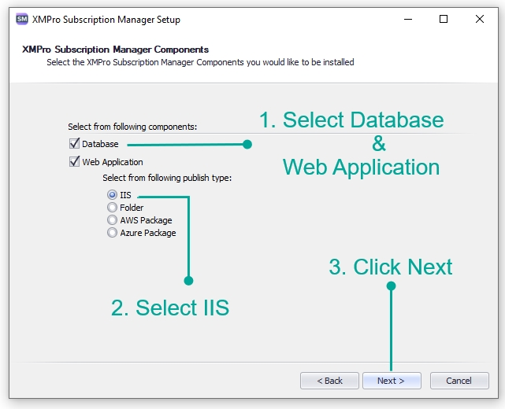

### Database

#### Server

1. Select the server instance to which you would like to connect

> [!NOTE]
> If you already know the server instance name, it can be entered manually. Otherwise, use the refresh button on the right to load all available servers. Selecting the "Local Servers" check box will limit the search to the local network.

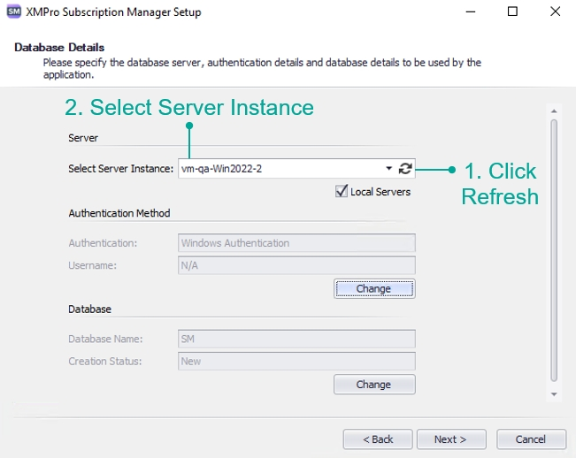

#### Authentication Method

1. Specify the authentication method that should be used: Windows or SQL

9.1. Windows Authentication: you may leave the options as is

> [!WARNING]
> Configure a service account that can be used for Windows authentication.

9.2. SQL authentication:

* Click the "Change" button
* Select the "Use SQL Authentication" option
* Enter the username and password of the SQL Server instance you're connecting to

> [!WARNING]
> The SQL user must have permission to create databases on the server.

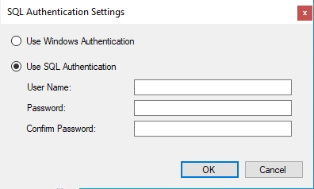

**Database**

> [!NOTE]
> The Database section allows you to configure if you would like to use an existing database or create a new one. Leaving the options as default will result in a new database being created.

To change the pre-populated name of the new database or to select to use an existing database:

1. Click the "Change" button
2. Make the changes needed by selecting the correct option
3. Specify the name of the new database or select an existing database from the drop-down

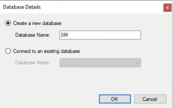

### Web Application

**DNS Name**

1. Verify if your DNS name is correct, if not, edit the value to contain the correct DNS name

> [!NOTE]
> This is your fully qualified domain name (FQDN). Please find some examples below explaining the DNS name.
>
> * <https://localhost/xmprosubscriptionmanager>
> * <https://vm-qa-win2022-2/xmprosubscriptionmanager>
> * <https://demo.azurewebsites.com>

| Complete Address | DNS | Virtual Directory |
| --- | --- | --- |
| <https://localhost/xmprosubscriptionmanager> | localhost | xmprosubscriptionmanager |
| <https://vm-qa-win2022-2/xmprosubscriptionmanager> | vm-qa-win2022-2 | xmprosubscriptionmanager |
| <https://demo.azurewebsites.com> | demo.azurewebsites.com |  |

**Virtual Directory**

1. Select the parent site from the Web Site drop-down

> [!NOTE]
> By default, the Virtual Directory name will be "xmprosubscriptionmanager" which will be created within IIS for the Subscription Manager site. If you wish to change the name you can specify it in the "Virtual Directory Name" text box.

1. Verify if the value in the content directory field is correct. If not, apply any changes needed

> [!NOTE]
> By default, the option to create a sub-directory within the content directory is checked and you can specify a name in the "Sub-Directory" text box.

#### Application Pool

1. If you wish to change this name or use an existing application pool, click the Change button

> [!NOTE]
> By default, a new application pool will be created when installing the site. The new application pool will have the same name as the name specified in the "Application Pool Name" field.

1. Either select the "Create a new Application Pool" or "Use an existing Application Pool" option

> [!NOTE]
> If you choose "Create a new Application Pool", give it an appropriate name. If you choose "Use an existing Application Pool", select an existing application pool from the drop-down.

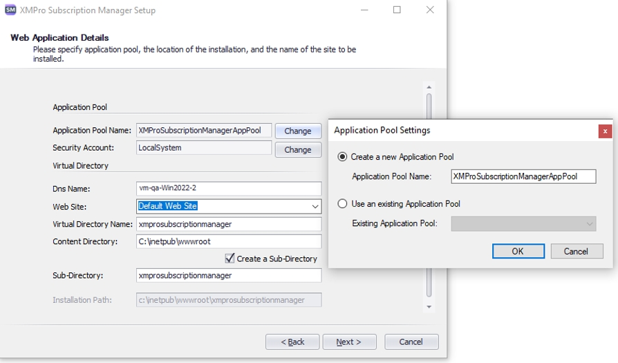

#### Security Account

1. Select a security account that can be used

> [!NOTE]
> The default option is "Local System", which is a built-in security account. You can either change it by selecting a different built-in security account from the drop-down or by specifying your own security account.

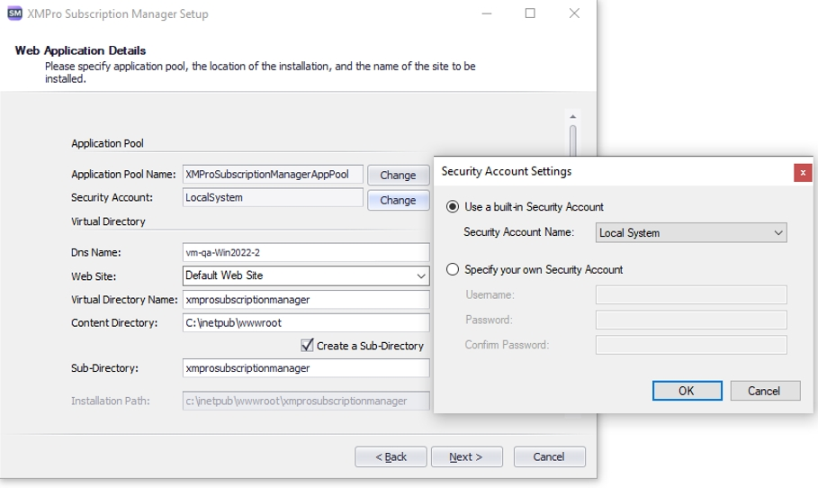

> [!WARNING]
> If you selected Windows authentication to connect to the database, you must choose "Specify your own Security Account" and provide the correct credentials. The service account must have batch logon rights enabled. More Information on how to set up a custom application pool in IIS as well as steps on how to enable batch logon rights can be found in this [link](https://docs.xmpro.com/knowledge-base-2/setting-up-a-custom-application-pool-so-that-windows-authentication-can-be-used-when-installing-xmpro-enabling-batch-logon-rights-for-a-user/).

### SMTP

1. Enter the SMTP details referenced in the [1. Preparation](../../install.md#smtp-account) guide.
    By default, the "Enable Email Notification" is checked.

> [!NOTE]
> SMTP can be disabled by unchecking the "Enable Email Notification" checkbox if you don't want to receive email notifications. If at a later stage email notifications are needed, the installer can be run again to add SMTP functionality.

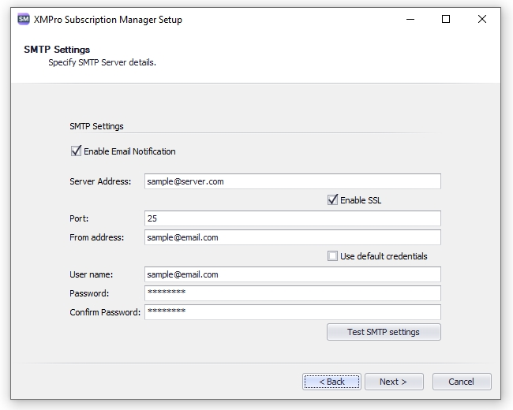

> [!WARNING]
> You are required to set up an SMTP account. Failing to do so will make registering new users very cumbersome.
>
> Check your connection to the email server using the "Test SMTP settings" button.

### Certificates

During the installation process, you will be asked to upload two certificates: a signing certificate and an encryption certificate. You may use the same certificate for both options. The instructions on how to create a certificate can be found in the [Installing Prerequisites](prerequisites.md) guide.

#### Signing Certificate

1. Start by browsing to a suitable _.pfx_ certificate file. Specify the password for the certificate
2. Use the dropdown to select "Subject Name"

> [!NOTE]
> It is recommended that you choose "LocalMachine" as the Location for the signing certificate.

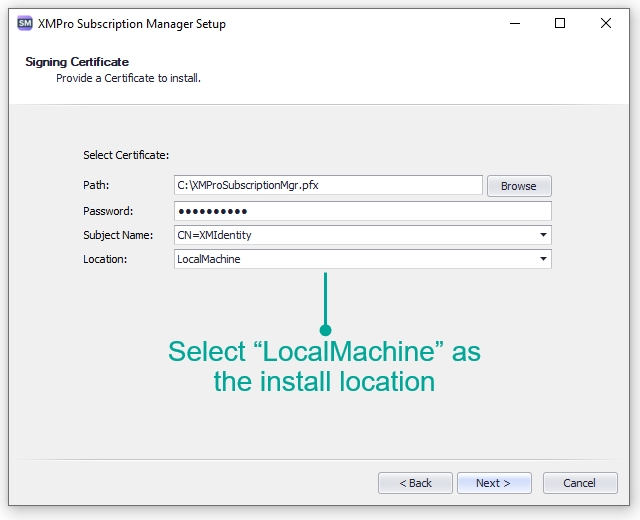

#### Encryption Certificate

1. Start by browsing to a suitable _.pfx_ certificate file. Specify the password for the certificate
2. Use the dropdown to select "Subject Name"

> [!NOTE]
> It is recommended that you choose "LocalMachine" as the Location for the encryption certificate.

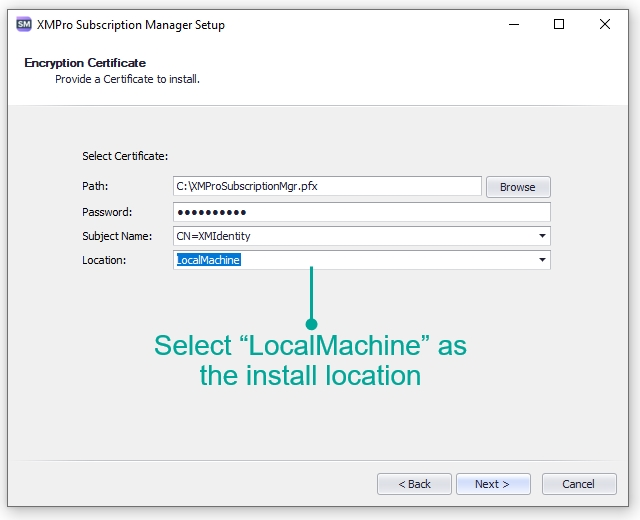

> [!WARNING]
> Both certificates must contain a private key.

### Final Steps

1. Continue through the wizard, confirm the installation and the components will be installed

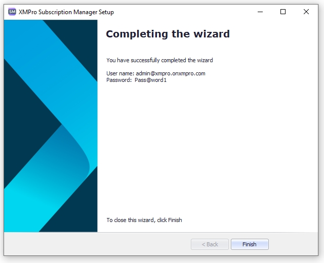

> [!WARNING]
> Note the username and password on the last screen of the installer. This user has been created during installation as Subscription Manager itself needs at least one user in the system. Without it, you cannot add other users.
>
> Change the password of the default user to a new, secure password after logging in for the first time.

### Accessing the Website

#### Using Web Browser

1. Access the website by putting the URL into your browser

> [!NOTE]
> The format of the URL will be as follows: "<https://yourdnsname/virtualdirectoryname/>"

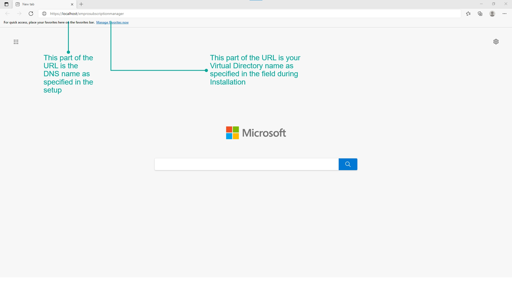

### Obtaining an Installation Profile

To install the Data Stream Designer and App Designer, you will need an Installation Profile.

1. Navigate to the XMPro Subscription Manager site as above using the Global Admin Login Details
2. Go to the Subscription Manager page

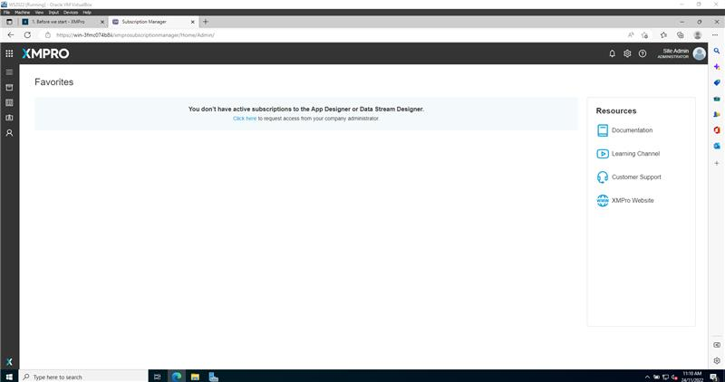

1. Click Products in the menu and click the Installation Profile button

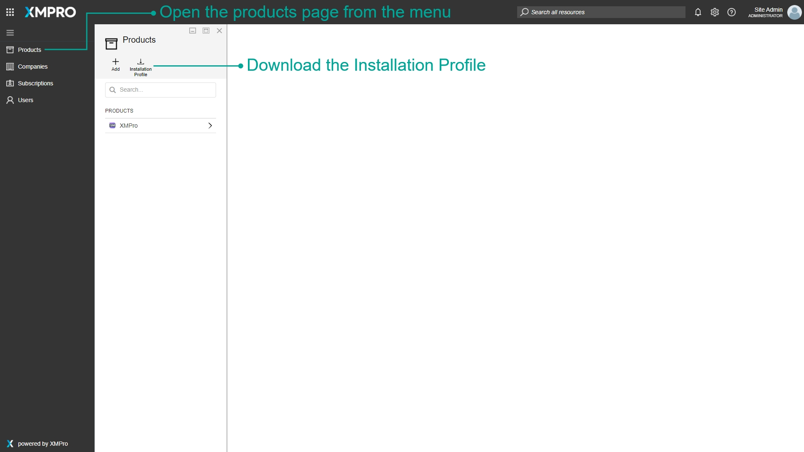

1. Enter a File Key and press OK to download the file

> [!WARNING]
> Remember the file key as it is needed when installing Data Stream Designer and App Designer.

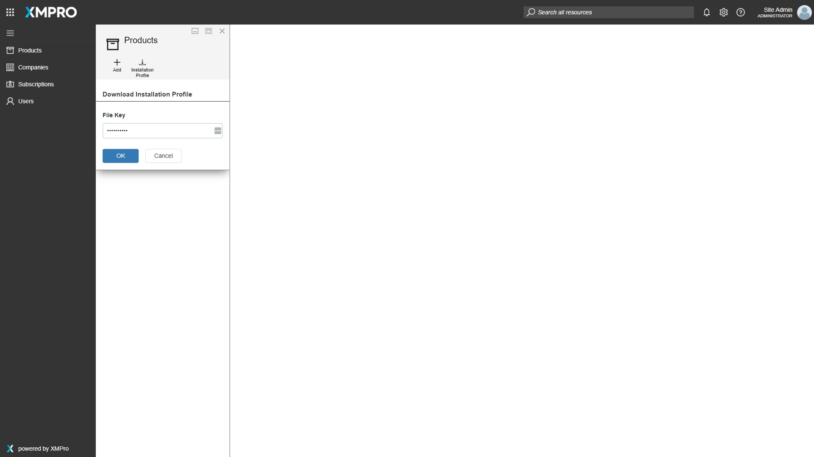

### Optional: IIS User Permissions

If you've chosen to use a **custom service account** during installation, you may have to perform an extra step. An error may be shown after logging into Subscription Manager, even after giving the _IIS\_USRS_ group permission on the signing certificate private keys. The error would be as follow: "_We could not grant you access to the requested subscription. There was an unexpected error_". The logs would also contain the following error: "_System.Security.Cryptography.CryptographicException: Keyset does not exist_".

To solve this issue, use this [article](https://docs.xmpro.com/knowledge-base-2/how-to-grant-permission-to-iis-user-on-xmpro-identity-service-signing-certificate/) as a guideline to grant access for the Application Pool Identity (in some cases a domain account) on the signing certificate private keys.

## Data Stream Designer

1. Start the installation process by running the _Data Stream Designer.exe_ that you've received from XMPro.

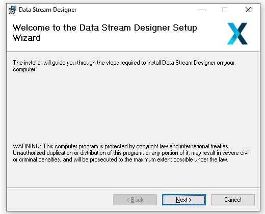

1. Click the "I Agree" button and press "Next"

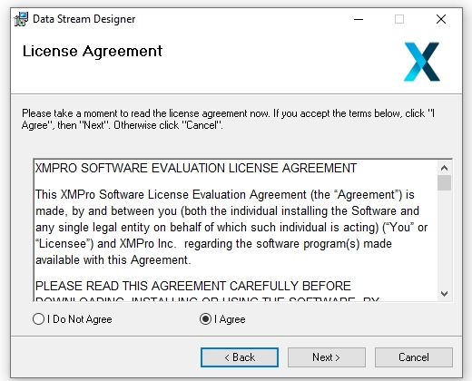

1. Follow the instructions and when the installation is finished click "Close"

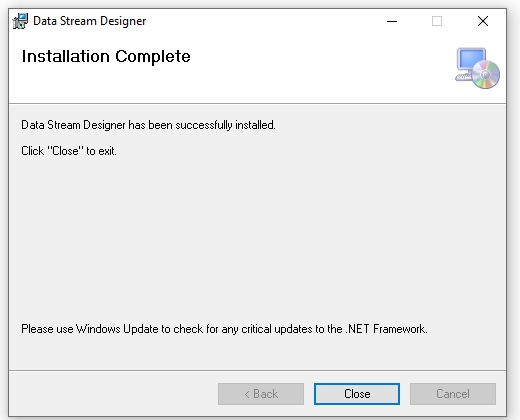

1. When this initial installation is complete, open the start menu
2. Search for "Data Stream Designer" and click on Run as Administrator

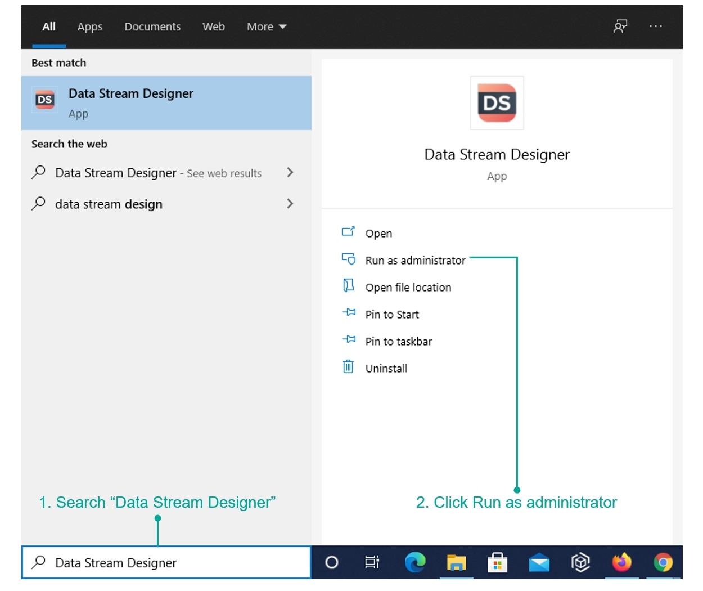

### Component Choice

1. When the installer launches, choose "Install"

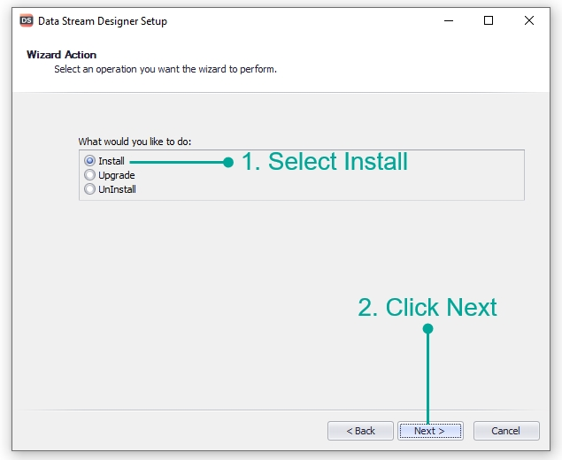

1. Select the components that you would like to install

> [!NOTE]
> If this is the first time you are installing the Data Stream Designer, it is highly recommended that you select both "Database" and "Web Application".

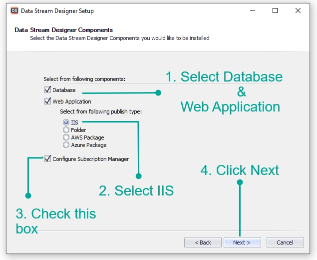

### Database

#### Server

1. Select the server instance you would like to connect to.

> [!NOTE]
> If you already know the server instance name, it can be entered manually. Otherwise, use the refresh button on the right to load all available servers. Selecting the "Local Servers" check box will limit the search to the local network.

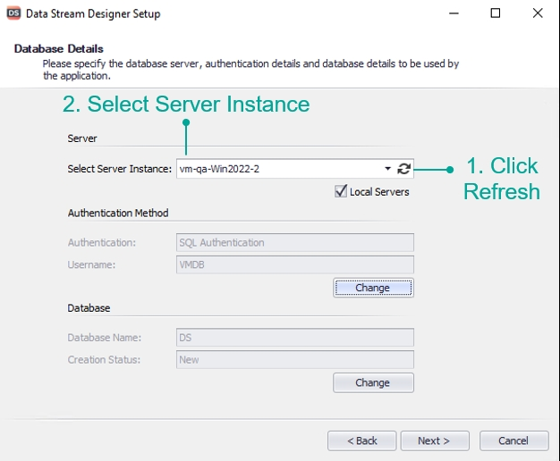

#### Authentication Method

1. Specify the authentication method that should be used: Windows or SQL

9.1. Windows Authentication: you may leave the options as is

> [!WARNING]
> Configure a service account that can be used for Windows authentication.

9.2. SQL Authentication:

* To connect to the database using SQL Server authentication, click the "Change" button
* Select the "Use SQL Authentication" option
* Enter the username and password of the SQL Server instance you're connecting to

> [!WARNING]
> The SQL user must have permission to create databases on the server.

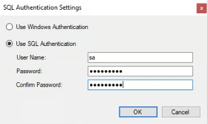

**Database**

> [!NOTE]
> The Database section allows you to configure if you would like to use an existing database or create a new one. Leaving the options as default will result in a new database being created.

To change the pre-populated name of the new database or to select to use an existing database:

1. Click the "Change" button and select the appropriate option
2. Specify the name of the new database or select an existing database from the drop-down

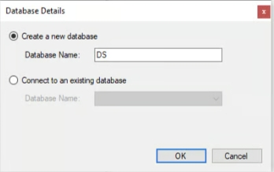

### Encryption Upgrade

If you are upgrading from 4.0 to 4.1+, you will be shown the Encryption Upgrade Settings page. This will assist you in migrating existing Server Variables to the new method of encryption.

> [!WARNING]
> To upgrade existing Server Variables, the details of the **Subscription Manager** database are required, **not** the **Data Stream Designer** database (provided on the previous page).

#### Upgrade Server Variables?

1. Tick to automatically upgrade the Server Variables. It is recommended, but not required.
    None of the other settings on this page are required if you choose not to upgrade.

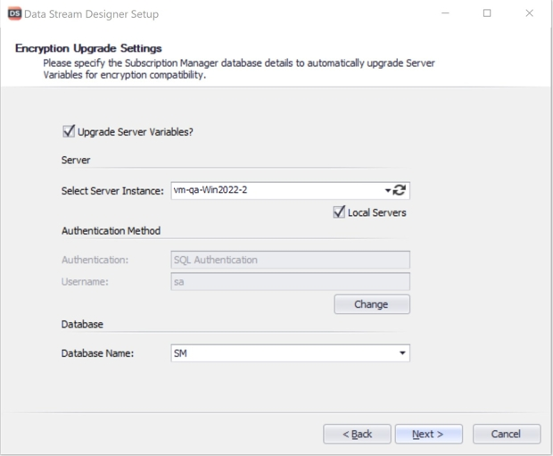

#### Server

1. Select the server instance you want to connect to

#### Authentication Method

1. Specify the authentication method that should be used: Windows or SQL

#### Database

1. Select the **Subscription Manager** database and click Next

### Web Application

**DNS Name**

1. Verify if your DNS name is correct. If not, edit the value to contain the correct DNS name

> [!NOTE]
> This is your fully qualified domain name (FQDN). Please find some examples below explaining the DNS name.
>
> * <https://localhost/datastreams>
> * <https://vm-qa-win2022-2/datastreams>
> * <https://demo.azurewebsites.com>

| Complete Address | DNS | Virtual Directory |
| --- | --- | --- |
| <https://localhost/xmprosubscriptionmanager> | localhost | datastreams |
| <https://vm-qa-win2022-2/xmprosubscriptionmanager> | vm-qa-win2022-2 | datastreams |
| <https://demo.azurewebsites.com> | demo.azurewebsites.com |  |

**Virtual Directory**

1. Select the parent site from the Web Site drop-down

> [!NOTE]
> By default, the Virtual Directory name will be "DataStreams" which will be created within IIS for the Data Stream site. If you wish to change the name you can specify it in the "Virtual Directory Name" text box.

1. Verify the value in the content directory field. If incorrect, apply any changes needed

> [!NOTE]
> By default, the option to create a sub-directory within the content directory is checked and you can specify a name in the "Sub-Directory" text box.

#### Application Pool

1. If you wish to change the name or use an existing application pool, click the Change button

> [!NOTE]
> By default, a new application pool will be created when installing the site. The new application pool will have the same name as the name specified in the "Application Pool Name" field.

1. Either select the "Create a new Application Pool" or "Use an existing Application Pool" option

> [!NOTE]
> If you choose "Create a new Application Pool", give it an appropriate name. If you choose "Use an existing Application Pool", select an existing application pool from the drop-down.

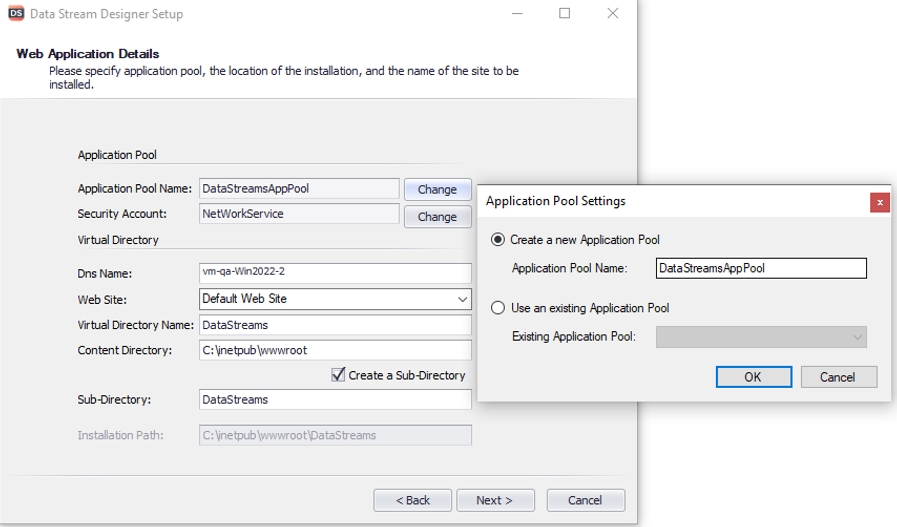

#### Security Account

1. Select "Local System" as the security account.

> [!NOTE]
> The two options available to choose from are using a built-in security account or specifying your own security account.

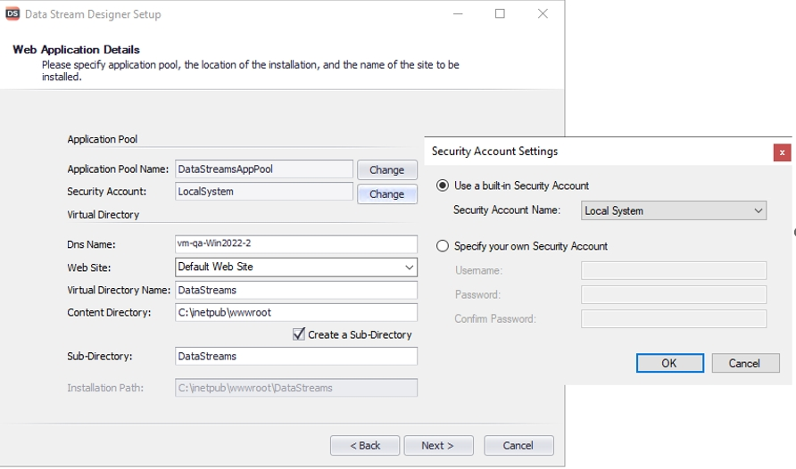

> [!WARNING]
> If you selected Windows authentication to connect to the database, you must choose "Specify your own Security Account" and provide the correct credentials. The service account must have batch logon rights enabled. More Information on how to set up a custom application pool in IIS as well as steps on how to enable batch logon rights can be found in this [link](https://docs.xmpro.com/knowledge-base-2/setting-up-a-custom-application-pool-so-that-windows-authentication-can-be-used-when-installing-xmpro-enabling-batch-logon-rights-for-a-user/).

### Installation Profile

1. Click the Browse button to upload an installation profile for Subscription Manager
2. Select a file and click "Next"

> [!NOTE]
> This file ensures the Data Stream Designer contains the correct details for the Subscription Manager instance you would like to use. The file can be obtained through the [steps outlined previously in this tutorial](#obtaining-an-installation-profile).

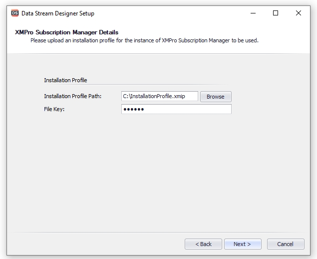

1. After you press "Next", authenticate yourself using Subscription Manager credentials

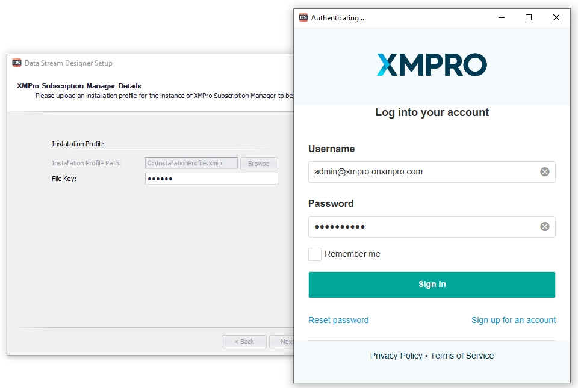

> [!WARNING]
> If you are unable to sign in at this step, please follow this [link](prerequisites.md) to disable Internet Explorer Enhanced Security Configuration.

### Final Steps

1. Continue through the wizard, confirm the installation and the components will be installed

## App Designer

1. Start the installation process by running the _App Designer.exe_ file that you've received from XMPro.

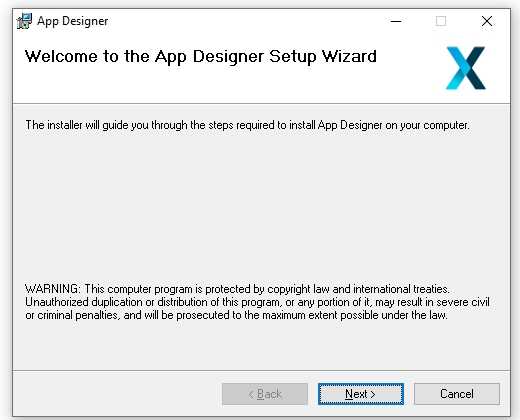

1. Click the "I Agree" button and press "Next"

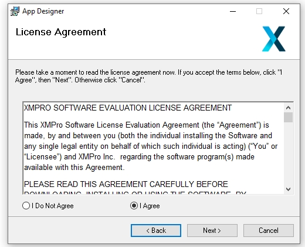

1. Follow the instructions and click "Close" when the installation is finished

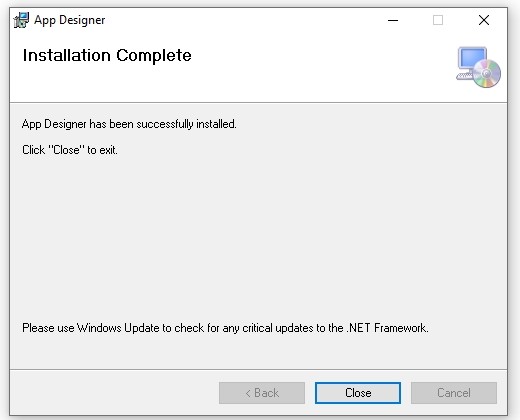

> [!NOTE]
> This "Setup" will install the installer you will use to install the database and website

1. When this initial installation is complete, open the start menu
2. Search for "App Designer" and click on Run as Administrator

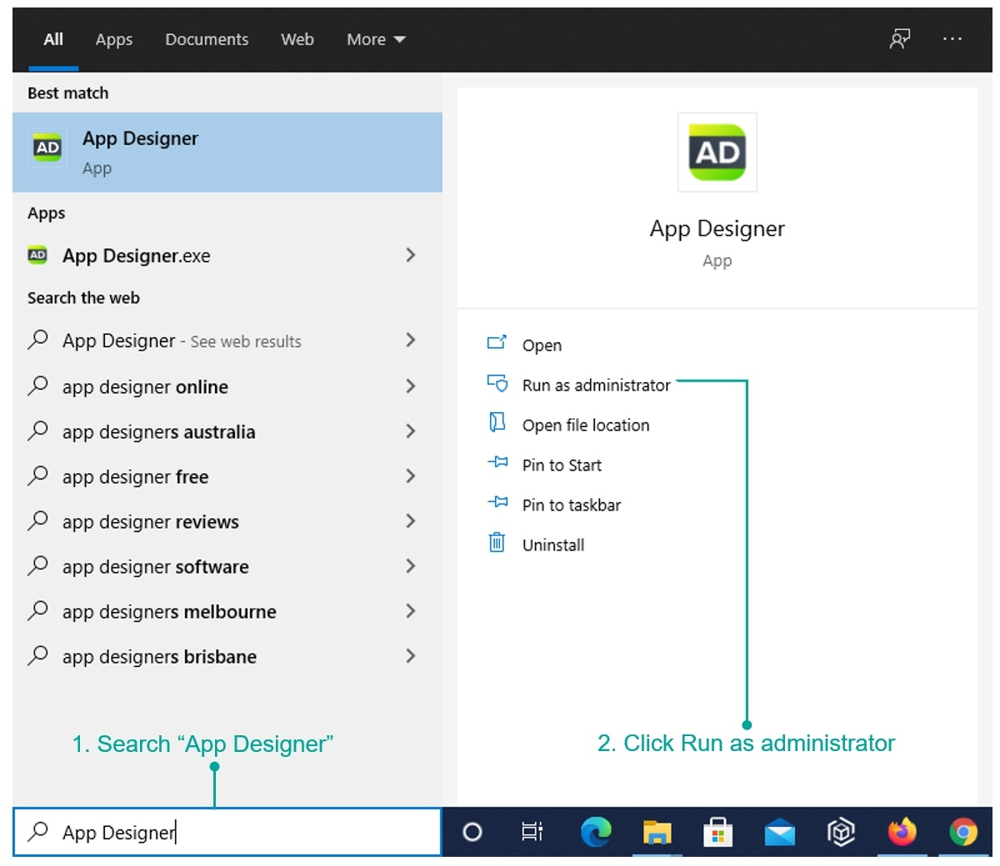

### Component Choice

1. When the installer launches, choose "Install" and click "Next"

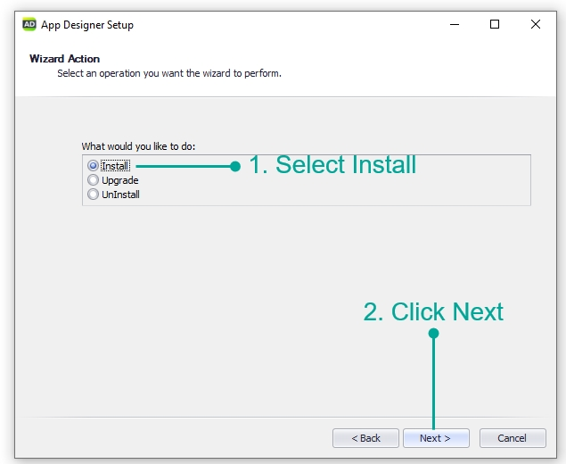

1. Select the components that you would like to install and click "Next"

> [!NOTE]
> If this is the first time you are installing Subscription Manager, it is highly recommended that you select both "Database" and "Web Application".

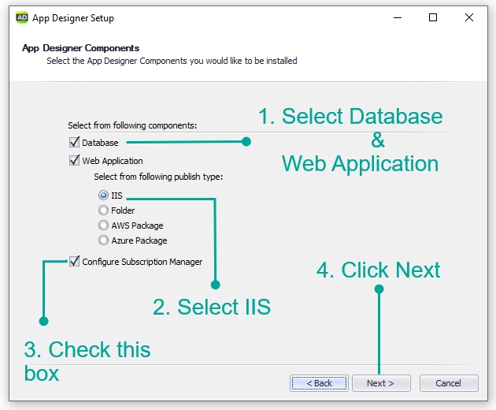

### Database

#### Server

1. Select the server instance you would like to connect to

> [!NOTE]
> If you already know the server instance name, it can be entered manually. Otherwise, use the refresh button on the right to load all available servers. Selecting the "Local Servers" check box will limit the search to the local network.

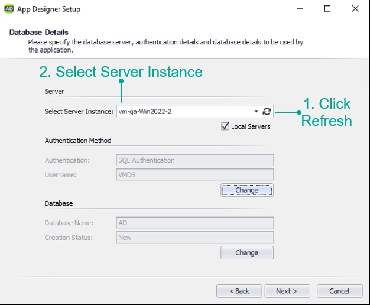

#### Authentication Method

1. Specify the authentication method that should be used: Windows or SQL

9.1. Windows Authentication: you may leave the options as is

> [!WARNING]
> Configure a service account that can be used for Windows authentication

9.2. SQL Authentication:

* Click the "Change" button
* Select the "Use SQL Authentication" option
* Enter the username and password of the SQL Server instance you're connecting to

> [!WARNING]
> The SQL user must have permission to create databases on the server.

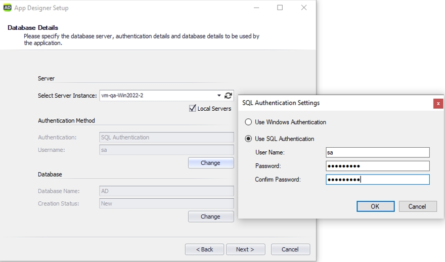

**Database**

> [!NOTE]
> The Database section allows you to configure if you would like to use an existing database or create a new one. Leaving the options as default will result in a new database being created.

To change the pre-populated name of the new database or to select to use an existing database:

1. Click the "Change" button and select the appropriate option
2. Specify the name of the new database or select an existing database from the drop-down

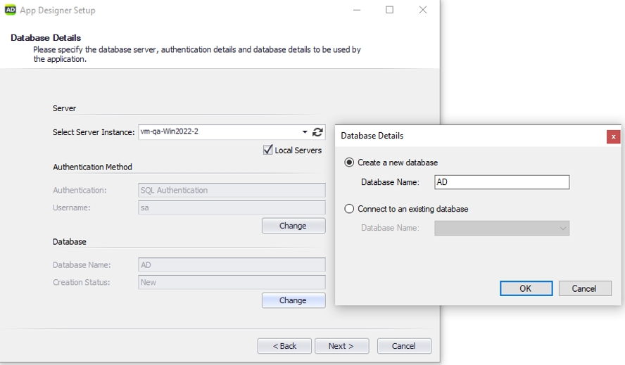

### Encryption Upgrade

If you are upgrading from 4.0 to 4.1 or greater, you will be shown the Encryption Upgrade Settings page. This will assist you in migrating existing Server Variables and Connector settings to the new method of encryption.

> [!WARNING]
> To upgrade existing Server Variables, the details of the **Subscription Manager** database is required, **not** the **Data Stream Designer** database (provided on the previous page).

#### App Designer Encryption Key

1. Enter the App Designer Encryption Key

> [!NOTE]
> To find the App Designer Encryption Key, inspect the appsettings.json file in the web server files. It will be found under the JSON path "xmpro.appDesigner.encryptionKey".
>
> If that path does not exist, it is stored in a cloud-service key vault. Search for the "xmpro.keyVault" JSON object for the details required to find the encryption key.
>
> Documentation for the [Azure](#server) and [Amazon](https://docs.aws.amazon.com/kms/latest/developerguide/overview.html) key vaults have been linked for convenience.

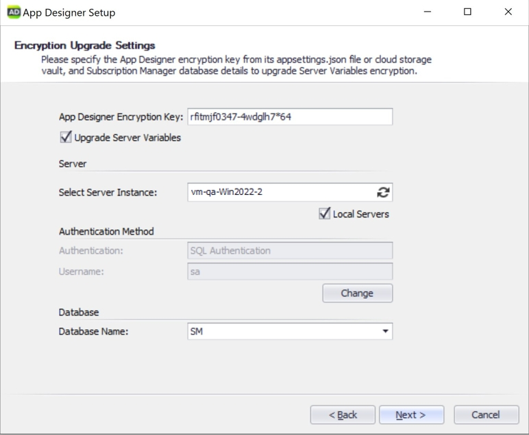

#### Upgrade Server Variables?

1. Tick to automatically upgrade the Server Variables. It is recommended, but not required.
    None of the other settings on this page are required if you choose not to upgrade.

#### Server

1. Select the server instance you want to connect to

#### Authentication Method

1. Specify the authentication method that should be used: Windows or SQL

#### Database

1. Select the **Subscription Manager** database and click Next

### Web Application

**DNS Name**

1. Verify if your DNS name is correct, if not, edit the value to contain the correct DNS name

> [!NOTE]
> This is your fully qualified domain name (FQDN). Please find some examples below explaining the DNS name.
>
> * <https://localhost/xmprosubscriptionmanager>
> * <https://vm-qa-win2022-2/xmprosubscriptionmanager>
> * <https://demo.azurewebsites.com>

| Complete Address | DNS | Virtual Directory |
| --- | --- | --- |
| <https://localhost/xmprosubscriptionmanager> | localhost | xmprosubscriptionmanager |
| <https://vm-qa-win2022-2/xmprosubscriptionmanager> | vm-qa-win2022-2 | xmprosubscriptionmanager |
| <https://demo.azurewebsites.com> | demo.azurewebsites.com |  |

**Virtual Directory**

1. Select the parent site from the Web Site drop-down

> [!NOTE]
> By default, the Virtual Directory name will be "AppDesigner" which will be created within IIS for the Data Stream site. If you wish to change the name you can specify it in the "Virtual Directory Name" text box.

1. Verify if the value in the content directory field is correct. If not, apply any changes needed

> [!NOTE]
> By default, the option to create a sub-directory within the content directory is checked and you can specify a name in the "Sub-Directory" text box.

#### Application Pool

1. If you wish to change this name or use an existing application pool, click the Change button

> [!NOTE]
> By default, a new application pool will be created when installing the site. The new application pool will have the same name as the name specified in the "Application Pool Name" field.

1. Either select the "Create a new Application Pool" or "Use an existing Application Pool" option

> [!NOTE]
> If you choose "Create a new Application Pool", give it an appropriate name. If you choose "Use an existing Application Pool", select an existing application pool from the drop-down.

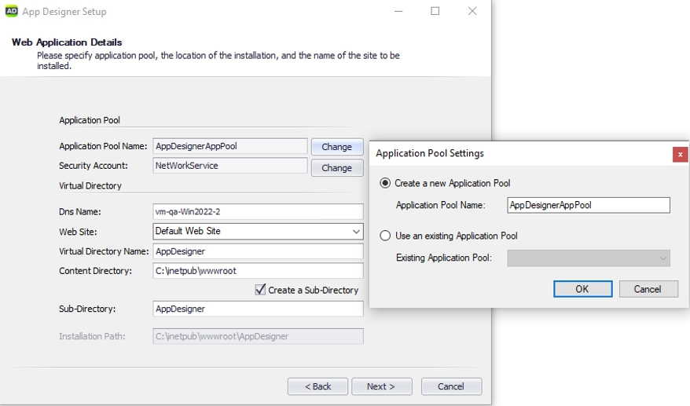

#### Security Account

1. Select "Local System" as the security account

> [!NOTE]
> You can either change it by selecting a different built-in security account from the drop-down or by specifying your own security account.

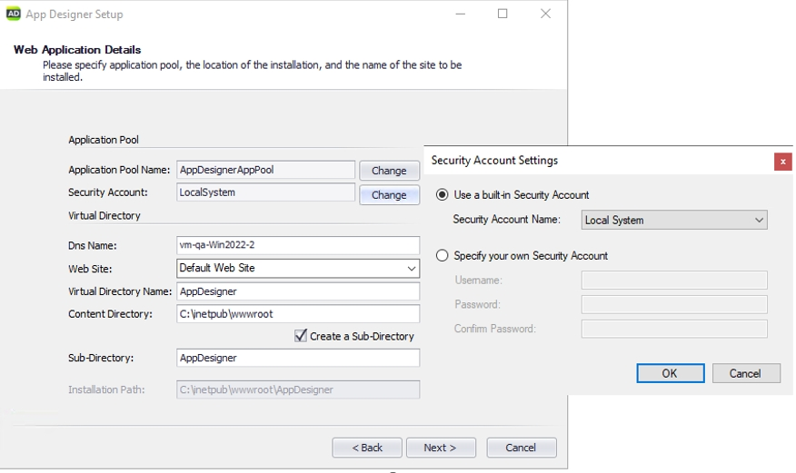

> [!WARNING]
> If you selected Windows authentication to connect to the database, you must choose "Specify your own Security Account" and provide the correct credentials. The service account must have batch logon rights enabled. More Information on how to set up a custom application pool in IIS as well as steps on how to enable batch logon rights can be found in this [link](https://docs.xmpro.com/knowledge-base-2/setting-up-a-custom-application-pool-so-that-windows-authentication-can-be-used-when-installing-xmpro-enabling-batch-logon-rights-for-a-user/).

### Integration Details

1. Type in the URL of Data Stream designer in the text box

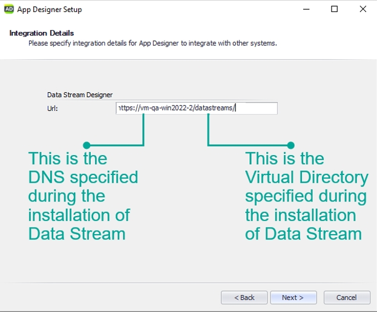

### SMTP

1. Enter the SMTP settings referenced in the [1. Preparation](../../install.md#smtp-account) guide.
    By default, the "Enable Email Notification" is checked.

> [!NOTE]
> SMTP can be disabled by unchecking the "Enable Email Notification" checkbox if you don't want to receive email notifications. If at a later stage email notifications are needed, the installer can be run again to add SMTP functionality.

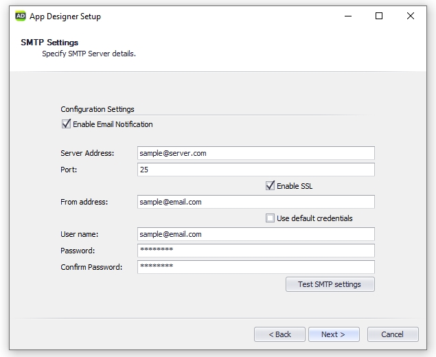

> [!WARNING]
> You are required to set up an SMTP account. Failing to do so will make registering new users very cumbersome.
>
> It is highly recommended to check your connection to the email server using the "Test SMTP settings" button.

### Twilio (Optional)

1. Enter the Twilio details referenced in the [1. Preparation](../../install.md#twilio-account-optional) guide. If you don't want SMS notifications you can select "None" from the "Select Provider" dropdown.

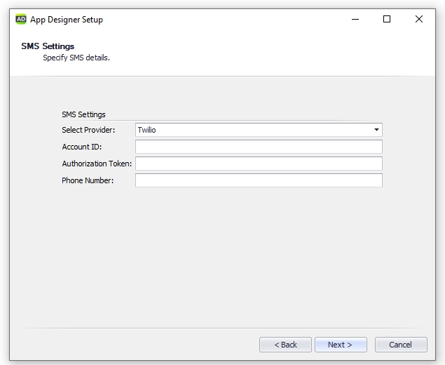

### Installation Profile

1. Click the Browse button to upload an installation profile for Subscription Manager
2. Select a file and click "Next"

> [!NOTE]
> This file ensures the App Designer contains the correct details for the Subscription Manager instance you would like to use. The file used can be obtained through the [steps outlined previously in this tutorial](#obtaining-an-installation-profile).
>
> The Installation Profile generated for Data Stream Installer can be used in this step.

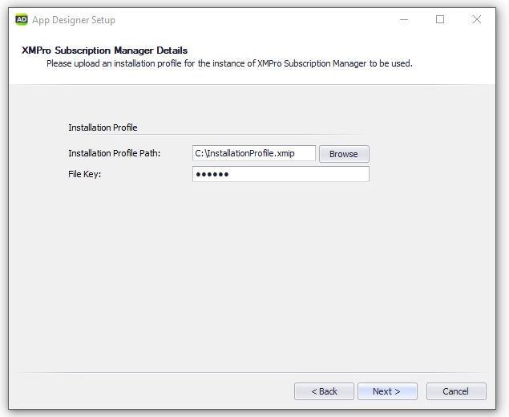

1. After you press "Next", authenticate yourself using Subscription Manager credentials

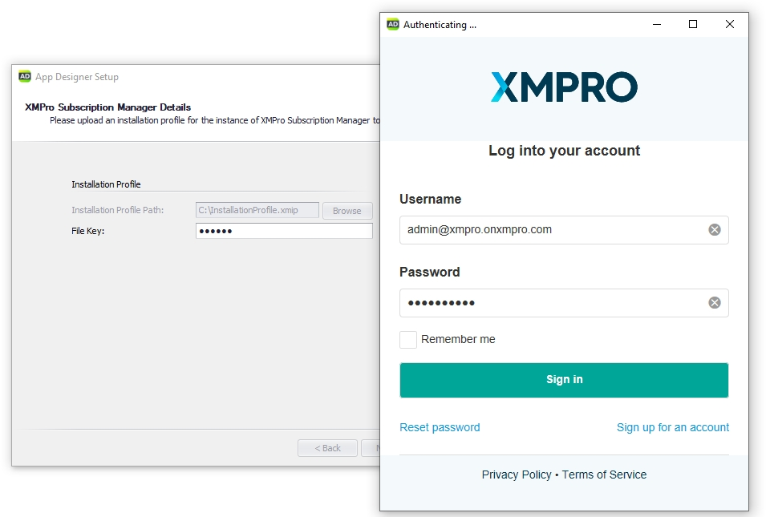

> [!WARNING]
> If you are unable to sign in at this step, please follow this [link](prerequisites.md) to disable Internet Explorer Enhanced Security Configuration.

### Final Steps

1. Continue through the wizard, confirm the installation and the components will be installed

## Next Step: Complete Installation

The installation of the XMPro Platform is now complete, but there are some environment setup steps before you can use the platform. Please click the below link for further instructions:

[Complete Installation](../../complete-installation/index.md)
