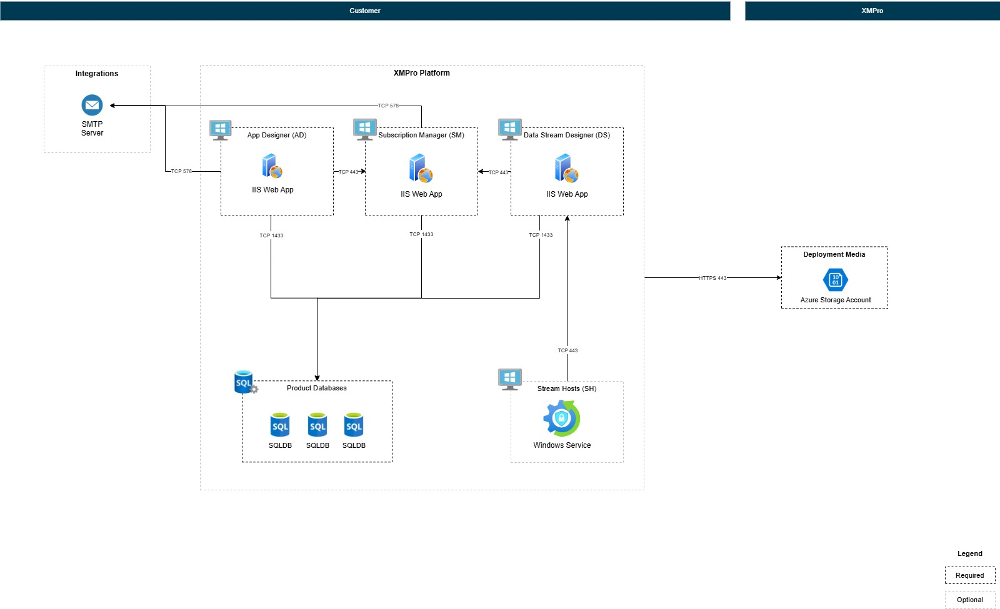

# Multi-Server Deployment

## Introduction

Deploy XMPro products across multiple Windows servers for enterprise-scale architectures. This approach enables distributed workloads, product isolation, and high-availability configurations. Use multi-server deployment when you need to scale beyond a single server or require separation between products for security, performance, or compliance requirements.

> [!NOTE]
> **Single-Server vs Multi-Server:** For simpler deployments where all products run on one server, see the [main installation guide](index.md). Use multi-server deployment when you need:
>
> - Distributed load across multiple servers
> - Isolation between products for security or performance
> - Scalability for high-availability architectures

> [!IMPORTANT]
> **Deployment Responsibilities**
>
> Multi-server deployments follow XMPro's [two-phase deployment responsibility model](../../overview.md#two-phase-deployment-model):
>
> - **Phase 1 (Customer):** Provision all servers, install prerequisites, configure networking and security
> - **Phase 2 (XMPro/Partner):** Deploy XMPro applications using the installer
>
> This guide focuses on Phase 2 application deployment. Ensure Phase 1 infrastructure is complete before proceeding.

## Prerequisites

Each server in your multi-server deployment must meet the standard prerequisites. See [Prerequisites](index.md#prerequisites) for complete requirements including:

- Windows Server 2022
- IIS with required features
- SQL Server 2022 with Mixed Mode authentication
- Certificates (signing and SSL)
- .NET Framework and .NET 8 Hosting Bundle

> [!NOTE]
> **Database Configuration:** Each product can use different SQL Server instances or credentials. See [Database Configuration](index.md#2-database-configuration) for all available options.

## Product Dependencies

XMPro products must be installed in this order due to dependencies:

```
SM (Subscription Manager)
  ↓
AD (App Designer) ← Requires product keys generated by SM
  ↓
DS (Data Stream Designer) ← Requires product keys generated by SM
  ↓
SH (Stream Host) ← Requires DS URL and collection details
```

**Why this order?**

- **SM** creates foundational data (company, products, licenses) required by all other products
- **AD and DS** both need product keys generated by SM database for authentication and licensing
- **SH** needs DS URL and collection details for data stream execution

## Multi-Server Architecture



> [!IMPORTANT]
> **Configuration File Preservation**
>
> The installer automatically preserves existing configuration from `C:\XMPro\`:
>
> - Database credentials (SQL Server, username, password)
> - SMTP settings (if previously configured)
> - Certificate paths and passwords
> - Previous product configurations
>
> You'll see these as defaults during reinstallation - press Enter to keep them.

## Installation Workflow

#### Step 1: Install SM (Server 1)

Run the installer on your SM server:

```cmd
powershell.exe -ExecutionPolicy Bypass -Command "$env:SCRIPT_URL='https://download.app.xmpro.com/4.5.5/install-xmpro-application.ps1'; iex (irm $env:SCRIPT_URL)"
```

When prompted, configure:

- **Products:** Select SM only
- **Hostname:** Enter Server 1's DNS name (e.g., `sm.yourcompany.com` or `sm-server-01`)
- **Port:** 5201 (default) or custom port
- **Database, SMTP, certificates:** Configure as prompted

Installation creates:

- SM database on SQL Server
- SM IIS application
- Configuration files in `C:\XMPro\`

#### Step 2: Copy Configuration to AD Server

Copy only the `.json` configuration files from SM server to AD server:

- Source: `C:\XMPro\*.json` on SM server (Server 1)
- Destination: `C:\XMPro\` on AD server (Server 2)

> [!NOTE]
> **What gets copied:**
>
> - Configuration files only (`Global-variables.json`, `Global-settings.json`, `SM-variables.json`, etc.)
> - These contain database credentials, SMTP settings, and certificate paths
>
> **Security:** Ensure certificates themselves are accessible on the destination server at the paths specified in the configuration files. Do not copy certificates - only the configuration that references them.

#### Step 3: Install AD (Server 2)

Run the installer on your AD server:

```cmd
powershell.exe -ExecutionPolicy Bypass -Command "$env:SCRIPT_URL='https://download.app.xmpro.com/4.5.5/install-xmpro-application.ps1'; iex (irm $env:SCRIPT_URL)"
```

When prompted, configure:

- **Products:** Select AD only
- **Hostname:** Enter Server 2's DNS name (e.g., `ad.yourcompany.com` or `ad-server-01`)
- **Port:** 5202 (default) or custom port
- **Other settings:** Uses existing configuration from `C:\XMPro\` (press Enter to accept defaults)

Installation creates:

- AD database on SQL Server
- AD IIS application

#### Step 4: Copy Configuration to DS Server

Copy only the `.json` configuration files from AD server to DS server:

- Source: `C:\XMPro\*.json` on AD server (Server 2)
- Destination: `C:\XMPro\` on DS server (Server 3)

#### Step 5: Install DS (Server 3)

Run the installer on your DS server:

```cmd
powershell.exe -ExecutionPolicy Bypass -Command "$env:SCRIPT_URL='https://download.app.xmpro.com/4.5.5/install-xmpro-application.ps1'; iex (irm $env:SCRIPT_URL)"
```

When prompted, configure:

- **Products:** Select DS only
- **Hostname:** Enter Server 3's DNS name (e.g., `ds.yourcompany.com` or `ds-server-01`)
- **Port:** 5203 (default) or custom port
- **Other settings:** Uses existing configuration from `C:\XMPro\` (press Enter to accept defaults)

Installation creates:

- DS database on SQL Server
- DS IIS application

#### Step 6: Copy Configuration to SH Server

Copy only the `.json` configuration files from DS server to SH server:

- Source: `C:\XMPro\*.json` on DS server (Server 3)
- Destination: `C:\XMPro\` on SH server (Server 4)

#### Step 7: Install SH (Server 4)

Run the installer on your SH server:

```cmd
powershell.exe -ExecutionPolicy Bypass -Command "$env:SCRIPT_URL='https://download.app.xmpro.com/4.5.5/install-xmpro-application.ps1'; iex (irm $env:SCRIPT_URL)"
```

When prompted, configure:

- **Products:** Select SH only
- **DS URL:** Enter Server 3's DS URL (e.g., `https://ds.yourcompany.com:5203` or `https://ds-server-01:5203`)
- **Other settings:** Uses existing configuration from `C:\XMPro\` (press Enter to accept defaults)

Installation creates:

- Stream Host Windows service

## Post-Deployment Validation

After completing all installation steps, verify that products can communicate across servers:

1. **Access SM** - Navigate to `https://<sm-hostname>:5201` and log in with super admin credentials
2. **Access AD** - From SM, navigate to App Designer or directly access `https://<ad-hostname>:5202`
3. **Access DS** - From SM, navigate to Data Stream Designer or directly access `https://<ds-hostname>:5203`
4. **Verify Stream Host** - In DS, check that Stream Host appears in the Stream Host list with "Connected" status

If any product fails to load or Stream Host shows "Disconnected", see [Troubleshooting Guide](troubleshooting.md).

## Next Steps

After completing your Windows Server deployment, proceed to:

**[Post-deployment](../../complete-installation/index.md)** - Complete the setup and configuration of your XMPro environment.

---

## Need Help?

For troubleshooting multi-server deployment issues, see the [Troubleshooting Guide](troubleshooting.md).
